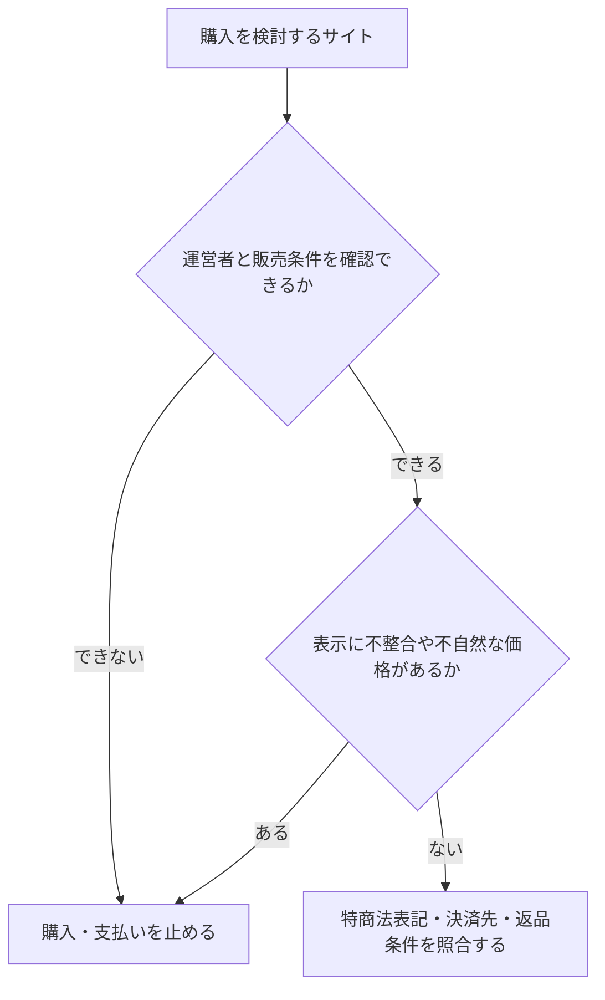

# オンライン販売サイトの安全性を確認する

## 調査の出発点

有限会社ハートプランニングが運営するとされる次のサイトについて確認した記録。 https://lotact.canwant.shop/

## 購入判断

この調査で確定できたのは、サイト運営者の実体や掲載情報を十分に検証できなかったことと、利用者が複数の不自然な表示を確認したことである。詐欺サイトであることをこのノートだけで断定はしないが、購入や支払いを進めず、公式情報・決済方法・特定商取引法表記を照合する必要がある。

|情報の性質|このノートにある内容|扱い|
|---|---|---|
|利用者が直接確認したこと|ロゴとドメインの不一致、商品説明の転用らしさ、価格、問い合わせ画面の不整合|購入を避ける判断の材料|
|AIが当時確認したこと|サイトへのアクセスが403で、本文や特商法表記を直接確認できなかった|運営実体の確認不能を示す事情|
|AIの照合・推論|法人情報や会社概要に不整合の可能性があるという評価|出典と時点に依存する仮説|

## 調査経過と確認項目

ご指定の **[https://lotact.canwant.shop/](https://lotact.canwant.shop/)** は、こちらの環境から直接アクセスして内容を確認しようとすると **403 Forbidden（閲覧ブロック）** になり、ページ本文・商品内容・「特定商取引法に基づく表記」等を読み取れませんでした。  
そのため「サイトの中身を読んだうえでの説明」はできないのですが、**運営者名（有限会社ハートプランニング）を手がかりに、確認すべき点と注意点**を整理します。

---

## まず重要：同名（類似名）の会社が複数見つかります

Web上には「ハートプランニング」を名乗る事業者が複数存在し、所在地や代表者が異なります。たとえば：

- **有限会社ハートプランニング（楽天の店舗情報として掲載）**：三重県三重郡菰野町、電話番号も記載あり
- **株式会社ハートプランニング（別サイトの特商法表記）**：千葉県習志野市、代表者名・電話番号等が別
- **株式会社ハート・プランニング（別サイトの特商法表記）**：岡山県倉敷市、責任者名・電話番号等が別

つまり、**「ハートプランニング」という名前だけでは同一事業者だと断定できません**。  
あなたが見ている _lotact.canwant.shop_ の「有限会社ハートプランニング」が、上記のどれと一致するか（あるいは別会社か）を突き止める必要があります。

---

## あなたが今すぐ確認すべきチェックリスト（安全確認）

サイトが見られる環境（スマホ回線/別ブラウザ等）で、次を確認してください。

1. **「特定商取引法に基づく表記」ページ**

- **会社名（有限/株）**
- **住所（都道府県・番地まで）**
- **電話番号**
- **代表者/販売責任者**
- **メールアドレス**
- **返品・キャンセル規定**  
    → ここが **空欄/不自然/コピペ感** があると要注意。

2. **会社情報の照合**

- 表記の住所・社名をそのまま検索し、  
    既知の別会社（上の例）と混ざっていないか確認  
    （例：会社名は「有限」なのに住所が「岡山/千葉」の別会社のもの、など）

3. **決済方法**

- クレカ/大手決済（PayPay等）でも、**決済代行の画面が不自然**なら注意
- 銀行振込のみ、前払い強制、振込先名義が会社名と違う、は特に警戒

4. **ドメイン/サイトの作り**

- `canwant.shop` 配下のサブドメイン（`lotact.canwant.shop`）は、独自ドメインではなく“間借り型”っぽい構成です。  
    それ自体が違法という意味ではないですが、**責任主体が分かりにくくなりやすい**ので、上の「特商法表記」の精査がより重要です。

5. **価格・在庫表現**

- 相場より極端に安い
- 「残りわずか」等の煽りが多い
- 日本語が不自然
- 会社情報が薄い  
    が重なるほどリスクは上がります。

---

## こちらから確実に説明するために

このサイトが403で読めないため、**サイト内の「特定商取引法に基づく表記」ページの内容**を（コピペで）貼ってくれれば、

- 会社情報の整合性
- 同名会社との混同がないか
- 返品/連絡先/決済のリスク  
    を具体的にチェックして、どこが怪しい/問題ないかまで踏み込みます。

（スクショでもOKですが、テキストの方が確認精度が上がります。）

## 利用者が確認した会社概要

運営会社として次の情報が表示されていたという記録。

有限会社ハートプランニング。会社の商号：有限会社ハートプランニング。本社所在地：〒512-0913 三重県四日市市西坂部町3996-14。代表者：黒田 隆典。設立年月日：2019年11月。売上高：連結584,318百万円、単体251,554百万円（2024年7月期）。資本金：4億110万円。主な株主：社員持株会、常勤役員、金融機関。従業員数：約1,280名、グループ全体従業員数：約83,364名。

事業目的として、新聞・出版、求人・採用支援、広告、派遣・職業紹介、教育、旅行、保険、ソフトウェア、通販、不動産、介護福祉、医薬品など非常に広い領域が列挙されていた。

## AIによる照合上の懸念

入力いただいた会社情報、**一部は実在情報（住所・電話など）と整合**しますが、**売上高・従業員数・資本金・事業目的のボリュームが明らかに不自然**で、少なくとも公開情報と噛み合っていません。結論から言うと、その「会社概要」は **別企業のプロフィールを混ぜた／コピペした／誇張・捏造されている可能性が高い**です。

---

## 1) 整合している点（実在の法人に紐づく可能性が高い）

あなたが提示した

- 〒512-0913 三重県四日市市西坂部町3996-14
- 代表者：黒田 隆典（※一部データベースで確認）
- 電話番号：059-328-4112（複数サイトで一致）

は、複数の企業情報サイトに載っている「有限会社ハートプランニング」と一致しています。

また、法人番号も **1190002024291** として gBizINFO で「本店所在地：三重県四日市市西坂部町3996番地14」と確認できます。

---

## 2) 不自然な点（ここが最大の警戒ポイント）

あなたの記載には、例えば

- 売上高：連結 584,318百万円（=約5.8兆円）
- 従業員数：グループ 83,364名
- 資本金：4億110万円
- 事業目的が「新聞発行〜旅行業〜保険〜M&A〜不動産〜介護福祉〜医薬品製造販売」まで超広範囲

などが含まれていますが、**有限会社（いわゆる小規模事業形態が一般的）としては規模が桁違い**です。

一方で、gBizINFO（国のデータ連携基盤）は、当該法人番号について「基本3情報（名称・所在地・法人番号）」を示す一方、あなたの提示したような巨大な連結売上やグループ従業員数を裏づける形では出ていません（少なくとも公開ページ上の基本情報からは読み取れません）。

さらに、公開されている事業の説明としては「介護用品・日用品の販売」等の記述が多く、あなたが書いた“巨大コングロマリット”像とは方向性が合いません。

**つまり：住所や代表者名は実在法人に寄せているが、会社規模・事業内容の説明部分が別物**、という構図が疑われます。

---

## 3) 「lotact.canwant.shop」についての注意

こちらの環境からはそのサイトが **403 Forbidden** で閲覧できず、中身（特商法表記、返品規定、決済、販売商品など）を確認できませんでした。()

なので、購入判断に必要な次の確認をおすすめします。

### A. 特定商取引法表記で必ず照合すべき項目

- 会社名（有限会社ハートプランニング）
- 住所（四日市市西坂部町3996-14 **“番地14”表記まで一致するか**）
- 電話番号（059-328-4112 か）
- 販売責任者名
- メール（独自ドメインか、フリーメールか）
- 返品・返金条件、支払い方法、振込先名義

※「会社概要」に不自然な巨大数値が載っている時点で、**特商法表記もコピペ混入しやすい**です。

### B. 一番確実な検証方法（高信頼）

- **国税庁 法人番号公表サイト**で、名称と所在地が一致するか確認（法人番号 1190002024291 でも検索可）
- さらに厳密にやるなら、法務局の**登記情報（履歴事項全部証明書）**で代表者・目的・資本金などの登記事項を確認（これは“公式原本に近い”）

---

## 4) こちらで具体的に「怪しい／問題なさそう」を判定するには

次を貼ってください（コピペでOK）：

1. lotact.canwant.shop の **「特定商取引法に基づく表記」全文**
2. **支払い方法**（クレカ/代引/銀行振込などの記載部分）
3. もしあれば **会社概要ページ**（売上や従業員数が載っている箇所）

それを見れば、**実在する四日市の同名法人を“名義だけ借りている”系**なのか、**単なる記載ミス**なのか、かなりの精度で切り分けできます。

## 利用者が追加で確認した表示上の問題

画像はサイトロゴであり、ドメインと明らかに異なっていて怪しい。スイッチソフトの販売ページの説明文はメルカリをコピーした内容に見える。「あつまれ どうぶつの森」が中古品かつセール中とはいえ3,000円以下で購入可能だった。お問い合わせページでは、「サービス名についてお使いいただきありがとうございます」といった文中のサービス名の部分に代表者名が入っているなど、テンプレート処理の不整合が見られた。

## AIによる最終的な注意喚起

状況を聞く限り、**かなり高確率で“偽通販（詐欺サイト）”の典型パターン**に当てはまります。あなたが挙げた点は、どれも「単なる作りの粗さ」ではなく、**運営実体が薄いサイトでよく出る赤信号**です。

## いま出ている赤信号（強い順）

- **ロゴ（サービス名）がドメインと一致しない**  
    画像のロゴは英字で別名（例：_ZuicyBonus_ のような表記）に見えます。ショップ名がコロコロ変わるのは典型。
- **商品説明がメルカリ等のコピペっぽい**（文体・注意書き・改行癖が一致）  
    正規店の在庫説明になっていない。
- **価格が相場から不自然に安い**（中古セールでも“釣り価格”になりがち）
- **問い合わせ文面のテンプレ崩れ**（サービス名の箇所に代表者名が入る等）  
    量産されたテンプレを機械的に差し替え損ねた形。
- さらに、あなたが先に貼ってくれた“会社概要”も、**巨大企業レベルの売上・従業員数などが混ざっていて不自然**でした（実在法人の基本情報だけ借りて、文章は別所から寄せ集め…の匂い）。

ここまで揃うと、**買わないのが正解**です。

---

## 今すぐやること（購入前）

1. **支払い方法を確認**
    - **銀行振込のみ／前払いのみ**、振込先名義が会社名と違う → ほぼ黒
    - クレカがあっても、決済画面が不自然（外部の怪しいフォーム等）なら避ける
2. **特商法表記の“突合”**
    - 住所・電話・責任者・メールが揃っているか
    - 返品規定が極端（「返品不可」「一切対応しない」等）でないか
3. **証拠保全（念のため）**
    - 商品ページ、価格、特商法、問い合わせ画面をスクショ保存

---

## もし“もう買ってしまった”場合

支払い方法別に動きが変わります。すぐやる順で：

### クレカ

- **カード会社に連絡 → 不正利用/詐欺通販の可能性で支払い停止・調査（チャージバック相談）**
- 注文確認メール、決済画面、サイトURL、スクショを渡す

### 銀行振込

- **すぐ銀行へ連絡して「組戻し」相談**（間に合えば止められることがあります）
- 相手口座の凍結につながる場合もあるので、早いほど良い

### コンビニ払い/電子マネー系

- 支払い前なら止める、支払い後は運営に戻らないことが多いので、**すぐ決済事業者・相談窓口へ**

---

## 相談・通報先（日本）

- **消費者ホットライン：188（いやや！）**  
    最寄りの消費生活センターにつながります（詐欺通販の相談に強い）
- **警察相談：#9110**（緊急でなければ）  
    県警のサイバー犯罪相談窓口を案内してくれます

---

## こちらで“確定度”をさらに上げるために

次を貼ってくれたら、チェック項目ごとに **「アウト理由」**を明文化して、購入判断に使える形にまとめます。

- ① 特商法表記（全文）
- ② 支払い方法の記載部分（スクショでも可）
- ③ 返品・返金ポリシー
- ④ 可能なら振込先情報（※口座番号は伏せてOK。名義だけでも）

あなたの観察だけでも十分危険域ですが、ここまで揃えば「避けるべき根拠」を確実に固められます。
