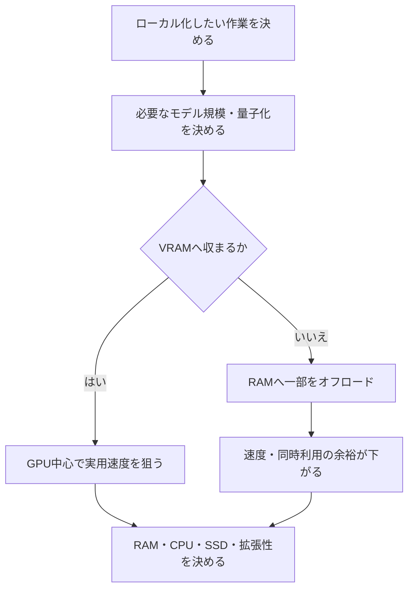

ローカルLLM用PCは、一般的なゲーミングPCのようにGPU演算性能やCPUグレードだけで選ばない。最初に決めるのは、常用したいモデルをどこまでVRAM上へ載せるかである。モデルサイズ、量子化、コンテキスト長、推論エンジンは変化するため、数値は検討時点の目安として扱う。



## VRAMが先になる理由

モデルを起動できることと、快適に使えることは別である。VRAMに収まらないモデルはRAMへ一部を逃がせる場合があるが、CPUとGPUの間で処理するため応答速度が大きく下がりやすい。

```text
VRAM 12GB：モデルが収まらない → RAMへ一部を逃がす → 速度が落ちる
VRAM 16GB：モデルが収まる      → GPU中心で処理       → 速くなり得る
```

GPUの演算性能が高くても、必要なモデルがVRAMに入らなければ優位性は限定的になる。VRAM容量の次に、生成速度へ影響するメモリ帯域、量子化、KV Cache、コンテキスト長、GPUオフロード率を比較する。

## 検討時のモデル規模と構成の目安

| 構成 | 想定する位置付け |
|---|---|
| RAM 32GB + VRAM 8GB | 4B〜8B中心。ローカルLLMを試す・軽作業 |
| RAM 32GB + VRAM 12GB | 8B〜12B中心。ゲームとAIのバランス |
| RAM 32GB + VRAM 16GB | 12B〜14Bを常用する実用ライン |
| RAM 64GB + VRAM 16GB以上 | 20B〜32B級も条件付きで試す上位構成 |
| 24〜32GB以上のVRAM | 30B級を高速に扱うための高価格帯 |

これはモデルの重みだけでなく、KV Cache、実行環境、OS、ブラウザ、RAG、同時起動するアプリの余白を含めて考える。RAMとVRAMは単純に合算できない。

| RAMの使い道 | 例 |
|---|---|
| OSと常駐アプリ | Windows、ブラウザ、Office、PDF |
| AI実行環境 | LM Studio、Ollama等 |
| LLMのオフロード | VRAMへ収まらない部分 |
| RAG | 検索・埋め込み・文書処理 |
| 文脈 | 会話履歴、KV Cache |

## 現在のAero 13は試用機として扱う

2022年モデルのHP Pavilion Aero 13は、専用GPU・専用VRAMがなく、RAMも増設しにくい構成であるため、本格的なローカルLLM運用機ではない。16GB RAMなら小型モデル、短い要約、文章の言い換え、箇条書き化、短い資料の分類などを試す入口になる。8GB RAMでは制約が大きい。

大量PDFのRAG、多数資料の横断分析、20B〜32B級、長いコンテキスト、大型マルチモーダルモデルを目的にしない。まず現PCで「何をローカルへ移したいか」を確かめ、必要なモデル規模を決めるための試用機として使う。

## CPU・SSD・GPUベンダーの順序

モデルの大部分をGPUへ載せるなら、最上位CPUよりVRAMを優先する。7B〜14B中心なら、Ryzen 7 / Core Ultra 7級、8コア前後、64GBへ増設可能なデスクトップを候補にできる。SSDは最低1TB、モデル・ゲーム・RAGを併用するなら2TBを基準にする。

初めて本格運用する場合、CUDA対応、ツールの対応例、画像生成への展開を考え、NVIDIAを比較の基準に置きやすい。AMDを除外するのではなく、利用するOS・推論エンジン・周辺ソフトの対応を先に確認する。

## ローカルとクラウドは役割を分ける

| ローカルLLMに寄せる作業 | クラウドAIに寄せる作業 |
|---|---|
| 機密資料、個人ノート、社内文書 | 最新情報・Web検索 |
| RAG、定型文章、繰り返し分類 | 複雑な推論、曖昧な依頼の理解 |
| ローカルAPI、オフライン寄りの処理 | 高度なAgent、総合的なマルチモーダル作業 |

PCを高性能化しても、実行するモデル自体の知識・推論能力・ツール連携は変わらない。ローカルLLMをクラウドAIの全面的な代替にせず、補完環境として導入する。

## 判断の順序

1. ローカル化したい作業を具体化する。
2. 常用したいモデル規模と量子化を決める。
3. 必要なVRAM容量を決める。
4. OS・RAG・同時利用を支えるRAMと増設性を決める。
5. ゲーム・VR・画像生成に必要なGPU性能とCPUを決める。
6. SSD、電源、冷却、将来のGPU更新余地を確認する。

検討時の第一候補は、RAM 32GB・VRAM 16GB・SSD 2TB・64GBへ増設可能なデスクトップだった。これは固定の完成形ではなく、12B〜14B級をGPU上で常用したいという要求から逆算した基準である。
