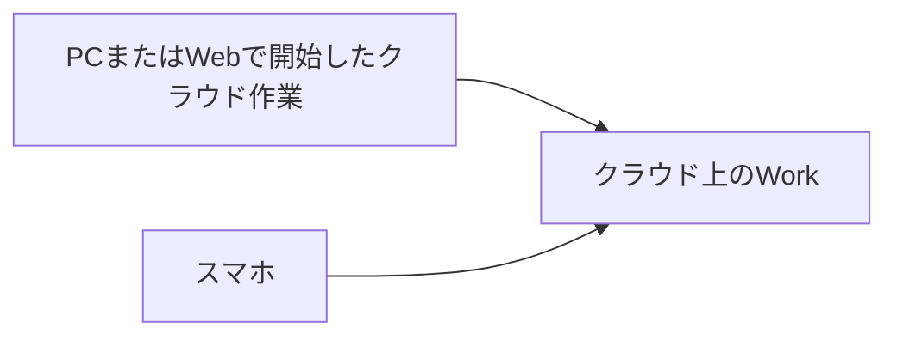
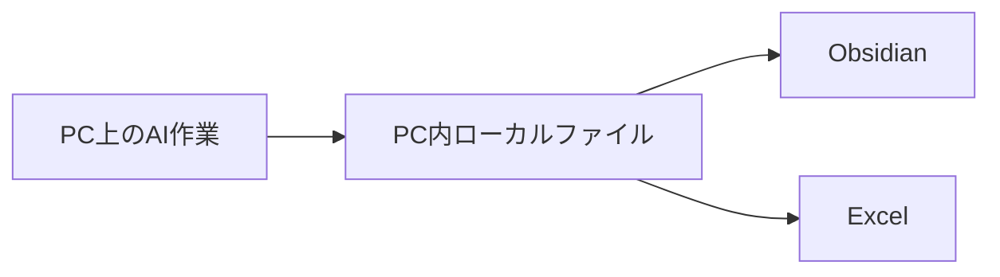
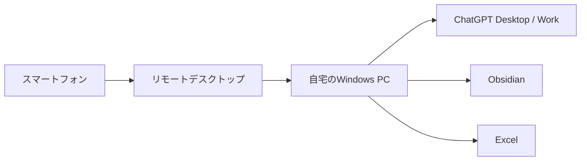
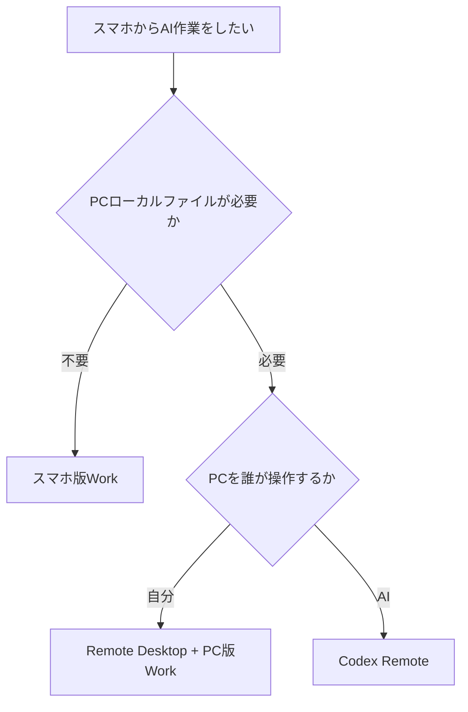

# スマートフォンからChatGPT Work／Codex／PCを遠隔利用する方法の整理

## このノートの役割

スマートフォンから自宅や職場のPCで行うAI作業へ関わる方法を、クラウド上のWork、Codex Remote、Windowsのリモート操作に分けて整理する。出発点は「スマホでChatGPTを使えるか」ではなく、PC内のObsidian Vault、Excel、ローカルファイル、デスクトップ版のAI作業まで扱いたい場合に、誰がどの画面やファイルを操作するのかを明らかにすることだった。

このノートに残すのは、当時の製品理解と方式選択の基準である。Remote、Work、OS、接続アプリの提供状況や制限は変わり得るため、実際に構築する前には現行の公式資料と端末の画面で確認する。

## 最初に確認したかったこと

想定していたのは、スマホで普通に会話することだけではなかった。PC内にある次のようなものを、AI作業の対象にしたいという意図があった。

- Obsidian Vault内のMarkdown
- Excelファイル
- Windows上のローカルファイルとフォルダ
- PC上のアプリケーション
- デスクトップ版ChatGPTのWork

したがって問題は、次の二つを分けて考える必要がある。

```text
スマホからクラウド上のAI作業を続けられるか

スマホから、自宅PC上のローカル作業を進められるか
```

前者ならPCの遠隔操作そのものが不要な場合がある。後者では、スマホ版の会話画面が自宅PCのCドライブへ直接つながるわけではないため、PC側でどう動かすかを別に決めなければならない。

## 三つの方法を混同しない

検討の途中で、Work、Codex Remote、Remote Desktopは似た言葉でも操作の主体が異なることが分かった。

| 方法 | 操作の主体 | 主な対象 | PCローカルのファイル | スマホからの関わり方 |
| --- | --- | --- | --- | --- |
| スマホ版Work | クラウド上のAI作業 | 調査、クラウド上のファイル、成果物作成 | 直接は扱わない | スマホのChatGPTから直接作業する |
| Codex Remote | PC上のCodex | Codexへ指示、進行確認、ローカル作業の依頼 | Codex側に許可があれば扱える | スマホからAIへ指示する |
| Remote Desktop | 利用者自身 | Windows画面、ChatGPT Desktop、Obsidian、Excel | PC画面と同じ範囲で扱う | スマホをPCの画面と操作装置として使う |

この違いを一文で言えば、Codex Remoteは「AIにPCを操作させる」方式であり、Remote Desktopは「自分がスマホからPCを操作する」方式である。Workを使うかどうか、ローカルファイルが必要かどうか、PC操作をAIへ任せたいかどうかで、選択が変わる。

## クラウドWork：PCを遠隔操作しない選択

クラウド上で動くWorkであれば、PCで始めた作業を同じアカウントのスマホから確認・継続できる場合がある。この場合、PC上のアプリをリモート操作する必要はない。



向いているのは、Web調査、クラウドブラウザ、ChatGPT上に置いたファイル、PCローカル環境を必要としない成果物作成である。PCの電源状態に左右されず、外出先から直接作業できることが利点になる。

ただし、PC内のObsidianやExcelを直接読ませたい場合は別である。クラウドWorkをスマホで続けられることと、自宅PCのフォルダを操作できることは同じではない。

## ローカルWorkが問題になる場面

たとえば、PC側で次のようなフォルダをAI作業に使いたい場合を考える。

```text
Windows PC
├─ Obsidian Vault
├─ Excel ファイル
└─ ローカルの資料・アプリ
```

この場合、AIがPC上で動き、そのフォルダやアプリへの許可を持つ必要がある。



スマホ版のWorkが、遠隔地からPCのCドライブへ直接アクセスするという考え方にはならない。ここから、PCそのものを操作する方法と、PC上のCodexに作業させる方法を検討する必要が出てきた。

## 方法A：Windowsそのものを遠隔操作する

最初に検討したのは、スマホからWindows PCへ接続して、PC画面そのものを操作する方法だった。



この方式では、スマホから見ているのはPC上の画面そのものである。そのため、ChatGPT Desktop、Work、Obsidian、Excel、エクスプローラー、確認ダイアログまで、普段PCの前で行う操作をそのまま扱える。

### Chrome Remote Desktopを候補にした理由

導入が比較的単純で、Windows Homeでも使える候補としてChrome Remote Desktopを検討した。主に想定していたのは、Workへ追加指示を出す、途中結果を確認する、承認画面を操作する、といった軽い遠隔作業である。

| 観点 | 当時の検討での位置づけ |
| --- | --- |
| 導入 | 比較的始めやすい候補 |
| Windowsの版 | Homeでも候補にできる |
| 用途 | PC画面の確認、軽い操作、PC版Workへの指示 |
| 利点 | ChatGPT固有の機能に依存せず、PC上のアプリをまとめて操作できる |
| 注意点 | 小さなスマホ画面での精密操作、PCの電源とスリープ、通信状態 |

この方式は、AIに任せる対象を増やすためではなく、PC版Workそのものを使い続けたいときの選択肢である。

### TailscaleとWindows RDPを検討した理由

もう一つ、より本格的なリモート操作として、TailscaleとWindows Remote Desktopを組み合わせる案を検討した。スマホとPCを仮想的なプライベートネットワークへつなぎ、その上でWindowsのリモートデスクトップを使う考え方である。

ただし、Windows標準のRDPで接続される側になるには、Windowsのエディションが条件になる。当時の整理では、Windows HomeではChrome Remote Desktop、Windows ProならChrome Remote DesktopまたはTailscale＋RDPを比較する、という位置づけだった。

設定量が増えるため、最初から高度な構成を作る必要はない。PC版Workを外出先から少し確認するだけなら、まず簡単な候補で操作感を確かめる方がよい。

### 電源・スリープは別の前提条件

リモート操作には、PCが接続可能な状態であることが必要になる。

```text
PC電源：ON
ネットワーク：接続済み
スリープ：接続を妨げない設定
ディスプレイ：OFFでもよい場合がある
```

PCが電源オフや完全なスリープ状態なら、通常は接続できない。Wake on LANのように遠隔からPCを起動する発展案も候補にはなるが、BIOS／UEFI、LAN、ルーター、ネットワーク構成などの条件が増える。最初は、外出する日にPCを使える状態にしておくという運用で足りるかを確認する。

## 方法B：Codex RemoteはPC画面のリモコンではない

途中で重要になったのが、ChatGPTの「Remote」という言葉だった。当初は、スマホからPCのChatGPT Desktop全体やWorkをマウス操作する機能ではないか、と考えた。しかし、この理解は修正が必要だった。

Codex Remoteは、概念的にはPC上で動くCodexセッションをスマホから扱う機能である。


つまり、スマホからChatGPT Desktopの画面全体を直接なぞるのではなく、PC上のCodexへ追加指示を出し、進行を確認し、必要な回答や承認を返す。Codex自身がPC上でアプリやファイルを扱う権限を持つ場合は、結果としてスマホからローカル作業を進められることがある。

ただし経路は、次のようになる。

```text
スマホ
↓
Codex Remote
↓
PC上のCodex
↓
Windowsアプリ・ローカルファイル
```

スマホがWindowsアプリを直接操作しているわけではない。この区別は、画面を細かく自分で確認したいのか、作業内容をAIへ依頼して結果を確認したいのかを決める際に重要である。

## WorkとCodex Remoteは別の経路

この検討で修正したかったもう一つの点は、WorkとCodex Remoteを同じものとして扱わないことである。

| 経路 | 意味 |
| --- | --- |
| PC版Work → ローカルファイル → Obsidian／Excel | PC版Workを利用者が使う経路 |
| スマホ → Codex Remote → PC上のCodex → ローカルファイル／アプリ | Codexへ作業を依頼する経路 |
| スマホ → Remote Desktop → Windows PC → PC版Work | 利用者がPC画面を遠隔操作する経路 |

そのため、「WorkをRemoteから操作できるが、勧めない」というよりも、「WorkそのものをCodex Remoteで遠隔操作する機能と、Codexにローカル作業を依頼する経路は別」と整理する方が正確である。

## Obsidian整理に当てはめる

たとえば、スマホからObsidianのInboxを整理したい場合、二つの考え方がある。

### PC版Workをそのまま使いたい場合

```text
スマホ
↓
Remote Desktop
↓
自宅PC
↓
ChatGPT Desktop / Work
↓
Obsidian Vault
```

これは、普段PCで行っているWorkの流れを保ったまま、操作する場所だけをスマホへ移す方法である。画面を自分で見て、どの操作をするか判断したい場合に向く。

### Codexへローカル作業を任せる場合

```text
スマホ
↓
Codex Remote
↓
自宅PC上のCodex
↓
Obsidian Vault
```

これはWorkを遠隔操作するのではなく、CodexにMarkdown編集、YAML修正、ファイル名変更、スクリプト実行、大量処理などを依頼する考え方である。作業範囲を明確に指定し、AIが行った変更を確認する運用が必要になる。

## 方式を選ぶ基準

最終的には、スマホから何をしたいのかを先に決める。



| したいこと | まず比較する方法 |
| --- | --- |
| クラウド上の調査や作業をスマホで続けたい | スマホ版Work |
| PC版Workへ追加指示を出し、画面を確認したい | Remote Desktop |
| PC上のObsidianやローカルファイルをAIに処理させたい | Codex Remote |
| ExcelやWindows画面を自分で直接操作したい | Remote Desktop |
| PCを触らず、作業内容をAIへ任せて結果を確認したい | Codex Remote |

## 最終整理と次の確認

> クラウド作業ならスマホからWorkを直接使う。PCのローカルファイルを使う作業では、PC画面を自分で操作したいならRemote Desktop、PC上のAIへ作業を任せたいならCodex Remoteを検討する。

この結論は、どれか一つを唯一の正解にするものではない。重要なのは、クラウド上の作業、PC版Work、Codexによるローカル作業、Windows画面の遠隔操作を同じ「スマホから使う」という言葉で混同しないことである。

実際に環境を選ぶ前には、次を小さく確認する。

1. スマホから必要なのは、指示追加、進行確認、ファイル編集、PC画面操作のどれか。
2. 作業対象はクラウド上だけか、ObsidianやExcelなどPCローカルを含むか。
3. 変更は自分で画面を見て判断したいか、AIへ範囲を指定して任せたいか。
4. PCの電源、スリープ、ネットワーク、Windowsのエディションが候補の前提を満たすか。
5. 遠隔からの書き込み、移動、削除をする場合に、対象と結果を確認できる運用になっているか。
