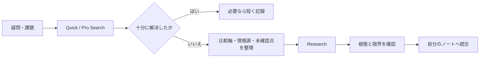
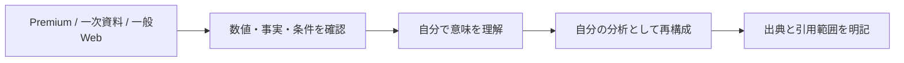

Perplexity Proを、ローカルファイル操作の代替ではなく、外部情報の収集・比較・検証を担う調査環境として使うための運用設計。無料特典、Computer用Credit、各機能の利用枠は検討時点の記録であり、現在の契約条件としては扱わない。

> Perplexityは外部世界を調べるAI、ChatGPT Work等は自分のファイルと成果物を扱うAI。最終的な採用判断は人が行う。

| 役割 | 担当 |
|---|---|
| Web検索、最新情報、複数ソース比較 | Perplexity Search / Pro Search |
| 本格的な複数ソース調査 | Perplexity Research |
| Researchの問い・比較軸を整える | ChatGPT等の対話AI |
| ローカルファイル操作、既存ノートとの照合 | Work / Codex等のローカル作業環境 |
| 結果の整理・統合 | 人と作業AI |
| Permanent化・意思決定 | 人 |

## 調査深度を使い分ける

| 段階 | 向く問い | 期待する結果 |
|---|---|---|
| Quick Search | 価格、機能有無、日付などの単純確認 | 短い事実確認 |
| Pro Search | 比較、現状確認、公式と利用者報告の照合 | 論点と主要ソース |
| Research | 多面的比較、歴史、相反する根拠、長い調査 | 調査レポートと未解決論点 |



Researchを「高性能な検索」として回数消費するのではなく、小さな調査プロジェクトとして扱う。同じテーマを何度も調べる、比較対象が多い、情報源が食い違う、時系列比較が必要、といった場合に昇格させる。

## Premium Sourcesは閲覧権と再配布権を分ける

検討時には、Statista、Wiley、PitchBook Essentials、CB Insightsなどを例として、Perplexity側で利用可能な情報源と、元サービスの別契約・Connectorが必要な情報源を区別した。提供範囲は変動するため、現在の利用可否・引用条件は個別に確認する。



情報源を閲覧できても、グラフ・表・データをそのまま公開・再配布できるとは限らない。公開用ノートにはResearch出力を丸ごと転載せず、必要な事実を検証し、自分の主張と出典へ再構成する。

## 利用枠を消化目標にしない

Pro Search、Research、Premium Sources、Computerは、同じ回数枠として単純に扱わない。具体的な回数を固定値と見なさず、アカウント表示を優先する。Researchは回数を使い切ることより、読んで比較し、行動や知識に接続できるテーマへ使う方が価値が高い。

Research候補はBacklogへ残す。

```text
日常の疑問
  ↓ Pro Search
繰り返し現れる・重要な問い
  ↓ Research Backlog
調査設計を整える
  ↓ Research
根拠を確認して自分のノートへ統合
```

無料期間の評価は「何回検索したか」ではなく、Perplexityを外したときに、一次資料発見・出典確認・調査速度が明確に悪化するかで判断する。
