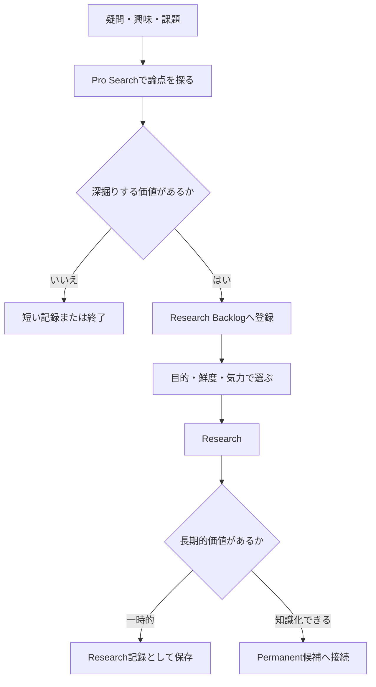

Researchを思いつきで実行せず、Pro Searchで問いを整え、価値の高いものだけをResearchへ進めるためのバックログ設計。目的は大量のテーマを消化することではなく、実用と好奇心の両方から「次に調べる問い」を低負荷で選べる状態を作ることである。



## テーマは判断系と好奇心系を並立させる

| 種類 | 定義 | 例 |
|---|---|---|
| 判断系（Decision） | 数か月以内に導入・契約・運用・保留などの判断へ関係する | AI契約、PC購入、Vault運用、公開基盤 |
| 好奇心系（Curiosity） | 結論を急がないが、調べることで知識体系を広げる | AIと認知、PKM史、Web文化、分類と思考 |

元の設計では各250件、合計500件を候補として整理した。件数は目標ではなくテーマプールの規模であり、500件を個別ノート化したり、すべてResearchしたりしない。

| ID帯 | 主な領域 |
|---|---|
| D001–D050 | AIサービス、Agent、実作業・自動化 |
| D051–D125 | Obsidian、Zettelkasten、Quartz・公開戦略 |
| D126–D200 | Perplexity、ニュース、PC・ローカルLLM |
| D201–D250 | 業務改善、EC、発信、個人プロジェクト |
| C001–C050 | AIとAI活用事例 |
| C051–C125 | Zettelkasten、デジタルガーデン、Web文化 |
| C126–C200 | Research、学習、ソフトウェア、PC・GPU |
| C201–C250 | デザイン、情報設計、読書、個人研究 |

## 深度と評価軸を分ける

調査深度は「重要度」ではなく、問いに対して必要な探索量で選ぶ。

| 深度 | 用途 |
|---|---|
| Q | 単純な事実確認、狭い疑問、概要把握 |
| P | 複数ソース比較、事例収集、現状確認 |
| R | 歴史・比較・相反する根拠・論点統合を要する調査 |

各テーマには、興味度・実用度・鮮度依存・Research向き度を各5点で仮置きする。とくに「鮮度依存 × Research向き度」が高いテーマは、変化しやすい情報を複数ソースで統合する価値が高い。

| 状況 | 選び方 |
|---|---|
| すぐ役立つ判断が必要 | 実用5・鮮度5・Research5を優先 |
| 無料期間中に調べる価値を高めたい | 鮮度4〜5・Research5を優先 |
| 好奇心を満たしたい | 興味5・Research4〜5を優先 |
| Permanentの材料が欲しい | 鮮度1〜2でも、興味とResearch向き度が高いもの |
| 気力が低い | Qまたは軽いP |
| 気力が高い | R |

固定の総合点ランキングを作らない。調査の目的とその日の気力を選択基準に含める。

## 1つの管理ノートで始める

実際に調べる前から500個の空ノートを作らない。Backlogを1ノートの表として持ち、調査したものだけを必要に応じてResearchノートやliteratureノートへ分離する。

```markdown
| ID | Theme | Kind | Depth | Interest | Utility | Freshness | Research | Tags | Status |
|---|---|---|---:|---:|---:|---:|---:|---|---|
| D020 | 調査AIの役割分担 | decision | R | 5 | 5 | 5 | 5 | AI, research | backlog |
| C051 | AI時代のZettelkasten | curiosity | R | 5 | 4 | 2 | 5 | AI, PKM | backlog |
```

ステータスは`backlog → researching → researched → note-created → archived`程度でよい。評価はAIによる初期案に留め、実際の関心や状況に合わせて人が修正する。

## 運用上の決定

1. Researchは、Pro Searchで問い・比較軸・不足情報を把握してから行う。
2. 判断系と好奇心系を混ぜ、Researchを義務化しない。
3. 調査結果は、長期的な価値があるものだけ知識ノートへ接続する。
4. テーマ数・検索回数・Research回数の消化を目的にしない。
5. 新しい関心は随時Backlogへ追加し、古い項目は必要ならarchivedへ移す。
