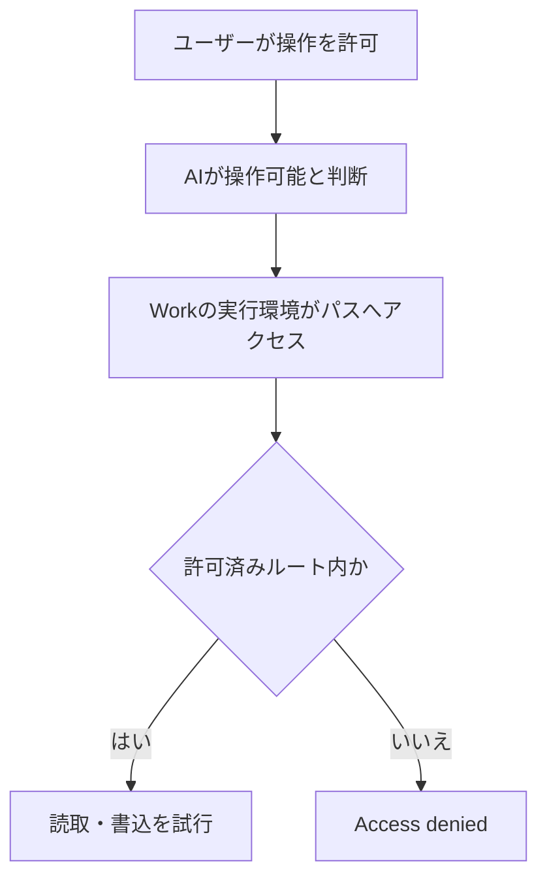
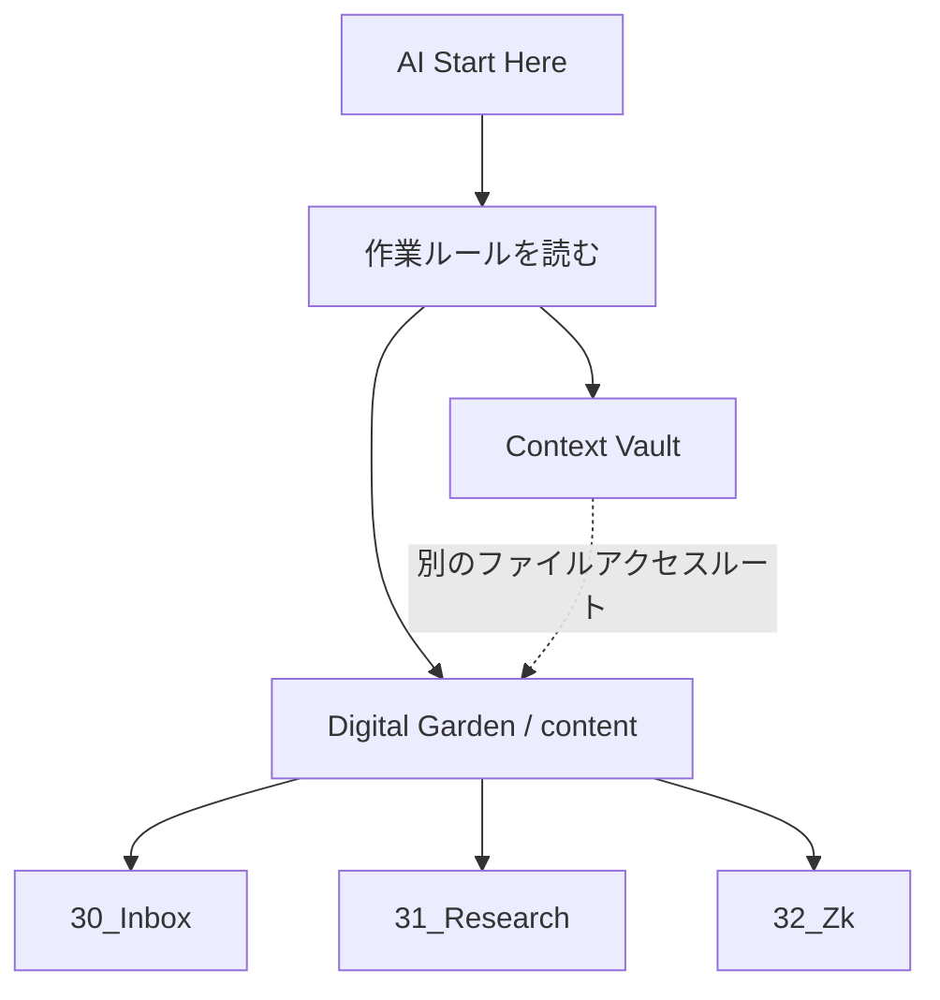
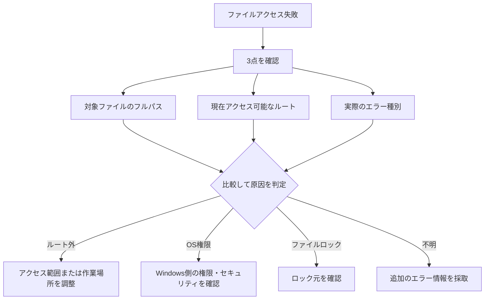
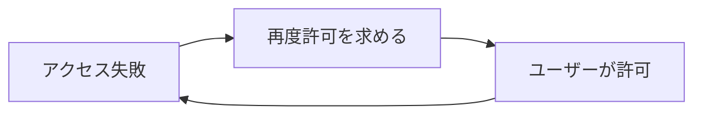

ChatGPT Workでファイルアクセスの許可を与えた後も「Access denied」が繰り返される現象について、観測事項と切り分け仮説を分けて残す障害記録。会話上の承認だけで、実行環境がOS上の任意のパスを読めるようになるとは限らない。

> このノートは特定時点のWork環境に基づく仮説である。画面・実行環境・権限仕様が変わった場合は、実際のエラーとアクセス範囲を優先する。

## 観測した失敗パターン

1. AIが特定ファイルへのアクセス許可を求める。
2. ユーザーが許可する。
3. AIがアクセスを試みる。
4. アクセス拒否が返る。
5. AIが同じ申請または同じ操作を再試行する。

この流れでは、単純な「ユーザーが許可していない」問題より、会話上の許可と実行環境のファイルアクセス権が別管理である可能性を先に調べる。



## 優先順位を付けた原因仮説

| 優先度 | 仮説 | 確認方法 |
|---:|---|---|
| 1 | 現在のWorkで許可されたルート外へアクセスした | 実行環境のアクセス可能ルートと対象のフルパスを比較する |
| 2 | Local / Cloudなど、実行環境が想定と異なる | 現在の実行環境とローカルアクセス可否を確認する |
| 3 | 権限付与処理が実際のアクセス範囲へ反映されていない | 同じ申請を繰り返さず、申請結果とエラー内容を確認する |
| 4 | Windows側の権限・セキュリティ制御 | NTFS、Defender、コントロールされたフォルダーアクセス、所有権等を確認する |
| 5 | 別プロセスによるファイルロック | sharing violation、file in useなど、ロックを示す具体的なエラーを確認する |

Markdownを別アプリで閲覧していることは、検討対象ではあっても主因と決めつけない。ファイルロックなら、抽象的な拒否よりロックを示すエラーが得られることが多い。

## 今回のような複数ルート構成で起きること

Zettelkasten作業では、作業ルールを置くContext Vaultと、実データを置くDigital Gardenを横断することがある。論理的には一つの作業でも、実行環境にとっては別のルートである。



たとえばDigital Gardenの`content`だけがアクセス可能なルートなら、別場所にあるContext Vaultへ移動すると、会話で許可を得ていてもルート外として拒否され得る。この場合はAIの判断やユーザーの承認を繰り返しても解決しない。

## 拒否が出た直後の切り分け手順



別スレッドでAIへ依頼する場合は、次のように具体化する。

```text
現在アクセス可能なローカルルートを確認してください。

続けて、対象ファイルのフルパス、アクセス可能なルート、実際のエラー種別を比較し、
ルート外・OS権限・ファイルロック・不明のどれかを切り分けてください。
同じアクセス申請や再試行を繰り返さないでください。
```

## 避けるべき再試行と、運用上の結論



このループは、アクセススコープ自体が原因なら解決しない。今後は「フルパス × アクセス可能ルート × 実エラー」の3点を先に比較する。

Context VaultとDigital Gardenを分ける知識管理上の設計は、それ自体で誤りではない。AIツールのアクセス制約を理由に、Vault構造を直ちに統合・変更するのではなく、必要なルートを同じWorkセッションから読めるかを確認する。知識の配置とツールの制約は分けて判断する。
