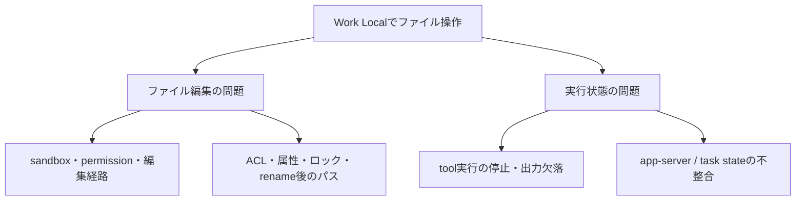
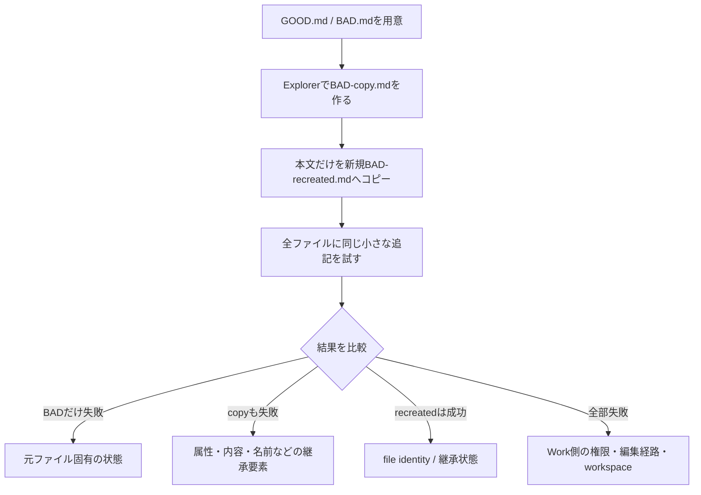

Windows版ChatGPT Work Localで、同じObsidian Vault内なのに編集できるMarkdownと拒否されるMarkdownが混在した事象の切り分け記録。ここで扱うのは確定診断ではなく、再現可能な証拠を集めるための仮説と手順である。製品仕様や障害状況は変化するため、現行の公式情報と実際のエラーを優先する。

## 先に分けるべき2つの問題

ファイルへ書けないことと、エラー後にAgentが実作業へ戻らず会話だけ返すことは、同一原因とは限らない。



| 観測した症状 | 先に疑う範囲 |
|---|---|
| 同じフォルダで成功・失敗が混在 | 個別ファイル状態、編集経路、アクセス範囲 |
| 再承認しても一部だけ拒否される | sandbox・permission反映、ACL、ファイルhandle |
| リネーム後だけ編集できない | stale path、古いキャッシュ・handle・workspace状態 |
| エラー後に「続けて」で実行へ戻らない | Agent実行・tool output・app-server状態 |

Vault全体が読み取り専用、Git管理下だから書けない、Obsidianを開いているから書けない、といった単一原因だけでは説明しにくい。

## 原因仮説の優先順位

| 仮説 | 優先度 | 確認方法 |
|---|---:|---|
| 編集経路ごとのsandbox・権限の差 | 高 | 成功・失敗時のtool名、permission modeを比較 |
| フォルダ承認が全プロセスへ反映されない | 高 | 使い捨てフォルダでDefault / Allow once / Full accessを比較 |
| 特定ファイルのACL・属性・所有者・handle | 高 | GOOD/BADのファイル状態を比較 |
| rename後の古いパス・状態保持 | 高 | 使い捨てファイルでrename直後と新規Workを比較 |
| Git-aware処理の副作用 | 中 | Git管理外コピーで再現するか確認 |
| Obsidian plugin・同期・セキュリティソフト | 中 | Obsidian停止、handle、隔離フォルダで比較 |
| 日本語ファイル名・パス長 | 低 | 単純なASCII名のテストで比較 |

Work Localは、ユーザーが許可した範囲、ワークスペース管理、端末のセキュリティポリシーに従ってローカル資源へアクセスする。会話上の許可と、すべての内部編集経路の書込可否を同一視しない。[OpenAI公式：ChatGPT Work Overview](https://learn.chatgpt.com/docs/enterprise/chatgpt-work-overview)

## 設定変更の前に行う比較

重要ファイルのACL変更・所有者変更・削除を先に行わない。異常状態を消さず、まず成功と失敗を比較する。



追記は、次のような無害で確認しやすいものにする。

```markdown
<!-- Work write test -->
```

確認する属性は、Owner、ACL、継承、ReadOnly、LinkType、Target、LastWriteTime、ファイルhandleである。PowerShellでは`Get-Item`、`Get-Acl`、`icacls`、`attrib`を比較に使える。

## 追加の切り分け

| テスト | 結果の読み方 |
|---|---|
| Obsidianを完全終了して再試行 | 停止後だけ成功なら、plugin・同期・監視処理を疑う |
| `.git`なしの使い捨てフォルダへコピー | 元で失敗・コピーで成功なら、Git/sandbox境界を疑う |
| rename-test-a → rename-test-b → 同一Workで追記 | rename直後だけ失敗し新規Workで成功なら、stale stateを疑う |
| Default / Allow once / Full accessを使い捨てフォルダで比較 | Full accessだけ成功なら、permission経路を疑う |
| リソースモニターで対象ファイルのhandleを確認 | 特定プロセスのロックや監視の証拠を得る |

Git管理であること自体は原因と決めつけない。通常ファイルの編集と`.git`保護・Git-awareな処理は別に扱う。ログに`Access is denied`、`sharing violation`、`sandbox`、`apply_patch`、`git apply`、`app-server`、`tool output is missing`などが出たら、成功時との違いを記録する。

## 再開不能になった場合

エラー後に通常の会話だけが成立し、tool実行が戻らないなら、繰り返し同じ「続けて」を送らない。次を記録して新しいWorkで再現確認する。

1. 最後に成功した操作と、最初に失敗した操作。
2. 実際のエラー全文と発生時刻。
3. 対象ファイルの絶対パスとアクセス可能ルート。
4. tool出力の有無、使用された編集経路。
5. 新しいWork、Obsidian停止、Git管理外コピーでの再現結果。

不具合報告には、WindowsとChatGPT Desktopのバージョン、permission mode、対象フォルダの種類、`.git`の位置、GOOD/BAD比較、短い再現手順、スクリーンショットやログを添える。原因を断定するより、再現手順を短くする方が解決に役立つ。
