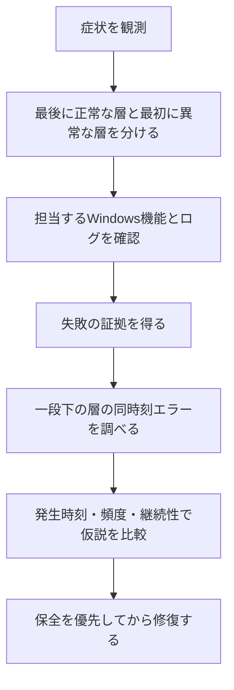

# Windows障害の切り分け：症状から下位原因へ進む診断フロー

このノートは、TEMPプロファイルが発生した実際の障害を例に、AIと進めた診断の流れをまとめる。目的は「SSDが原因だった」と断定することではなく、観測事実と仮説を混同せず、原因を一段下の層へたどる判断を残すことである。

実際には、Windowsは起動し、認証も通る一方、いつものデスクトップ、壁紙、ショートカット、ユーザー設定が読み込まれず、元のユーザーフォルダは残っていた。このため、最初からストレージ障害と決めず、ユーザー環境の読み込みを担当するUser Profile Serviceを確認した。`%USERPROFILE%`が`C:\Users\TEMP`なら、一時プロファイルでのログオンを確認できる。

今回、User Profile Serviceの読込障害を確認した後、発生した8月19日前後のSystemログを調べた。Disk Event ID 7が大量に記録され、翌日にも継続していたため、ProfileListや更新の問題だけでなく、ファイルシステムやストレージI/Oの異常を優先して確認する必要があると判断した。SSD/HDDの異常は、プロファイル障害とDiskエラーの両方を説明できる仮説だが、因果関係の確定ではない。

診断では、次の順を守る。1. 症状を正確に書く。2. 同時刻の関連ログを確認する。3. より下位層の異常を探す。4. 複数の症状を最もよく説明する仮説を優先する。5. データ保全と証拠採取を済ませる。6. 非破壊的な確認、修復、交換を検討する。

この事例では、新規ユーザーで業務を再開できても、ストレージの健全性が確認できたことにはならない。バックアップ、SMART情報、メーカー診断、Disk関連イベントの再確認を優先する。具体的な経過は[WindowsのDiskイベントID 7とユーザープロファイル変更後の再発について](WindowsのDiskイベントID%207とユーザープロファイル変更後の再発について.md)に残す。実施済みの確認・処置と提案段階の項目は、[Windowsプロファイル障害の確認・対処タイムライン](windows-profile-disk-incident-timeline.md)で区別する。
