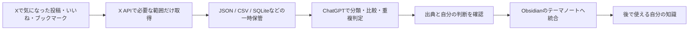
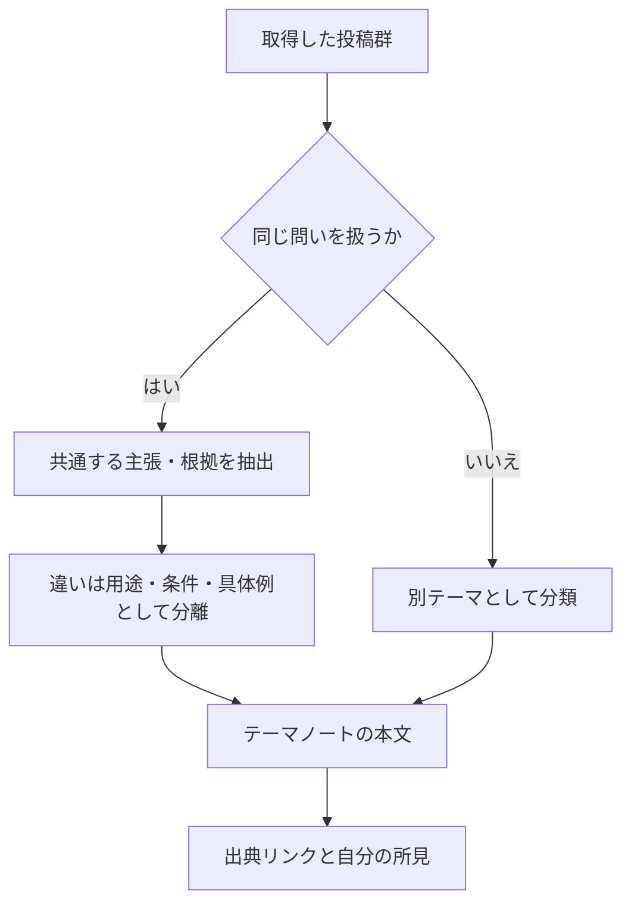

## この検討で決めたいこと

このノートは、Xで後から見返したい投稿を、単に保存件数の多いブックマークとして寝かせず、調査・比較・自分の考えへつながる知識に変えられるかを検討した記録である。中心にある問いは「Xの投稿をChatGPTに読ませればよいか」ではない。X上の反応、投稿本文、外部リンク、著者の継続的な発言を、どの範囲まで取得し、どこでAIに処理させ、最終的にどの粒度でObsidianへ残すか、という設計の問題として捉える。

この流れで大切なのは、Xを知識庫そのものにしないことである。Xは発見と反応が速い一方、時間が経つほど投稿の文脈、なぜ保存したか、同じ論点を扱う別の投稿との関係が失われやすい。Xから取り出した情報をいったん「知識化前の受信箱」として扱い、AIはその受信箱を読むための補助に置く。結論をAIに任せて自動保存するのではなく、出典、条件、例外、自分の考えを確認してからObsidianに残す。

## Xの取得とChatGPTの役割を分ける

ChatGPTにXを直接読ませる方法と、X APIで取得したデータを渡す方法は、似ているようでできることが異なる。直接参照は、その場で公開投稿を探して概略を把握するには便利だが、いいね・ブックマーク・フォローといった自分の行動履歴を、漏れなく再利用する基盤にはなりにくい。後者は取得や絞り込みの手間と費用が発生する代わりに、対象範囲を自分で決め、繰り返し同じデータに対して分析できる。

|やりたいこと|ChatGPTによる直接参照|X APIで取得してからAIへ渡す|
|---|---|---|
|公開投稿を探し、概要をつかむ|向いている|可能|
|特定アカウントの投稿を調べる|範囲次第で可能|対象・期間を指定して取得できる|
|自分のいいね／ブックマークを全件に近く扱う|安定しない|取得対象として扱える|
|投稿・著者・日時・URL・反応数を揃える|不足や揺れがあり得る|構造化して保持できる|
|継続的に更新し、差分だけ読む|難しい|取得条件と保存先を設計できる|

役割分担は、次のように置くのが自然である。

- **X API** は、投稿、著者、日時、URL、いいね数・リポスト数などを取得し、対象を期間やアカウントで絞るための入口である。
- **JSON／CSV／SQLite** は、取得したデータをその場限りにせず、再分析・差分取得・費用確認を行うための一時的な保管場所である。最初から大きなデータベースを作る必要はない。
- **ChatGPT** は、投稿の要約、論点別の分類、似た主張の束ね直し、相反する見解の抽出、外部リンク先を含めた比較を行う編集・分析役である。
- **Obsidian** は、AIの出力をそのまま蓄積する場所ではなく、テーマごとに出典と自分の判断を統合する最終保存先である。

たとえば、ブックマークだけを対象にしても、投稿本文だけで判断してはいけない。投稿が「この記事が参考になる」と言っている場合、実際に価値の中心が外部リンク先の記事にあることがある。反対に、リンク先より投稿者自身の短い評価や反論が重要な場合もある。したがって、一件のレコードには最低限、投稿本文、著者、投稿日時、投稿URL、反応、外部リンクの有無を持たせ、必要なテーマではリンク先の本文も別途確認する。

## 保存した反応を、関心の地図として読む

いいねとブックマークは「良いと思った投稿」の単純な一覧ではない。ブックマークには後で読む、仕事に使う、調べ直すといった意図が混ざり、いいねには共感、賛同、軽い反応、記録といった別の意味が混ざる。両者を同じ保存箱として扱うより、まず分けて取得し、重なるテーマと片方にしか出ないテーマを比較する方が、現在の関心や保留している課題が見えやすい。

|見る単位|AIに依頼する処理|残したい判断|
|---|---|---|
|いいね／ブックマーク全体|テーマ分類、頻出語、時期ごとの偏り|何に繰り返し反応しているか|
|同じテーマの複数投稿|内容の重複、共通結論、固有の主張|一つに統合してよい部分と残すべき差分|
|特定アカウント|関心分野、技術・製品への態度、主張の変化|その人を追う理由と、鵜呑みにしない条件|
|外部リンクを含む投稿|投稿の評価とリンク先の根拠の切り分け|投稿自体を残すか、原典を読むか|
|自分の保存履歴と他者の投稿|自分が保存していない論点や反証の抽出|追加調査が必要な穴|

特定の発信者を読む場合も、単発の名言集にはしない。たとえば「何を主なテーマにしているか」「特定の技術・サービスを推しているのか、警戒しているのか」「根拠として何をリンクするのか」「時期によって主張が変化しているか」を並べる。さらに、自分のブックマークにある投稿と照らし、同意している点、食い違う点、未確認の前提を分ける。AIには、投稿を褒める方向の要約だけではなく、反対の見方、根拠不足、調べるべき一次情報も出させる。

重複判定は、単語一致では不十分である。たとえばMCPを扱う投稿でも、Google Driveの接続手順に集中した投稿、MCPという仕組みの意味を説明する投稿、社内データベースとの連携可能性を考える投稿は、同じ語を使っていても残す価値が異なる。一方で、別の言い回しでも「AIを外部データへ安全につなぐ」という中心命題が同じなら、共通知識として一度まとめ、各投稿は具体例や条件の出典としてぶら下げられる。

## 費用を抑えながら始める範囲

API価格は変更されるため、ここで扱う金額は**2026年9月3日に調査した時点の概算**であり、実行前に公式の料金表を確認する前提である。当時の目安では、自分が所有するリソースの読み取りは `1 resource あたり $0.001` とされ、1,000件のブックマークなら約$1、2,000件のいいねなら約$2という試算になった。費用を抑えるためには、全履歴を毎回取り直すのではなく、初回の対象範囲を決め、以後は前回取得日以降の差分だけを読む。

|段階|対象の目安|目的|注意点|
|---|---:|---|---|
|最初の試行|ブックマーク 1,000〜2,000件、いいね 1,000〜3,000件|テーマ分類と重複判定が役に立つかを確かめる|全履歴取得を前提にしない|
|テーマ別の再調査|関心テーマに該当する投稿だけ|外部リンクと自分の既存ノートを含めて統合する|取得条件をメモする|
|継続運用|前回以降の差分|関心の変化と新しい論点を追う|月額化・自動化の前に効果を確認する|

ChatGPT PlusとAPIの組み合わせも、目的により二つに分かれる。

|運用|流れ|費用の考え方|向く段階|
|---|---|---|---|
|手動・半自動|X API → JSON/CSV → ChatGPT Plus → Obsidian|X APIの取得費用が中心。OpenAI APIは使わない|まず分析の質を試す段階|
|自動化|X API → Python／n8n／Make → OpenAI API → Obsidian等|X APIとOpenAI API、必要なら自動化基盤の費用がかかる|手順と保存形式が固まった後|

最初から月額契約や完全自動化を前提にする必要はない。まず一回、限られた保存履歴を取得し、次の順で出力を確認する。

1. AI・仕事・Obsidianなど、投稿を大まかなテーマに分ける。
2. 同じテーマで、内容が実質的に重なる投稿を束ねる。
3. 束ごとに、共通する主張、固有の具体例、反対意見・未確認事項を分ける。
4. 投稿に含まれるリンクを、原典まで読むべきものと、投稿だけで十分なものに分ける。
5. 自分の既存ノートと照合し、既に書いたこと、更新すべきこと、新たに調べることを分ける。
6. テーマノートへ統合した後、元の投稿URLと取得時点を残す。

## Obsidianへ残す単位と、まだ決めないこと

この構想は「X Bookmark Manager」を作ることではない。より正確には、**X → 自分の知識受信箱 → AIによる整理 → Obsidianへの統合**という経路を作る試みである。保存単位を一投稿にすると量に圧倒され、AIの出力だけを一ノートに貼ると後から使えない。中心となる問いごとに一つのテーマノートを置き、その中に複数の投稿・外部記事・自分のメモを統合する方が、知識として再利用しやすい。

|項目|この検討で決まったこと|未決定の検討|
|---|---|---|
|入口|X APIを候補にし、取得とAI分析を分ける|実際に使うプラン・認証方法|
|対象|いいねとブックマークを分け、まず限定件数で試す|どちらを主対象にするか|
|保存先|最終成果はObsidianのテーマノートに統合する|投稿単位のデータをどこまで残すか|
|分析|分類・意味的重複・差分・追加調査をAIに補助させる|重複を統合する判断基準の細部|
|リンク先|必要なテーマでは投稿と原典を切り分ける|URL本文をどこまで取得するか|
|自動化|手動・半自動で価値を確かめてから検討する|Python、n8n、Makeなどの採用|

次に実際の試行へ進むなら、先に「対象期間」「取得する反応の種類」「一度に扱う件数」「出力先のテーマ」を一つずつ決める。たとえば、ブックマークから1,000件だけを取得してAI関連の投稿に絞り、既存のAI運用ノートへ統合する。そこで、重複判定、リンク先確認、費用、Obsidianでの読み返しやすさを評価してから、いいねや他テーマへ広げる。これなら、Xの履歴を一括で処理すること自体を目的にせず、知識として使える形になるかを先に確かめられる。
