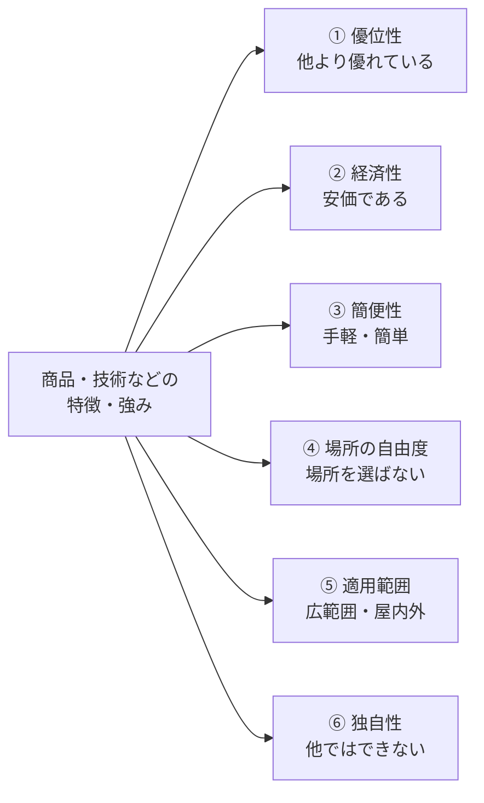
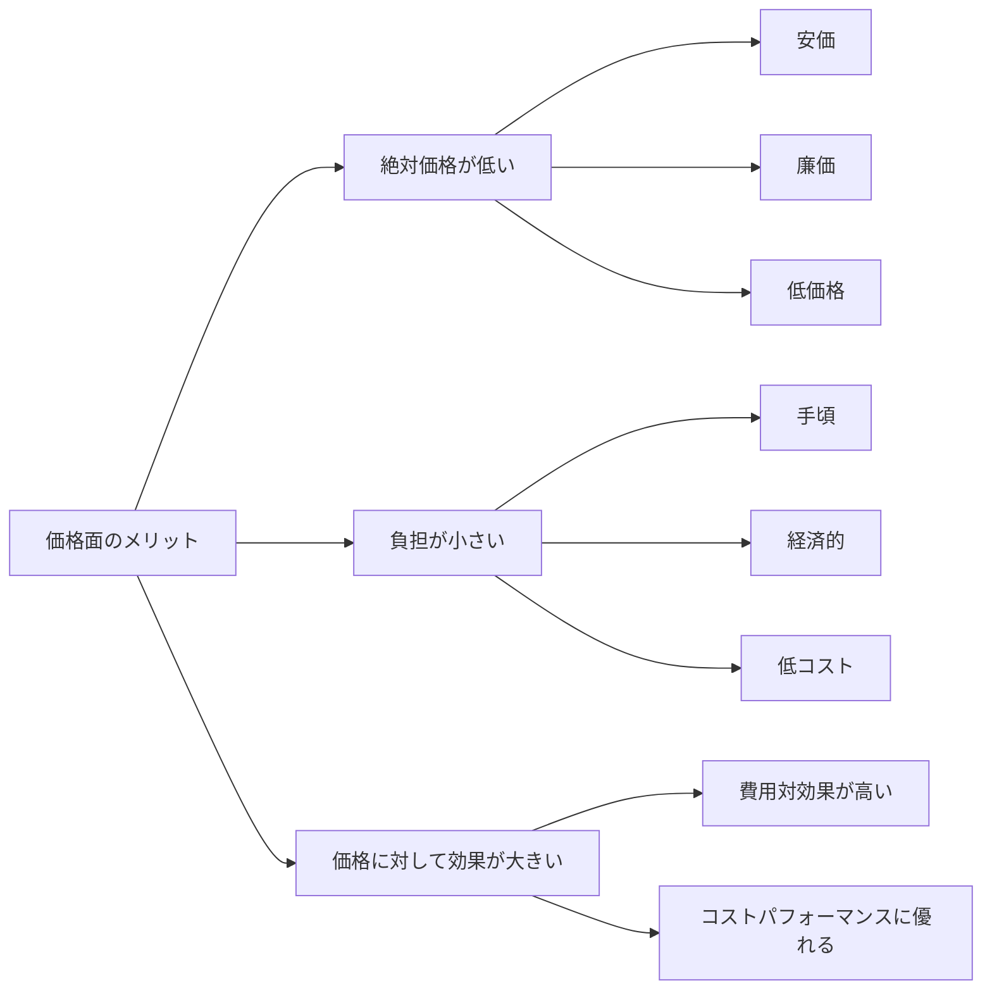
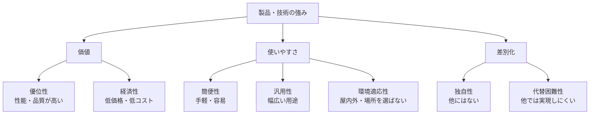

このチャットでは、商品・サービス・技術などの特徴を言語化するために、複数の観点から類語・言い回し・四字熟語・ことわざを整理した。

質問の流れを統合すると、求めていた表現は大きく次の6軸に分類できる。

## 1. 他より優れていることを表す

最初のテーマは、「他のものと比較して優れている」「競合などより上である」という状態をどう表現するかだった。

### 一般的な表現

|表現|意味・ニュアンス|強さ|
|---|---|:-:|
|優れている|基本的で客観的|★★|
|勝る|比較対象より上|★★|
|優位|比較上、有利な位置にある|★★|
|秀でている|他より特に優れている|★★★|
|際立っている|周囲と比較して目立っている|★★★|
|出色|同種の中でも特に優れている|★★★|
|秀逸|品質・出来などが非常に良い|★★★|
|抜きん出ている|他より明確に優れている|★★★★|
|群を抜いて|多数の中で突出している|★★★★|
|頭一つ抜けている|他より一段上にいる|★★★★|
|抜群|群を抜いて優れている|★★★★|
|卓越|通常の水準を大きく上回る|★★★★|
|傑出|同種の中で際立って優れている|★★★★|
|凌駕する|比較対象を超えて上回る|★★★★★|
|比類ない|比較できるものがない|★★★★★|
|唯一無二|同じものが他にない|★★★★★|

強度としては、おおむね、

**優れる → 秀でる → 抜きん出る → 卓越・抜群 → 凌駕 → 比類ない・唯一無二**

という関係になる。

### 四字熟語・故事的な表現

- **天下無双**：世の中に並ぶものがない。
- **古今無双**：昔から現在まで並ぶものがない。
- **国士無双**：国中に並ぶ者のない優れた人物。
- **一騎当千**：一人で千人に匹敵するほど能力が高い。
- **群鶏一鶴**：平凡な集団の中に、一人だけ非常に優れた人物がいること。
- **泰山北斗**：ある分野で最高峰として仰がれる人物。

これらは人物・能力に対して使うものが多く、製品説明には大げさになりやすい。

### 関連することわざ・慣用表現

- **頭角を現す**：才能・力量が周囲より目立つようになる。
- **青は藍より出でて藍より青し**：弟子が師を超える。
- **栴檀は双葉より芳し**：優れた人物は幼いころからその兆候がある。
- **能ある鷹は爪を隠す**：本当に能力のある者は、それをむやみに誇示しない。

なお、以前の回答に含まれていた「光陰矢の如し」「二兎を追う者は一兎をも得ず」「石の上にも三年」などは、**「他より優れている」という意味の表現ではないため、この分類からは除外すべきもの**である。

## 2. 安価・経済的であることを表す

次に、「価格が安い」「費用負担が少ない」という特徴を表す語彙を整理した。

|表現|ニュアンス|
|---|---|
|安価|単純に価格が安い|
|廉価|安価のやや硬い表現|
|低価格|商品説明で使いやすい|
|手頃|無理なく購入・導入できる価格|
|リーズナブル|内容に対して価格が妥当|
|経済的|金銭的負担が少ない|
|低コスト|導入・施工・運用費用などが低い|
|コストを抑えられる|効果として価格メリットを表現|
|費用対効果が高い|得られる効果に対して費用が小さい|
|コストパフォーマンスに優れる|性能と価格のバランスが良い|

ここでは「安い」と「コストパフォーマンスが高い」を区別する必要がある。

商品説明では、単純な「安い」よりも、**「手頃」「経済的」「低コスト」「費用対効果に優れる」**などの方が「安物」という印象を避けやすい。

## 3. 手軽・簡単であることを表す

価格だけでなく、「作業が難しくない」「導入しやすい」「手間がかからない」という意味も検討した。

|表現|主な意味|
|---|---|
|手軽|手数が少なく気軽にできる|
|簡単|難しくない|
|容易|困難なく実行できる|
|簡易|方法・構造などが簡素|
|簡便|手間が少なく便利|
|気軽|心理的なハードルが低い|
|扱いやすい|操作・施工などがしやすい|
|使いやすい|使用時の負担が少ない|
|導入しやすい|導入時の障壁が低い|
|施工しやすい|建材・工法などの作業性が高い|
|手間がかからない|作業負担が少ない|
|省力的|必要な作業量・人手を減らせる|
|特別な技術を必要としない|専門性のハードルが低い|

特に製品・施工方法などであれば、

**「簡単」より「施工性に優れる」「扱いやすい」「容易に施工できる」「省力化できる」**

などとすると、技術・業務資料にも使いやすい。

一方、**「安易」**は「容易」という意味もあるものの、「深く考えていない」「軽率」という否定的意味を伴うため、訴求表現には適さない。

## 4. 場所を厭わない・場所を選ばない

続いて、「特定の場所に限定されず使用できる」という特徴について検討した。

最初に出た「場所を厭わない」は意味としては通じるが、「厭わない」は本来「嫌がらない・避けない」という意味であり、製品性能を説明するなら、より自然な表現がある。

### 類語・言い換え

- **場所を問わず**
- **場所を選ばず**
- **場所に関係なく**
- **場所に左右されず**
- **どこでも**
- **幅広い場所で**
- **さまざまな場所で**
- **使用場所を選ばない**
- **設置場所を選ばない**
- **施工場所を選ばない**

用途によって適切な表現が変わる。

|対象|適した表現|
|---|---|
|一般的な商品|使用場所を選ばない|
|設備・機器|設置場所を選ばない|
|建材・工法|施工場所を選ばない|
|サービス|場所を問わず利用可能|
|キャッチコピー|いつでも、どこでも|

「所構わず」も語義的には近いものの、「周囲を気にせず何かをする」という否定的ニュアンスが生じるため、商品訴求には通常向かない。

## 5. 広範囲・屋内外を問わない

「場所を選ばない」からさらに、**適用範囲そのものの広さ**について検討した。

### 「広範囲」の類語

|表現|適した意味|
|---|---|
|広範囲|広い範囲全般|
|広域|地理的に広い|
|広汎|対象・用途などが広く及ぶ|
|広大|面積・空間が非常に大きい|
|幅広い|用途・対象・分野などが多い|
|多岐にわたる|多数の種類・分野に及ぶ|
|包括的|全体を広くカバーする|
|全般的|全体にわたる|
|大規模|規模そのものが大きい|

製品の用途・適用対象については、**「幅広い」「多用途」「広範囲」「多様な○○に対応」**が使いやすい。

### 「屋内外を問わない」の類語

「屋内・屋外の双方で利用できる」という意味なら、より具体的な表現が可能である。

- **屋内外を問わず**
- **屋内・屋外を問わず**
- **屋内外対応**
- **屋内外で使用可能**
- **内外兼用**
- **屋内から屋外まで**
- **屋内外を選ばない**
- **室内・屋外の双方に対応**
- **さまざまな環境に対応**
- **幅広い使用環境に対応**
- **屋内から屋外まで幅広く対応**

特に建材・塗料などであれば、

**「屋内外対応」「内外兼用」「屋内外を問わず施工可能」**

などが簡潔で具体的である。

## 6. 「他にはできない・他所ではできない」を表す

最後に、単に「優れている」のではなく、**競合にはない独自性・代替困難性**を表す言葉を検討した。

|表現|ニュアンス|強さ|
|---|---|:-:|
|独自|そのもの固有の特徴|★★|
|独自性がある|客観的で穏当|★★|
|他にはない|他との違いを直接表現|★★★|
|他では見られない|珍しい特徴がある|★★★|
|一線を画す|他と明確に異なる|★★★|
|差別化された|ビジネス的な表現|★★★|
|他では得られない|効果・価値の独自性|★★★★|
|他では実現できない|技術・性能面での独自性|★★★★|
|真似のできない|模倣困難性を強調|★★★★|
|代替のない|他のもので置き換えられない|★★★★|
|他に類を見ない|同種の例がほとんどない|★★★★★|
|比類ない|比較できる対象がない|★★★★★|
|唯一無二|同じものが他に存在しない|★★★★★|
|独壇場|特定分野で圧倒的優位|★★★★★|

この系統では、

**独自 → 他にはない → 一線を画す → 他に類を見ない → 比類ない → 唯一無二**

と強くなっていく。

「他所ではできない」という口語的な表現を商品・技術説明へ置き換えるなら、たとえば、

- **他では実現できない**
- **独自の○○を実現**
- **他にはない○○**
- **従来技術とは一線を画す**
- **独自技術による○○**
- **代替の難しい○○**
- **他に類を見ない○○**

などが候補になる。

ただし、「唯一」「他社にはできない」「No.1」などの断定的な比較表現を広告で使用する場合には、その主張を裏付けられる根拠が重要になる。そのため、根拠が不十分な段階なら「独自」「特徴的」「幅広く対応」などの表現の方が扱いやすい。

## 7. 全体を「訴求軸」として再構成する

ここまでの質問は、ばらばらの類語検索というより、最終的には**商品・技術の強みをどの軸で表現するか**という問題として整理できる。

|訴求軸|表したい内容|代表的な語彙|
|---|---|---|
|**優位性**|他より性能・品質が良い|卓越、抜群、傑出、凌駕|
|**経済性**|費用負担が小さい|手頃、低価格、経済的、低コスト|
|**簡便性**|手間・技術を必要としない|手軽、容易、簡便、扱いやすい|
|**汎用性**|多くの用途に使える|幅広い、多用途、汎用性が高い|
|**環境適応性**|使用場所に制約されにくい|場所を選ばない、屋内外対応|
|**独自性**|他にはない特徴を持つ|独自、一線を画す、他に類を見ない|
|**代替困難性**|他の製品・方法では実現しにくい|他では実現できない、代替のない、唯一無二|

これらには相互関係がある。

### 一言で表現したい場合の候補

ここまで探してきた特徴に近い概念を、短い単語へ圧縮すると次のようになる。

- **高性能**：性能面で優れる
- **経済性**：価格・ランニングコスト面で優れる
- **簡便性**：手軽で簡単
- **施工性**：施工しやすい
- **汎用性**：用途・対象が幅広い
- **適応性**：さまざまな環境に対応できる
- **独自性**：他にはない特徴
- **優位性**：競合との比較で優れる
- **希少性**：他ではあまり見られない
- **代替困難性**：他の方法・製品に置き換えにくい

したがって、このチャット全体で探してきた特徴を最もコンパクトに分類するなら、

> **優位性 × 経済性 × 簡便性 × 汎用性 × 環境適応性 × 独自性**

という6軸が中心になる。

たとえば、これらを一つの製品説明へ統合すると、

> **低コストかつ簡便で、屋内外を問わず幅広い用途に対応し、従来の製品・工法とは一線を画す独自性を備える。**

という構造になる。

つまり、このチャットで一貫して探していたのは単なる「褒め言葉」ではなく、**「競合に対する優位性」「安さ」「使いやすさ」「適用範囲の広さ」「場所への非依存性」「他にはない独自性」を、それぞれ適切な日本語で表現するための語彙体系**だったと整理できる。