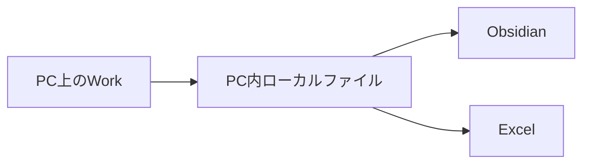
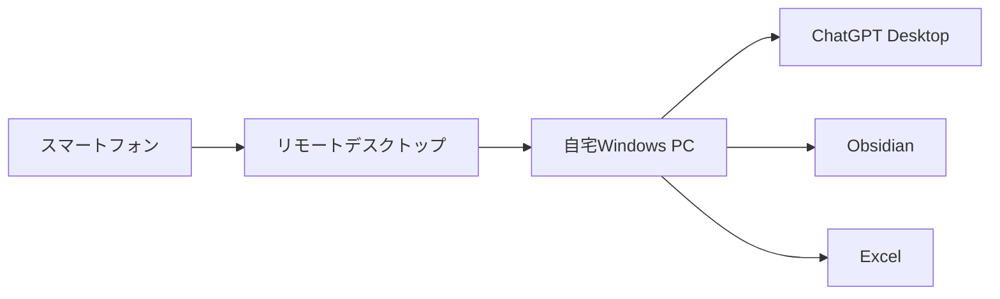
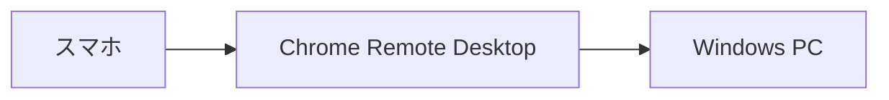
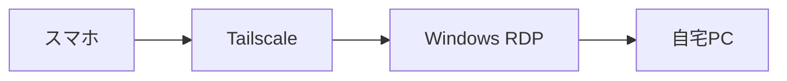
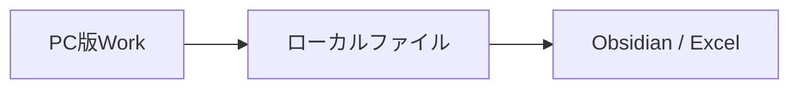
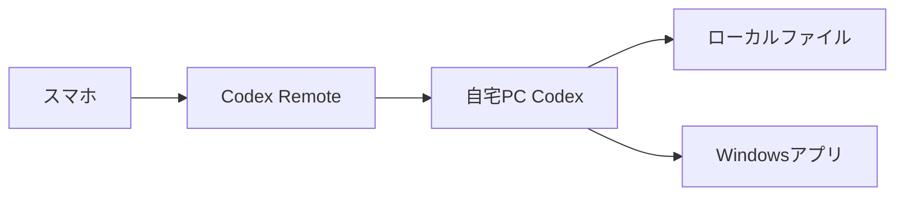
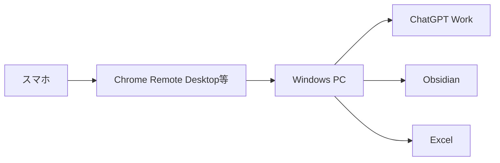
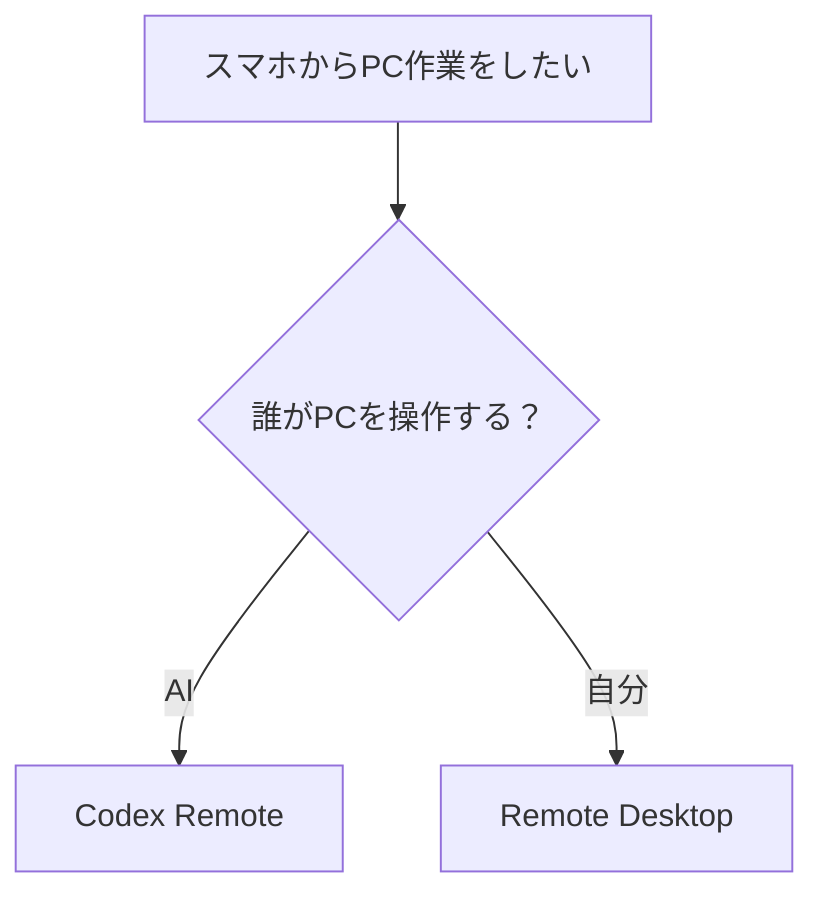
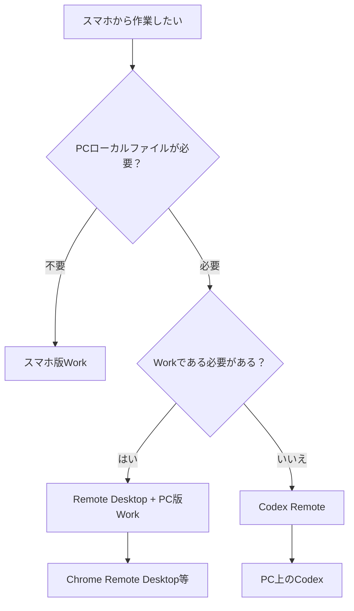

## 1. そもそもの目的

今回の相談の出発点は、

> スマートフォンから、自宅や会社のPC上にあるChatGPT Workを使いたい

というものでした。

特に想定していたのは、単にスマホ版ChatGPTで会話することではなく、PC内にある以下のようなローカルデータをChatGPTに扱わせる用途です。

- Obsidian Vault
- Excelファイル
- Windows上のローカルファイル
- PC上のアプリケーション
- デスクトップ版ChatGPTのWork

そのため、問題の本質は、

> 「スマホからChatGPTを使えるか」

ではなく、

> 「スマホから、PC上で実行されているローカルWorkやPC内のファイル操作まで制御できるか」

という点にあります。

---

## 2. ChatGPT Workには「クラウド側」と「PCローカル側」の違いがある

Workについて最初に整理すべきなのは、スマホ版でも使えるWorkと、デスクトップPCでなければ成立しないWorkがあることです。

### クラウドWork

クラウド上で動作するWorkであれば、スマートフォン版ChatGPTから直接利用できます。

例えば、

```text
PCでWorkを開始
↓
同じChatGPTアカウントでスマホから開く
↓
同じクラウドWorkを確認・継続する
```

という使い方が可能です。

この場合、そもそもPCを「遠隔操作」する必要がありません。

スマホ版ChatGPTから直接Workを利用すればよいためです。

### ローカルWork

一方、PC内のファイルを直接扱うWorkは事情が異なります。

例えば、

```text
C:\Users\...\Documents\Obsidian Vault
```

にあるMarkdownファイルをWorkに整理させたり、

```text
C:\Users\...\Documents\Excel\
```

にあるExcelファイルを直接操作させたりする場合です。

このような処理では、Workが実際にそのWindows PC上で動いている必要があります。

したがって、



という関係になります。

スマホ版Workが、自宅PCのCドライブへ直接アクセスするわけではありません。

---

## 3. 最初に検討した方法：Windowsそのものをリモート操作する

そこで最初に検討したのが、

> スマホからWindows PCそのものへリモート接続する

方法でした。

構成としては以下です。



この方法であれば、スマホから見ているのは「PCの画面そのもの」です。

そのため、

- ChatGPT Desktop
- Work
- Obsidian
- Excel
- エクスプローラー
- Windows上の確認ダイアログ

などをまとめて操作できます。

つまりChatGPTの機能に依存せず、

> 「PCの前にスマホから遠隔で座る」

方式です。

---

## 4. Chrome Remote Desktop

その用途の最も簡単な候補として挙げたのが、Chrome Remote Desktopです。

構成は非常に単純です。



PC側にChrome Remote Desktopを設定しておけば、外出先のスマホからWindows画面へアクセスできます。

そのWindows上で、

```text
ChatGPT Desktop
↓
Work
↓
Obsidian Vault
```

という通常のPC操作を行います。

### Chrome Remote Desktopの特徴

|項目|内容|
|---|---|
|導入難易度|比較的低い|
|Windows Home|利用可能|
|Windows Pro|利用可能|
|Android|利用可能|
|iPhone|利用可能|
|ポート開放|基本不要|
|PC画面の遠隔操作|可能|
|ChatGPT Desktop|操作可能|
|Obsidian|操作可能|
|Excel|操作可能|
|主な用途|確認・軽操作・Workへの指示|

特に、

> Workに追加指示を出す  
> 処理結果を確認する  
> 承認画面をクリックする

程度の用途であれば、かなり現実的です。

---

## 5. より本格的な方法：Tailscale + Windows RDP

もう一つの候補として、

> Tailscale + Windows Remote Desktop

という構成も検討しました。



Tailscaleによって、スマホとWindows PCを仮想的なプライベートネットワーク内に置き、その中でWindows Remote Desktopを使います。

Chrome Remote Desktopより設定は増えますが、Windowsのリモートデスクトップ環境としてはより本格的です。

ただし重要な制約があります。

### Windows HomeではRDPホストになれない

Windows標準Remote Desktopで「接続される側」となるには、基本的にWindows Pro以上が必要です。

そのため、

|Windows Edition|推奨候補|
|---|---|
|Windows Home|Chrome Remote Desktop|
|Windows Pro|Chrome Remote Desktop / Tailscale + RDP|

という整理になります。

---

## 6. PCの電源・スリープ問題

リモート操作を行う場合、PCが利用可能な状態である必要があります。

基本条件は、

```text
PC電源：ON
ネットワーク：接続
スリープ：無効
ディスプレイ：OFFでも可
```

です。

PCが完全にスリープしたり、電源OFFになった場合は、通常のリモート接続はできません。

そこで将来的な発展案として、

> Wake on LAN

も候補になります。

構成は、


です。

ただしWake on LANは、

- BIOS / UEFI
- LANアダプター
- ルーター
- ネットワーク構成
- 有線LAN / Wi-Fi

などの条件が絡むため、最初から導入する必要はありません。

最初は、

> 外出する日はPCを起動状態にしておく

程度で十分です。

---

# 7. その後に出てきた重要な論点：ChatGPTの「Remote」

ここでユーザーから、

> ChatGPTには「Codex Remote / Remote」があり、スマートフォンからPC上のCodexやデスクトップアプリを遠隔操作できるという説明を見た

という指摘がありました。

ここが今回の一番重要な整理ポイントです。

当初の説明では、

> ChatGPT Remoteではなく、Windows自体をRemote Desktopで操作する

という方向を中心に説明しました。

しかし調べた情報を見ると、

> ChatGPTのRemoteを使えば、PCのChatGPT Desktopそのものをスマホから操作できるのではないか

という疑問が生じました。

この点を改めて整理しました。

---

# 8. ChatGPT Remoteは「デスクトップアプリ全体のリモコン」ではない

結論としては、

> ChatGPTのRemoteは、ChatGPT Desktop全体を遠隔操作する機能ではありません。

より正確には、

> PC上で動作しているCodexセッションを、スマートフォンから操作する機能

です。

つまり、


です。

これを、

```text
スマホ
↓
ChatGPT Desktopアプリ全体
↓
Work
```

として操作する機能ではありません。

---

# 9. Remoteから操作できるもの

現時点で整理すると、概念的には次のようになります。

|対象|スマホRemote|
|---|--:|
|Codexセッション|○|
|Codexへの追加指示|○|
|Codexの進行確認|○|
|Codexへの質問回答|○|
|Codexの操作承認|○|
|Codexが操作しているPCアプリ|○ 条件付き|
|ChatGPT Desktopそのもの|×|
|Workセッションそのもの|×|
|ローカルWorkをRemoteから操作|×|

つまりRemoteは、

> PCのChatGPT Desktopをスマホからマウス操作する

ものではなく、

> PC上で動いているCodexエージェントへスマホから指示を出す

仕組みです。

---

# 10. なぜ「PC上のアプリを遠隔操作できる」という説明も間違いではないのか

ここが少し紛らわしいところです。

Codexには、Windows環境でアプリケーションを操作するComputer Use系の機能があります。

そのため、


ということができます。

CodexがPC上で、

```text
画面を見る
↓
アプリをクリックする
↓
文字を入力する
↓
ファイルを操作する
```

といった処理を行い、そのCodexへスマートフォンからRemoteで指示できます。

したがって、

> スマートフォンからPC上のアプリを遠隔操作できる

という説明は、完全な誤りではありません。

ただし正確には、

```text
スマホ
↓
Codex Remote
↓
Codex
↓
Windowsアプリ
```

です。

スマホから直接Windowsアプリを操作しているわけではありません。

---

# 11. WorkとCodex Remoteは別物

今回の最重要ポイントはここです。

Workを使う場合：



Codex Remoteを使う場合：


という別系統になります。

Remoteから、

```text
PC版ChatGPT
↓
Work
```

を操作するわけではありません。

したがって、

> 「WorkをRemoteから操作できるが、おすすめしない」

という話ではありません。

正しくは、

> 「WorkをRemoteから操作する機能としては提供されていない」

です。

---

# 12. クラウドWorkならそもそもRemote不要

Workについてはもう一つ重要な点があります。

クラウドWorkであれば、

```text
PCでWorkを開始
↓
スマホ版ChatGPTを開く
↓
同じWorkを継続
```

という利用ができます。

したがってクラウドWorkの場合、

> Remoteを使ってPC版ChatGPTを操作する

必要そのものがありません。

スマートフォン版ChatGPTから直接同じWorkへアクセスします。

---

# 13. 問題になるのは「ローカルWork」

今回の用途で本当に問題になるのは、

> PC内のObsidian VaultやExcelファイルをWorkに直接扱わせたい

場合です。

例えば、

```text
C:\Users\...\Obsidian\
```

というPC内ローカルフォルダをWorkに整理させている場合、

そのWorkはPC側で動いています。

スマホ版Workから、

```text
自宅PCのCドライブ
```

へ直接アクセスするわけにはいきません。

また、そのローカルWorkをChatGPT Remoteから操作する仕組みもありません。

したがってこの用途では、現在のところ別の方法が必要になります。

---

# 14. 現在考えられる3つの運用パターン

ここまでを整理すると、実際の運用は次の3パターンになります。

|方法|主な用途|PCローカルファイル|スマホ操作|
|---|---|--:|--:|
|スマホ版Work|クラウド作業|×|◎|
|Codex Remote|PC上のCodexによる作業|○|◎|
|Remote Desktop|PCそのものの操作|○|○|

それぞれ性質がかなり違います。

---

# 15. 方法A：スマホ版Work

構成：


適しているのは、

- Web調査
- クラウドブラウザ
- ChatGPT上のファイル
- クラウドにある作業
- PCローカル環境を必要としない作業

です。

最大の利点は、

> PCが不要

なことです。

一方、

```text
C:\Users\...
```

などのPCローカルファイルへ直接アクセスする用途には向きません。

---

# 16. 方法B：Codex Remote

構成：



これは、

> PC上のAIエージェントへスマホから指示する

方式です。

用途によっては、今回考えている

> スマホからPC上のObsidianをAIに整理させる

という目的にかなり適しています。

Workを遠隔操作するのではなく、

> Codex自身にObsidian Vaultやローカルファイルを扱わせる

考え方です。

---

# 17. 方法C：Windows Remote Desktop

構成：



これは、

> AIを遠隔操作するのではなく、PCそのものを遠隔操作する

方式です。

この方法なら、現在PC上で行っていることをほぼそのままスマホから実行できます。

したがって、

> 「どうしてもWorkを使いたい」

のであれば、現時点ではこれが最も確実です。

---

# 18. Codex RemoteとRemote Desktopの根本的な違い

この2つは一見似ていますが、実際には思想がかなり違います。

### Codex Remote

```text
自分
↓
AIへ指示
↓
AIがPCを操作
```

です。

### Remote Desktop

```text
自分
↓
スマホからPCを直接操作
```

です。

つまり、



と考えると分かりやすくなります。

---

# 19. Obsidian整理に当てはめた場合

例えば、

> ObsidianのInboxを整理したい

とします。

### Work方式

```text
スマホ
↓
Remote Desktop
↓
自宅PC
↓
ChatGPT Desktop
↓
Work
↓
Obsidian Vault
```

となります。

これは現在PCでWorkを使っている運用をそのまま維持できます。

### Codex Remote方式

```text
スマホ
↓
Codex Remote
↓
自宅PCのCodex
↓
Obsidian Vault
```

となります。

こちらではWorkを使わず、Codexに直接ローカルファイルを整理させます。

もし、

- Markdownファイル編集
- YAML修正
- ファイル移動
- ファイル名変更
- スクリプト実行
- 大量処理

などが中心なら、Codexの方がむしろ適している可能性があります。

一方、

- Web調査
- 人間との対話
- 複数ステップの調査整理
- ChatGPT Work固有の機能

を重視するならWorkの方が適しています。

---

# 20. 今回の理解の修正点

今回の対話を通じて、一つ重要な修正がありました。

最初は、

> ChatGPT RemoteではWorkを操作できないので、Chrome Remote Desktop等を使う

という説明をしました。

これは結論としては「Workについては」正しいものの、ChatGPT Remoteの能力については説明が不足していました。

より正確には、

```text
ChatGPT Remote
＝
Codex専用の遠隔操作機能
```

であり、

```text
ChatGPT Remote
≠
ChatGPT Desktop全体のリモートデスクトップ
```

です。

ただしCodex自体がPCアプリを操作できるため、

> 結果的にPC内のアプリやファイルをスマホから操作できるケースがある

という点が重要です。

---

# 21. 現時点での結論

今回の目的を、

> スマホから自宅PCのAI作業を管理し、必要ならObsidianやExcelなどPCローカルデータを扱わせる

とすると、選択肢は以下のようになります。



要するに、

**クラウド作業ならスマホ版Work。**

**PCローカル作業をAIに任せるならCodex Remote。**

**PC版Workそのものを使いたいならWindowsをRemote Desktopで操作する。**

という3分割で考えると整理しやすくなります。

---

# 22. 今後検討すべき点

実際に環境を構築するなら、次に決めるべきなのは、

> 「スマホから何をしたいのか」

です。

例えば、

```text
A. Workに指示を追加したいだけ
B. Workの処理結果を確認したい
C. Obsidian VaultをAIに整理させたい
D. ExcelファイルをAIに処理させたい
E. Windows画面を直接操作したい
F. PCを触らず完全にAIへ任せたい
```

によって最適な方式が変わります。

今回の話から見ると、特に比較価値が高いのは、

```text
Codex Remote
vs
Chrome Remote Desktop + Work
```

です。

これは単なる技術比較ではなく、

> 「AIにPC操作を任せるか」

と

> 「自分がPCを遠隔操作してWorkを使うか」

という運用思想の違いになります。

---

## 最終整理

最も短くまとめると、

> **ChatGPT RemoteはChatGPT Desktop全体のリモート操作機能ではなく、PC上のCodexをスマートフォンから操作する機能。**
> 
> **Workのクラウドセッションはスマホから直接利用できる。**
> 
> **PCローカルファイルを使うWorkをスマホから使いたい場合は、Work自体をRemoteで操作することはできないため、Chrome Remote Desktop等でWindowsそのものを操作する必要がある。**
> 
> **一方、Workにこだわらなければ、Codex Remoteを利用してPC上のCodexにローカル作業を任せるという別ルートがある。**

したがって、今回の目的に対する主要候補は、

**① スマホ版Work**  
**② Codex Remote**  
**③ Chrome Remote Desktop等 + PC版Work**

の3つであり、特にローカルObsidianやExcelを扱う用途では、**②と③を比較して選ぶ**のが妥当です。