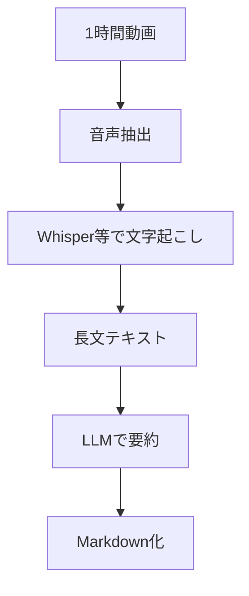
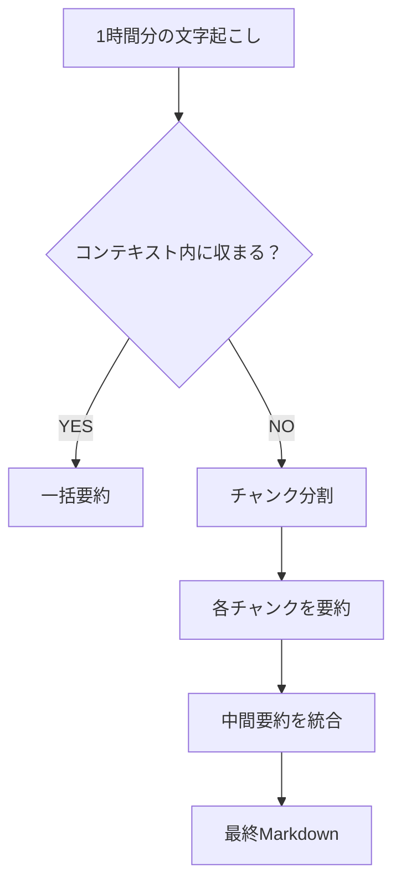
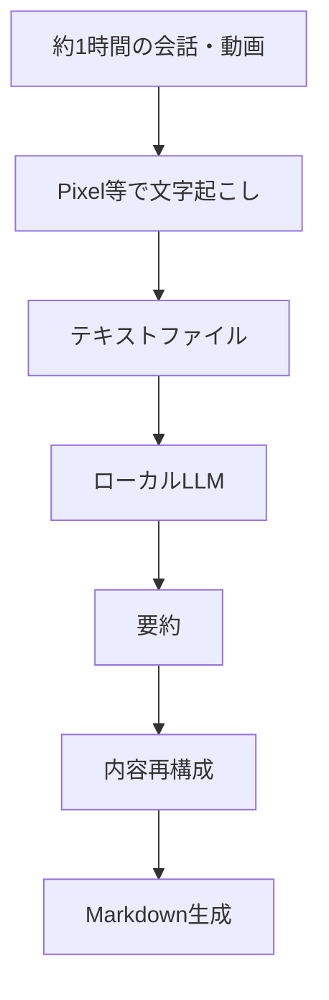

# 

このチャットでは、**ローカルLLMとは何か**という基本から始まり、PCスペックごとの処理能力、長文要約、1時間程度の動画文字起こし後の要約処理まで、用途別に必要性能を整理した。

結論から言えば、**すでに文字起こし済みのテキストを要約してMarkdown化する用途であれば、音声認識用の高性能GPUは必須ではない**。実用性を重視するなら、**7B〜14B級のモデルを快適に動かせるPC**が一つの基準になる。

## 1. ローカルLLMとは

ローカルLLMとは、ChatGPTのような大規模言語モデルを、クラウド上ではなく**自分のPCや社内サーバー上で実行する仕組み**を指す。

通常のChatGPTでは、

という構成になる。

一方、ローカルLLMでは、

となり、モデルそのものをPC内で実行する。

主な特徴は次のとおり。

|特徴|内容|
|---|---|
|オフライン利用|モデル取得後は、構成次第でインターネット接続なしでも利用可能|
|プライバシー|入力データを外部AIサービスへ送らず処理できる|
|カスタマイズ|モデル、プロンプト、RAG、処理フローなどを自由に組み合わせられる|
|ランニングコスト|API利用料を抑えられる。一方、PC購入費・電気代は必要|
|ハードウェア依存|モデルサイズが大きくなるほどGPU VRAM・RAMが必要|
|導入難易度|Ollamaなどで簡単になっているが、用途によっては設定や自動化が必要|

代表的な実行環境として、このチャットでは**Ollama**などを例に挙げた。

## 2. PCスペックと動かせるLLMの大まかな関係

ローカルLLMでは、単純なCPU性能よりも、特に**GPUのVRAM容量**と**システムRAM容量**が重要になる。

チャット内では、概念的に以下のような分類で整理した。

|レベル|おおよその構成|想定モデル|主な用途|PC価格感|
|---|---|---|---|--:|
|ライト|RAM 16GB、GPUなし〜低価格GPU|1B〜3B級|簡単な質問、短文整形|10〜15万円程度|
|ミドル|RAM 32GB、RTX 3060〜4070級|7B〜14B級|要約、Markdown生成、コード補助|20〜30万円程度|
|ハイエンド|RAM 64〜128GB、RTX 4080/4090級|14B〜30B超|高品質な長文処理、複雑な分析|40〜70万円程度|
|ワークステーション|大容量RAM、複数GPU等|70B級以上|大規模推論、研究、複数ユーザー|数百万円規模もあり|

ただし、これは**大まかなクラス分け**である。

実際には、同じ「14Bモデル」でも量子化方法によって必要VRAMが異なるため、

> モデルのパラメータ数だけでなく、量子化方式・コンテキスト長・GPU VRAMを見る

必要がある。

## 3. 「どれくらい仕事を依頼できるか」という考え方

ローカルLLMの能力は、単純に「PCが高性能ならChatGPTと同じになる」というものではない。

主に次の4つで決まる。

- **モデル自体の能力**
- **モデルサイズ**
- **コンテキスト長**
- **PC側の処理速度・メモリ容量**

PC性能は主に、

> 「そのAIを動かせるか」「どれくらい速く処理できるか」

を決める。

一方、

> 「どれくらい賢いか」

については、モデルそのものの性能が大きい。

したがって、RTX 4090を使って小型モデルを高速に動かしても、そのモデルの推論能力自体が大型クラウドモデル並みになるわけではない。

## 4. 長文を要約してMarkdown化する場合

次に、

> 長文を入力し、内容を要約してMarkdownとして整理させたい

という用途について検討した。

想定する処理は、

という比較的シンプルなものになる。

この用途は、画像生成や音声認識ほどGPU負荷が高いわけではない。

### モデルクラス別の目安

|モデル規模|長文要約|Markdown整形|日本語|実用性|
|---|--:|--:|--:|---|
|1B〜3B|△|○|△|軽作業向け|
|7B〜8B|○|○〜◎|○|実用ライン|
|12B〜14B|◎|◎|◎|バランスが良い|
|20B〜30B級|◎|◎|◎|複雑な再構成にも強い|
|70B級|◎|◎|◎|高性能だがハードウェア負荷大|

単純な、

- 誤字修正
- 箇条書き化
- 見出し付与
- Markdown化

程度なら小型モデルでも可能。

一方で、

- 話の流れを理解する
- 重複を統合する
- 論点ごとに分類する
- 主張と具体例を区別する
- 本筋ではない話を削る
- 長文全体を再構成する

といった作業になると、7Bより**12B〜14B以上**のモデルの方が安定しやすい。

## 5. 1時間程度の動画を処理する場合

さらに、

> 約1時間の動画の会話を文字起こしし、その内容を要約してMarkdown化する

ケースについて検討した。

当初は、

という処理を想定した。

この場合、

1. 音声認識
2. 長文要約
3. Markdown生成

という3種類の処理が発生する。

そのため、Whisperなどの音声認識モデルもローカルで実行するなら、GPU性能がより重要になる。

チャット内では、実用ラインとしてRTX 4070級以上、RAM 32GB以上といった構成を例に挙げた。

## 6. 文字起こしをPixelなど別の端末・アプリで行う場合

その後、前提条件が変更された。

> Google Pixelなど別の端末・アプリですでに文字起こしを済ませ、ローカルLLMにはテキストデータだけ渡す。

この構成なら、ローカルPC側では**音声認識処理が完全に不要**になる。

処理フローは次のように簡略化される。

この方式はかなり合理的である。

ローカルLLM側が担当するのは、

- テキスト読み込み
- 内容理解
- 要約
- 情報整理
- Markdown整形

だけになる。

したがって、高性能な音声処理向けGPUを用意する必要はない。

## 7. 1時間分の文字起こしテキストを処理する場合

1時間の会話は、話す速度や無音時間によって大きく変わるが、かなりの長文になる。

重要なのは「文字数」そのものよりも、LLMでは**トークン数**として処理される点。

そのため、1時間分を一度に渡せるかどうかは、主にモデルの**コンテキストウィンドウ**によって決まる。

例えば概念的には、

という処理になる。

したがって、非常に長い文字起こしでは、

> 大型モデルを買う

以外にも、

> 分割 → 要約 → 統合

という処理フローを使えば、小〜中型モデルでも対応できる。

## 8. 文字起こし済みテキスト処理なら必要スペックは下げられる

このチャットでの最終的な用途を前提にすると、求めているのは、

> 「音声処理AI」ではなく、「文章整理AI」

に近い。

そのため、おおよその位置付けは以下になる。

|PC構成|想定用途|評価|
|---|---|---|
|RAM 16GB・GPUなし|短文要約、小型モデル|△|
|RAM 32GB・RTX 3060/4060級|7B前後、長文の分割要約|○|
|RAM 32〜64GB・RTX 4070級|7B〜14B、長文要約・Markdown|◎|
|RAM 64GB・RTX 4080/4090級|大型モデル、高速処理|◎だが用途に対して過剰な場合あり|

つまり、

> **Pixel等で文字起こし → PCでLLM要約**

という用途だけなら、RTX 4090クラスは必須ではない。

コストと性能のバランスを考えると、**RAM 32〜64GB + 中〜上位GPU**あたりが現実的なゾーンになる。

## 9. この用途でローカルLLMに任せられる仕事

今回想定しているような文字起こしデータなら、単純な要約よりもかなり広い処理を自動化できる。

|処理|ローカルLLMへの依頼例|
|---|---|
|要約|全体を1,000字程度にまとめる|
|Markdown化|H2/H3、箇条書き、表に整理|
|議事録化|議題・結論・決定事項・課題に分ける|
|会話整理|雑談や重複を削除する|
|話題分類|テーマ別に並べ替える|
|TODO抽出|発生したタスクだけ抽出|
|決定事項抽出|会話中に確定した事項を一覧化|
|未解決事項抽出|保留・要確認事項を抽出|
|Q&A化|会話を質問と回答に再構成|
|ノート化|Obsidian向けMarkdownへ変換|
|タイトル生成|内容に合ったタイトル・ファイル名を作成|
|YAML生成|title、tags、aliases等を生成|
|タグ付け|内容に基づいて分類タグを付与|

特に、

> **文字起こし → 情報整理 → Markdown → Obsidian**

のような処理は、ローカルLLMとの相性がよい。

## 10. ローカル処理のメリット

今回の用途では、ローカルLLMを利用する理由として特に重要なのがプライバシーである。

会議、業務メモ、個人的な音声記録などを処理する場合、

とすれば、AI処理部分をPC内部で完結させることができる。

クラウドAPIを使用しないため、

- API従量課金を抑えられる
- 大量処理しやすい
- 機密性の高いテキストを外部へ送信せずに済む
- 自分専用の処理フローを構築できる

という利点がある。

## 11. 今回の用途に対する整理

このチャットで条件を徐々に絞った結果、想定用途は次のようになった。

この構成なら、PC側に必要なのは主として**LLM推論性能**であり、音声認識性能ではない。

### 現時点での目安

|項目|推奨|
|---|---|
|用途|文字起こし済み長文の整理・要約|
|モデル|7B〜14B級を中心に検討|
|RAM|32GB以上、余裕を見るなら64GB|
|GPU|RTX 3060〜4070級以上を検討|
|GPU VRAM|モデル選択上かなり重要|
|ストレージ|SSD推奨。複数モデル利用なら1TB以上が便利|
|PC予算|おおむね20〜35万円前後から現実的|
|上位構成|40万円以上なら大型モデル・高速処理へ余裕|
|音声認識GPU|Pixel等で処理するなら不要|
|Markdown生成|7B級でも可能|
|高品質な再構成|12B〜14B以上の方が安定しやすい|

## まとめ

今回の検討で重要だったのは、**「ローカルLLMを使いたい」という話と、「全部のAI処理をPCでやる」という話は別である**という点。

文字起こしまでローカルPCで行うのであれば、それなりのGPU性能が必要になる。一方、Pixelなどに文字起こしを任せるのであれば、ローカルPCが担当するのは文章処理だけになるため、必要スペックをかなり抑えられる。

特に今回の、

> **1時間程度の文字起こし済みテキスト → 要約 → 構造化 → Markdown**

という用途では、7B級が最低限の実用ゾーン、**12B〜14B級を無理なく動かせる環境が品質とコストのバランスがよい構成**と考えられる。

なお、このチャット中で挙げたモデル名・GPU価格・「○文字まで」といった数値には、当時の説明としてかなり粗い目安も含まれている。実際にPC購入まで検討する場合は、**2026年9月時点のモデル事情・GPU価格・VRAM容量を基準として改めて比較した方がよい**。