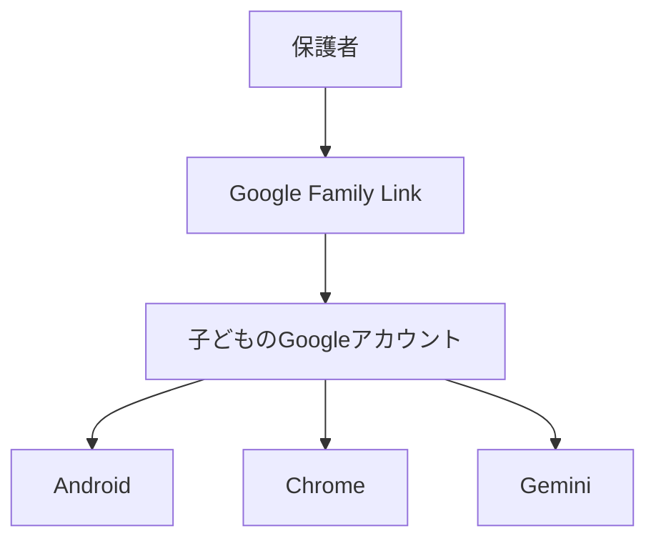
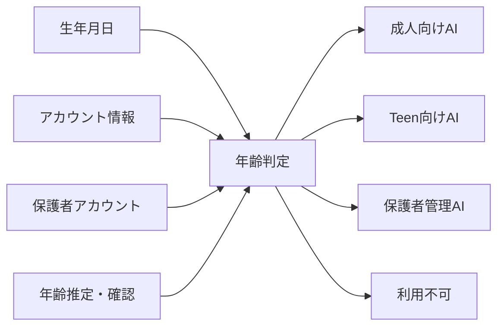
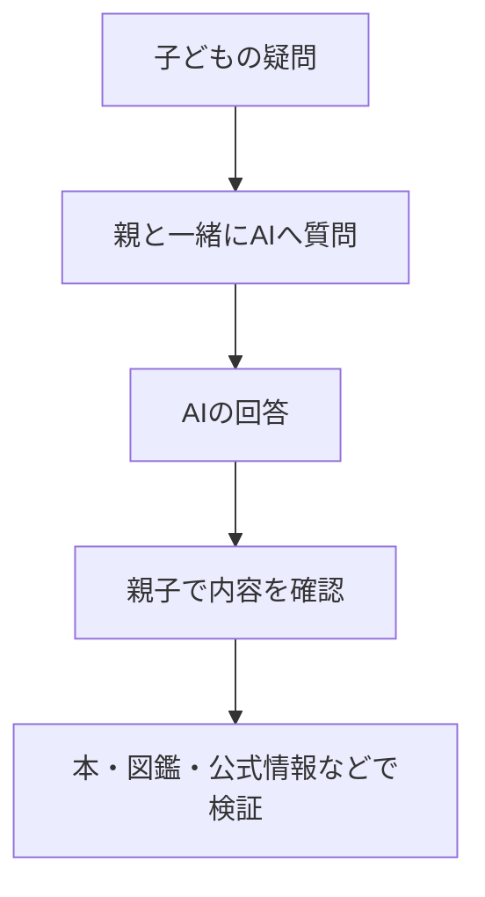
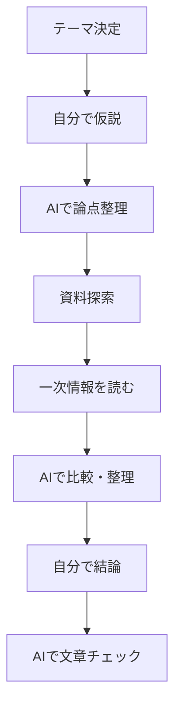
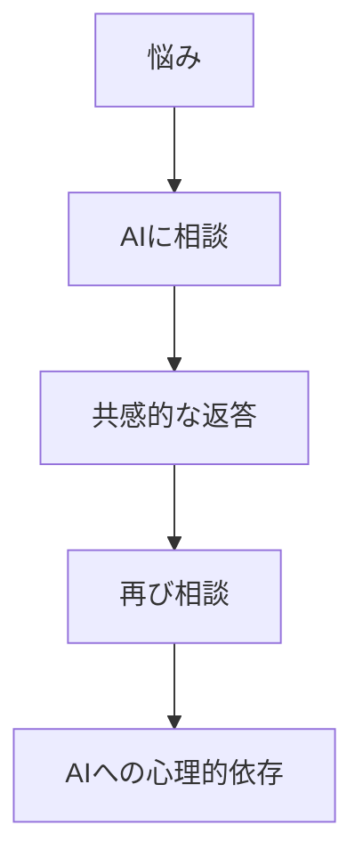
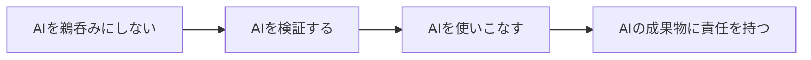

## 1. このチャットで確認したこと

このチャットでは、ChatGPTなど主要な生成AIについて、主に次の観点から整理した。

- そもそも生成AIに年齢制限があるのか
- 未成年はどの条件で利用できるのか
- 保護者向けのペアレンタルコントロールがあるのか
- 各AIサービスで未成年への考え方にどのような違いがあるのか
- 小学生・中学生・高校生に、実際どの程度AIを使わせるべきか
- 家庭でどのようなルールを設定すればよいか
- AIを「禁止する」のではなく、どう使い方を教育するべきか

結論としては、現在の主要生成AIは一律ではなく、かなり異なる方針を採っている。

大きく分けると、

1. **13歳前後から利用可能にし、未成年向け制限を設ける**
2. **13歳未満でも保護者管理下なら利用可能にする**
3. **18歳未満は原則利用させない**

という3つの方向性がある。

---

## 2. 主要AIサービスの年齢制限

2026年9月時点で確認した大まかな状況は次のとおり。

|サービス|年齢の目安|未成年の扱い|保護者管理|
|---|--:|---|---|
|ChatGPT|13歳以上|13～17歳は保護者同意が必要|かなり充実|
|Gemini|原則13歳以上|13歳未満でもFamily Link管理下で利用可能|非常に充実|
|Microsoft Copilot|13歳以上|13～17歳向け制限あり|Family Safetyと連携|
|Claude|18歳以上|未成年は原則利用不可|未成年利用を想定しない|
|Grok|13歳以上|未成年は保護者許可が必要|比較的限定的|
|Perplexity|13歳以上|未成年は保護者同意が必要|比較的限定的|

この中でも特に特徴的なのは、**ChatGPT、Gemini、Claude**の違いである。

---

# 3. ChatGPTの考え方

ChatGPTは、基本的に**13歳以上**を対象としている。

13～17歳については、保護者または法定代理人の同意が必要となる。

さらに、2026年からは未成年向けの仕組みがかなり強化されている。

## ChatGPT for Teens

13～17歳と判断されたユーザーは、成人向け通常環境ではなく、未成年向けに調整された環境へ移行する。

自己申告だけでなく、OpenAI側が利用者を18歳未満と推定した場合にも、Teen向け設定が適用される仕組みが導入されている。

### 保護者が管理できる主な項目

保護者と子どものアカウントをリンクすると、たとえば次のような項目を管理できる。

- センシティブコンテンツの低減
- 画像生成
- 音声機能
- メモリ
- モデル改善への会話利用
- Webやクラウドブラウザー系機能
- Study Mode
- Study Hours
- Quiet Hours
- ChatGPT自体を利用できない時間帯
- 深刻な自傷・暴力関連などについての安全通知

重要なのは、

> **保護者が子どものチャット内容を常時閲覧する仕組みではない**

という点である。

通常の会話内容そのものは保護者には公開されない。

つまりChatGPTの設計思想は、

> 「未成年にもAIを使わせるが、成人とは異なる安全環境を提供する」

というもの。

---

# 4. Geminiの考え方

Google Geminiは、ChatGPTとは少し違う。

Googleアカウントを自分で管理できる年齢は、日本では基本的に13歳以上だが、**13歳未満でも保護者がFamily Linkで管理している子ども用アカウントならGeminiを利用できる**。

構造としては次のようになる。



つまりGemini単独でペアレンタルコントロールを持つというより、

> **Googleアカウント全体のファミリー管理の中にAIも組み込まれている**

という考え方。

そのため保護者は、

- Gemini利用のON/OFF
- アカウント管理
- 年齢に応じた制限
- デバイス利用
- Web利用

などをまとめて管理できる。

小学生など13歳未満でもAIを使わせたい家庭にとっては、現状かなり分かりやすい仕組みである。

---

# 5. Microsoft Copilot

Microsoft Copilotも基本的に13歳以上。

13～17歳については、成人ユーザーとは異なる処理が行われる。

例として、

- パーソナライズを制限
- パーソナライズ広告を制限
- 会話のモデル学習利用を制限

などがある。

また保護者側では、Microsoft Family Safetyなどを通じて、

- Copilotアプリ
- Web版Copilot
- 利用時間
- アプリ利用
- 一部AI機能

などを管理できる。

Googleと同様、

> **AI単体ではなく、Microsoftアカウント・Windows・端末管理の一部としてAIを管理する**

という方向に近い。

---

# 6. Claude

Claudeは他社とかなり違う。

Anthropicは消費者向けClaudeについて、

> **18歳以上**

という方針を採っている。

つまり、

```text
ChatGPT / Gemini / Copilot
↓
未成年向け安全機能を用意して利用可能にする

Claude
↓
未成年には基本的に使わせない
```

という違い。

未成年と判断される利用者について、場合によっては年齢確認や利用停止などが行われることもある。

そのためClaudeは、

> ペアレンタルコントロールを充実させるより、未成年を利用対象外にする

という比較的明快な立場を取っている。

---

# 7. Grok・Perplexity

Grok、Perplexityはいずれも概ね13歳以上。

未成年の場合、

- 保護者の許可
- 保護者による利用規約への同意

などが必要となる。

ただし現状では、

- ChatGPTの親子アカウント連携
- Google Family Link
- Microsoft Family Safety

ほど、体系的なペアレンタルコントロールは中心的ではない。

そのため、

> **家庭で細かく管理したい場合はChatGPT・Gemini・Copilotの方が分かりやすい**

という整理になる。

---

# 8. 年齢制限そのものも変化している

従来のWebサービスでは、

> 「13歳以上と規約に書いてある」

程度であり、自己申告に依存する場合が多かった。

生成AIでは、この考え方が変化してきている。

現在は、



という方向へ進んでいる。

特に、

- 年齢推定
- ファミリーアカウント
- Teen専用モード
- 年齢確認

などが導入されつつあり、単なる自己申告から一歩進んでいる。

---

# 9. 子どもには「何歳から」より「どう使わせるか」

このチャットではさらに、

> 「では実際、小学生・中学生・高校生にはどう使わせるべきなのか」

という点も検討した。

基本的な考え方は、

> **年齢が上がるにつれて制限を減らし、その代わり本人の検証責任を増やす**

というもの。

大まかには次のようになる。

|年齢|AIとの関係|親の関与|
|---|---|---|
|小学生|親と一緒に使う道具|強い|
|中学生|学習補助・思考補助|中～強|
|高校生|実務ツールの練習|中|
|成人|本人管理の汎用ツール|原則不要|

---

# 10. 小学生への使わせ方

小学生については、

> **一人でAIを自由に使わせるより、親子共同利用**

が基本。

理想的なのは、



たとえば、

「恐竜はなぜ絶滅したの？」

という質問に対し、AIに説明してもらった後、

> 「本当にそうなのか図鑑でも確認してみよう」

とする。

ここで重要なのは、

> **AIの回答を正解として受け取らない習慣**

を早い段階で身につけること。

小学生については、サービスの仕組みだけを見ると、

> **Gemini + Family Link**

が比較的利用しやすい。

一方ChatGPTは13歳未満を基本的な利用対象としていない。

---

# 11. 中学生への使わせ方

13歳を超えると、多くのAIサービスで本人アカウントを持てるようになる。

中学生では、

> **AIを「答えを出す機械」ではなく「家庭教師」にする**

ことが重要。

悪い例は、

```text
宿題
↓
ChatGPT
↓
答えをコピー
↓
提出
```

望ましい使い方は、

```text
問題
↓
まず自分で考える
↓
分からない部分をAIに聞く
↓
説明を読む
↓
自分で解く
↓
AIに採点・別解を聞く
```

という流れ。

この年代から、

> **AIの答えを疑う能力**

を積極的に身につけさせる。

### 中学生向け設定の例

|設定|方針|
|---|---|
|Teenモード|ON|
|センシティブコンテンツ低減|ON|
|Quiet Hours|夜間ON|
|Study Hours|必要に応じて|
|モデル改善への会話利用|OFFも検討|
|メモリ|最初はOFFでもよい|
|画像生成|家庭方針次第|
|親による全文監視|原則しない|

---

# 12. 高校生への使わせ方

高校生では、AI利用をかなり自由にしてよいと考えられる。

むしろ今後は、

> **AIを使わないこと自体が、将来的な不利になる可能性**

もある。

将来的な大学・仕事では、

- 情報収集
- 文章作成
- 翻訳
- 要約
- データ分析
- プログラミング
- プレゼン作成
- アイデア整理
- AIエージェント

などが一般的になる可能性が高い。

したがって高校生では、

> **AIを使った成果物に本人が責任を持つ**

ところまで教育する。

理想的なレポート作成例は、



となる。

一方で、

```text
課題をコピー
↓
「2000字で書いて」
↓
提出
```

では、AIリテラシーも思考力も育たない。

---

# 13. 子どもに最初に教えるべき5つ

AIを使わせる場合、年齢を問わずまず教えるべき基本事項として次の5つを挙げた。

- **AIは普通に間違える**
- **分からなくても、分かったように話すことがある**
- **個人情報をむやみに入力しない**
- **重要な情報は別の資料で確認する**
- **AIに考えてもらうのではなく、自分が考えるために使う**

特に重要なのは、

> **「AIは先生ではない」**

という認識。

より正確には、

> 「非常に物知りで説明もうまいが、ときどき堂々と間違える相談相手」

くらいの理解が適している。

---

# 14. 感情相談・心理的依存の問題

生成AIには、検索エンジンにはあまりなかった問題もある。

それが、

> **人間のように会話できるため、相談相手になり得る**

という点。

利用が進むと、



となる可能性がある。

そのため、

> 「AIに悩みを相談してはいけない」

と禁止するより、

> **「AIに相談するのは構わないが、大事なことは人間にも相談する」**

というルールの方が現実的。

特に、

- 自傷
- いじめ
- 強い不安
- 家庭問題
- 人間関係
- 犯罪被害
- 性的トラブル

などは、AIだけで完結させないようにする必要がある。

ChatGPTがTeen向けに安全通知の仕組みを整備している背景にも、この問題がある。

---

# 15. 家庭での現実的なAI利用ルール

家庭で運用するなら、年齢ごとに次の程度が現実的。

|項目|小学生|中学生|高校生|
|---|---|---|---|
|AI利用|親子共同|本人利用可|原則自由|
|アカウント|親管理|Teen / Family管理|Teen管理|
|学習|◎|◎|◎|
|宿題丸投げ|×|×|×|
|調べもの|親と一緒|○|◎|
|文章作成|補助|下書き・添削|積極活用|
|プログラミング|遊び中心|○|◎|
|画像生成|親と一緒|制限付き|○|
|感情相談|人間中心|補助|補助|
|個人情報入力|×|原則×|最小限|
|出典確認|親が担当|一緒に確認|本人が担当|
|利用時間制限|強め|あり|必要に応じて|

---

# 16. 「監視」より「段階的な自立」

保護者のAI管理では、

> **チャット内容を全部読むべきか**

という問題もある。

このチャットでは、全面監視よりも、

- 利用時間を制限する
- 利用できる機能を制限する
- 安全設定を行う
- 子どもと利用方法について話す
- 重大な問題だけ保護者へ通知する

という方法の方が現実的だと整理した。

つまり、

```text
小学生
親が管理

↓ 成長

中学生
親と本人で管理

↓ 成長

高校生
本人主体

↓ 成人

本人が全面管理
```

という移行が望ましい。

---

# 17. 最終的に育てるべき能力

AI教育の目的は、

> **「AIを使える子どもを作ること」**

だけではない。

最終的には、

> **AIを使いながらも、自分で考え、AIの間違いを発見し、情報を検証し、最終判断を自分で下せる人間を育てること**

が重要。

成長段階としては、



となる。

---

# 18. このチャット全体の結論

このチャットを通じて得た結論は、大きく5点にまとめられる。

1. **主要AIには明確な年齢制限がある**
2. **未成年への対応方針は各社でかなり違う**
3. **ChatGPT・Gemini・Copilotは未成年利用を前提に安全機能を整備している**
4. **Claudeは18歳未満を原則利用対象外としている**
5. **家庭では年齢で一律禁止するより、利用方法と責任範囲を段階的に変える方がよい**

特に重要なのは、

> **年齢が上がるにつれて「制限」を減らし、「本人の責任」を増やす**

という考え方。

小学生では親と一緒に使い、中学生ではAIの答えを疑う力を身につけ、高校生ではAIを使った仕事や学習を本人が管理する。

この段階を踏むことで、

> **AIに依存する人ではなく、AIを道具として扱える人**

を育てることにつながる。

必要であれば次に、このまとめを**「家庭向けAI利用ガイドライン」形式に再構成して、実際に子どもと共有できるルール表**まで落とし込めます。