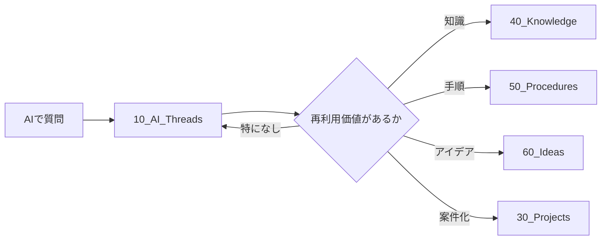
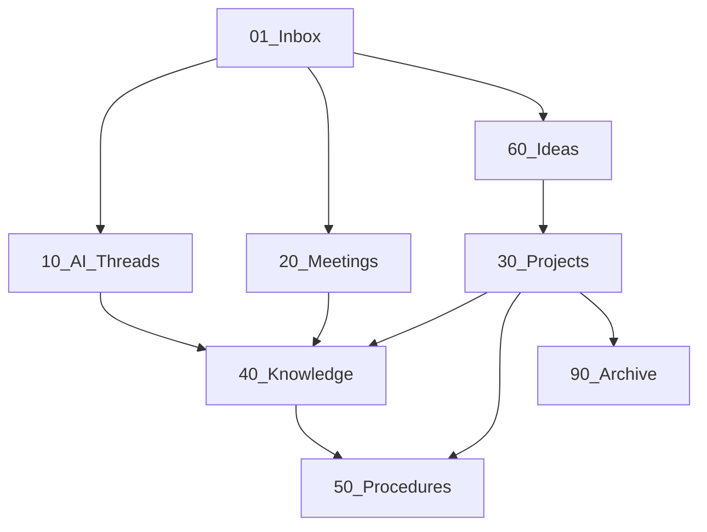

今回の目的は、単に会社資料を保管することではなく、以下を一つのVault内で扱えるようにすることです。

- AIとの対話・スレッドを大量に保存する
- 会議・打ち合わせの記録を残す
- 現在進行中の仕事を管理する
- 後から参照できる知識を蓄積する
- 同じ仕事をするときに再利用できる手順を残す
- 自分自身の考え・改善案・アイデアを蓄積する
- 将来的にはZettelkasten的な「仕事から得た知見・原則」も育てられるようにする

ただし、最初から細かく分類しすぎないことを基本方針とする。

---

## 1. 最初に考えた基本構造

最初の前提として、

```text
00_Templates
01_Inbox
```

を設けることを想定した。

### `00_Templates`

各種ノートのテンプレート置き場。

例：

- 議事録テンプレート
- AI対話保存用テンプレート
- Knowledgeノート用テンプレート
- Procedure用テンプレート
- Project用テンプレート

### `01_Inbox`

まだ分類・整理していない情報を一時的に入れる場所。

例：

- とりあえず書いたメモ
- Webからコピーした内容
- 思いついたこと
- 後で整理したい資料

Inboxは最終保管場所ではなく、**判断を後回しにするための入口**として扱う。

---

# 2. 会社Vaultでは「情報の種類」ではなく「役割」で分ける

議論の中で重要になったのが、

> 営業・EC・Excel・AIなどのテーマ別分類より、まず「そのノートが何のために存在するか」で分類する

という考え方。

その結果、基本構造として以下を候補とした。

```text
00_Templates
01_Inbox

10_AI_Threads
20_Meetings
30_Projects
40_Knowledge
50_Procedures
60_Ideas

90_Archive
```

これは現時点でかなり有力な構成。

---

# 3. 各フォルダの役割

|フォルダ|役割|
|---|---|
|`00_Templates`|ノートのテンプレート|
|`01_Inbox`|未整理情報の一時置き場|
|`10_AI_Threads`|AIとの対話・スレッドの保存|
|`20_Meetings`|会議・打ち合わせ等の記録|
|`30_Projects`|現在進行中の仕事|
|`40_Knowledge`|整理済み・再利用可能な知識|
|`50_Procedures`|次回そのまま使える手順|
|`60_Ideas`|自分の考え、仮説、改善案|
|`90_Archive`|完了・旧版・現在使わないもの|

特に重要なのは、

```text
AI Threads
Meetings
        ↓
Knowledge
        ↓
Procedures
```

という情報の成長過程。

---

# 4. AIスレッドは価値判断せず全部保存する

途中で大きく明確になった要件。

会社でAIを使った内容について、

> 価値があるかどうかは現時点では判断せず、一度片っ端からObsidianへ入れておきたい。

目的は知識整理だけではなく、**AIスレッドそのものの整理・アーカイブ**でもある。

そのため、AIとの対話は `Knowledge` に直接入れるのではなく、

```text
10_AI_Threads
```

を独立させる方針とした。

つまり、

> `10_AI_Threads` = AI利用履歴の原資料・アーカイブ

という位置づけ。

---

# 5. AIスレッドとKnowledgeを混同しない

AIとの会話には価値の高いものも低いものもある。

そのため、

```text
AIで質問
    ↓
10_AI_Threads
```

には無条件で保存する。

その後、必要に応じて内容を抽出する。



重要なのは、**元のAIスレッドを削除したり移動したりする必要はない**ということ。

たとえば、

```text
10_AI_Threads/
    楽天市場の商品管理番号について.md
```

から、

```text
40_Knowledge/
    楽天市場の商品管理番号とSKU管理番号.md
```

を作っても、元のAIスレッドはそのまま残す。

これによって、

- 原文を確認できる
- 判断過程を追跡できる
- Knowledge側だけを簡潔に保てる

という利点がある。

---

# 6. AIスレッドの分類方法

AI別、

```text
10_AI_Threads/
    ChatGPT/
    Claude/
    Gemini/
```

という構造も考えられる。

ただし今回の用途では、AIサービスの種類より、

- いつ質問したか
- 何を質問したか
- 処理済みかどうか

の方が重要。

そのため、年月ベースも有力。

```text
10_AI_Threads/
    2026/
        2026-08/
        2026-09/
```

例：

```text
10_AI_Threads/
    2026/
        2026-08/
            楽天市場の商品管理番号について.md
            YouTubeサムネイル制作フロー.md

        2026-09/
            会社用Obsidianの構成について.md
```

ただし、これについても最初から必須ではない。

ノート数が少ないうちは、

```text
10_AI_Threads/
```

直下でも問題ない。

---

# 7. AIスレッドには「処理状態」を持たせる案

AIスレッドを大量投入する場合、後から、

> これはもう整理したのか？

が分からなくなる可能性がある。

そのため、YAMLで状態を持たせる案を検討した。

例：

```yaml
---
title: 会社用Obsidianの構成について
type: ai-thread
created: 2026-09-01
source: ChatGPT
status: unprocessed
tags:
  - ai-thread
---
```

`status` の候補：

|status|意味|
|---|---|
|`unprocessed`|保存しただけ|
|`reviewed`|内容を一度確認済み|
|`extracted`|Knowledge等へ内容を抽出済み|

ただし、これも最初から複雑化しない。

大量投入の初期段階では、

```yaml
status: unprocessed
```

だけでも十分。

---

# 8. AIスレッドの「原文」と「まとめ」を区別する案

AIとの対話を保存するとき、

### 原文コピー

```yaml
type: ai-thread
content_type: transcript
```

### AIによる要約・整理版

```yaml
type: ai-thread
content_type: summary
```

のように分ける案も出た。

ただしこれも、現時点では必須ではない。

まず大量保存することを優先し、必要性が生じてから導入する方がよい。

---

# 9. Meetingsの位置づけ

```text
20_Meetings
```

には、

- 会議
- 打ち合わせ
- 社内相談
- ヒアリング
- 商談記録

などを保存する。

AIスレッドと同じく、基本的には**一次記録**。

そこから重要な決定事項や知識が発生したら、

```text
40_Knowledge
50_Procedures
30_Projects
```

などへ展開する。

---

# 10. Projectsは「今動いている仕事」

```text
30_Projects
```

には、テーマとして知っているだけではなく、

> 現在、具体的に進めている仕事

を置く。

例：

```text
30_Projects/
    楽天市場出店
    棚卸処理自動化
    商品画像整備
```

プロジェクトが完了したら、

- 成果物
- 得られた知識
- 次回使う手順

を整理したうえで、プロジェクト自体はArchiveへ移せる。

---

# 11. Knowledgeは「後で参照する整理済み知識」

```text
40_Knowledge
```

は非常に重要。

ここにはAIとの会話そのものではなく、

> 「後からこのノートだけ読めば理解できる」

状態まで整理された情報を置く。

例：

```text
40_Knowledge/
    楽天市場の商品管理番号とSKU管理番号.md
    Excelテーブルの構造化参照.md
    SAMPLE_REDACTEDの商品仕様.md
```

AIスレッド：

```text
10_AI_Threads/
    楽天の商品管理番号について相談.md
```

から、

```text
40_Knowledge/
    楽天市場の商品管理番号とSKU管理番号.md
```

を作るという関係。

---

# 12. Proceduresは「次回どうやるか」

```text
50_Procedures
```

はKnowledgeとは明確に異なる。

Knowledgeが、

> これは何か・どういう仕様か

を扱うのに対して、Procedureは、

> 次に同じ仕事をするとき、どうすればよいか

を扱う。

例：

```text
50_Procedures/
    楽天市場に新商品を登録する手順.md
    月次棚卸データを作成する手順.md
    AIで商品画像案を作成する手順.md
```

会社Vaultでは非常に価値が高い部分。

---

# 13. Ideasは独立させる価値がある

ユーザー自身から、

> 議事録やAIの対話とは別に、自分の考えやアイデアをメモしておく場所も欲しい

という話があった。

そこで、

```text
60_Ideas
```

を設ける案とした。

例：

```text
60_Ideas/
    楽天の商品画像を自動生成できないか.md
    棚卸管理をもっと簡略化できないか.md
    AIによる社内ナレッジ整理.md
```

Ideasでは完成度を求めない。

例えば、

```markdown
# 在庫管理をもっと単純化できないか

- 部署ごとにExcelが分かれている
- 毎月結合作業が発生する
- DB化すべきか？
- Power Queryでも相当減らせそう
- 要検討
```

程度でもよい。

アイデアが採用されたら、

```text
60_Ideas
   ↓
30_Projects
```

へ発展する。

---

# 14. 「Decision」を残す考え方

会社では、

> 何を決めたか

だけではなく、

> なぜその決定になったのか

が後から重要になる。

そのため、Decisionノートを持つ考え方も紹介した。

例：

```markdown
# 楽天の商品管理番号は英字名称を使用する

## Decision

商品管理番号には製品の英字名称を使用する。

## Reason

- URLから内容を判別しやすい
- バリエーションに依存しない
- 社内商品コードと独立して管理できる

## Considered

- 社内商品コード
- 短縮コード
- 単純な連番
```

ただし、

```text
Decisions
```

を最初からトップフォルダにする必要はない。

必要になれば、

```text
40_Knowledge/Decisions
```

などへ発展させればよい。

---

# 15. Zettelkastenを会社Vaultに導入する意味

その後、

> 会社のObsidianにZKのようなフォルダを作る意味はあるか？

を検討した。

結論としては、

> **Zettelkasten的な考え方は有効。ただし「ZK」というフォルダを作ること自体には大きな価値はない。**

となった。

Zettelkastenの本質はフォルダではなく、

```text
情報を得る
   ↓
自分なりに理解する
   ↓
一つの概念として切り出す
   ↓
他の概念とリンクする
```

という知識形成プロセス。

---

# 16. 会社でZK的なノートが有効な例

例えば、楽天市場の商品管理番号について調べたところから、

```text
楽天の商品管理番号
        ↓
公開URLに使われるIDは変更しにくい
        ↓
外部公開IDと内部管理IDを分離すべき
```

という一般化された知見を得たとする。

すると、

```text
40_Knowledge/
    外部公開IDと内部管理IDは分離する.md
```

というノートを作れる。

内容例：

```markdown
# 外部公開IDと内部管理IDは分離する

外部公開される識別子は、
一度公開すると変更コストが高くなる。

そのため、

- External ID
- Internal ID

を同一設計にしない方がよい。

## Examples

- 楽天の商品管理番号
- SKU
- Web URL
- 社内商品コード

## Related

- [[変更困難な識別子は意味を持たせすぎない]]
- [[URL設計では将来の変更可能性を考慮する]]
```

これは楽天だけでなく、

- EC
- Webサイト
- 社内DB
- API
- ファイル命名
- システム設計

などへ横断的に使える。

こういうノートがZettelkasten的な価値を持つ。

---

# 17. ZKフォルダを作るだけでは意味が薄い

一方、

```text
ZK/
    ChatGPTとの会話.md
    9月営業会議.md
    楽天登録手順.md
    商品仕様.md
```

のように、単に雑多なノートを入れるだけなら意味が薄い。

これはZettelkastenではなく、単なる保管フォルダになる。

そのため、

```text
ZK
```

という名前のトップフォルダを今すぐ作る必要はない。

---

# 18. KnowledgeをZettelkasten的にも使う

現段階では、

```text
40_Knowledge
```

に、

- 通常の参照知識
- 一般化した知見
- 原則
- 自分なりの洞察

をまとめて置いてよい。

例えば、

```text
40_Knowledge/
    楽天市場の商品管理番号とSKU管理番号.md
    Power Queryの仕様.md

    外部公開IDと内部管理IDは分離する.md
    自動化前に入力形式を標準化する.md
```

最初はこれで十分。

---

# 19. 将来必要ならInsights等を分離する

Knowledgeが増えてきて、

> 仕様・事実のノートと、自分なりの洞察・原則を分けたい

となった場合に初めて、

```text
40_Knowledge
50_Insights
```

のような分離を検討すればよい。

例えば、

```text
40_Knowledge/
    楽天SKUの仕様.md
    Power Queryの仕様.md

50_Insights/
    外部IDと内部IDは分離する.md
    自動化前に入力形式を標準化する.md
    属人化はデータ構造から減らす.md
```

この方が会社用途では `ZK` より名称としても意味が分かりやすい可能性がある。

候補としては、

```text
Insights
Principles
Concepts
```

なども考えられる。

ただし現段階では作らない。

---

# 20. 最も重要な設計原則：「最初から細分化しない」

最後に確認した重要方針。

> **必要になる前から細かい分類を作らない。**

例えば最初から、

```text
Knowledge/
    EC/
        Rakuten/
            SKU/
            ProductManagement/
    Excel/
        VBA/
        PowerQuery/
    Products/
        Coatings/
        Sealers/
```

などと大量に作る必要はない。

ノートが少ないうちは、分類すること自体が負担になる。

判断基準は、

> 「分類できそうだから分ける」

ではなく、

> **「現在の構造では実際に困るようになったから分ける」**

とする。

例えば、

- KnowledgeにECノートが大量に増えて探しにくい
- AI Threadsが数百件になった
- Projectsに完了案件が大量に残った
- Knowledgeの中でInsight系ノートだけ見たい

などの問題が起こった時点で細分化する。

---

# 現時点での推奨構成

ここまでを統合すると、会社Vaultの初期構成は以下が有力。

```text
Company Vault/
│
├─ 00_Templates/
│
├─ 01_Inbox/
│
├─ 10_AI_Threads/
│
├─ 20_Meetings/
│
├─ 30_Projects/
│
├─ 40_Knowledge/
│
├─ 50_Procedures/
│
├─ 60_Ideas/
│
└─ 90_Archive/
```

情報の流れとしては、



ただしこれは「必ずこの矢印通りに動かす」というワークフローではなく、役割関係を示したもの。

---

# 現時点で確定度の高い考え

今回の議論から、特に重要なのは次の点です。

1. **AIとの会話は価値判断せず、一旦すべて保存する**
2. AIスレッドはKnowledgeとは分離し、`10_AI_Threads` を専用アーカイブとする
3. 元スレッドを残したまま、必要な知識をKnowledge等へ抽出する
4. `Knowledge` は「整理済みで再利用可能な知識」
5. `Procedures` は「次回どうやるか」
6. `Ideas` は自分の未確定な考えを自由に保存する場所
7. Zettelkastenの思想は会社Vaultにも有効
8. ただし現時点で `ZK` フォルダを別途作る必要はない
9. ZK的な概念ノートも、当面は `Knowledge` に入れる
10. Knowledgeが増えてから必要なら `Insights` / `Principles` 等を独立させる
11. **実際の不便が発生するまでは細分化しない**

要するに、現時点では**「まず全部入れられる簡単な構造を作り、その中から価値ある情報を徐々にKnowledge・Procedures・Projectsへ昇華させる」**という設計になっています。

特に今回の会社Vaultでは、最初から完成された知識体系を作るのではなく、**AIスレッドや日々の業務記録を大量に蓄積できる受け皿を先に作り、その利用実態を見ながら構造を育てていく**のが基本方針です。