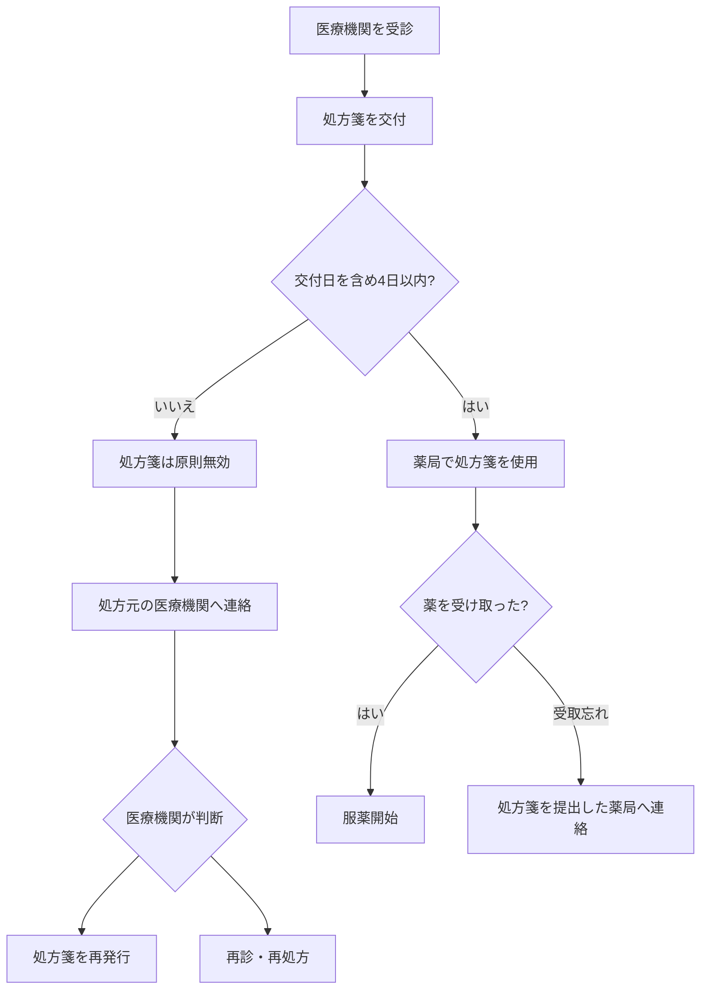

## 1. 処方箋は原則「交付日を含めて4日以内」

日本の保険診療では、処方箋の使用期間は原則として、

**処方箋を交付された日を1日目として、4日以内**

と定められています。

土曜日・日曜日・祝日も日数に含まれます。

たとえば9月1日に処方箋を受け取った場合は次のようになります。

|日付|状態|
|---|---|
|9月1日|1日目|
|9月2日|2日目|
|9月3日|3日目|
|9月4日|4日目・使用可能|
|9月5日|原則として期限切れ|

重要なのは、これは**「薬を4日分しか処方できない」という意味ではない**ことです。

たとえば30日分の薬が処方されていても、

> 30日分の薬を調剤してもらうための処方箋を、4日以内に薬局で使用する

という意味になります。

## 2. なぜ4日という期限があるのか

処方箋は単なる「薬の引換券」ではありません。

医師が、

- 診察時の症状
- 病状
- 服用中の薬
- 検査結果
- 患者の状態

などを確認し、**その時点で適切だと判断した薬を記載した医療上の指示書**です。

そのため、診察から長期間経過すると、

- 症状が改善している
- 症状が悪化している
- 別の症状が出ている
- 他の薬を服用し始めている
- 当初処方された薬が現在の状態には適さなくなっている

といった可能性が出てきます。

つまり制度としては、

> **診察時点の医学的判断を、無期限に有効なものとして扱わない**

という考え方があります。

そのため、診察からあまり時間が経過しないうちに調剤することを前提として、原則4日間という使用期間が設けられています。

## 3. 特別な事情があれば4日を超えることもある

4日という期間には例外があります。

長期旅行など、処方箋を4日以内に使用することが難しい特殊な事情があらかじめ分かっている場合、**医師が処方箋に別の使用期間を記載することができます。**

したがって、

- 長期旅行
- 遠方への移動
- その他、4日以内に薬局へ行けないことが事前に分かっている

といった場合は、処方時に医師へ相談することが重要です。

## 4. 薬を受け取り忘れた場合

「薬を受け取り忘れた」といっても、大きく2つの状況があります。

```text
薬を受け取り忘れた
        │
        ├─ A. まだ処方箋を薬局に提出していない
        │
        │     ├─ 4日以内
        │     │     → そのまま薬局へ
        │     │
        │     └─ 4日を過ぎた
        │           → 処方箋は原則無効
        │           → 医療機関へ相談
        │
        └─ B. 処方箋はすでに薬局へ提出している
                    → 処方箋の期限切れとは別問題
                    → 提出した薬局へ確認
```

この2つは対応が大きく違います。

## 5. 処方箋をまだ薬局に出していない場合

### まだ4日以内

特に問題ありません。

その処方箋を持って薬局へ行けば、通常どおり調剤してもらえます。

### すでに4日を過ぎている

原則として、**その処方箋は使用できません。**

薬局へ持っていっても、その処方箋のまま調剤してもらうことは原則できません。

この場合は、処方した病院・クリニックへ連絡します。

基本的な流れは、

1. 処方した医療機関へ電話する
2. 「処方箋を薬局に出さないまま期限が切れてしまった」と伝える
3. 医療機関側が対応を判断する
4. 必要に応じて処方箋の再発行、または再診・再処方を受ける
5. 新しい処方箋を薬局へ持っていく

となります。

## 6. 「期限を延長してもらう」というより、再発行・再処方になる

一度期限が切れてしまった処方箋について、

> 「期限を過ぎたので、その場で日付を書き換えてもらえばよい」

という単純な扱いには基本的になりません。

医療機関側で、

- 再発行で対応する
- 再診が必要
- 改めて処方内容を確認する

などの判断が行われます。

どの対応になるかは、薬の種類、経過日数、病状、医療機関の運用などによって異なります。

## 7. 再発行では費用が発生する可能性がある

患者側の都合で処方箋の使用期限が切れた場合、**再発行に関する費用が自己負担になることがあります。**

そのため、

> 「期限が切れた処方箋をそのまま薬局へ持っていけば何とかなる」

とは考えず、先に処方元の医療機関へ連絡する方が適切です。

また、再診が必要になれば、再診料などが発生する可能性もあります。

具体的な金額や扱いについては医療機関に確認する必要があります。

## 8. すでに薬局へ処方箋を提出している場合

こちらは事情が異なります。

たとえば、

1. 4日以内に薬局へ処方箋を提出
2. 薬局で調剤してもらった
3. 後で受け取りに行く予定だった
4. そのまま忘れてしまった

というケースです。

この場合、**「処方箋を4日以内に使用しなかった」というケースとは異なります。**

すでに有効期間内に薬局が処方箋を受け付けているためです。

この場合は、処方箋を提出した薬局へ連絡して、

> 「○日に処方箋を提出したのですが、薬を受け取りに行くのを忘れていました」

と伝えて確認するのが適切です。

薬局側で、

- 薬がまだ保管されているか
- そのまま受け取れるか
- 追加の確認が必要か

などを判断します。

## 9. FAXや薬局アプリで処方箋を送った場合は注意

最近は、

- 薬局アプリ
- 処方箋送信サービス
- FAX
- 処方箋の写真送信

などを使って、事前に薬局へ処方内容を送れることがあります。

ただし、

**「画像を送信したこと」と「正式に処方箋を提出したこと」が必ずしも同じとは限りません。**

特に紙の処方箋の場合、原本を薬局へ提出する必要があるケースがあります。

そのため、

> 「期限内にアプリで写真を送ったから大丈夫だと思っていた」

という場合も、薬局へ確認した方が確実です。

## 10. 服用開始の遅れが問題になる薬もある

薬によっては、

> 「処方箋が切れたなら、次の診察まで待とう」

と自己判断することが適切ではない場合があります。

特に、

- 抗菌薬
- てんかん治療薬
- ステロイド
- 抗凝固薬
- 継続して服用することが重要な薬

などでは、服用開始の遅れや中断が問題になる可能性があります。

こうした薬の場合は、処方元の医療機関または薬局へ確認することが重要です。

## 全体像

今回確認した内容を一連の流れにすると、次のようになります。



## 今回のポイント

|疑問|結論|
|---|---|
|なぜ処方箋は4日以内なのか|診察時点の医学的判断を長期間有効にしないため|
|4日には休日も含むか|含む|
|30日分の薬なら30日間有効なのか|いいえ。薬の日数と処方箋の使用期限は別|
|4日を過ぎた処方箋は使えるか|原則使えない|
|期限切れの場合どうするか|処方した医療機関へ相談|
|再発行だけで済むか|医療機関の判断。再診が必要な場合もある|
|費用はどうなるか|患者都合による期限切れでは自己負担が生じる場合がある|
|薬局に提出済みで受取だけ忘れた|薬局へ直接確認|
|アプリで写真を送っていれば提出済みか|必ずしもそうとは限らない|
|特殊事情で4日以内に行けない|事前に医師へ相談すれば別の使用期間を設定できる場合がある|

要するに、今回の話では**「処方箋の使用期限」と「調剤済みの薬を受け取る期限」を分けて考えることが重要**です。前者は原則4日という明確なルールがありますが、後者は薬局への提出状況などによって対応が変わります。