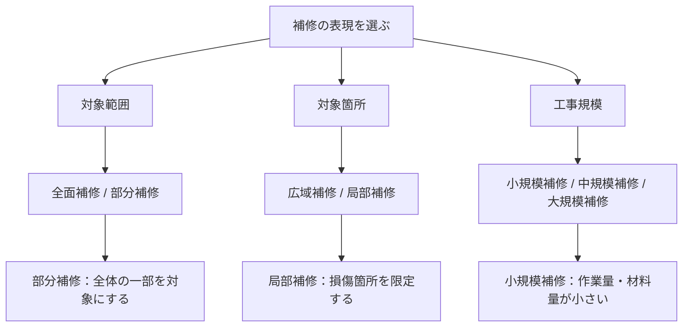

部分補修、局部補修（局所）、小規模補修のニュアンスの違いを教えて。

この3つは似ていますが、着目点が違います。

|用語|着目点|ニュアンス|対義語|
|---|---|---|---|
|部分補修|補修対象の範囲|全面ではなく一部だけ補修|全面補修|
|局部補修（局所補修）|損傷箇所の位置|傷んだ箇所だけピンポイント補修|広域補修|
|小規模補修|工事の規模|作業量・材料量が少ない補修|大規模補修|

### ① 部分補修

「全面施工に対する部分施工」

例

- 床100㎡のうち5㎡だけ補修
- 外壁全体ではなく一面だけ補修

損傷箇所が広くても、「全体の一部」なら部分補修です。

---

### ② 局部補修（局所補修）

「不具合箇所だけを狙い撃ち」

例

- タイルの欠けた1枚だけ交換
- クラック部分だけ補修
- 錆びた箇所だけ補修

面積の大小よりも、  
「損傷箇所を限定している」  
ことがポイントです。

建築・土木ではこちらの方が技術用語として使われることが多いです。

---

### ③ 小規模補修

「工事のボリュームが小さい」

例

- タイル2～3枚の交換
- 小さなひび割れ補修
- ドア枠の傷補修

局部補修でも、  
範囲が広ければ小規模とは言えません。

例えば、

- 駐車場のクラックだけ補修
- ただし総延長200m

なら局部補修ではあるが、小規模補修とは言いにくいです。

---

### 現場でのイメージ

```
全面補修└─部分補修    ├─局部補修    │   ├─小規模補修    │   └─中規模補修    └─広範囲補修
```

例えばタイル補修材のカタログなら、

- 「部分補修用」→ 全面張替え不要を訴求
- 「局部補修用」→ 欠け・浮き・割れのピンポイント補修を訴求
- 「小規模補修用」→ DIYや簡易補修の印象が強くなる

という違いがあります。

補修材の販促資料なら、施工業界では **「局部補修用」または「部分補修用」** の方が一般的で、「小規模補修用」はややDIY・軽作業寄りの印象になります。

## 範囲・位置・規模の関係

作成予定だった画像が表すべき関係を、本文内の図として残す。三つの観点は同じ分類ではなく、組み合わせて使う。



たとえば「局部補修かつ小規模補修」はあり得るが、局部補修だからといって必ず小規模とは限らない。この図は、画像の有無に左右されずにその関係を読めるようにするためのものとする。

