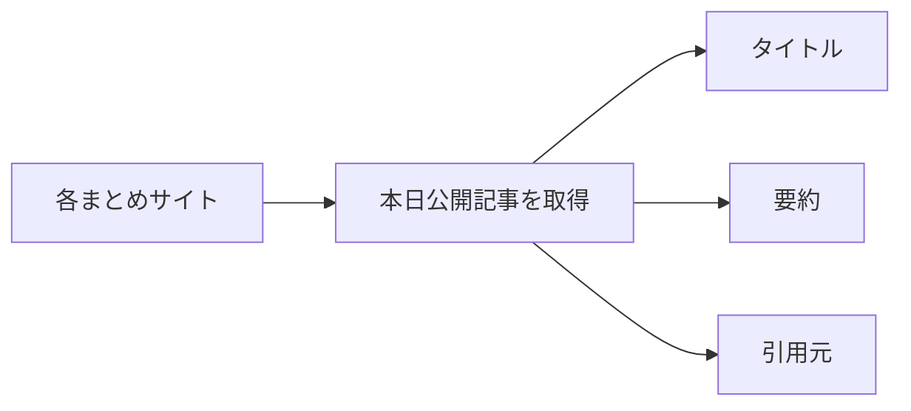
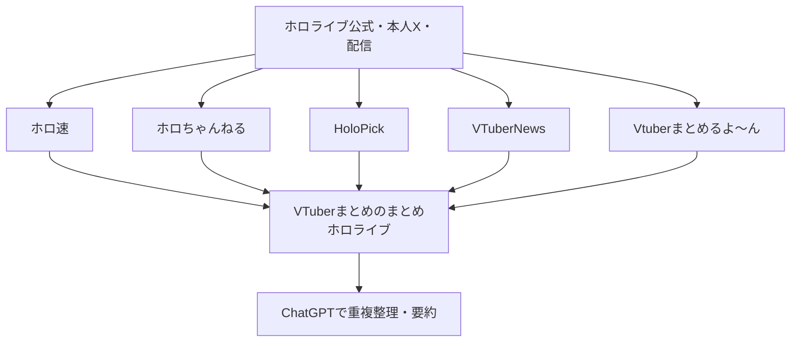
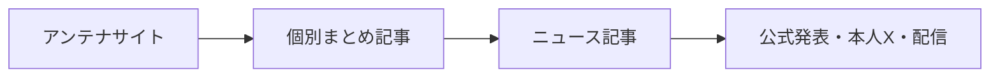
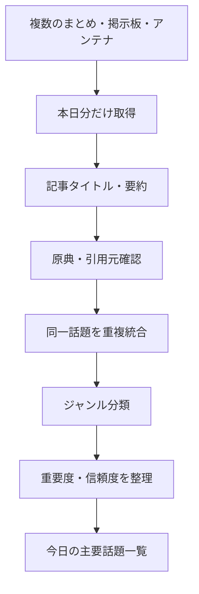

このチャットでやろうとしていたことは、単純に「各まとめサイトの記事一覧を見る」ことではなく、**複数のまとめサイト・掲示板・アンテナサイトを横断し、その日に何が話題になっているかを重複を除きながら把握できる形に整理すること**でした。

## 1. やりたかったこと

最初の目的は、指定した複数サイトについて、**本日公開された記事をまとめて確認すること**でした。

具体的には各記事について、

- タイトル
- 内容の要約
- まとめ記事が参照・引用している元情報
    - ニュースメディア
    - 公式発表
    - X投稿
    - YouTube・配信
    - 掲示板
    - Amazon等の商品ページ
- 必要に応じて、情報の確度や注意点

を整理して一覧化することを求めていました。

当初対象にしたサイトは以下の3つです。

|サイト|主な性格|
|---|---|
|オレ的ゲーム速報＠刃|時事、ゲーム、SNS、炎上ネタ|
|はちま起稿|ゲーム、ネット、芸能、時事|
|理想ちゃんねる|ガジェット、経済、ニュース、5chまとめ|

つまり最初の段階では、



という比較的シンプルな情報収集でした。

## 2. 途中で対象範囲を広げた

その後、さらに次の3サイトを追加しました。

|サイト|主な性格|
|---|---|
|めぎしす！|VTuber・配信者・ネット炎上系|
|あにまんch|漫画・アニメ・ゲームのファン考察|
|ガールズちゃんねる|ニュース、芸能、生活、雑談系掲示板|

これによって、単純なニュースまとめサイトだけでなく、

- 一般的なネットニュース
- SNS炎上
- VTuber
- 漫画・アニメ
- 女性向け・生活系
- 掲示板上の反応

まで拾えるようになりました。

この段階で、対象は**6サイト**になりました。

## 3. サイトごとに性質が違うことが分かった

調査を進める中で、すべてのサイトを同じ方法で扱うのは適切ではないことが分かりました。

### 通常のまとめサイト

以下は比較的「外部ニュースやSNS → 記事」という構造です。

- オレ的ゲーム速報＠刃
- はちま起稿
- 理想ちゃんねる
- めぎしす！

これらは基本的に、

```text
ニュース・X・公式発表
        ↓
まとめサイトの記事
```

という構造です。

### あにまんch

あにまんchは性質が異なります。

```text
漫画・アニメ・ゲーム
        ↓
あにまん掲示板で議論
        ↓
議論をまとめ記事化
```

そのため、「ニュース」というより、

- キャラクター考察
- ストーリー考察
- 好きなシーン
- 作品比較
- ネタスレ

を追う情報源として位置づけるのが適切だと整理しました。

### ガールズちゃんねる

ガールズちゃんねるも通常の記事サイトではなく、

```text
外部ニュース・芸能記事・SNS
          ↓
ガルちゃんにトピック作成
          ↓
ユーザーがコメント
```

という構造です。

そのため、

- 外部記事を引用したニュース型トピック
- 完全にユーザー発の雑談トピック

を分けて扱う方針にしました。

例えば、

- 事件
- 芸能
- 社会ニュース
- 経済
- 政治

などは今回のニュース収集対象にできますが、

- 「探偵小説で好きな作品」
- 「仕事の休憩時間」
- 「負の感情をなくす方法」

などは別枠として除外する方向になりました。

## 4. ホロライブ専用の情報収集源も追加した

さらに、

**VTuberまとめのまとめ**  
の「ホロライブ」絞り込みページも検討しました。

これは通常のまとめサイトではなく、さらに上位の**アンテナサイト／メタまとめ**です。

構造は次のようになります。



ここで重要な判断をしました。

このサイトは、

> 7番目の「まとめサイト」として単純に横並びにする

よりも、

> **ホロライブ関連ニュースを発見するための探索ハブ**

として使う方が適切です。

## 5. 「まとめサイトのまとめ」の問題にも気づいた

VTuberまとめのまとめを見ると、同じ話題を複数サイトが記事化しています。

例えば、

- ロゼキャンARK
- ホロ甲2026
- hololiveNext
- ホロドリ

などです。

そのため、

```text
記事A
記事B
記事C
記事D
```

を4件のニュースとして数えるのではなく、

```text
ニュース1件
 ├─ サイトAが記事化
 ├─ サイトBが記事化
 └─ サイトCが記事化
```

という**話題単位への統合**が必要だと整理しました。

これが、このチャットの途中からかなり重要なテーマになっています。

## 6. 引用元・原典をできるだけ遡る方針にした

まとめ記事だけを要約すると、

```text
原典
 ↓
ニュース記事
 ↓
まとめサイト
 ↓
まとめサイトのまとめ
 ↓
AI要約
```

となり、情報が何段階も加工されます。

そのため、可能な限り、



と遡る方向にしました。

情報源の強さも概ね次のように区別しています。

|情報源|扱い|
|---|---|
|公式発表|原則として最重要|
|本人X・本人配信|本人の発言確認に強い|
|大手報道|事件・社会ニュースなどで重要|
|専門メディア|ゲーム・ITなどで有用|
|まとめサイト|話題発見に有用|
|X第三者投稿|未確認情報の場合あり|
|掲示板|世論・反応を見る用途|
|5ch等の書き込み|事実確認には使わない|

特に、

- 「暴行疑惑」
- 「炎上」
- 「不正」
- 「AI生成疑惑」
- 「リーク」

などについては、**まとめサイトのタイトルをそのまま事実として扱わない**ようにしました。

## 7. 本日分だけを正確に切り出すルールも決めた

サイトによっては前日の記事がランキング上位に残っています。

そのため、

> 「現在表示されている人気記事」

ではなく、

> **9月3日0:00以降に新規公開された記事・トピック**

を本日分とするルールにしました。

例えばガールズちゃんねるでは、

- 前日に作られたトピック
- 今日もコメントが増えているトピック

は、本日の新規記事には含めないようにしました。

## 8. 実際に時間を変えて2回巡回した

このチャットでは、同じ9月3日について**朝と夕方の2回**確認しています。

### 朝7時台

朝の時点では、

- JIN：数本
- 理想ちゃんねる：数本
- めぎしす！：0
- VTuberまとめのまとめ／ホロライブ：ほぼ0
- ガルちゃん：0時台から複数トピック

という状態でした。

### 夕方18時台

夕方になるとかなり増え、

- JIN：約23本
- はちま：20本超確認
- 理想ちゃんねる：10本
- めぎしす！：依然0
- あにまんch：多数
- ガルちゃん：大量
- ホロライブメタまとめ：10本

となりました。

つまり、今回のやり取りによって、

> **同じ日の中でも、朝と夕方では情報量が大幅に変わる**

ことも確認できました。

## 9. 7サイトを横断すると重複がかなり多い

夕方の確認では、複数サイトで同じニュースが扱われていました。

代表例は次の通りです。

|話題|重複掲載|
|---|---|
|『薬屋のひとりごと』実写化|JIN、はちま、理想ちゃんねる等|
|マガジングラビア「指6本」問題|JIN、はちま、ガルちゃん|
|自衛隊への外国人登用提言|JIN、理想ちゃんねる、ガルちゃん|
|北海道でゴキブリ増加|JIN、ガルちゃん|
|ベッセント米財務長官・円安|JIN、はちま|
|ロゼキャンARK|ホロ系複数サイト|
|ホロ甲2026|ホロ系複数記事|

ここから、

**記事数 ≠ 実際のニュース数**

ということが明確になりました。

## 10. 最終的に目指している形

このチャットの流れからすると、最終的にやりたいのは次のような仕組みです。



つまり、最終成果物としては、

### サイト別一覧

「どのサイトが何を記事化したか」を確認するための一覧。

加えて、

### 横断ニュース一覧

例えば、

|話題|要約|掲載サイト|原典|種別|
|---|---|---|---|---|
|薬屋のひとりごと実写化|芦田愛菜主演でPrime Video配信予定|JIN、はちま、理想|Prime Video|エンタメ|
|自衛隊への外国人登用提言|人員不足対策として一部登用を提言|JIN、理想、ガル|笹川平和財団等|社会|
|ロゼキャンARK|チーム編成・参加者発表|ホロちゃんねる、VTuberNews|配信・本人告知|VTuber|

のように、**同一話題を1件に集約した「今日の主要ニュース」**を作る方向です。

## 11. 各サイトの現在の役割

ここまでの調査を踏まえると、各サイトの使い分けは次のように整理できます。

|サイト|この仕組みでの役割|
|---|---|
|オレ的ゲーム速報＠刃|ネット全般・炎上・SNS・時事の早期発見|
|はちま起稿|ゲーム・ネット・時事・エンタメ|
|理想ちゃんねる|ガジェット・経済・社会＋5ch|
|めぎしす！|VTuber・配信者関連の補完|
|あにまんch|漫画・アニメのコミュニティ動向|
|ガールズちゃんねる|社会・芸能・生活系ニュースと一般反応|
|VTuberまとめのまとめ／ホロライブ|**ホロライブ専用探索ハブ**|

特に最後のサイトだけは、他と同列ではなく、

> **ホロライブ情報を漏れなく探すためのメタインデックス**

という位置づけになっています。

## 12. このチャットで実際にやったこと

要約すると、ここまでに実施したのは以下です。

1. 最初の3サイトについて当日記事を取得・要約した。
2. 引用元・原典をできる範囲で特定した。
3. 追加3サイトを加えて6サイト体制にした。
4. サイトごとの性質の違いを整理した。
5. ガルちゃんについて「ニュース型」と「雑談型」を分離した。
6. あにまんchを「ニュースサイト」ではなく「作品考察コミュニティまとめ」と位置づけた。
7. ホロライブ専用メタまとめを追加検討した。
8. メタまとめは「7番目のサイト」ではなく「探索ハブ」とする方針にした。
9. 同一ニュースの重複が非常に多いことを確認した。
10. 「記事単位」から「話題単位」へ統合する方向を見つけた。
11. 朝・夕方の2回巡回し、時間経過による更新量の違いも確認した。
12. 最終的には**「今日の主要話題」を横断整理する仕組み**へ発展させる方向になった。

## 現時点の方向性

今回の流れを見る限り、目的はすでに、

> **「まとめサイトの記事を読む」**

から、

> **「複数の情報源をAIに巡回させ、重複・煽り・伝言ゲームを除去しながら、その日のネット上の主要話題を効率よく把握する」**

へ変化しています。

さらに、

- 一般ニュース
- ゲーム
- 漫画・アニメ
- VTuber
- ホロライブ
- SNS炎上
- 掲示板世論

を同じ収集基盤に乗せつつ、**ジャンルごとに情報源を使い分ける形**になりつつあります。

現段階で次に詰めるべきなのは、記事を増やすことよりも、**最終出力フォーマットを固定すること**です。たとえば「サイト別一覧＋重複統合済み主要話題＋原典＋信頼度」の4要素に統一すれば、今後の日次巡回にそのまま使える形になります。

### セッションサマリー

- **決定したこと**：複数サイトを横断し、本日分のみ取得。ホロライブのメタまとめは探索ハブとして扱う。重複記事は話題単位で統合する。
- **未解決**：最終的な日次レポートの固定フォーマット、重要度・信頼度の付け方、全件取得か主要話題のみか。
- **次のアクション候補**：日次巡回用のテンプレートを確定し、今後同じ形式で繰り返せるようにする。