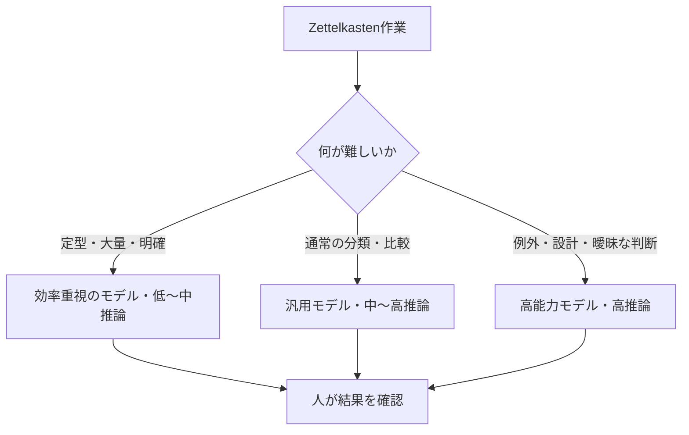

Zettelkasten整理でモデル・推論レベル・速度をどう使い分けるかの運用原則。モデル名や利用可能な設定は時期・プラン・クライアントで変わるため、過去のSol / Terra / Lunaという比較は当時の記録として残し、実際の選択は現在のモデル選択画面に合わせる。[OpenAI公式：Models](https://learn.chatgpt.com/docs/models)

重要なのは、最も高い設定を常用することではなく、作業の判断負荷に合わせて計算資源を配分することである。



## 3つの設定軸を混同しない

| 軸 | 決めること | 影響 |
|---|---|---|
| モデル | 基礎的な能力、得意な作業、効率 | 複雑な判断・ツール利用・大量処理への適性 |
| 推論レベル | どれだけ計画・分析・検証するか | 品質、処理時間、Token利用量 |
| 速度 | 待ち時間とCredit消費の交換 | 完了までの時間と利用枠の消費 |

推論レベルを高くすると、複雑な関係・曖昧な判断・例外処理に役立つ一方、時間とTokenを多く使う傾向がある。固定の料金倍率としては扱わず、入力・出力・ファイル数・ツール利用・作業難度を含む実行量として考える。

## 当時のモデル区分を、役割の区分として読む

元の記録では、Solを複雑な判断、Terraを通常の分析、Lunaを定型・大量処理の候補としていた。現行モデル名に依存せず、次の3役へ読み替える。

| 役割 | 向く作業 | 例 |
|---|---|---|
| 効率重視 | 明確・定型・大量 | ファイル一覧、YAML整形、確定事項の転記 |
| 汎用分析 | 分類・比較・通常の判断 | 仮クラスタリング、ノート関係の評価 |
| 深い判断 | 設計・例外・矛盾・曖昧さ | Permanent化、統合、ポリシー設計、境界事例 |

```text
効率重視 → 全件を整える・候補を作る
汎用分析 → 通常の比較・分類を行う
深い判断 → 曖昧なものだけを再検討する
```

全件を最高設定で処理するより、通常の分析で候補を作り、曖昧・複数候補・矛盾ありだけを深い判断へエスカレーションする。

## Zettelkasten整理への適用

| 作業 | 推奨する考え方 |
|---|---|
| ファイル一覧、機械的検索、定型整形 | 効率重視。低〜中推論 |
| 確定済み方針の記録 | 汎用モデル・中推論。意味を変えず構造化する |
| 仮クラスタリング、ノート間関係 | 汎用モデル・高めの推論。理由・確信度を残す |
| 重複・統合候補、Permanent化 | 深い判断。対象を絞って高推論 |
| ポリシー設計、矛盾解消 | 深い判断。人の承認を必須にする |


## ポリシーと作業状態を分ける

ポリシーは、恒久ルール・禁止事項・判断基準・例外処理を残す長期的な正本。仮クラスタ一覧は、現在の第一候補、第二候補、理由、確信度、要レビュー、状態を扱う一時的な作業状態である。両者は更新頻度も目的も違うため、同じファイルに混ぜない。

| 種別 | 内容 | 保存形式の候補 |
|---|---|---|
| Policy | 安定したルールと判断基準 | Markdown |
| Working State | 仮分類・進捗・レビュー対象 | Markdown表、CSV、TSVなど |

大規模な一覧は、Markdownだけに閉じ込めない。人が読む説明はMarkdown、並び替え・集計・機械更新が多い作業状態はCSV / TSV等を検討する。

## 運用原則

1. 現行のモデル名ではなく、作業の難度から設定を選ぶ。
2. 高推論は例外・設計・曖昧な判断へ集中させる。
3. 最高設定の結果も、人が差分と根拠を確認する。
4. 速度設定は待ち時間と利用枠の交換として判断する。
5. 確定ルールと仮の作業状態を分離する。
