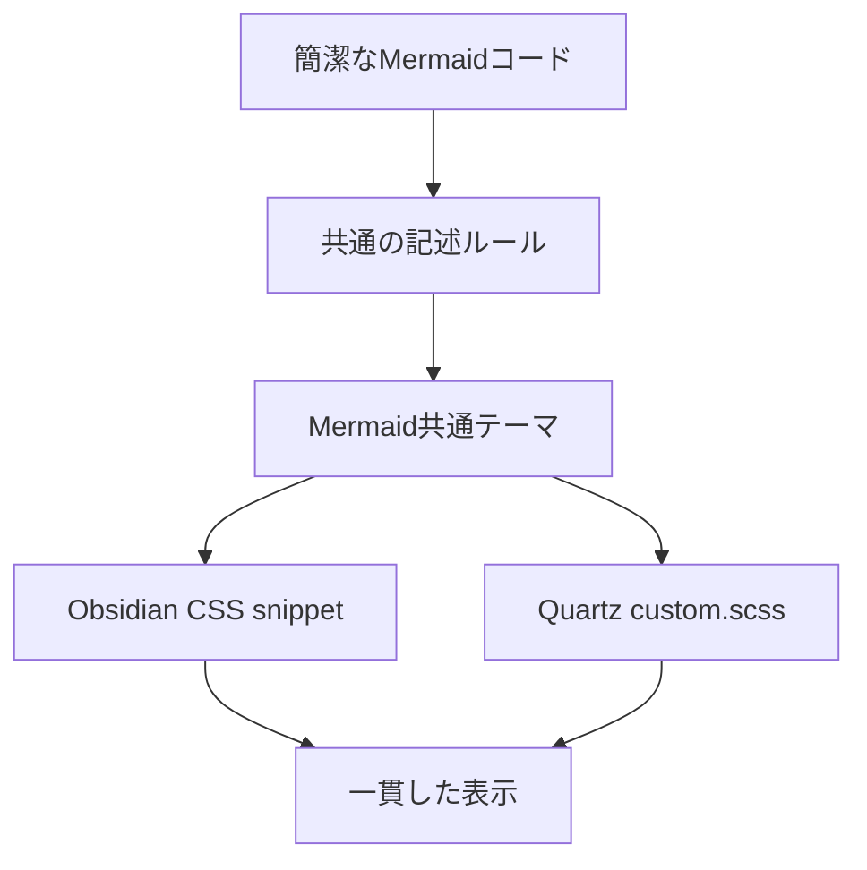
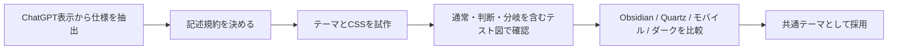

ChatGPTで表示されるMermaid図の「読みやすさ」を、ObsidianとQuartzで近づけるための方針。目標はChatGPTの表示を完全複製することではなく、同じMermaidコードが両環境で一貫して読みやすく見える共通デザイン規約を作ることにある。

ChatGPTの実際の表示にはMermaid本体だけでなくアプリ側のUI・スタイルが関わり得るため、完全一致を成功条件にはしない。

## 再現したい視覚的な特徴

| 要素 | 目標 | Mermaid標準との差 |
|---|---|---|
| 通常ノード | 淡いブルーの大きな角丸カード | 四角に近い標準ノードよりUI的 |
| 判断ノード | 角丸カードと破線枠 | ひし形を必須にしない |
| 文字 | 濃紺・やや太め・読みやすいサイズ | 黒〜グレーで細い標準表示との差 |
| 分岐ラベル | 小さな丸みのあるラベル | 文字だけの背景より識別しやすい |
| 接続線 | 淡いブルーグレー | 黒く強い線を避ける |
| 余白・間隔 | ノード内・ノード間ともやや広く | 縦長・窮屈な図を抑える |

> 判断を必ずひし形にするのではなく、「角丸カード＋破線」を判断用の見た目として採用することが、ChatGPT風に寄せる際の主要な差分になる。

## コードとデザインを分ける

各ノートのMermaidコードへ大量の`classDef`、`style`、`linkStyle`を埋め込む方式は、個別の図には効いても、ObsidianとQuartzを横断して維持するには不向きである。図の意味はMermaid、見た目は共通テーマと環境別CSSへ置く。

| 層 | 置くもの | 役割 |
|---|---|---|
| Mermaid記述 | 図の意味、方向、最小限のクラス | ノート本文を読みやすく保つ |
| 共通テーマ | フォント、色、線、ラベル背景など | 表示環境をまたぐ基調を作る |
| Obsidian CSS snippet | SVGの角丸、太さ、ダークモード等 | ローカル閲覧を調整する |
| Quartz `custom.scss` | 同じデザイントークンのWeb向け調整 | 公開サイト側を整える |

## Mermaidの記述規約

今後生成する図は、装飾より意味の読みやすさを先に決める。

1. 通常処理は短い文の角丸ノードにする。
2. 判断はひし形を既定にせず、判定内容が読めるカードとする。
3. ノード本文を長文化せず、必要なら表や本文へ逃がす。
4. 縦長になりすぎる場合は`LR`、手順の流れには`TD`を選ぶ。
5. Yes / Noなどの分岐ラベルは短く保つ。
6. 図ごとにデザイントークンを増やさず、例外だけ最小限のクラスを使う。

Mermaid側で対象にする共通変数の例は、`fontFamily`、`fontSize`、`primaryColor`、`primaryTextColor`、`primaryBorderColor`、`lineColor`、`edgeLabelBackground`である。実際に利用可能な変数は導入済みのMermaid・Obsidian・Quartzのバージョンで確認する。

## 実装の成功条件と検証順序

| 成功条件 | 確認方法 |
|---|---|
| ObsidianとQuartzで基調が揃う | 同じテスト図を両方で比較する |
| 既存Mermaidを大きく書き換えない | 既存コードの表示を確認する |
| 横切れ・極端な縦長を抑える | 横長・縦長・複雑な図を用意する |
| モバイルで読める | 狭い幅でラベルとノードを確認する |
| ライト・ダークで破綻しない | 両テーマで色とコントラストを確認する |
| ノート本文が装飾で汚れない | 個別styleの増加を確認する |

最初のテストは、通常ノード、判断、Yes / No分岐、複数の終端、長いノード名を含むフローチャートが適している。1図で整えた後、横長図・縦長図・複雑な図へ広げる。

## 実装前に確認すること

- 利用中のObsidianテーマと既存CSS snippet
- Quartzの`custom.scss`と既存カスタマイズ
- Mermaidのバージョンと、環境ごとの差異
- ライトモード・ダークモードの対象範囲
- 判断ノードを今後どこまでカード＋破線へ統一するか
- 既存図に遡及適用する範囲

実装はまだ行わない。このノートは、既存スタイルを壊さずに試作・比較するための設計基準として使う。
