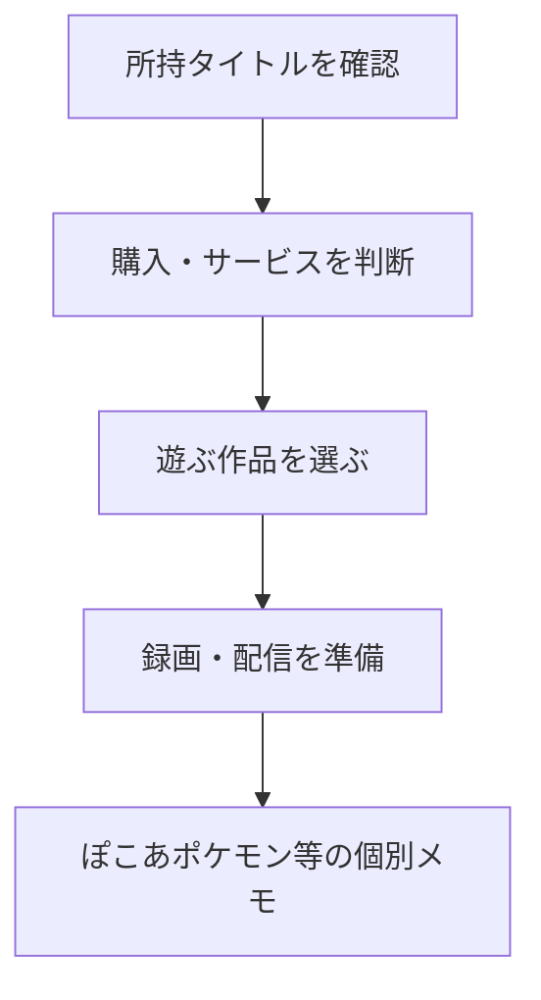

# ゲームの購入・所持・録画／配信ストラクチャー

クラスタ15-07のノートを、用途ごとに辿るための入口。価格・セール・サービス仕様・配信ガイドラインは記録時点の情報であり、実際の購入・配信前には公式情報を確認する。

## 所持状況と無料配布の記録

- [PCゲームライブラリ（Steam / Epic Games Store）](../30_Inbox/クラスタ15に追加/pc-game-library.md)
- [Epic Games Store・EAのPCゲーム無料配布履歴](../30_Inbox/クラスタ15に追加/epic-ea-free-game-history.md)

## 購入・サービスを判断する

まず、作品・サービス別の入口である[ゲーム購入ガイド一覧](../30_Inbox/クラスタ15に追加/振り分け中/game-purchase-guides-index.md)を確認する。

### ストア・サブスクリプション・プラットフォーム

- [GeForce NOW：セール・加入タイミングガイド](../30_Inbox/クラスタ15に追加/振り分け中/geforce-now-membership-sale-guide.md)
- [GeForce NOW：連携ストア・ライブラリ運用ガイド](../30_Inbox/クラスタ15に追加/振り分け中/geforce-now-storefront-guide.md)
- [ゲームサブスクとクラウドゲーミング：選び方ガイド](../30_Inbox/クラスタ15に追加/振り分け中/game-subscription-cloud-gaming-guide.md)
- [ニンテンドープリペイドとSwitch Online：キャンペーン活用ガイド](../30_Inbox/クラスタ15に追加/振り分け中/nintendo-prepaid-switch-online-campaign-guide.md)

### 作品・シリーズごとの購入判断

- [アトリエ アーランド三部作：購入・プラットフォームガイド](../30_Inbox/クラスタ15に追加/振り分け中/atelier-arland-trilogy-purchase-guide.md)
- [アトリエ 黄昏三部作：購入・プラットフォームガイド](../30_Inbox/クラスタ15に追加/振り分け中/atelier-dusk-trilogy-purchase-guide.md)
- [アトリエ 不思議三部作：購入・プラットフォームガイド](../30_Inbox/クラスタ15に追加/振り分け中/atelier-mysterious-trilogy-purchase-guide.md)
- [アトリエDXセットのセール価格予想](../30_Inbox/クラスタ15に追加/atelier-dx-sale-price-estimates.md)
- [ダンガンロンパ：シリーズ・購入ガイド](../30_Inbox/クラスタ15に追加/振り分け中/danganronpa-series-purchase-guide.md)
- [テイルズ オブ シリーズ：価格・購入ガイド](../30_Inbox/クラスタ15に追加/振り分け中/tales-series-price-purchase-guide.md)
- [ドラゴンクエストビルダーズ1・2：購入・プラットフォームガイド](../30_Inbox/クラスタ15に追加/振り分け中/dragon-quest-builders-1-2-purchase-platform-guide.md)
- [ぷよぷよテトリス：シリーズ・購入ガイド](../30_Inbox/クラスタ15に追加/振り分け中/puyo-puyo-tetris-series-purchase-guide.md)
- [モンスターハンター：シリーズ評価とRise＋Sunbreak購入ガイド](../30_Inbox/クラスタ15に追加/振り分け中/monster-hunter-series-rise-sunbreak-purchase-guide.md)
- [ルーンファクトリー：SteamとSwitch 2の購入判断ガイド](../30_Inbox/クラスタ15に追加/rune-factory-platform-purchase-guide.md)
- [幻想水滸伝：シリーズ・HDリマスター購入ガイド](../30_Inbox/クラスタ15に追加/振り分け中/suikoden-series-hd-remaster-purchase-guide.md)

## 作品を知る・遊び方を検討する

- [SimCityシリーズの系譜・評価・MOD文化・現行プレイ環境](../30_Inbox/クラスタ15に追加/simcity-series-history-mods-play-environment.md)
- [DQ7リイマジンドの熟練度稼ぎ：未検証の仕様メモ](../31_Research/dragon-quest-7-reimagined-proficiency.md)

## 録画・配信を準備する

- [Switch 2のゲーム録画・配信準備ログ](../31_Research/switch-2-game-streaming-planning-log.md)
- [Switch 2・OBS・キャプチャーボード・複数モニター構成メモ](../30_Inbox/クラスタ15に追加/switch-2-obs-capture-monitor-setup.md)
- [ゲーム配信の概要欄・遅延・話し方に関する検討メモ](../31_Research/game-streaming-description-latency-voice.md)
- [公開しないゲーム配信・録画の意義と運用メモ](../31_Research/meaningful-game-streaming.md)

## ぽこあポケモンと周辺メモ

- [ぽこあポケモン](pokoa-pokemon.md)
- [パラスの本体は「きのこ」である](pokemon-paras-mushroom-host-theory.md)
