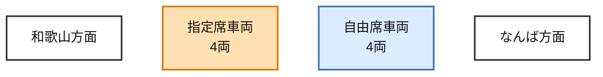

特急サザンは、指定席車両4両と自由席車両4両を連結した8両編成で運転される。

- なんば側の4両：自由席車両
- 和歌山側の4両：指定席車両
- 自由席車両：乗車券だけで利用できる
- 指定席車両：乗車券に加えて座席指定券が必要

車両番号は車種や編成の案内と混同しやすいため、乗車時は「なんば側／和歌山側」で判断する。

座席指定券を買うかどうかは、[特急サザンの座席指定料金で買うのは時間ではなく着席の確実性](is-limited-express-southern-worth-it.md)で判断する。

## 公式資料

- [特急サザン](https://www.nankai.co.jp/traffic/express/sazan.html?sazan=2)
