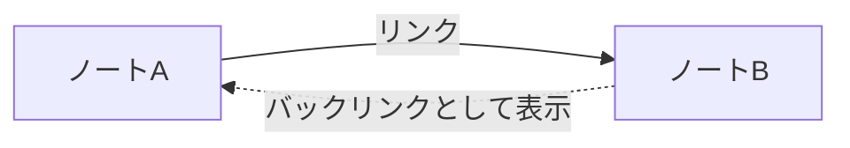

# メモ同士のリンクとバックリンクの関係を理解する

ノートAからノートBへ明示的に作る参照がリンクであり、そのリンクを受け取るノートBから見える「ノートAに参照されている」という一覧がバックリンクである。

| 見る場所 | 分かること |
| --- | --- |
| ノートAの本文 | AがBを参照している理由 |
| ノートBのバックリンク一覧 | Bを参照しているノートAの存在 |
| 双方の本文 | 参照が現在も意味を持つか |

バックリンクは通常、リンク先ノートから元ノートへ移動するための手動リンクではなく、既存リンクをもとにObsidianが表示する逆向きの関係である。
