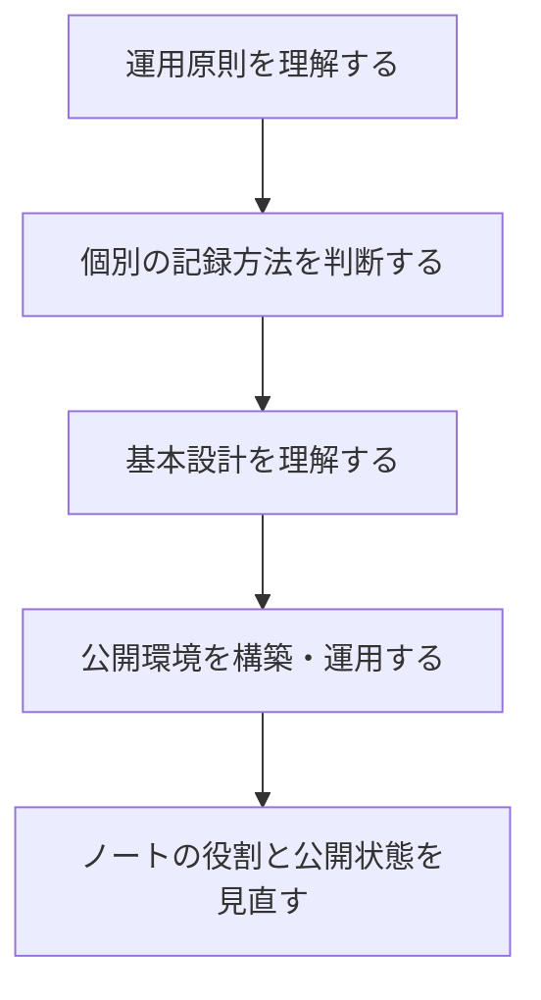

公開型ツェッテルカステンの入口となるStructure Note。知識管理の原則とQuartzによる公開環境を、個別ノートの一覧ではなく「どの順で読めば運用判断を追えるか」という導線として案内する。

## まず運用原則を理解する

1. [ツェッテルカステン向けのVaultのフォルダ構成](zettelkasten-vault-folder-structure.md)
2. [Quartzにおけるノートの管理設計](quartz-note-management-design.md)
3. [外部環境で得た知識と内省知の切り分け方](separating-external-and-reflective-knowledge.md)
4. [知識や経験を自分のネットワークに編み込んでいく](weaving-knowledge-into-zettelkasten.md)

次に、個別の記録をどのような目的で残すかを判断する。

- [再読時に思考へ戻れること](return-to-thinking-on-reread.md)
- [活動記録はジャーナルとして残す](keep-activity-logs-as-journal.md)
- [AIに尋ねた質問をメモとして残す判断基準](criteria-for-saving-ai-questions.md)
- [外部リンクだけのノートには接続意図を残す](external-link-hub-notes.md)
- [読書習慣を取り戻すための仕組みを作る](building-a-reading-folder-to-rebuild-the-habit.md)

## 基本設計

カードは一つの問いや主張を扱い、関係の理由が分かるリンクで接続する。アトミックであることを文章の短さと同一視せず、別の文脈でも再利用でき、再読時に思考を再開できる単位を目指す。

| 要素 | 役割 |
|---|---|
| フォルダ | 作業段階や利用場面を示す |
| `type` | ノートの現在の知識上の役割を示す |
| `tags` | 分野・情報源などを横断する属性を示す |

| `type` | 意味 |
|---|---|
| `fleeting` | 未整理の着想や一時的な問い |
| `literature` | 外部資料の内容や、それに対する記録 |
| `permanent` | 自分の言葉で成立する再利用可能な主張 |
| `structure` | 複数ノートの関係や読み順を案内する構造ノート |
| `index` | 特定の規則に基づき対象を列挙する索引 |

AI回答は自動的にLiterature Noteにしない。検証段階と保存目的から`type`を選び、AI生成の本文であることは`ai-generated`タグで示す。外部リンクだけを保存する場合も、接続する問い・主張・目的を残す。

## 公開環境と運用ルール

| 領域 | 採用するもの | 関連ノート |
|---|---|---|
| ノート作成・管理 | Obsidian | — |
| 静的サイト生成 | Quartz | — |
| リポジトリ管理 | GitHub | [Gitエコシステムまとめ](32_Zk/git-ecosystem-notes.md) |
| ホスティング | Cloudflare Pages | [比較](cloudflare-pages-vs-github-pages.md) / [主な制限](cloudflare-pages-limitations.md) |
| ドメイン管理 | conoHa | [外部カスタムドメインの制限](cloudflare-pages-external-domain-restrictions.md) |

公開・管理の設計は、次のノートから辿る。

- [QuartzにおけるURL設計](quartz-url-design.md)
- [Quartzにおけるノートの管理設計](quartz-note-management-design.md)
- [Quartzの公開・非公開を設定する](quartz-publish-visibility-settings.md)
- [markdownlinkを採用](adopting-markdown-links.md)
- [画像ファイルの命名規則](image-naming-conventions.md)
- [コールアウトの使い分け](using-markdown-callouts.md)

## フォルダ構成

フォルダ間の移動を機械的な必須工程にはしない。ノートの役割と今後の利用方法から保存先を判断する。

| フォルダ | 用途 |
|---|---|
| `01_Templates` | 新規ノート用テンプレート |
| `02_images` | 画像などの添付ファイル |
| `10_Analytics` | 分析結果や集計 |
| `20_Journal` | 日記、活動経過、試行錯誤 |
| `21_Reading` | 負担の軽い読書記録 |
| `30_Inbox` | 未整理のメモと一時的な作業領域 |
| `31_Research` | 調査記録、資料整理、精読 |
| `32_Zk` | Permanent Note、Structure Note、Indexを中心とする知識ネットワーク |
