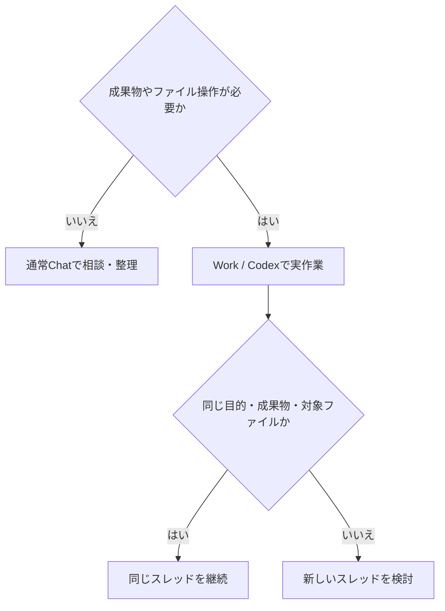

利用量を抑える目的は、会話を機械的に短く切ることではない。相談に必要な文脈だけを持ち、実作業が必要なときだけWork／Codexのファイル・ツール環境を使うことである。

| 作業の性質 | 基本の置き場 | 理由 |
|---|---|---|
| 知識質問、考えの整理、文章のたたき台、軽い比較 | 通常Chat | ファイル読込や実行環境の準備が不要なことが多い |
| Obsidianの確認・編集、ファイル作成、資料制作、コード、複数工程の実作業 | Work／Codex | ファイル・ツール・作業手順を同じ環境で扱える |
| 最終的にWorkで制作・編集する相談 | 初めからWorkも検討 | 後から文脈を移し直す負担を避けられる場合がある |

Workでは、プロジェクト指示、`AGENTS.md`、背景資料、ファイル、ツールを確認する。その準備は一問一答には余分になり得るが、同じ成果物を継続して作るなら文脈の再利用になる。

## スレッドを継続するか分けるか

| 状況 | 判断 |
|---|---|
| 同じ成果物への追加質問・修正 | 同じスレッドを継続する |
| 複数ノートを同じ判断単位で比較・編集する | 共通文脈を活かして一括で扱う |
| 目的、成果物、対象ファイルが変わる | 新しいスレッドを検討する |
| 無関係な相談が混ざり始めた | 分離して文脈と判断負荷を減らす |

ChatからWorkへ移すときは、会話全文をコピーするより、次の5点を短く引き継ぐ。

1. 目的と背景
2. 決定事項と成功条件
3. 対象ファイル・参照資料
4. 制約、変更禁止範囲、未決事項
5. Workに実行してほしい作業と、実装前に確認してほしいこと

この引き継ぎは、過去ログを圧縮して捨てるためではなく、実作業に必要な前提を明示し、不要な探索と誤解を減らすためのものである。
