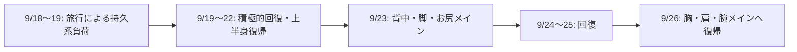

2026年9月18日〜26日のトレーニング記録と計画。旅行による持久系負荷を、単なる「ジムに行かなかった空白」ではなく、回復設計に含める1サイクルとして扱った。これは当時の個人記録であり、痛み・体調不良・持病がある場合の一般的な運動処方ではない。

| 日付 | 区分 | 内容 | 状態 |
|---|---|---|---|
| 9/18（金） | 持久系負荷 | 旅行、14,489歩、荷物あり、暑さ | 記録 |
| 9/19（土） | 持久系高ボリューム＋回復 | 旅行17,638歩、城内階段、夜に軽い回復刺激 | 記録 |
| 9/20（日） | 上半身＋下半身回復 | 胸・肩・腕、軽い内転・外転、背中軽め | 実施済み |
| 9/21（月） | 回復セッション | 内転・外転・背中軽め・レッグプレス | 実施済み |
| 9/22（火） | 上半身アクティブレスト | 胸・肩を軽く。疲労があれば休養へ変更 | 計画 |
| 9/23（水） | 背中・脚・お尻メイン | 通常の水曜メニューへ復帰 | 計画 |
| 9/24（木） | 下半身アクティブレスト | 内転・外転を軽く | 計画 |
| 9/25（金） | 上半身アクティブレスト | 背中軽め、必要に応じて下半身軽め | 計画 |
| 9/26（土） | 胸・肩・腕メイン | 通常の土曜メニューへ復帰 | 計画 |

## 実施した内容

### 9/18（金）・9/19（土）：旅行負荷

| 日付 | 記録 |
|---|---|
| 9/18 | 14,489歩。神戸市立博物館等ではリュックをロッカーへ。気温は28〜30℃前後。 |
| 9/19 | 17,638歩。姫路駅→姫路城→西の丸→好古園→はまもとコーヒー。開始時の荷物は約7.6kg、気温は約30℃、階段あり。 |

9/19の夜は、アダクション15kg × 15 × 2、アブダクション15kg × 15 × 2、ラットプルダウン15kg × 15 × 2を実施。これは筋力向上を狙う本トレーニングではなく、旅行後の軽い回復刺激として記録する。

### 9/20（日）：胸・肩・腕メイン＋回復

| 種目 | 内容 |
|---|---|
| チェストプレス | 15kg×15、25kg×12、30kg×10〜12、40kg×6〜8、35kg×10〜12×2 |
| バイセップスカール | 10kg×12、15kg×9〜12×3 |
| ディップス | 25kg×12、30kg×10〜12、35kg×8〜10×3 |
| ショルダープレス | 10kg×12、15kg×12×3 |
| 内転・外転 | 午前：15kg×15〜18×2。午後：軽重量×12〜15×1（最低重量なら15kg×10〜12×1） |
| ラットプルダウン | 15kg×15×1程度 |

午前・午後の回復刺激は実施済み。

### 9/21（月）：回復セッション

- アダクション：15kg × 15〜18 × 1〜2
- アブダクション：15kg × 15〜18 × 1〜2
- ラットプルダウン：15kg × 15 × 1
- レッグプレス：20kg × 15 × 1

レッグプレスは旅行で疲れていた足裏へ過度な負荷をかけない、回復目的の範囲として記録する。

## 以降の計画

### 9/22（火）：上半身アクティブレスト

- チェストプレス：15kg × 15 × 1〜2
- ショルダープレス：10kg × 12 × 1〜2
- ラットプルダウン、バイセップス、重い下半身種目は原則行わない

日曜の胸・肩の疲労が残るなら、完全休養へ変更する。

### 9/23（水）：背中・脚・お尻メイン

| 種目 | 内容 |
|---|---|
| レッグプレス前半 | 20kg×15、35kg×12、45kg×10〜12、50kg×12×3 |
| ラットプルダウン | 20kg×12〜15、25kg×12、30kg×12×3、余裕があれば35kg×6〜8×1 |
| レッグプレス再開 | 45kg×5〜8、55kg×10〜12×1 |
| アブダクション | 25kg×12、30kg×12×2、35kg×10〜12×2 |
| アダクション | 25kg×12、30kg×12×2、35kg×10〜12×2 |

50kgのレッグプレス後にラットプルダウンを挟み、局所的な休憩後に55kgへ戻る構成。

### 9/24（木）・9/25（金）：回復

| 日付 | 内容 |
|---|---|
| 9/24 | アダクション・アブダクションを各15kg×15〜18×2。疲労が強ければ各1セット。 |
| 9/25 | ラットプルダウン15kg×15×1〜2。必要なら内転・外転を各15kg×15×1。胸・肩・バイセップスは積極的に行わない。 |

### 9/26（土）：胸・肩・腕メインへ復帰

| 種目 | 内容 |
|---|---|
| チェストプレス | 15kg×15、25kg×12、30kg×10〜12、40kg×6〜8、35kg×10〜12×2 |
| バイセップスカール | 10kg×12、15kg×9〜12×3 |
| ディップス | 25kg×12、30kg×10〜12、35kg×8〜10×3 |
| ショルダープレス | 10kg×12、15kg×12×3 |

この週の要点は、旅行を下半身の持久系高ボリュームとして数え、回復を挟んで水曜の背中・脚・お尻、土曜の胸・肩・腕へ戻すことにある。
