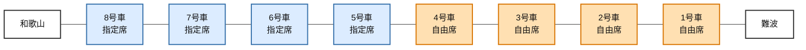

南海特急サザンは指定席と自由席が一体となった特急列車。そのため、特急券がなくても自由席車両であれば、誰でも乗ることが出来る。

では、どの席が指定席で自由席なのか？
- 指定席：和歌山側
- 自由席：難波側

つまり、図解すると次のようになる

```mermaid
flowchart LR
    W["和歌山"]

    C8["8号車<br/>指定席"]
    C7["7号車<br/>指定席"]
    C6["6号車<br/>指定席"]
    C5["5号車<br/>指定席"]

    C4["4号車<br/>自由席"]
    C3["3号車<br/>自由席"]
    C2["2号車<br/>自由席"]
    C1["1号車<br/>自由席"]

    N["難波"]

    W --- C8 --- C7 --- C6 --- C5 --- C4 --- C3 --- C2 --- C1 --- N

    classDef station fill:#ffffff,stroke:#333,stroke-width:2px,color:#111;
    classDef free fill:#dcecff,stroke:#3973ac,stroke-width:2px,color:#111;
    classDef reserved fill:#ffe0b2,stroke:#d97706,stroke-width:2px,color:#111;

    class W,N station;
    class C5,C6,C7,C8 free;
    class C1,C2,C3,C4 reserved;
```

