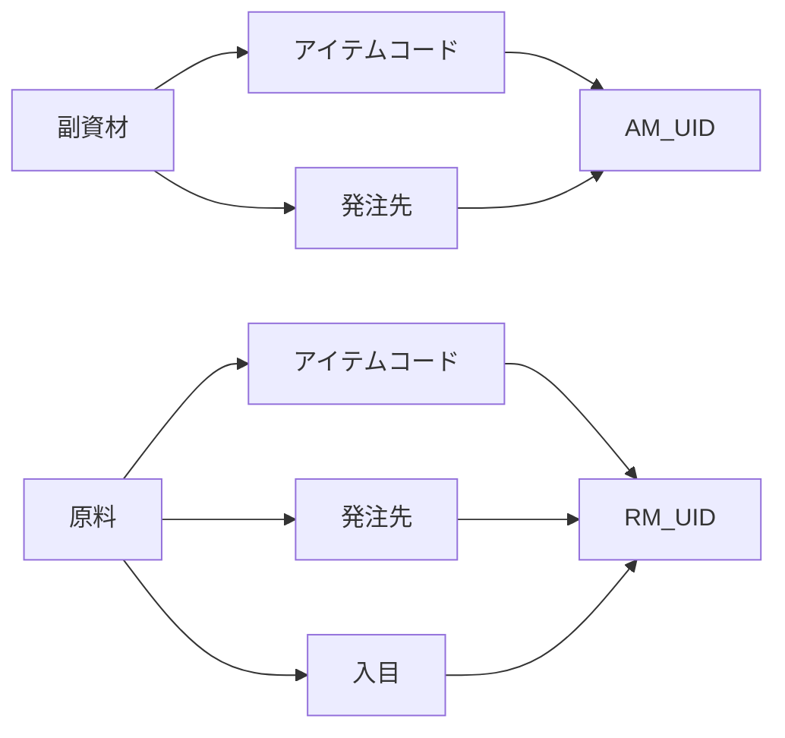
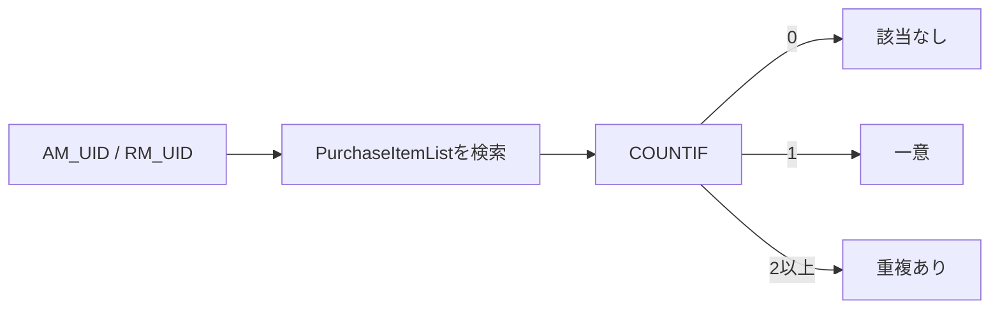
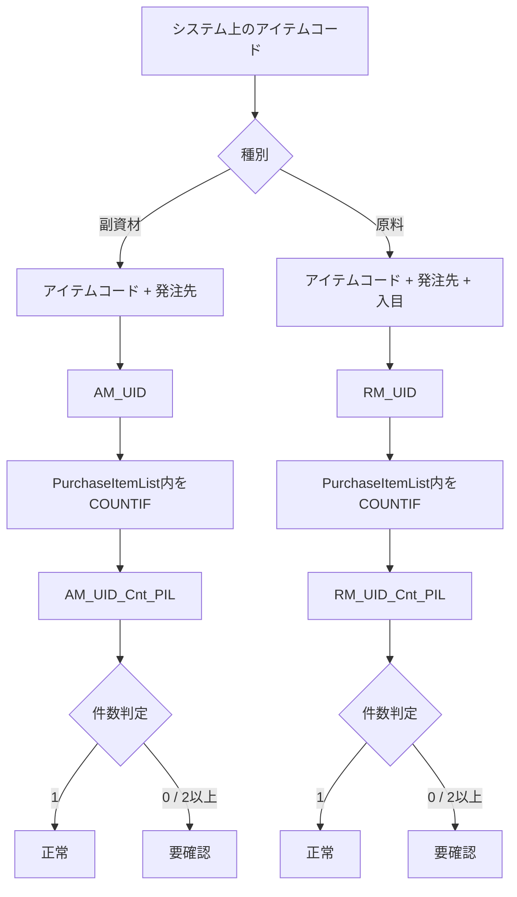

## 1. 背景

現在のシステムでは、**アイテムコード単体では商品を一意に特定できないケースがある**ため、複数項目を連結した識別子を暫定的に作成している。

これは本来のシステム設計として理想的な方法というより、**既存システムに重複コードが存在する問題を回避するための暫定措置**である。将来的にシステムが改修され、アイテムコード自体が一意になるまで、この方式を継続する想定。

対象は次の2種類。

|種別|識別子の生成方法|カラム名|
|---|---|---|
|副資材|アイテムコード + 発注先|`AM_UID`|
|原料|アイテムコード + 発注先 + 入目|`RM_UID`|

ここで、

- `AM` = Auxiliary Material
- `RM` = Raw Material
- `UID` = Unique ID

という意味で使用する。

## 2. UIDという名称について

当初は、

- `AuxiliaryMaterial_Unique_ID`
- `Material_Unique_ID`
- `Composite_ID`
- `CombinedKey`

なども候補として検討した。

ただし、今回の用途では短く扱いやすいことから、

- `AM_UID`
- `RM_UID`

という命名でも問題ないという整理になった。

### UIDを使用する意味

`UID` は「Unique ID」の略として、今回のような**複数項目から生成した一意識別子**にも使用できる。

ただし、このUIDはシステムから正式に付与されたIDではなく、既存データの重複を回避するために人工的に生成したものである。

構造としては次のようになる。



## 3. UIDの重複チェック

UIDを作成した後、そのUIDが本当に一意になっているか確認する必要がある。

具体的には、`PurchaseItemList` シートに存在する、

- `AM_UID`
- `RM_UID`

を対象として `COUNTIF` 関数による件数チェックを行う。

つまり単純に、

> 現在処理しているテーブル内でUIDが何件あるか

を調べるのではなく、

> **基準となる `PurchaseItemList` 内に、そのUIDが何件存在するか**

を確認する処理である。

この「検索先が `PurchaseItemList` である」という点が、カラム名を決めるうえで重要となった。

## 4. 当初の重複チェック用カラム名

当初は次の名称を使用していた。

|対象|カラム名|
|---|---|
|副資材|`AM_Dup_Cnt`|
|原料|`RM_Dup_Cnt`|

意味としては、

- `AM` / `RM` = 対象
- `Dup` = Duplicate
- `Cnt` = Count

なので、「重複数」という意味は伝わる。

ただし、この名称だけでは、

> **どこを検索して算出された重複数なのか**

が判別できない。

たとえば、将来的に同じテーブル内の重複チェックなどが追加された場合、`AM_Dup_Cnt` だけでは意味が曖昧になる可能性がある。

## 5. 検索先を明示した命名候補

そこで、`PurchaseItemList` を検索対象としていることが分かる名称を検討した。

候補として以下が挙がった。

|命名|特徴|
|---|---|
|`AM_UID_DupInPurchaseItemList`|意味が非常に明確|
|`RM_UID_DupInPurchaseItemList`|同上|
|`AM_UID_DuplicateCount_PurchaseItemList`|正式だが長い|
|`RM_UID_DuplicateCount_PurchaseItemList`|正式だが長い|
|`AM_UID_UniquenessCheck_PurchaseItemList`|「一意性チェック」を強調|
|`RM_UID_UniquenessCheck_PurchaseItemList`|同上|
|`AM_UID_CountIf_PurchaseItemList`|実装方法を名前に含める|
|`RM_UID_CountIf_PurchaseItemList`|同上|
|`AM_Dup_Cnt_PIL`|短い|
|`RM_Dup_Cnt_PIL`|短い|
|`AM_UID_Dup_PIL`|UIDと検索先の両方を短く表現|
|`RM_UID_Dup_PIL`|同上|

`PIL` は `PurchaseItemList` の略称として想定している。

## 6. 命名を考える際の重要な区別

今回の処理では、実際には「重複しているかどうか」というより、`COUNTIF` により、

> `PurchaseItemList` 内に同じUIDが何件存在するか

を数値として取得している。

たとえば、

|COUNTIF結果|意味|
|--:|---|
|0|`PurchaseItemList` に存在しない|
|1|正常。一意に存在|
|2以上|UIDが重複している|

となる。

そのため厳密には、`Dup` よりも **Count** を表した名前の方がデータの実体に近い。



## 7. 現時点での整理

今回のカラム群は、役割として次のように整理できる。

|カラム|役割|
|---|---|
|`AM_UID`|副資材を「アイテムコード + 発注先」で暫定的に一意化|
|`RM_UID`|原料を「アイテムコード + 発注先 + 入目」で暫定的に一意化|
|`AM_Dup_Cnt`|`AM_UID` の重複件数を確認する旧名称|
|`RM_Dup_Cnt`|`RM_UID` の重複件数を確認する旧名称|
|`AM_Dup_Cnt_PIL`|`PurchaseItemList` を検索していることを追加した短縮候補|
|`RM_Dup_Cnt_PIL`|同上|
|`AM_UID_Dup_PIL`|UIDの重複チェックであることを明示した候補|
|`RM_UID_Dup_PIL`|同上|

## 8. 命名方針としての推奨

今回の用途を考えると、**検索対象である `PurchaseItemList` をカラム名に残した方がよい**。

特に、将来的に別のテーブル内でもUIDの重複数を調査する可能性を考えると、

```text
AM_Dup_Cnt
RM_Dup_Cnt
```

だけでは情報不足になる。

短さと意味の分かりやすさを両立するなら、

```text
AM_UID_Cnt_PIL
RM_UID_Cnt_PIL
```

という形も有力である。

これは今回の議論で出た `AM_UID_Dup_PIL` よりも、実際に格納している値が **COUNTIFの結果そのもの** であることを正確に表現できる。

### 比較

|候補|評価|
|---|---|
|`AM_Dup_Cnt`|短いが検索先が不明|
|`AM_UID_Dup_PIL`|UID・重複・検索先が分かる|
|`AM_Dup_Cnt_PIL`|現名称からの変更が小さい|
|**`AM_UID_Cnt_PIL`**|UID・件数・検索先を簡潔に表現|
|`AM_UID_DuplicateCount_PurchaseItemList`|最も明確だが長すぎる|

原料側も同様に、

```text
AM_UID_Cnt_PIL
RM_UID_Cnt_PIL
```

と対にすると、命名規則が非常に明快になる。

## 9. 最終的な構造

現状の設計を整理すると、次の関係になる。



### 現時点で最も整理された命名案

```text
AM_UID
RM_UID

AM_UID_Cnt_PIL
RM_UID_Cnt_PIL
```

この形なら、**「暫定UIDそのもの」と「PurchaseItemList上でのUID出現件数」**が明確に区別でき、将来的にチェック項目が増えた場合にも拡張しやすい命名になる。
