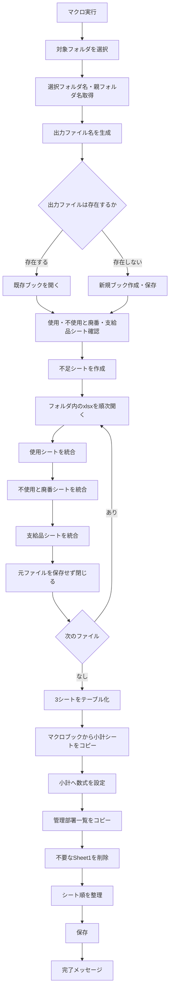
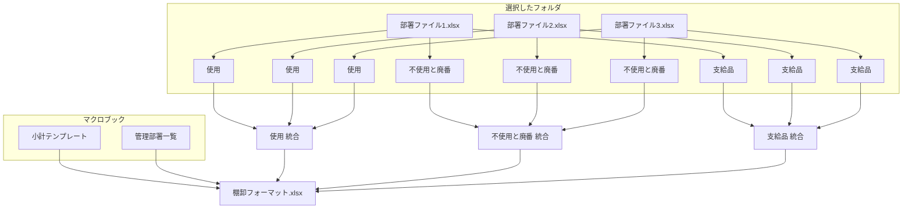
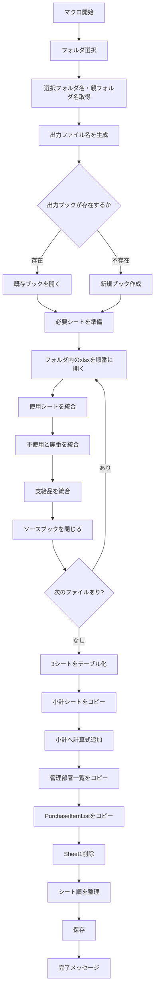
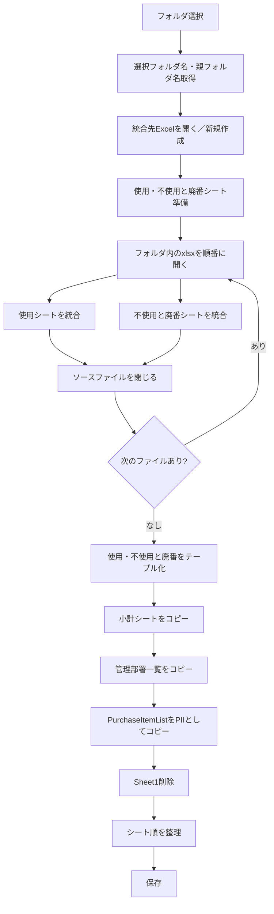

部署や拠点ごとに分かれた棚卸Excelファイルを1つの棚卸フォーマットへ統合するVBA `CombineDepartmentFiles` の理解、実装、エラー対策をまとめた記録です。

元の活動日時は確認できないため、実際の日付順ではなく、内容から推定した段階順に配置しています。後段に置いたコードを最終版候補として扱いますが、現在の環境では未検証です。完全に同一のコード断片だけは重複掲載を省略し、異なる版、失敗例、訂正、未解決事項は残しています。

## 記録の読み方

このノートは現在使う手順書ではなく、当時どのような課題を扱い、どのように設計やコードを変えていったかを残す活動記録です。記録間で判断が食い違う場合は、後段の記録を有力候補としつつ、矛盾そのものも経緯として残しています。

## 段階1：`CombineDepartmentFiles` VBAの理解・整理まとめ

このチャットでは、VBAモジュール `CombineDepartmentFiles` のコード全体を確認し、その処理内容と構造を整理した。目的は、**部署ごと・拠点ごとに分かれている棚卸Excelファイルを1つの棚卸フォーマットへ統合し、後続処理に使える形へ整形すること**である。

### VBA全体の目的

対象マクロは、ユーザーが選択したフォルダ内の複数の `.xlsx` ファイルから、以下の3シートを収集・結合する。

|対象シート|処理|
|---|---|
|`使用`|各ファイルのデータを縦方向に統合|
|`不使用と廃番`|各ファイルのデータを縦方向に統合|
|`支給品`|各ファイルのデータを縦方向に統合|

その後、統合した各データをExcelテーブル化し、マクロブック側から以下も追加する。

- `小計`シート
- `管理部署`シート
- `小計`シート内の集計数式
- 所定のシート順

最終的には、選択フォルダ名と親フォルダ名を利用した名前で統合ファイルを保存する。

```text
棚卸フォーマット_<選択フォルダ名>_<親フォルダ名>.xlsx
```

たとえば、

```text
棚卸フォーマット_本社・6丁目_副資材.xlsx
```

のような構成になることを想定したコードである。

---

### 全体の処理フロー



### メイン処理 `CombineDepartmentFiles`

### 1. 変数宣言

冒頭では、処理対象となるブック・シート・ファイル名・最終行・制御フラグなどを宣言している。

主な変数は以下。

|変数|用途|
|---|---|
|`sourceWorkbook`|統合元の各Excelブック|
|`destWorkbook`|統合結果を書き込む出力ブック|
|`folderPath`|ユーザーが選択したフォルダ|
|`selectedFolderName`|選択フォルダそのものの名前|
|`parentFolderName`|選択フォルダの親フォルダ名|
|`destFileName`|出力ファイルのフルパス|
|`fileName`|`Dir`で取得する各Excelファイル名|
|`wsUsage`|出力側の`使用`シート|
|`wsUnused`|出力側の`不使用と廃番`シート|
|`wsSupplies`|出力側の`支給品`シート|
|`wsSubtotal`|出力側の`小計`シート|
|`firstCopyUsage`|`使用`の初回コピー判定|
|`firstCopyUnused`|`不使用と廃番`の初回コピー判定|
|`firstCopySupplies`|`支給品`の初回コピー判定|

`firstCopy...` の3つは、**最初のファイルだけヘッダーを含め、それ以降はヘッダーを除外する**ために使われている。

---

### 2. フォルダ選択

```vba
Set fileDialog = Application.fileDialog(msoFileDialogFolderPicker)
```

フォルダ選択ダイアログを表示する。

選択された場合、

```vba
folderPath = fileDialog.SelectedItems(1)
selectedFolderName = GetFolderName(folderPath)
parentFolderName = GetParentFolderName(folderPath)
```

によって、

- フォルダのフルパス
- 選択フォルダ名
- 親フォルダ名

を取得する。

キャンセルされた場合は、

```vba
MsgBox "フォルダが選択されませんでした。処理を中止します。"
Exit Sub
```

で終了する。

---

### 3. 出力ファイル名の生成

```vba
destFileName = ThisWorkbook.Path & _
    "\棚卸フォーマット_" & _
    selectedFolderName & "_" & _
    parentFolderName & ".xlsx"
```

出力先は、**マクロブックと同じフォルダ**になる。

フォルダ構造そのものを意味情報として利用している点が特徴である。

たとえば、

```text
副資材
└─ 本社・6丁目
```

という構成の `本社・6丁目` を選択した場合、

```text
selectedFolderName = 本社・6丁目
parentFolderName   = 副資材
```

となる。

この `parentFolderName` は、後でテーブル名にも使われる。

---

### 4. 出力ブックを開く、または新規作成

まず既存ファイルを開こうとする。

```vba
On Error Resume Next
Set destWorkbook = Workbooks.Open(destFileName)
On Error GoTo 0
```

存在しなければ、

```vba
Set destWorkbook = Workbooks.Add
destWorkbook.SaveAs destFileName, FileFormat:=xlOpenXMLWorkbook
```

で新規作成する。

したがって、このコードは、

- 出力ファイルがなければ新規作成
- あれば既存ファイルを開く

という設計になっている。

---

### 5. 統合先シートの取得・作成

出力ブックで、

- `使用`
- `不使用と廃番`
- `支給品`

を探す。

存在しないシートだけ新規作成する。

```vba
If wsUsage Is Nothing Then
    Set wsUsage = destWorkbook.Sheets.Add(...)
    wsUsage.Name = "使用"
End If
```

他2シートも同様である。

---

### 各Excelファイルの結合処理

### ファイル列挙

```vba
fileName = Dir(folderPath & "\*.xlsx")
```

によって、選択フォルダ直下の `.xlsx` ファイルを取得する。

その後、

```vba
Do While fileName <> ""
```

で各ファイルを順番に処理する。

サブフォルダの中までは検索しない。

---

### 各ソースブックを開く

```vba
Set sourceWorkbook = Workbooks.Open(folderPath & "\" & fileName)
```

各Excelファイルを通常のWorkbookとして開く。

その後、3種類のシートを順番に処理する。

---

### `使用`シートの結合

まず、

```vba
Set wsSource = sourceWorkbook.Sheets("使用")
```

を試みる。

対象シートがなければ、そのファイルについてはスキップする。

#### 初回コピー

```vba
If firstCopyUsage Then
```

最初の`使用`シートは、

```vba
wsSource.UsedRange.Copy
```

で使用範囲全体をコピーする。

貼り付けは、

```vba
wsUsage.Range("A1").PasteSpecial Paste:=xlPasteValues
wsUsage.Range("A1").PasteSpecial Paste:=xlPasteFormats
```

で、

- 値
- 書式

を別々にコピーする。

したがって、数式そのものは持ち込まず、結果値が保存される。

コピー後、

```vba
firstCopyUsage = False
```

として、以降は追加コピーに切り替える。

#### 2ファイル目以降

既存データの末尾をA列基準で取得する。

```vba
lastRowUsage = wsUsage.Cells(wsUsage.Rows.Count, "A").End(xlUp).Row + 1
```

そして、

```vba
wsSource.UsedRange.Offset(1, 0) _
    .Resize(wsSource.UsedRange.Rows.Count - 1).Copy
```

によって、先頭行を除外してコピーする。

つまり、

```text
1ファイル目
ヘッダー
データ
データ

2ファイル目
データ
データ

3ファイル目
データ
...
```

という形で縦方向に連結される。

---

### `不使用と廃番`・`支給品`

基本ロジックは`使用`と完全に同じである。

それぞれ独立した、

- 初回コピー判定
- 最終行
- 出力シート

を持っている。

|シート|初回判定変数|最終行変数|
|---|---|---|
|使用|`firstCopyUsage`|`lastRowUsage`|
|不使用と廃番|`firstCopyUnused`|`lastRowUnused`|
|支給品|`firstCopySupplies`|`lastRowSupplies`|

したがって、あるExcelファイルに`支給品`がなくても、他の2シートの処理には影響しない。

---

### ソースブックを閉じる

各ファイルの処理終了後、

```vba
Application.DisplayAlerts = False
sourceWorkbook.Close SaveChanges:=False
Application.DisplayAlerts = True
```

とする。

元ファイルには何も保存しない。

---

### 統合後のテーブル化

全ファイルを読み終えた後、

```vba
CreateTable wsUsage, "棚卸表_" & parentFolderName & "_使用"
CreateTable wsUnused, "棚卸表_" & parentFolderName & "_不使用と廃番"
CreateTable wsSupplies, "棚卸表_" & parentFolderName & "_支給品"
```

を実行する。

例えば、

```text
parentFolderName = 副資材
```

なら、

|シート|テーブル名|
|---|---|
|使用|`棚卸表_副資材_使用`|
|不使用と廃番|`棚卸表_副資材_不使用と廃番`|
|支給品|`棚卸表_副資材_支給品`|

となる。

原料なら、

```text
棚卸表_原料_使用
棚卸表_原料_不使用と廃番
棚卸表_原料_支給品
```

となる設計である。

---

### `CreateTable`

```vba
Sub CreateTable(ws As Worksheet, tableName As String)
```

では、

```vba
Set tblRange = ws.Range("A1").CurrentRegion
```

によってA1を起点とした連続範囲をテーブル対象とする。

その後、

```vba
Set tbl = ws.ListObjects.Add(xlSrcRange, tblRange, , xlYes)
```

でExcelテーブル化する。

ヘッダーありとして処理し、

```vba
tbl.Name = tableName
tbl.TableStyle = "TableStyleLight8"
```

でテーブル名とスタイルを設定する。

---

### `小計`シートの追加

マクロブック自身、

```vba
ThisWorkbook
```

の`小計`シートを検索する。

```vba
Set sourceSubtotalSheet = ThisWorkbook.Sheets("小計")
```

存在すれば、新規シートを作成して、

```vba
sourceSubtotalSheet.Cells.Copy
wsSubtotal.Cells.PasteSpecial Paste:=xlPasteAll
```

で全内容をコピーする。

コピー後、新シートを、

```text
小計
```

に変更する。

つまりこの`小計`は、各部署ファイル側から統合するものではなく、**マクロファイル側に用意されたテンプレート**である。

---

### `AddFormulasToSubtotal`

`小計`シートには、統合した棚卸表を参照する数式を追加する。

大きく2種類ある。

### 数量が0より大きい行数

たとえば、

```vba
.Range("D4").Formula = _
    "=COUNTIF(棚卸表_" & parentFolderName & "_使用[数量_202406], "">0"")"
```

これは、

```text
棚卸表_原料_使用[数量_202406]
```

または

```text
棚卸表_副資材_使用[数量_202406]
```

に対して、0より大きいデータ件数をカウントする。

対象月は現在コード内に固定されている。

```text
202406
202402
202310
202306
202302
202210
```

#### 行構成

|行|内容|
|---|---|
|4|使用|
|5|不使用と廃番|
|6|上記2行の合計|

D～I列で6期間を参照している。

---

### 金額合計

D10～I11では、

```vba
=SUM(テーブル名[金額_YYYYMM])
```

で金額列を集計する。

行構成は、

|行|内容|
|---|---|
|10|使用|
|11|不使用と廃番|
|12|上記2行の合計|

となっている。

なお、`支給品`についてはこの小計数式からは参照されていない。

---

### `管理部署`シート

`CopyManagementDepartmentList` では、選択したフォルダ名によってコピー元テーブルを切り替えている。

```vba
If selectedFolderName = "本社・6丁目" Then
    sourceTableName = "管理部署一覧表_本社・6丁目"
ElseIf selectedFolderName = "石切" Then
    sourceTableName = "管理部署一覧表_石切"
```

現在対応しているのは、

- `本社・6丁目`
- `石切`

のみ。

それ以外のフォルダの場合、

```text
選択したフォルダ名に対応する管理部署一覧表がありません。
```

と表示して、このサブルーチンを終了する。

---

### 管理部署一覧のコピー元

コピー元は、

```vba
ThisWorkbook.Sheets("管理部署")
```

つまりマクロブック内の`管理部署`シートである。

その中から、

```vba
wsSource.ListObjects(sourceTableName)
```

で目的のExcelテーブルを取得する。

---

### 出力先

出力ブックに新しいシートを作り、

```text
管理部署
```

と命名する。

元テーブルの、

- 値
- 書式

をコピーする。

その後、

```vba
CreateTable wsDest, sourceTableName
```

によってテーブル化し、元と同じテーブル名を付与する。

---

### フォルダ名取得関数

### `GetFolderName`

```vba
Function GetFolderName(folderPath As String) As String
```

`FileSystemObject`を使って、指定フォルダ自身の名称を取得する。

---

### `GetParentFolderName`

```vba
Function GetParentFolderName(folderPath As String) As String
```

同じく`FileSystemObject`を利用し、1階層上のフォルダ名を返す。

これにより、フォルダ階層を、

```text
データ種別
└─ 拠点
```

のような業務上の分類として利用できる。

---

### 最終シート構成

途中で新規ブックに自動作成された `Sheet1` が残っている場合は削除する。

その後、シートを以下の順に並び替える。

```text
1. 小計
2. 使用
3. 不使用と廃番
4. 支給品
5. 管理部署
```

Mermaidで表すと、


となる。

---

### 入力・出力の関係

このVBAの構造をまとめると、以下の関係になる。



---

### このVBAの設計上の特徴

今回確認したコードには、次のような設計思想がある。

- **フォルダ単位で部署別ファイルを一括処理する**
- 各ファイルに共通する3シートを縦結合する
- 1ファイル目だけヘッダーを含める
- 元ファイルからは数式ではなく値と書式だけを取得する
- 統合結果をExcelテーブルとして利用できる状態にする
- 親フォルダ名から「原料」「副資材」などのデータ種別を判定し、テーブル名に反映する
- 選択フォルダ名から拠点を判定し、その拠点用の管理部署一覧を付加する
- `小計`はテンプレートをコピーし、統合テーブルを参照する数式を後から設定する
- 出力ブックは、その後の棚卸処理に利用できる完成形に近い構造で保存する

---

### 現コードを読むうえで注意しておく点

今回のチャットではコード変更までは行っていないが、今後改修する際に重要になるポイントも読み取れる。

|項目|現在の仕様|
|---|---|
|対象ファイル|選択フォルダ直下の`.xlsx`のみ|
|サブフォルダ|検索しない|
|初回ファイル|ヘッダー込み|
|2件目以降|先頭行を除外|
|最終行判定|A列基準|
|コピー対象|`UsedRange`|
|コピー内容|値＋書式|
|数式|コピーしない|
|小計対象年月|VBA内に固定|
|拠点判定|`本社・6丁目` / `石切`|
|出力先|マクロブックと同じフォルダ|
|出力形式|`.xlsx`|
|テーブル基準範囲|`A1.CurrentRegion`|

特に、以前の棚卸マクロ関連で問題になった**A列が空白の場合の最終行判定**や、ヘッダーしか存在しないシートに対する、

```vba
.Resize(wsSource.UsedRange.Rows.Count - 1)
```

の扱いは、今後の堅牢化を検討する際の重要ポイントになる。

---

### 今回のチャットで確認されたこと

今回のやり取りでは、コードそのものの修正は行わず、まずこのVBAが何をしているのかを理解・整理した。

結論として、この `CombineDepartmentFiles` は単なるファイル結合マクロではなく、

> **部署・拠点単位に分散している棚卸データを、「原料／副資材」などの分類を保ちながら統合し、小計・管理部署情報まで含む棚卸作業用の統合ブックを生成するマクロ**

と捉えるのが最も正確である。

また、このマクロは棚卸業務全体の中では、**部署別ファイルをまとめる「統合工程」**を担当しており、後続の列追加・数式付与や再分割処理へつながる基礎データを作成する役割を持つ。

## 段階2：VBA「CombineDepartmentFiles」棚卸ファイル統合処理 ― チャット全体まとめ

### 1. このVBAの目的

今回確認した `CombineDepartmentFiles` は、**部署ごとなどに分かれている複数の棚卸Excelファイルを1つのブックへ統合するマクロ**です。

主に以下の3シートを対象としています。

|対象シート|処理|
|---|---|
|`使用`|各ファイルのデータを縦方向に結合|
|`不使用と廃番`|各ファイルのデータを縦方向に結合|
|`支給品`|各ファイルのデータを縦方向に結合|

その後、統合ブックに以下も追加します。

- `小計`
- `管理部署`
- `PurchaseItemList`

最終的には、概ね次の構成の棚卸フォーマットを生成します。

```text
棚卸フォーマット_選択フォルダ名_親フォルダ名.xlsx
```

シート順は次のように整えられます。

```text
小計
↓
使用
↓
不使用と廃番
↓
支給品
↓
管理部署
↓
PurchaseItemList
```

---

### 2. `CombineDepartmentFiles` の処理フロー

全体の処理は以下の構造になっています。



---

### 3. フォルダ選択と出力ファイル名

最初にフォルダ選択ダイアログを表示します。

> 同一のコード断片は前段階に記録済みのため、重複掲載を省略。

フォルダが選択されると、次の2つを取得します。

```vba
selectedFolderName = GetFolderName(folderPath)
parentFolderName = GetParentFolderName(folderPath)
```

例えばフォルダ構成が、

```text
原料
└─ 本社・6丁目
```

で `本社・6丁目` を選択した場合、

```text
selectedFolderName = 本社・6丁目
parentFolderName   = 原料
```

となります。

出力ファイルは、

> 同一のコード断片は前段階に記録済みのため、重複掲載を省略。

なので、例として、

```text
棚卸フォーマット_本社・6丁目_原料.xlsx
```

のようなファイルが作成されます。

---

### 4. 出力ブックの準備

同じ名前の出力ファイルが存在する場合は開きます。

```vba
Set destWorkbook = Workbooks.Open(destFileName)
```

存在しない場合は新規作成します。

> 同一のコード断片は前段階に記録済みのため、重複掲載を省略。

続いて、

```text
使用
不使用と廃番
支給品
```

の各シートが存在するか確認し、なければ追加します。

---

### 5. 各ファイルを統合する仕組み

フォルダ内の `.xlsx` を `Dir` で順番に取得します。

```vba
fileName = Dir(folderPath & "\*.xlsx")

Do While fileName <> ""
```

それぞれのファイルを、

> 同一のコード断片は前段階に記録済みのため、重複掲載を省略。

で開きます。

各ファイルから、

```text
使用
不使用と廃番
支給品
```

を探して統合します。

---

### 6. 最初のファイルと2つ目以降のファイルの違い

重要なのが、

```vba
firstCopyUsage
firstCopyUnused
firstCopySupplies
```

という3つのBoolean変数です。

初期値は、

```vba
firstCopyUsage = True
firstCopyUnused = True
firstCopySupplies = True
```

となっています。

#### 最初のファイル

最初のファイルについては、**ヘッダーを含めてUsedRange全体をコピー**します。

例：

```vba
wsSource.UsedRange.Copy

wsUsage.Range("A1").PasteSpecial Paste:=xlPasteValues
wsUsage.Range("A1").PasteSpecial Paste:=xlPasteFormats
```

処理後、

```vba
firstCopyUsage = False
```

に変更します。

#### 2つ目以降

2ファイル目以降はヘッダーが不要なので、1行目を除外してコピーします。

> 同一のコード断片は前段階に記録済みのため、重複掲載を省略。

つまり、

```text
元データ

1行目：ヘッダー        ← コピーしない
2行目：データ          ┐
3行目：データ          ├ コピー
4行目：データ          ┘
```

という意図です。

---

### 7. 今回発生したエラー

今回問題になったのは次のコードです。

> 同一のコード断片は前段階に記録済みのため、重複掲載を省略。

ここで実行時エラーが発生しました。

このコードを分解すると、

```vba
wsSource.UsedRange
```

で使用範囲を取得し、

```vba
.Offset(1, 0)
```

で1行下へずらし、

> 同一のコード断片は前段階に記録済みのため、重複掲載を省略。

でヘッダー1行分を除いた行数にサイズ変更しています。

---

### 8. 最も重要な原因候補：UsedRangeが1行しかない

特に重要な問題が、

```vba
wsSource.UsedRange.Rows.Count = 1
```

の場合です。

このとき、

```vba
wsSource.UsedRange.Rows.Count - 1
```

は、

```text
1 - 1 = 0
```

になります。

つまりVBAには実質、

```vba
.Resize(0)
```

を実行させることになります。

しかしExcelの `Range.Resize` に**0行の範囲は指定できません**。

そのためエラーになります。

#### 典型例

コピー元のシートが、

```text
コード | 品名 | 数量 | 単価
```

のようにヘッダーしかない場合、

```text
UsedRange.Rows.Count = 1
```

になります。

このシートについて2ファイル目以降の処理に入ると、

```vba
Resize(0)
```

となり、エラーになります。

---

### 9. 基本的な対処方法

コピー対象が2行以上存在する場合だけコピーするようにします。

基本形は次の考え方です。

```vba
Dim dataRange As Range

Set dataRange = wsSource.UsedRange

If dataRange.Rows.Count > 1 Then

    dataRange.Offset(1, 0) _
        .Resize(dataRange.Rows.Count - 1).Copy

End If
```

これによって、

```text
UsedRange = 1行
```

ならコピー処理をスキップします。

---

### 10. 既存コードへ適用する場合の構造

例えば `使用` シートでは現在、

```vba
If firstCopyUsage Then

    wsSource.UsedRange.Copy
    wsUsage.Range("A1").PasteSpecial Paste:=xlPasteValues
    wsUsage.Range("A1").PasteSpecial Paste:=xlPasteFormats
    firstCopyUsage = False

Else

    lastRowUsage = wsUsage.Cells(wsUsage.Rows.Count, "A").End(xlUp).Row + 1

    wsSource.UsedRange.Offset(1, 0) _
        .Resize(wsSource.UsedRange.Rows.Count - 1).Copy

    wsUsage.Range("A" & lastRowUsage).PasteSpecial Paste:=xlPasteValues
    wsUsage.Range("A" & lastRowUsage).PasteSpecial Paste:=xlPasteFormats

End If
```

となっています。

考え方としては、

```text
最初のコピー
    ↓
ヘッダー込みでコピー

2回目以降
    ↓
UsedRangeが2行以上？
    ├─ Yes → ヘッダーを除いてコピー
    └─ No  → コピーしない
```

という構造に変更する必要があります。

---

### 11. 他に検討した原因

チャットでは、ほかにも以下の可能性を検討しました。

|原因候補|内容|優先度|
|---|---|--:|
|UsedRangeが1行|`Resize(0)` になる|**高**|
|データが実質空|使用履歴だけが残っている場合など|中|
|結合セル|`Offset` / `Resize` と範囲構造が衝突する場合|低〜中|
|`wsSource Is Nothing`|対象シートが存在しない|低|

ただし現在のコードでは、

```vba
If Not wsSource Is Nothing Then
```

が存在するため、少なくとも今回の問題については、

```text
wsSource = Nothing
```

よりも、

```text
UsedRange.Rows.Count = 1
```

をまず疑うのが妥当です。

また、以前提示した、

```vba
If Not dataRange.MergeCells Then
```

という結合セル判定を必須条件にする必要は通常ありません。今回のエラーに対しては、まず**ゼロ行の `Resize` を防ぐことが本質的な対策**です。

---

### 12. 同じ問題は3か所存在する

今回エラーになった構造は `使用` だけではありません。

同一コードが、

```text
使用
不使用と廃番
支給品
```

のすべてに存在します。

#### 使用

> 同一のコード断片は前段階に記録済みのため、重複掲載を省略。

#### 不使用と廃番

同じ処理です。

#### 支給品

こちらも同じ処理です。

したがって、修正する場合は**3か所すべて同じ基準で修正する必要があります**。

---

### 13. 統合後のテーブル化

3シートの結合終了後、

```vba
CreateTable wsUsage, "棚卸表_" & parentFolderName & "_使用"

CreateTable wsUnused, _
    "棚卸表_" & parentFolderName & "_不使用と廃番"

CreateTable wsSupplies, _
    "棚卸表_" & parentFolderName & "_支給品"
```

を実行します。

`CreateTable` は、

> 同一のコード断片は前段階に記録済みのため、重複掲載を省略。

で範囲を取得し、

```vba
Set tbl = ws.ListObjects.Add( _
    xlSrcRange, tblRange, , xlYes)
```

でExcelテーブルへ変換します。

テーブルスタイルは、

```vba
tbl.TableStyle = "TableStyleLight8"
```

です。

---

### 14. 「小計」シート

マクロブック、

```vba
ThisWorkbook
```

に存在する `小計` シートをコピーします。

> 同一のコード断片は前段階に記録済みのため、重複掲載を省略。

コピー先には新しいシートを作り、

> 同一のコード断片は前段階に記録済みのため、重複掲載を省略。

によって完全コピーします。

その後、

```vba
AddFormulasToSubtotal wsSubtotal, parentFolderName
```

を実行します。

---

### 15. 小計の計算式

現在は年月が固定されています。

対象年月は、

> 同一のコード断片は前段階に記録済みのため、重複掲載を省略。

です。

例えば、

```vba
.Range("D4").Formula = _
    "=COUNTIF(棚卸表_" & parentFolderName & _
    "_使用[数量_202406], "">0"")"
```

となっています。

数量については、

```text
使用
不使用と廃番
合計
```

を計算します。

金額についても、

```text
使用
不使用と廃番
合計
```

を計算します。

---

### 16. 管理部署一覧

`CopyManagementDepartmentList` では、選択したフォルダ名によって参照テーブルを切り替えます。

|selectedFolderName|テーブル|
|---|---|
|`本社・6丁目`|`管理部署一覧表_本社・6丁目`|
|`石切`|`管理部署一覧表_石切`|

それ以外の場合は、

```vba
MsgBox "選択したフォルダ名に対応する管理部署一覧表がありません。"
```

として処理を終了します。

コピー後は、

```text
管理部署
```

シートとして追加されます。

---

### 17. PurchaseItemList

マクロブックに存在する、

```text
PurchaseItemList
```

シートについてはシート単位でコピーしています。

```vba
ThisWorkbook.Sheets("PurchaseItemList").Copy _
    After:=destWorkbook.Sheets(destWorkbook.Sheets.Count)
```

これは `管理部署` のような「テーブル範囲のみコピー」ではなく、**シート全体コピー**です。

---

### 18. 最終的なシート整理

不要な、

```text
Sheet1
```

を削除します。

その後、

```vba
.Sheets("小計").Move Before:=.Sheets(1)
.Sheets("使用").Move After:=.Sheets("小計")
.Sheets("不使用と廃番").Move After:=.Sheets("使用")
.Sheets("支給品").Move After:=.Sheets("不使用と廃番")
.Sheets("管理部署").Move After:=.Sheets("支給品")
.Sheets("PurchaseItemList").Move After:=.Sheets("管理部署")
```

として順番を固定します。

---

### 19. 現時点での整理

今回のチャットで確認できた状態をまとめると、次のとおりです。

|項目|状態|
|---|---|
|VBAの目的|複数部署ファイルの棚卸データ統合|
|統合対象|使用 / 不使用と廃番 / 支給品|
|ヘッダー処理|最初のファイルのみコピー|
|2ファイル目以降|`Offset + Resize` でヘッダー除外|
|現在の不具合|`Offset().Resize().Copy` でエラー|
|主原因候補|`UsedRange.Rows.Count = 1`|
|発生条件|ヘッダーしか存在しないシートなど|
|必要な修正|`Rows.Count > 1` の場合のみコピー|
|修正対象|使用 / 不使用と廃番 / 支給品の3か所|
|その他|小計、管理部署、PurchaseItemListも追加|
|最終成果物|`棚卸フォーマット_○○_○○.xlsx`|

### 結論

今回の問題の核心は、2ファイル目以降について、

```vba
wsSource.UsedRange.Rows.Count - 1
```

を無条件に `Resize` の行数として使っている点です。

コピー元シートにヘッダーしかなければ、

```text
Rows.Count = 1
↓
Rows.Count - 1 = 0
↓
Resize(0)
↓
エラー
```

となります。

したがって今後の修正方針としては、**「データ行が存在する場合だけヘッダーを除いた範囲をコピーする」ように3シート共通で防御処理を追加する**のが第一候補です。

なお、この段階では原因分析まで進んでおり、`CombineDepartmentFiles` 全体のコード修正版への反映はまだ確定していません。次に修正する場合は、3シートに同じ判定を個別記述するより、重複している統合処理自体を共通化できるかも併せて検討する余地があります。

## 段階3：チャット全体まとめ：`CombineDepartmentFiles` の理解と、A列空白時のテーブル化エラー対策

このチャットでは、棚卸関連の複数Excelファイルを1つに統合するVBAマクロ `CombineDepartmentFiles` の処理内容を確認し、その後、統合後のシートをテーブル化する際に発生した **実行時エラー 1004** の原因を特定し、**A列に空白があっても動作するようにする修正方法**を検討した。

#### 1. 対象VBAの目的と全体フロー

対象マクロ `CombineDepartmentFiles` は、ユーザーが指定したフォルダ配下にある複数の `.xlsx` ファイルを読み込み、それぞれの `"使用"` シートと `"不使用と廃番"` シートを1つのExcelブックに統合する処理である。

処理全体は次の流れになっている。



統合先ファイル名は以下の規則で生成される。

```text
棚卸フォーマット_<選択フォルダ名>_<親フォルダ名>.xlsx
```

保存場所はマクロブック `ThisWorkbook` と同じフォルダである。

---

#### 2. `"使用"`・`"不使用と廃番"` の統合方法

フォルダ内の `.xlsx` ファイルを `Dir` で取得し、1ファイルずつ開いて処理する。

> 同一のコード断片は前段階に記録済みのため、重複掲載を省略。

各ファイルについて、

- `"使用"`
- `"不使用と廃番"`

のシートを探し、存在すれば統合する。

最初のファイルのみヘッダー込みでコピーするために、

```vba
firstCopyUsage = True
firstCopyUnused = True
```

というフラグを使用している。

2ファイル目以降は、

```vba
wsSource.UsedRange.Offset(1, 0)
```

によって先頭行を除外し、ヘッダーを重複させずに追加する構造になっている。

コピーされるのは、

- 値
- 書式

である。

```vba
.PasteSpecial Paste:=xlPasteValues
.PasteSpecial Paste:=xlPasteFormats
```

---

#### 3. 統合後に追加されるシート

最終的な統合ブックには、以下のシートが作成・コピーされる。

|順序|シート名|内容|
|--:|---|---|
|1|小計|マクロブックの `"小計"` シート|
|2|使用|各部署ファイルの `"使用"` シート統合結果|
|3|不使用と廃番|各部署ファイルの `"不使用と廃番"` 統合結果|
|4|管理部署|対象拠点に応じた管理部署一覧|
|5|PII|`purchase_item_information.xlsx` の `PurchaseItemList`|

`管理部署` については選択フォルダ名によってコピー対象テーブルが変わる。

|選択フォルダ|コピー元テーブル|
|---|---|
|本社・6丁目|`管理部署一覧表_本社・6丁目`|
|石切|`管理部署一覧表_石切`|

また、次の固定ファイルから `PurchaseItemList` を取得している。

```text
C:\Users\kyoupatty029\projects\kpm\inventory\purchase_item_information.xlsx
```

コピー後のシート名は、

```text
PII
```

に変更される。

---

#### 4. 発生したエラー

問題となったのは、統合後のシートをExcelテーブル化する `CreateTable` である。

元のコードは次の形だった。

```vba
Sub CreateTable(ws As Worksheet, tableName As String)
    Dim tbl As ListObject
    Dim tblRange As Range

    Set tblRange = ws.Range("A1").CurrentRegion

    Set tbl = ws.ListObjects.Add(xlSrcRange, tblRange, , xlYes)
    tbl.Name = tableName
    tbl.TableStyle = "TableStyleLight8"
End Sub
```

エラー発生箇所は以下。

> 同一のコード断片は前段階に記録済みのため、重複掲載を省略。

発生したエラーは、

```text
実行時エラー 1004
```

だった。

---

#### 5. 原因の切り分け

ユーザーが確認した結果、**A列にデータを入れると正常に動作する**ことが判明した。

この結果から、問題の中心は `ListObjects.Add` そのものよりも、テーブル化対象範囲の取得方法にあることが分かった。

特に問題になるのが、

```vba
ws.Range("A1").CurrentRegion
```

である。

`CurrentRegion` は、A1を起点として「空白行・空白列で囲まれた連続領域」を取得する。

そのため、A列が空白であったり、データ配置によって連続領域が正しく形成されていない場合、期待する表全体を取得できない可能性がある。

概念的には次のような違いになる。

```text
A列が埋まっている場合

A        B        C
コード   品名     数量
001      商品A    10
002      商品B    20

→ A1.CurrentRegion で表全体を取得しやすい
```

一方、

```text
A        B        C
         品名     数量
         商品A    10
         商品B    20
```

のような状態では、A1基準の `CurrentRegion` に依存する設計は不安定になる。

---

### 6. 採用候補となった解決方法

A列に依存せず、**シート上で実際にデータが存在する最後の行と最後の列を探してテーブル範囲を作る**方法を提案した。

基本方針は以下。


範囲取得には次を利用する。

```vba
lastRow = ws.Cells.Find("*", _
    SearchOrder:=xlByRows, _
    SearchDirection:=xlPrevious).Row
```

最終列は、

```vba
lastCol = ws.Cells.Find("*", _
    SearchOrder:=xlByColumns, _
    SearchDirection:=xlPrevious).Column
```

そして、

```vba
Set tblRange = ws.Range(ws.Cells(1, 1), ws.Cells(lastRow, lastCol))
```

とする。

この方法であれば、**A列そのものに値が存在するかどうかに依存せず、B列以降のデータも含めてシート全体のデータ範囲を判定できる**。

---

### 7. 提案した `CreateTable` 改良版

チャット内では、最終的に次のような方向を提示した。

```vba
Sub CreateTable(ws As Worksheet, tableName As String)
    Dim tbl As ListObject
    Dim tblRange As Range
    Dim lastRow As Long
    Dim lastCol As Long

    ' データ範囲の特定
    On Error Resume Next
    lastRow = ws.Cells.Find("*", SearchOrder:=xlByRows, _
                                 SearchDirection:=xlPrevious).Row

    lastCol = ws.Cells.Find("*", SearchOrder:=xlByColumns, _
                                 SearchDirection:=xlPrevious).Column
    On Error GoTo 0

    ' シートが完全に空の場合
    If lastRow = 0 Or lastCol = 0 Then
        MsgBox "シート " & ws.Name & _
               " にデータがありません。テーブル作成をスキップします。", _
               vbExclamation
        Exit Sub
    End If

    ' A1～最終データセルまでをテーブル範囲とする
    Set tblRange = ws.Range( _
        ws.Cells(1, 1), _
        ws.Cells(lastRow, lastCol) _
    )

    ' 完全に空なら処理しない
    If Application.WorksheetFunction.CountA(tblRange) = 0 Then
        MsgBox "シート " & ws.Name & _
               " にデータがありません。テーブル作成をスキップします。", _
               vbExclamation
        Exit Sub
    End If

    ' 既存テーブル確認
    On Error Resume Next
    Set tbl = ws.ListObjects(tableName)

    If Not tbl Is Nothing Then
        tbl.Delete
    End If
    On Error GoTo 0

    ' テーブル作成
    Set tbl = ws.ListObjects.Add( _
        xlSrcRange, _
        tblRange, _
        , _
        xlYes _
    )

    tbl.Name = tableName
    tbl.TableStyle = "TableStyleLight8"
End Sub
```

---

### 8. この修正によって改善される点

元の実装と修正版の違いを整理すると以下になる。

|項目|元の実装|修正版|
|---|---|---|
|範囲取得|`A1.CurrentRegion`|`Find("*")` で最終行・列を取得|
|A列への依存|強い|ほぼない|
|A列空白への耐性|低い|高い|
|表内の空白行|範囲が分断される可能性あり|基本的に含められる|
|表内の空白列|範囲が分断される可能性あり|基本的に含められる|
|完全な空シート|エラーの可能性|スキップ可能|
|同名テーブル|状況によって問題|事前確認可能|

---

### 9. 補足：今回の問題で重要な点

今回判明した問題は、単純に「A列に空白セルが1つでもあればテーブル化できない」というものではない。

正確には、

> **表範囲の決定を `A1.CurrentRegion` とA列に強く依存させているため、A列のデータ状態によって意図した表範囲を取得できなくなる**

という問題である。

したがって、今後の処理でも、

```vba
Cells(Rows.Count, "A").End(xlUp)
```

のように**A列を基準として最終行を取得している箇所**には注意が必要である。

実際、元コードには次の処理も存在する。

> 同一のコード断片は前段階に記録済みのため、重複掲載を省略。

```vba
lastRowUnused = wsUnused.Cells(wsUnused.Rows.Count, "A").End(xlUp).Row + 1
```

ここもA列が完全に空白になる可能性があるデータ構造なら、将来的には同様に不安定になる。

より堅牢にするなら、追加行の判定についても、

```vba
Find("*", SearchOrder:=xlByRows, SearchDirection:=xlPrevious)
```

を利用し、**特定列ではなくシート全体から最終行を求める設計**に統一するのが望ましい。

---

### 現時点での結論

今回のエラーについては、

1. `ListObjects.Add` で実行時エラー1004が発生した
2. A列にデータを入力すると正常動作した
3. その結果、`A1.CurrentRegion` による範囲判定が主要因と判断した
4. `CurrentRegion` をやめ、`Find("*")` を使って最終行・最終列を取得する方法を提示した
5. これにより、A列に空白があってもテーブル化できる構造へ変更可能

というところまで整理できている。

なお、**完全に堅牢化するなら `CreateTable` だけでなく、統合処理中の `lastRowUsage` / `lastRowUnused` のA列依存も合わせて修正対象にするべき**である。今回のエラー箇所とは別だが、同じ設計上の弱点を持っている。

## 統合元ファイル

- 「`CombineDepartmentFiles` VBAの理解・整理まとめ.md」
- 「VBA「CombineDepartmentFiles」棚卸ファイル統合処理 ― チャット全体まとめ.md」
- 「チャット全体まとめ：`CombineDepartmentFiles` の理解と、A列空白時のテーブル化エラー対策.md」
