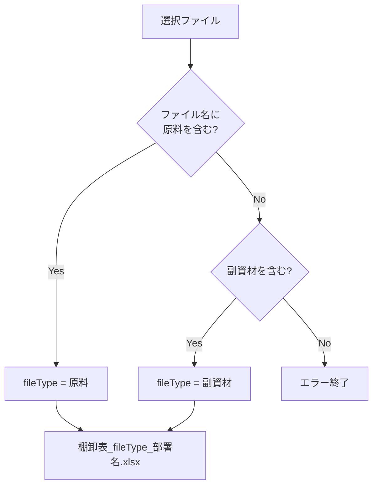
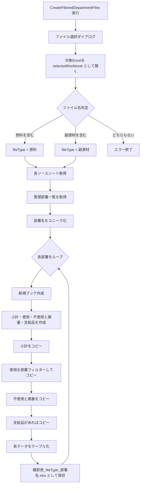
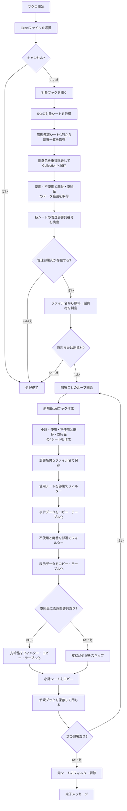
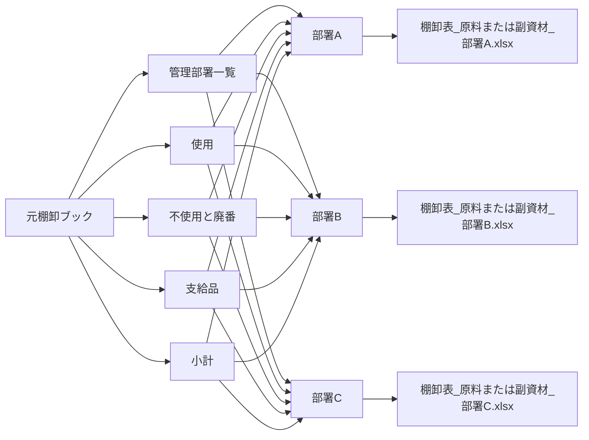
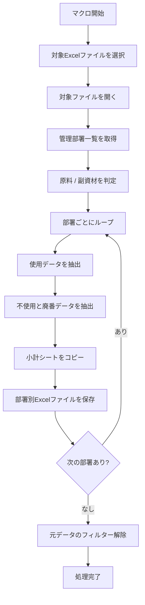
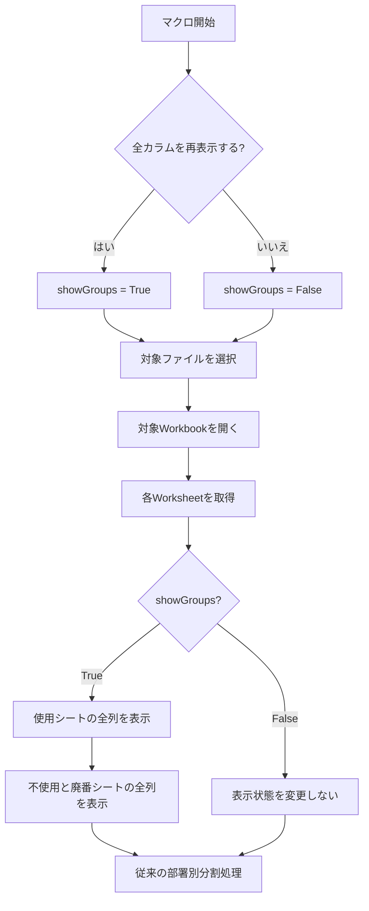

棚卸フォーマットを管理部署ごとのExcelファイルへ分割するVBA `CreateFilteredDepartmentFiles` の構造理解、外部ファイル対応、出力処理、全カラム再表示機能をまとめた記録です。

元の活動日時は確認できないため、実際の日付順ではなく、内容から推定した段階順に配置しています。後段に置いたコードを最終版候補として扱いますが、現在の環境では未検証です。完全に同一のコード断片だけは重複掲載を省略し、異なる版、失敗例、訂正、未解決事項は残しています。

## 記録の読み方

このノートは現在使う手順書ではなく、当時どのような課題を扱い、どのように設計やコードを変えていったかを残す活動記録です。記録間で判断が食い違う場合は、後段の記録を有力候補としつつ、矛盾そのものも経緯として残しています。

## 段階1：棚卸準備用VBAの整理まとめ

このチャットでは、棚卸業務の準備に使用するVBAについて、既存の部署別分割マクロを起点に、**外部Excelファイルを選択して処理する構成への変更、原料／副資材の判定、出力ファイル名の組み立て、シートコピー、テーブル化、命名方針**までを整理した。

全体としては、各部署の棚卸ファイルを一度結合し、必要な加工を行った後、再び各部署別ファイルへ分割するためのマクロ群を、1つのマクロブックにまとめる方向で検討している。

### 全体の目的と業務フロー

棚卸準備では、主に次の2つのマクロを使用する。

|マクロ名|役割|
|---|---|
|`CombineDepartmentFiles`|各部署ごとの棚卸ファイルを1つのファイルへ結合する|
|`CreateFilteredDepartmentFiles`|結合済みデータを「管理部署」でフィルターし、各部署ごとのExcelファイルへ再分割する|

これらを1つのマクロファイルにまとめる方針とした。


マクロファイル名については複数案を検討したが、最終的に機能を直接表現する

`InventoryDataCombinerSplitter`

という名称を採用した。

「Inventory Data」を「Combine」と「Split」するマクロであることが分かりやすく、用途にも合っている。

### 元となった `CreateFilteredDepartmentFiles`

最初に提示されたマクロは、マクロブック自身である `ThisWorkbook` の以下のシートを使用する構成だった。

- `管理部署一覧`
- `使用`
- `不使用と廃番`

処理は次の流れ。

1. `管理部署一覧` シートのA列から部署名を取得
2. `Collection` を使って部署名をユニーク化
3. `使用`、`不使用と廃番` シートのデータ範囲を取得
4. 各シートから「管理部署」列を検索
5. 部署ごとに新規Excelブックを作成
6. `AutoFilter` で対象部署だけに絞り込む
7. 可視セルを新規ブックへコピー
8. `棚卸表_原料_部署名.xlsx` の形式で保存

部署名のユニーク化では、次の仕組みを使用していた。

```vba
On Error Resume Next

For Each cell In rng
    If cell.Value <> "" Then
        departmentList.Add cell.Value, CStr(cell.Value)
    End If
Next cell

On Error GoTo 0
```

`Collection.Add` のキーに部署名を指定し、重複キーによるエラーを `On Error Resume Next` で無視することで、ユニークな部署一覧を作成している。

### 外部Excelファイルを選択して処理する構成

当初のコードでは、

```vba
ThisWorkbook.Sheets(...)
```

を参照していたが、実際にはマクロブックとは別にあるExcelファイルを選択し、そのファイルを基に分割処理したいという要件になった。

そのため、`Application.GetOpenFilename` を使う構成を検討した。

基本形は次のとおり。

```vba
Dim selectedFile As String
Dim selectedWorkbook As Workbook

selectedFile = Application.GetOpenFilename( _
    "Excel Files (*.xlsx), *.xlsx", _
    , _
    "エクセルファイルを選択してください")

If selectedFile = "False" Then
    MsgBox "ファイルが選択されませんでした。処理を終了します。", vbExclamation
    Exit Sub
End If

Set selectedWorkbook = Workbooks.Open(selectedFile)
```

以降は、

```vba
Set wsSourceUsage = selectedWorkbook.Sheets("使用")
Set wsSourceUnused = selectedWorkbook.Sheets("不使用と廃番")
```

のように、`selectedWorkbook` をデータソースとして使用する。

この変更によって、`InventoryDataCombinerSplitter.xlsm` 自体には実データを持たせず、処理対象ファイルを都度選択できる構成にできる。

### 「原料」「副資材」の自動判別

選択対象となるファイルは、例えば次の4種類。

|ファイル名|
|---|
|`棚卸フォーマット_石切_原料.xlsx`|
|`棚卸フォーマット_石切_副資材.xlsx`|
|`棚卸フォーマット_本社・６丁目_原料.xlsx`|
|`棚卸フォーマット_本社・６丁目_副資材.xlsx`|

ファイル名に必ず、

- `原料`
- `副資材`

のどちらかが含まれるため、その文字列からファイル種別を判定する方針とした。

判定結果は後で出力ファイル名に使うため、`fileType` に保存する。

```vba
Dim fileType As String
Dim posGenryo As Long
Dim posFukushizai As Long

posGenryo = InStr(selectedFile, "原料")
posFukushizai = InStr(selectedFile, "副資材")

If posGenryo > 0 Then
    fileType = "原料"

ElseIf posFukushizai > 0 Then
    fileType = "副資材"

Else
    MsgBox "選択されたファイル名に「原料」または「副資材」が含まれていません。", vbCritical
    Exit Sub
End If
```

`InStr` は、対象文字列の中で指定文字列が何文字目に存在するかを返す。

存在しない場合は `0`。

そのため、

```vba
If InStr(selectedFile, "原料") > 0 Then
```

のような判定も可能。

#### `posGenryo` の `pos`

`pos` は、

**position**

の略。

つまり、

```text
posGenryo
```

は「原料という文字列が存在する位置」という意味になる。

ただし、今回の目的は「位置そのもの」を後で使うわけではなく、存在判定だけなので、さらに簡略化して直接 `InStr` を条件式に書くこともできる。

例えば、

```vba
If InStr(selectedFile, "原料") > 0 Then
    fileType = "原料"
ElseIf InStr(selectedFile, "副資材") > 0 Then
    fileType = "副資材"
End If
```

でも成立する。

### 出力ファイル名への `fileType` 利用

判定した `fileType` は、部署別ファイルを保存するときに利用する。

```vba
.SaveAs fileName:=currentDirectory _
    & "\棚卸表_" _
    & fileType _
    & "_" _
    & departmentName _
    & ".xlsx"
```

例えば、

```text
fileType = 原料
departmentName = 石切
```

なら、

```text
棚卸表_原料_石切.xlsx
```

になる。

副資材なら、

```text
棚卸表_副資材_石切.xlsx
```

となる。



### `.xlsm` と `.xlsx` の `SaveAs`

次のコードは、マクロ有効ブック `.xlsm` 用。

```vba
destWorkbook.SaveAs destFileName, _
    FileFormat:=xlOpenXMLWorkbookMacroEnabled
```

通常の `.xlsx` として保存する場合は、

```vba
destWorkbook.SaveAs destFileName, _
    FileFormat:=xlOpenXMLWorkbook
```

とする。

対応関係は以下。

|保存形式|VBA定数|
|---|---|
|`.xlsx`|`xlOpenXMLWorkbook`|
|`.xlsm`|`xlOpenXMLWorkbookMacroEnabled`|

今回、部署ごとに生成する棚卸ファイルにはマクロを含める必要がないため、基本的には `.xlsx` が適切。

### 「管理部署」の英語名と変数名

「管理部署」の英訳として、

**Managing Department**

を候補とした。

ワークシート変数名について、

```vba
ws
```

だけでは意味が分かりにくい一方、

```vba
wsManagingDepartment
```

は少し長いのではないか、という検討を行った。

結論として、`wsManagingDepartment` 程度の長さは十分許容範囲。

VBAでは、短さよりも「何を示す変数なのか」が分かるほうが保守性が高い。

短縮する場合は、

```vba
wsDept
wsMngDept
```

なども候補。

ただし、現在のコードのように複数シートを扱う場合、

```vba
wsSourceUsage
wsSourceUnused
wsSourceSubtotal
```

といった明示的な名前のほうが、後からコードを読み返したときに理解しやすい。

### 「小計」シートのコピー

処理対象ブックから、

```vba
Set wsSourceSubtotal = selectedWorkbook.Sheets("小計")
```

として元の「小計」シートを取得する。

新規ブックにはすでに、

```vba
With newWorkbook
    .Sheets(1).Name = "小計"
    .Sheets.Add(After:=.Sheets("小計")).Name = "使用"
    .Sheets.Add(After:=.Sheets("使用")).Name = "不使用と廃番"
    .Sheets.Add(After:=.Sheets("不使用と廃番")).Name = "支給品"
End With
```

という構造を作る方針。

このとき、

```vba
newWorkbook.Sheet("小計") = wsSourceSubtotal
```

のような代入はVBAではできない。

既に存在する「小計」シートへ元シートの内容をコピーする場合は、

```vba
wsSourceSubtotal.Cells.Copy _
    Destination:=newWorkbook.Sheets("小計").Cells
```

とする。

全体では、

```vba
Set wsSourceSubtotal = selectedWorkbook.Sheets("小計")

With newWorkbook
    .Sheets(1).Name = "小計"

    wsSourceSubtotal.Cells.Copy _
        Destination:=.Sheets("小計").Cells

    .Sheets.Add(After:=.Sheets("小計")).Name = "使用"
    .Sheets.Add(After:=.Sheets("使用")).Name = "不使用と廃番"
    .Sheets.Add(After:=.Sheets("不使用と廃番")).Name = "支給品"

    .SaveAs fileName:=currentDirectory _
        & "\棚卸表_" _
        & fileType _
        & "_" _
        & departmentName _
        & ".xlsx"
End With
```

という形になる。

ただし、この方法は**セル内容をコピーする方法**であり、シートそのものを完全コピーする場合とは意味が異なる。

シートのタブ色、ページ設定、図形なども含めて完全に複製したい場合は、

```vba
wsSourceSubtotal.Copy
```

系の処理を使う必要がある。

今回の会話では、既に作成した「小計」シートへ中身を丸ごと移す方針として `Cells.Copy` を検討した。

### 部署別データのコピー

部署別分割では、各シートの「管理部署」列を `AutoFilter` で絞り込み、可視セルだけをコピーする。

#### 使用

```vba
sourceDataUsage.AutoFilter _
    Field:=colNumUsage, _
    Criteria1:=departmentName

sourceDataUsage.SpecialCells(xlCellTypeVisible).Copy _
    Destination:=newWorkbook.Sheets("使用").Range("A1")

wsSourceUsage.AutoFilterMode = False
```

#### 不使用と廃番

```vba
sourceDataUnused.AutoFilter _
    Field:=colNumUnused, _
    Criteria1:=departmentName

sourceDataUnused.SpecialCells(xlCellTypeVisible).Copy _
    Destination:=newWorkbook.Sheets("不使用と廃番").Range("A1")

wsSourceUnused.AutoFilterMode = False
```

#### 支給品

「支給品」については、該当列が存在する場合だけ処理する構成。

```vba
If colNumSupplies > 0 Then

    sourceDataSupplies.AutoFilter _
        Field:=colNumSupplies, _
        Criteria1:=departmentName

    sourceDataSupplies.SpecialCells(xlCellTypeVisible).Copy _
        Destination:=newWorkbook.Sheets("支給品").Range("A1")

End If
```

元コードではここで、

```vba
wsSourceUnused.AutoFilterMode = False
```

となっていたが、「支給品」をフィルターしているのであれば、本来は支給品側のシート変数、

```vba
wsSourceSupplies.AutoFilterMode = False
```

にするのが自然。

これは今後コードを完成させる際に修正したほうがよい箇所。

### コピーしたデータのテーブル化

コピーした各シートのデータを、通常のセル範囲ではなくExcelテーブル、つまり `ListObject` に変換する方法も検討した。

基本形は、

```vba
Set tblUsage = .ListObjects.Add( _
    xlSrcRange, _
    .Range("A1").CurrentRegion, _
    , _
    xlYes)
```

となる。

`xlYes` は「1行目をヘッダーとして扱う」という指定。

#### 使用

```vba
With newWorkbook.Sheets("使用")
    Dim tblUsage As ListObject

    Set tblUsage = .ListObjects.Add( _
        xlSrcRange, _
        .Range("A1").CurrentRegion, _
        , _
        xlYes)

    tblUsage.Name = "Table_Usage"
End With
```

#### 不使用と廃番

```vba
With newWorkbook.Sheets("不使用と廃番")
    Dim tblUnused As ListObject

    Set tblUnused = .ListObjects.Add( _
        xlSrcRange, _
        .Range("A1").CurrentRegion, _
        , _
        xlYes)

    tblUnused.Name = "Table_Unused"
End With
```

#### 支給品

```vba
With newWorkbook.Sheets("支給品")
    Dim tblSupplies As ListObject

    Set tblSupplies = .ListObjects.Add( _
        xlSrcRange, _
        .Range("A1").CurrentRegion, _
        , _
        xlYes)

    tblSupplies.Name = "Table_Supplies"
End With
```

### ヘッダーしかない場合の扱い

部署によっては、

```text
ヘッダーのみ
データ行なし
```

というケースが発生する可能性がある。

この場合でもExcelテーブル自体は作成可能だが、`CurrentRegion` やコピー後の範囲判定との組み合わせで想定外の挙動が起きないように注意する必要がある。

会話では、一旦「データ行が存在するときだけテーブル化する」案を検討した。

例えば、

```vba
If Application.WorksheetFunction.CountA( _
    .Range("A2:A" & .Cells(.Rows.Count, "A").End(xlUp).Row)) > 0 Then

    Set tblUsage = .ListObjects.Add( _
        xlSrcRange, _
        .Range("A1").CurrentRegion, _
        , _
        xlYes)

End If
```

ただし、この方式では**ヘッダーしかない場合はテーブル化しない**。

ユーザーの元の要望は、

> ヘッダーしかない1行の状態でもテーブル化したい

という方向なので、最終実装ではここを再検討する必要がある。

つまり、現在の論点は次の2案。

|方針|結果|
|---|---|
|データ行がある場合のみテーブル化|安全だが、ヘッダーだけの部署はテーブルにならない|
|ヘッダーだけでもテーブル化|出力形式を統一できるが、範囲指定を慎重に設計する必要あり|

棚卸ファイルとして構造を統一するなら、後者のほうが扱いやすい可能性が高い。

### `inventory_prep_macro` という名称

フォルダ名またはファイル名として、

```text
inventory_prep_macro
```

も検討した。

この名前からは、

- `inventory` = 在庫・棚卸
- `prep` = preparation、準備
- `macro` = マクロ

と読み取れるため、

**棚卸業務の事前準備を自動化するマクロ**

という意味に解釈できる。

特に、今回行っている、

- 部署別ファイルの結合
- データ加工
- 部署別ファイルへの再分割
- 棚卸用ファイル生成

といった作業をまとめるフォルダ名としては自然。

一方、

```text
InventoryDataCombinerSplitter.xlsm
```

は具体的なマクロブック名として適しており、

```text
inventory_prep_macro
```

はプロジェクトフォルダ名として使い分ける構成も分かりやすい。

例えば、

```text
inventory_prep_macro/
├─ InventoryDataCombinerSplitter.xlsm
├─ input/
├─ output/
└─ archive/
```

のような構成にできる。

### 現時点の構成イメージ

ここまでの内容をまとめると、`CreateFilteredDepartmentFiles` は最終的に次のような処理になる。



### 現時点で確定していること

- `CombineDepartmentFiles` と `CreateFilteredDepartmentFiles` を1つのマクロブックにまとめる。
- マクロブック名は **`InventoryDataCombinerSplitter`** を採用。
- 処理対象はマクロブック自身ではなく、ファイル選択ダイアログからExcelファイルを選ぶ構成にする。
- 選択ファイル名から `原料` / `副資材` を自動判別し、`fileType` に格納する。
- 出力ファイル名は概ね次の形式。
    - `棚卸表_原料_部署名.xlsx`
    - `棚卸表_副資材_部署名.xlsx`
- 出力形式は通常の `.xlsx` とし、`FileFormat:=xlOpenXMLWorkbook` を使用する。
- 出力ブックには少なくとも、
    - `小計`
    - `使用`
    - `不使用と廃番`
    - `支給品`  
        を用意する方向。
- 「小計」は元ファイルの `小計` シートをコピーする。
- 「使用」「不使用と廃番」「支給品」は管理部署でフィルターしてコピーする。
- コピー後のデータはExcelテーブル化する方向。

### 今後詰めたほうがよい点

現時点で未確定または修正候補なのは次の点。

- ヘッダーしか存在しない部署データも、必ずテーブルとして出力するか。
- テーブル名を、
    - `Table_Usage`
    - `Table_Unused`
    - `Table_Supplies`  
        のような英語名にするか、元の棚卸テーブル名に合わせるか。
- `小計` シートについて、単純に `Cells.Copy` するのか、シートそのものを完全コピーするのか。
- `支給品` のフィルター解除部分にある
    ```vba
    wsSourceUnused.AutoFilterMode = False
    ```
    は、`wsSourceSupplies` に修正する必要がある可能性が高い。
- 保存先を `ThisWorkbook.Path` とするのか、選択したファイルと同じフォルダにするのか。
- 既存ファイルと同名になった場合の上書き制御。
- `原料` と `副資材` でシート構成やテーブル名が異なる場合の分岐設計。

今回の設計は、単なる「部署別ファイル分割マクロ」から、**棚卸準備全体を担う `InventoryDataCombinerSplitter` という独立したマクロツール**へ発展している。今後は、この内容を基準に `CreateFilteredDepartmentFiles` の完成版コードへ整理していくのが自然です。

## 段階2：`CreateFilteredDepartmentFiles` VBAの整理・詳細まとめ

以下に、このチャットで扱った内容を、VBAの目的・処理構造・各変数の役割・注意点まで含めて整理します。


### 1. このVBAの目的

今回確認した `CreateFilteredDepartmentFiles` マクロは、棚卸用の元Excelファイルを選択し、その中にある「管理部署」情報を基準として、**部署ごとにデータを分割したExcelファイルを自動生成する処理**です。

対象となる主なシートは次の5つです。

|シート名|役割|
|---|---|
|管理部署|分割対象となる部署名の一覧を取得する|
|使用|使用中の棚卸データ|
|不使用と廃番|不使用品・廃番品の棚卸データ|
|支給品|支給品の棚卸データ|
|小計|各部署ファイルにそのままコピーする小計用シート|

元ファイルから「管理部署」ごとにデータを抽出し、最終的に次のようなファイルを部署単位で作成します。

```text
棚卸表_原料_○○部.xlsx
棚卸表_副資材_○○部.xlsx
```

ファイルが「原料」か「副資材」かは、ユーザーが選択した元ファイルのファイル名から自動判定します。

---

### 2. 全体の処理フロー

マクロ全体は、概ね次の順番で処理されています。



---

### 3. ファイル選択と対象ブックの取得

最初に、次のコードでExcelファイルをユーザーに選択させます。

```vba
selectedFile = Application.GetOpenFilename( _
    "Excel Files (*.xlsx), *.xlsx", , _
    "エクセルファイルを選択してください")
```

キャンセルした場合は `"False"` が返るため、処理を終了します。

```vba
If selectedFile = "False" Then
    MsgBox "ファイルが選択されませんでした。処理を終了します。", vbExclamation
    Exit Sub
End If
```

選択したファイルは次のコードで開きます。

```vba
Set selectedWorkbook = Workbooks.Open(selectedFile)
```

---

### 4. 対象シートの設定

開いたブックから、次の5シートを取得しています。

```vba
Set wsMngDept = selectedWorkbook.Sheets("管理部署")
Set wsSourceUsage = selectedWorkbook.Sheets("使用")
Set wsSourceUnused = selectedWorkbook.Sheets("不使用と廃番")
Set wsSourceSupplies = selectedWorkbook.Sheets("支給品")
Set wsSourceSubtotal = selectedWorkbook.Sheets("小計")
```

したがって、このVBAを実行する対象ブックには、これらのシート名が正確に存在することが前提です。

---

### 5. 部署一覧の取得

部署一覧は「管理部署」シートの **C列** から取得しています。

```vba
Set rng = wsMngDept.Range( _
    "C2:C" & wsMngDept.Cells(wsMngDept.Rows.Count, "C").End(xlUp).Row)
```

つまり、

```text
C1：ヘッダー
C2以降：部署名
```

という構造を前提としています。

#### 重複部署の除外

部署名は `Collection` に格納しています。

```vba
Set departmentList = New Collection
```

その際、部署名自身をキーとして登録します。

```vba
departmentList.Add cell.Value, CStr(cell.Value)
```

`Collection` では同じキーを重複登録できません。

そのエラーを、

```vba
On Error Resume Next
```

で無視することで、結果的に**ユニークな部署名だけを取得する仕組み**になっています。

イメージとして、

```text
営業部
製造部
営業部
品質保証部
製造部
```

というデータがあれば、最終的な `departmentList` は、

```text
営業部
製造部
品質保証部
```

となります。

---

### 6. 出力先フォルダ

出力先は、選択した元ファイルの場所ではありません。

次のコードになっています。

```vba
currentDirectory = ThisWorkbook.Path
```

`ThisWorkbook` は、**このVBAコードが保存されているマクロブック**を意味します。

したがって、生成される棚卸表は、

> マクロブックが保存されているフォルダ

に作成されます。

---

### 7. 元データ範囲の取得

「使用」「不使用と廃番」「支給品」のデータ範囲は、それぞれ `A1.CurrentRegion` で取得しています。

```vba
Set sourceDataUsage = wsSourceUsage.Range("A1").CurrentRegion
Set sourceDataUnused = wsSourceUnused.Range("A1").CurrentRegion
Set sourceDataSupplies = wsSourceSupplies.Range("A1").CurrentRegion
```

`CurrentRegion` は、A1を含む連続した表形式の範囲を取得する機能です。

そのため、途中に完全な空白行・空白列が存在すると、そこでデータ範囲が途切れる可能性があります。

---

### 8. 「管理部署」列の検索

各データシートの1行目から、

```text
管理部署
```

という見出しを検索しています。

```vba
colNumUsage = wsSourceUsage.Rows(1).Find( _
    What:="管理部署", _
    LookIn:=xlValues, _
    LookAt:=xlWhole).Column
```

同様に、

- 使用
- 不使用と廃番
- 支給品

について列番号を取得しています。

#### 初期値

検索前に、

```vba
colNumUsage = 0
colNumUnused = 0
colNumSupplies = 0
```

としています。

検索できなかった場合は `0` のまま残ります。

---

### 9. 管理部署列の存在チェック

現在のコードでは、

```vba
If colNumUsage = 0 Or colNumUnused = 0 Then
```

となっているため、

- 使用
- 不使用と廃番

のどちらかに「管理部署」列がなければ処理終了します。

一方で、

```text
支給品
```

については必須扱いではありません。

これは後段で、

```vba
If colNumSupplies > 0 Then
```

としているためです。

つまり設計上、

|シート|管理部署列|
|---|---|
|使用|必須|
|不使用と廃番|必須|
|支給品|任意|

となっています。

---

### 10. 原料・副資材の判定

選択されたファイルのパス文字列に、

```text
原料
副資材
```

のどちらが含まれているかを `InStr` で調べています。

```vba
posGenryo = InStr(selectedFile, "原料")
posFukushizai = InStr(selectedFile, "副資材")
```

その結果、

```vba
If posGenryo > 0 Then
    fileType = "原料"
ElseIf posFukushizai > 0 Then
    fileType = "副資材"
```

としています。

どちらも含まれていなければ、

```text
選択されたファイル名に「原料」または「副資材」が含まれていません。
```

というメッセージを表示して処理終了します。

厳密には `selectedFile` にはフルパスが入るため、判定対象はファイル名だけでなくパス全体です。

---

### 11. 部署ごとの新規ブック作成

取得した部署一覧を、

```vba
For Each departmentName In departmentList
```

で順番に処理します。

部署ごとに、

```vba
Set newWorkbook = Workbooks.Add
```

として新規Excelブックを作ります。

作成するシートは4枚です。

```text
小計
使用
不使用と廃番
支給品
```

順番もこの順序です。

```vba
.Sheets(1).Name = "小計"
.Sheets.Add(After:=.Sheets("小計")).Name = "使用"
.Sheets.Add(After:=.Sheets("使用")).Name = "不使用と廃番"
.Sheets.Add(After:=.Sheets("不使用と廃番")).Name = "支給品"
```

---

### 12. 出力ファイル名

新規ブックは次の形式で保存します。

```vba
.SaveAs fileName:= _
    currentDirectory & _
    "\棚卸表_" & _
    fileType & "_" & _
    departmentName & ".xlsx"
```

例えば、

```text
fileType = 副資材
departmentName = 製造部
```

なら、

```text
棚卸表_副資材_製造部.xlsx
```

になります。

---

### 13. 「使用」シートの処理

まず元の「使用」データを、対象部署でAutoFilterします。

```vba
sourceDataUsage.AutoFilter _
    Field:=colNumUsage, _
    Criteria1:=departmentName
```

その後、フィルター後に表示されているセルだけをコピーします。

```vba
sourceDataUsage.SpecialCells(xlCellTypeVisible).Copy _
    Destination:=newWorkbook.Sheets("使用").Range("A1")
```

コピー後は元シートのフィルターを解除します。

```vba
wsSourceUsage.AutoFilterMode = False
```

---

### 14. コピー後のテーブル化

コピーしたデータはExcelテーブル、すなわち `ListObject` に変換しています。

```vba
Set tblUsage = .ListObjects.Add( _
    xlSrcRange, _
    .Range("A1").CurrentRegion, _
    , xlYes)
```

テーブル名は、

```vba
tblUsage.Name = "棚卸表_" & fileType & "_使用"
```

となります。

例えば副資材なら、

```text
棚卸表_副資材_使用
```

です。

---

### 15. 「不使用と廃番」シートの処理

処理方法は「使用」と同じです。

#### フィルター

```vba
sourceDataUnused.AutoFilter _
    Field:=colNumUnused, _
    Criteria1:=departmentName
```

#### コピー

```vba
sourceDataUnused.SpecialCells(xlCellTypeVisible).Copy _
    Destination:=newWorkbook.Sheets("不使用と廃番").Range("A1")
```

#### テーブル化

テーブル名は、

```text
棚卸表_原料_不使用と廃番
```

または、

```text
棚卸表_副資材_不使用と廃番
```

となります。

---

### 16. 「支給品」シートの処理

今回のコードでは「支給品」処理が追加されています。

ただし、

```vba
If colNumSupplies > 0 Then
```

となっているため、「支給品」に「管理部署」列が存在する場合だけ処理します。

処理内容は、

1. 部署でフィルター
2. 表示データをコピー
3. Excelテーブル化

という流れです。

テーブル名は、

```vba
tblSupplies.Name = "棚卸表_" & fileType & "_支給品"
```

となるため、例えば、

```text
棚卸表_副資材_支給品
```

です。

---

### 17. 「小計」シートのコピー

「小計」だけは部署でフィルターせず、元シート全体をそのままコピーします。

> 同一のコード断片は前段階に記録済みのため、重複掲載を省略。

そのため、すべての部署ファイルに同じ「小計」シート内容が入ります。

---

### 18. 部署ファイルの保存・終了

1部署分の処理が終了すると、

```vba
newWorkbook.Close SaveChanges:=True
```

によって保存して閉じます。

その後、

```vba
Next departmentName
```

で次の部署に移ります。

したがって、部署が5つ存在すれば5ファイルが作られます。

---

### 19. 最終的なフィルター解除

すべての部署処理終了後、元データ側にフィルター状態が残っていた場合に備えて、

```vba
If wsSourceUsage.FilterMode Then wsSourceUsage.ShowAllData
If wsSourceUnused.FilterMode Then wsSourceUnused.ShowAllData
If wsSourceSupplies.FilterMode Then wsSourceSupplies.ShowAllData
```

を実行しています。

この部分は、

```vba
On Error Resume Next
```

でエラーを無視する構造です。

---

### 20. 完了通知

最後に、

```vba
MsgBox "すべての部署のフィルタリングされたデータが現在のディレクトリに作成されました。"
```

と表示して終了します。

---

### 21. 主要変数の整理

|変数|型|用途|
|---|---|---|
|`selectedFile`|String|ユーザーが選択したファイルパス|
|`selectedWorkbook`|Workbook|選択した元ブック|
|`wsMngDept`|Worksheet|管理部署シート|
|`wsSourceUsage`|Worksheet|使用シート|
|`wsSourceUnused`|Worksheet|不使用と廃番シート|
|`wsSourceSupplies`|Worksheet|支給品シート|
|`wsSourceSubtotal`|Worksheet|小計シート|
|`rng`|Range|管理部署一覧の範囲|
|`cell`|Range|部署一覧を走査する各セル|
|`departmentList`|Collection|重複を除いた部署一覧|
|`departmentName`|Variant|現在処理中の部署名|
|`newWorkbook`|Workbook|部署別出力ブック|
|`currentDirectory`|String|出力先フォルダ|
|`sourceDataUsage`|Range|使用データ全体|
|`sourceDataUnused`|Range|不使用と廃番データ全体|
|`sourceDataSupplies`|Range|支給品データ全体|
|`colNumUsage`|Long|使用の管理部署列番号|
|`colNumUnused`|Long|不使用と廃番の管理部署列番号|
|`colNumSupplies`|Long|支給品の管理部署列番号|
|`fileType`|String|原料／副資材|
|`posGenryo`|Long|「原料」の検索位置|
|`posFukushizai`|Long|「副資材」の検索位置|
|`tblUsage`|ListObject|使用シートのExcelテーブル|
|`tblUnused`|ListObject|不使用と廃番のExcelテーブル|
|`tblSupplies`|ListObject|支給品のExcelテーブル|

---

### 22. このVBAの入力と出力

構造を単純化すると、次のようになります。



つまり、このVBAの本質は、

> **1つの棚卸マスターファイルを、「管理部署」をキーとして複数の部署別棚卸ファイルへ分割する処理**

です。

---

### 23. 現在のコードで確認できる注意点

コードを理解するうえで、いくつか留意すべき点があります。

#### 支給品のフィルター解除先

支給品をコピーした直後に、

```vba
wsSourceUnused.AutoFilterMode = False
```

となっています。

しかし、直前にフィルターしているのは、

```vba
sourceDataSupplies.AutoFilter
```

です。

したがって、意図としては、

```vba
wsSourceSupplies.AutoFilterMode = False
```

である可能性が高い箇所です。

これはコードの動作確認・修正を行う場合に確認すべきポイントです。

#### 「支給品」シート自体は必須

「管理部署」列については任意扱いですが、

```vba
Set wsSourceSupplies = selectedWorkbook.Sheets("支給品")
```

を無条件で実行しています。

そのため、「支給品」シートそのものが存在しない場合は、その時点で実行時エラーになります。

つまり現在のコードは、

- 支給品シート：必須
- 支給品の「管理部署」列：任意

という構造です。

#### 元ブックを閉じていない

最後まで、

```vba
selectedWorkbook.Close
```

は実行していません。

したがって、処理終了後も元の選択ブックは開いたままになります。

#### 同名ファイルが既に存在する場合

`.SaveAs` の前に同名ファイルの存在確認を行っていません。

そのため既存ファイルがある場合、Excel側の上書き確認やエラー等が発生する可能性があります。

#### 部署名がファイル名として使用される

部署名をそのまま、

```text
棚卸表_○○_部署名.xlsx
```

に利用します。

したがって部署名に、

```text
\
/
:
*
?
"
<
>
|
```

などWindowsファイル名で使用できない文字が含まれている場合は問題になります。

---

### 24. このチャットで確認した結論

今回のチャットでは、このVBAを変更するのではなく、まず既存コードの処理内容を理解することを目的として確認しました。

理解した処理は次の通りです。

1. ユーザーが棚卸用Excelファイルを選択する。
2. 「管理部署」シートC列からユニークな部署一覧を作る。
3. 「使用」「不使用と廃番」「支給品」の各データから「管理部署」列を探す。
4. 選択ファイルのパスに含まれる「原料」「副資材」からファイル種別を判定する。
5. 部署ごとに新規Excelブックを作る。
6. 新規ブックには「小計」「使用」「不使用と廃番」「支給品」の4シートを用意する。
7. 「使用」「不使用と廃番」「支給品」は各部署でフィルタリングしてコピーする。
8. コピーした各データをExcelテーブル化する。
9. 「小計」はフィルタせず、そのままコピーする。
10. `棚卸表_原料または副資材_部署名.xlsx` という名称でマクロブックと同じフォルダへ保存する。
11. 全部署分のファイルを作成して処理を終了する。

現時点では**コードの理解・構造整理までを行っており、コード自体の修正・リファクタリングはまだ実施していません**。

特に今後コードを修正する場合は、`支給品` のフィルター解除先が `wsSourceUnused` になっている点は最初に確認すべき箇所です。

## 段階3：CreateFilteredDepartmentFiles：部署別棚卸表の分割処理と「全カラム再表示」機能の追加まとめ

### 1. マクロの目的

対象となったVBAは `CreateFilteredDepartmentFiles`。

このマクロの役割は、**原料または副資材の棚卸データを「管理部署」単位に分割し、部署ごとのExcelファイルとして出力すること**。

大きな処理フローは次のとおり。



今回、この既存処理に対して、**コピー元で非表示になっている列をコピー前に再表示するか選択できる機能**を追加することになった。

---

### 2. 元の `CreateFilteredDepartmentFiles` の構成

#### 入力ファイル

初期フォルダとして次を指定している。

```text
C:\Users\kyoupatty029\projects\kpm\dev\internal_systems\inventory_prep_macro\test_files
```

`Application.GetOpenFilename` によって、ユーザーが `.xlsx` ファイルを選択する。

キャンセルした場合は処理終了。

#### 使用するシート

選択したExcelファイルから次の4シートを取得する。

|シート|用途|
|---|---|
|`管理部署`|分割対象となる部署一覧の取得|
|`使用`|使用中の棚卸データ|
|`不使用と廃番`|不使用・廃番データ|
|`小計`|部署別ファイルへコピーする小計シート|

対応するWorksheet変数は以下。

```vba
wsMngDept
wsSourceUsage
wsSourceUnused
wsSourceSubtotal
```

---

### 3. 管理部署一覧の取得

`管理部署` シートのC列から部署名を取得する。

```vba
Set rng = wsMngDept.Range("C2:C" & wsMngDept.Cells(wsMngDept.Rows.Count, "C").End(xlUp).Row)
```

その後、`Collection` を使って重複を除外する。

```vba
Set departmentList = New Collection

For Each cell In rng
    On Error Resume Next
    departmentList.Add cell.Value, CStr(cell.Value)
    On Error GoTo 0
Next cell
```

同じ部署名をキーとして再度Collectionへ追加するとエラーになる性質を利用し、`On Error Resume Next` で重複を無視している。

結果として、

```text
管理部署シート
    ↓
C列から部署名取得
    ↓
重複除去
    ↓
departmentList
```

という構造になる。

---

### 4. 「使用」「不使用と廃番」のデータ範囲取得

それぞれ `A1` を起点として `CurrentRegion` でデータ範囲を取得する。

```vba
Set sourceDataUsage = wsSourceUsage.Range("A1").CurrentRegion
Set sourceDataUnused = wsSourceUnused.Range("A1").CurrentRegion
```

さらに、各シートの1行目から `"管理部署"` というヘッダーを検索し、AutoFilterで使用する列番号を取得する。

```vba
colNumUsage = wsSourceUsage.Rows(1).Find( _
    What:="管理部署", _
    LookIn:=xlValues, _
    LookAt:=xlWhole _
).Column

colNumUnused = wsSourceUnused.Rows(1).Find( _
    What:="管理部署", _
    LookIn:=xlValues, _
    LookAt:=xlWhole _
).Column
```

この列番号を後の部署別フィルタリングに使用する。

---

### 5. 原料・副資材の判定

選択されたブックの**ファイル名**によって種類を判定する。

```vba
If InStr(selectedWorkbook.Name, "原料") > 0 Then
    fileType = "原料"
ElseIf InStr(selectedWorkbook.Name, "副資材") > 0 Then
    fileType = "副資材"
Else
    MsgBox "選択されたファイル名に「原料」または「副資材」が含まれていません。", vbCritical
    Exit Sub
End If
```

つまりファイル名には、

- `原料`
- `副資材`

のどちらかが含まれている必要がある。

この `fileType` は後で、

- テーブル名
- 出力ファイル名

の生成に利用する。

---

### 6. 部署ごとのExcelファイル作成

`departmentList` に登録された部署について順番に処理する。

> 同一のコード断片は前段階に記録済みのため、重複掲載を省略。

部署ごとに新規Workbookを作成し、

```text
小計
使用
不使用と廃番
```

の3シートを用意する。

```vba
Set newWorkbook = Workbooks.Add

With newWorkbook
    .Sheets(1).Name = "小計"
    .Sheets.Add(After:=.Sheets("小計")).Name = "使用"
    .Sheets.Add(After:=.Sheets("使用")).Name = "不使用と廃番"
End With
```

---

### 7. 「使用」データの部署別抽出

コピー元の「使用」シートを、現在処理している部署名でフィルタリングする。

> 同一のコード断片は前段階に記録済みのため、重複掲載を省略。

表示されているセルだけを新規Workbookへコピーする。

> 同一のコード断片は前段階に記録済みのため、重複掲載を省略。

その後、コピーされたデータをExcelテーブル化する。

```vba
With newWorkbook.Sheets("使用")
    .ListObjects.Add( _
        xlSrcRange, _
        .Range("A1").CurrentRegion, _
        , _
        xlYes _
    ).Name = "棚卸表_" & fileType & "_使用"
End With
```

したがってテーブル名は、例えば、

```text
棚卸表_原料_使用
棚卸表_副資材_使用
```

となる。

---

### 8. 「不使用と廃番」データの部署別抽出

基本構造は「使用」と同じ。

> 同一のコード断片は前段階に記録済みのため、重複掲載を省略。

可視セルだけをコピー。

> 同一のコード断片は前段階に記録済みのため、重複掲載を省略。

コピー後にテーブル化する。

テーブル名は、

```text
棚卸表_原料_不使用と廃番
```

または

```text
棚卸表_副資材_不使用と廃番
```

となる。

---

### 9. 「小計」シートのコピー

「小計」については部署別フィルタリングを行わず、元シート全体をコピーする。

> 同一のコード断片は前段階に記録済みのため、重複掲載を省略。

最終的な部署別ファイルは次の構成になる。

|シート|内容|
|---|---|
|小計|コピー元の小計シート|
|使用|該当部署のみ|
|不使用と廃番|該当部署のみ|

---

### 10. ファイル保存

保存先は、

```vba
ThisWorkbook.Path
```

つまり、**このVBAマクロが格納されているWorkbookと同じフォルダ**。

ファイル名は、

```vba
fileType & "_" & departmentName & ".xlsx"
```

となる。

例えば、

```text
原料_製造部.xlsx
原料_研究部.xlsx
副資材_製造部.xlsx
副資材_品質管理部.xlsx
```

のような形式になる。

保存後、その部署のWorkbookを閉じて次の部署へ進む。

---

### 11. 今回追加した要件

今回、新たに次の仕様を追加することになった。

> 「使用」と「不使用と廃番」シートをコピーするとき、コピー元でグループ化されている列を再表示してからコピーするか選択したい。

具体的な要件は2点。

1. **コピー元ファイルを選択・読み込む前に、全カラムを再表示するか確認する**
2. **「はい」を選択した場合、ファイル読み込み後に「使用」「不使用と廃番」の全カラムを表示状態にする**

処理順としては次のようになった。



---

### 12. 確認ダイアログの追加

新しく次の変数を追加した。

```vba
Dim userResponse As Integer
Dim showGroups As Boolean
```

ファイル選択ダイアログより前に次を実行する。

```vba
userResponse = MsgBox( _
    "コピー元のグループ化を再表示しますか？", _
    vbYesNo + vbQuestion, _
    "グループ化の解除" _
)

showGroups = (userResponse = vbYes)
```

ユーザーの選択結果は次のように保持される。

|選択|`showGroups`|
|---|--:|
|はい|`True`|
|いいえ|`False`|

これにより、ファイルをまだ開いていない段階で動作方針を決定できる。

---

### 13. ファイル読み込み後の全カラム再表示

対象Workbookを開き、

> 同一のコード断片は前段階に記録済みのため、重複掲載を省略。

まで完了した後、次の処理を追加した。

```vba
If showGroups Then
    wsSourceUsage.Cells.EntireColumn.Hidden = False
    wsSourceUnused.Cells.EntireColumn.Hidden = False
End If
```

したがって、「はい」を選択すると、

```text
使用
├─ 表示列
├─ 非表示列 → 表示
└─ 非表示列 → 表示

不使用と廃番
├─ 表示列
├─ 非表示列 → 表示
└─ 非表示列 → 表示
```

となってから、その後のコピー処理へ進む。

「いいえ」なら、この処理自体をスキップする。

---

### 14. 今回の変更で維持されているもの

今回の修正は、既存の部署別分割ロジック自体には手を加えていない。

|処理|変更|
|---|---|
|対象ファイル選択|基本変更なし|
|管理部署一覧取得|変更なし|
|原料／副資材判定|変更なし|
|部署別AutoFilter|変更なし|
|使用データコピー|変更なし|
|不使用と廃番データコピー|変更なし|
|小計コピー|変更なし|
|Excelテーブル化|変更なし|
|ファイル名生成|変更なし|
|保存先|変更なし|
|**コピー前の列表示状態**|**今回追加**|

つまり、今回の変更は既存処理の前段に、

```text
「全列を表示するか？」
        ↓
     はい / いいえ
        ↓
必要なら全列を表示
        ↓
従来処理
```

というオプションを追加したもの。

---

### 15. 技術的に注意すべき点

今回の実装について、一点だけ整理しておく必要がある。

ユーザーの要望では「**グループ化されているのを再表示**」となっているが、実際に追加したコードは、

```vba
wsSourceUsage.Cells.EntireColumn.Hidden = False
wsSourceUnused.Cells.EntireColumn.Hidden = False
```

である。

これは厳密には**アウトライン（グループ）の展開だけを行っているのではなく、非表示列をすべて表示する処理**。

したがって、

- グループ化によって折りたたまれている列
- ユーザーが手動で非表示にした列

を区別せず、両方とも表示する。

今回の要求にある「**全カラムを再表示した状態にする**」という最終状態には合致するが、「グループだけを展開し、手動非表示列はそのまま」という意味であれば別実装が必要になる。

また、現在のコードではコピー元Workbookそのものの列表示状態を変更する。そのWorkbookを明示的に保存してはいないため通常は元ファイルへ保存されないが、**コピー処理だけの一時的な表示制御に限定したいのであれば、処理終了時に元の表示状態へ戻す設計も検討余地がある**。

---

### 16. 現時点の仕様

最終的な `CreateFilteredDepartmentFiles` の役割は次のように整理できる。

> 原料／副資材の統合済み棚卸表を読み込み、「管理部署」シートに登録された部署単位で「使用」「不使用と廃番」をフィルタリングし、「小計」と合わせて部署別Excelファイルを生成する。処理開始時には、「使用」「不使用と廃番」の非表示列をすべて表示してから分割処理を行うかをユーザーが選択できる。

今回決定した追加仕様は、**対象ファイル選択前に確認 → 「はい」なら対象Workbookを開いた直後に「使用」「不使用と廃番」の全列を表示 → 従来の部署別分割処理を実行**、という流れである。

## 統合元ファイル

- 「棚卸準備用VBAの整理まとめ.md」
- 「`CreateFilteredDepartmentFiles` VBAの整理・詳細まとめ.md」
- 「CreateFilteredDepartmentFiles：部署別棚卸表の分割処理と「全カラム再表示」機能の追加まとめ.md」
