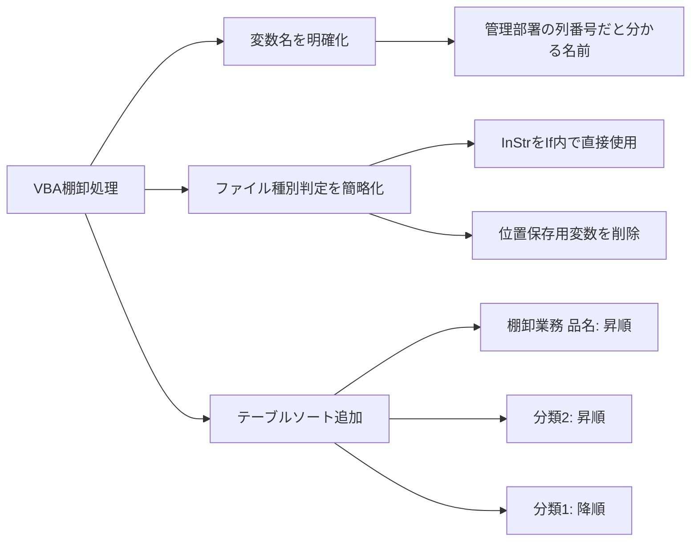
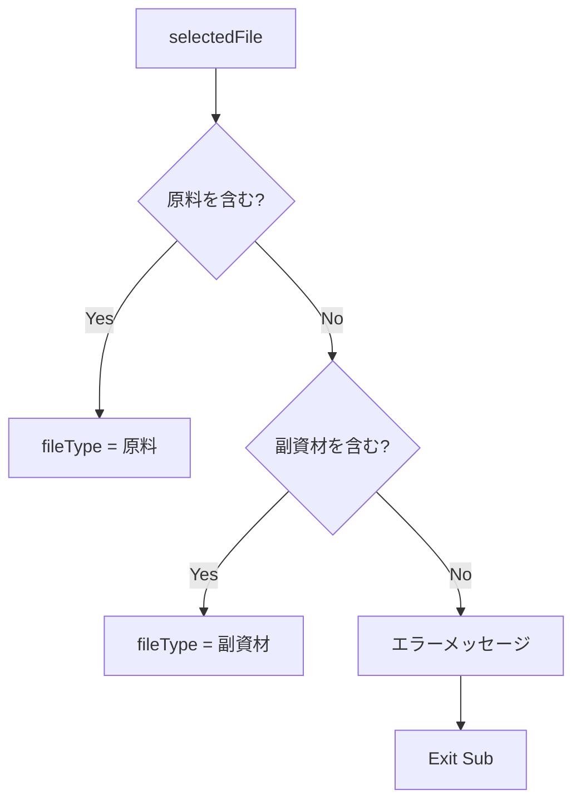
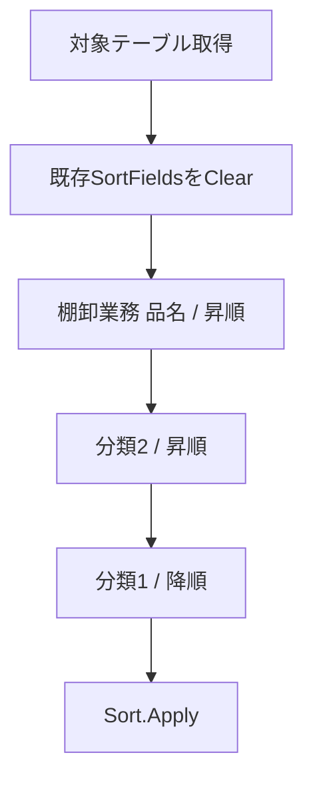
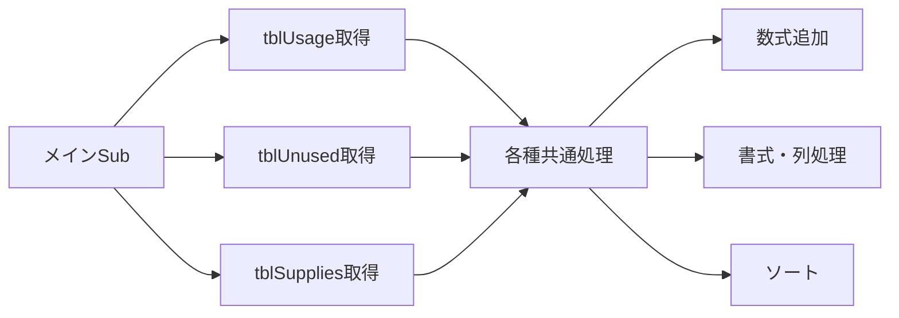

以下に、このチャット全体の内容を、VBA修正の目的・判断・コード・注意点まで含めて整理します。


## 1. このチャットで行ったこと

今回のやり取りでは、棚卸関連VBAについて主に次の3点を整理・修正した。

- 「管理部署」の列番号を保持する変数名を、用途が分かる名称へ変更
- 「原料」「副資材」のファイル種別判定で不要になった位置取得用変数を削除
- 副資材の2つのExcelテーブルに対して、複数列を優先順位付きでソートする処理を検討

全体として、**コードを読んだだけで変数の用途や処理内容が分かるようにしつつ、不要な変数を減らして簡潔化する**方向で整理した。



## 2. 「管理部署」列番号を保持する変数名の修正

### 修正前

```vba
Dim colNumUsage As Long              ' "使用"シートの管理部署列番号
Dim colNumUnused As Long             ' "不使用と廃番"シートの管理部署列番号
Dim colNumSupplies As Long           ' "支給品"シートの管理部署列番号
```

この名称では、

- `colNumUsage`
- `colNumUnused`
- `colNumSupplies`

という名前だけを見ても、**何の列番号なのかが分からない**という問題があった。

そのため、「管理部署」を示す `MgmtDept` を変数名に含める形を提案した。

### 修正案

```vba
Dim colNumMgmtDeptUsage As Long      ' "使用"シートの管理部署列番号
Dim colNumMgmtDeptUnused As Long     ' "不使用と廃番"シートの管理部署列番号
Dim colNumMgmtDeptSupplies As Long   ' "支給品"シートの管理部署列番号
```

|変数|内容|
|---|---|
|`colNumMgmtDeptUsage`|「使用」シートの「管理部署」列番号|
|`colNumMgmtDeptUnused`|「不使用と廃番」シートの「管理部署」列番号|
|`colNumMgmtDeptSupplies`|「支給品」シートの「管理部署」列番号|

`MgmtDept` は `Management Department` の省略として使用している。

この変更により、コードの他の部分から変数を参照した場合でも、**「管理部署の列番号を表している変数」であることが名前だけで判断できる**ようになる。

---

## 3. 「原料」「副資材」の位置取得用変数を英語化

当初は次の変数が存在していた。

```vba
Dim posGenryo As Long                ' "原料" の位置を保存
Dim posFukushizai As Long            ' "副資材" の位置を保存
```

これらについて、日本語ローマ字表記ではなく英語に変更したいという要望があった。

### 提案した変数名

```vba
Dim posRawMaterial As Long           ' Position of "原料" (Raw Material)
Dim posSubMaterial As Long           ' Position of "副資材" (Sub Material)
```

対応関係は次のとおり。

|日本語|英語|変数|
|---|---|---|
|原料|Raw Material|`posRawMaterial`|
|副資材|Sub Material|`posSubMaterial`|

ただし、その後のコード整理によって、**この2つの変数自体を使わなくてもよいことが確認された**。

---

## 4. ファイル種別判定処理の簡略化

元のコードでは、まず `InStr` の結果を変数に保存し、その変数を使ってファイル種別を判定していた。

### 修正前

```vba
' "原料" または "副資材" を含むかを確認
posRawMaterial = InStr(selectedFile, "原料")
posSubMaterial = InStr(selectedFile, "副資材")

' ファイルタイプを判別
If posRawMaterial > 0 Then
    fileType = "原料"
ElseIf posSubMaterial > 0 Then
    fileType = "副資材"
Else
    MsgBox "選択されたファイル名に「原料」または「副資材」が含まれていません。", vbCritical
    Exit Sub
End If
```

`InStr` は、検索対象文字列が見つかった場合にはその開始位置を返し、見つからなければ `0` を返す。

今回必要なのは文字列の「位置」そのものではなく、**含まれているかどうかだけ**である。

したがって、変数への代入を省略して `If` の条件式で直接判定する形に変更できる。

### 修正後

```vba
' ファイルタイプを判別
If InStr(selectedFile, "原料") > 0 Then
    fileType = "原料"
ElseIf InStr(selectedFile, "副資材") > 0 Then
    fileType = "副資材"
Else
    MsgBox "選択されたファイル名に「原料」または「副資材」が含まれていません。", vbCritical
    Exit Sub
End If
```

この修正後のコードでも正常に動作する。

### 判定フロー



この変更によって、次の変数は不要になる。

```vba
Dim posRawMaterial As Long
Dim posSubMaterial As Long
```

したがって、ファイル種別判定以外で使用していなければ、宣言自体を削除できる。

### 修正の考え方

今回のように、

```vba
value = Function(...)
If value > 0 Then
```

という処理で `value` を後続処理で一切使わないのであれば、

```vba
If Function(...) > 0 Then
```

と直接判定した方が簡潔である。

ただし、検索位置そのものを後で利用する場合は、変数に保存する元の方法にも意味がある。

---

## 5. 副資材テーブルのソート要件

次に、以下の2つのExcelテーブルについて、特定列を複数条件でソートしたいという要件があった。

### 対象テーブル

```text
棚卸表_副資材_使用
棚卸表_副資材_不使用と廃番
```

### ソート条件

|優先順位|列名|ソート方向|
|--:|---|---|
|1|棚卸業務 品名|昇順|
|2|分類2|昇順|
|3|分類1|降順|

ここで重要なのは、この3つを個別に順番にソートするのではなく、**Excelの複数キーソートとして一度に指定すること**。

すなわち、並び順は概念的には次のようになる。

```text
棚卸業務 品名 ↑
    └─ 同じ品名の中で 分類2 ↑
          └─ 同じ分類2の中で 分類1 ↓
```

---

## 6. 提案したソート処理

当初、以下のようなコードを提案した。

```vba
Sub SortTables()
    Dim ws As Worksheet
    Dim tbl As ListObject
    Dim tableNames As Variant
    Dim i As Integer

    ' ソートするテーブル名のリスト
    tableNames = Array("棚卸表_副資材_使用", "棚卸表_副資材_不使用と廃番")

    ' 各テーブルごとにソート処理を実行
    For i = LBound(tableNames) To UBound(tableNames)
        ' 現在のシートを設定
        Set ws = ActiveSheet
        ' テーブルオブジェクトを取得
        Set tbl = ws.ListObjects(tableNames(i))

        ' テーブルが見つからない場合のエラーチェック
        If tbl Is Nothing Then
            MsgBox "テーブル '" & tableNames(i) & "' が見つかりません。", vbCritical
            Exit Sub
        End If

        ' ソート条件をクリア
        tbl.Sort.SortFields.Clear

        ' 「棚卸業務 品名」を昇順
        tbl.Sort.SortFields.Add _
            Key:=tbl.ListColumns("棚卸業務 品名").Range, _
            SortOn:=xlSortOnValues, _
            Order:=xlAscending, _
            DataOption:=xlSortNormal

        ' 「分類2」を昇順
        tbl.Sort.SortFields.Add _
            Key:=tbl.ListColumns("分類2").Range, _
            SortOn:=xlSortOnValues, _
            Order:=xlAscending, _
            DataOption:=xlSortNormal

        ' 「分類1」を降順
        tbl.Sort.SortFields.Add _
            Key:=tbl.ListColumns("分類1").Range, _
            SortOn:=xlSortOnValues, _
            Order:=xlDescending, _
            DataOption:=xlSortNormal

        ' ソートを実行
        With tbl.Sort
            .Header = xlYes
            .MatchCase = False
            .Orientation = xlTopToBottom
            .SortMethod = xlPinYin
            .Apply
        End With
    Next i

    MsgBox "すべてのテーブルがソートされました。", vbInformation
End Sub
```

### 処理内容



使用している主要オブジェクトは次のとおり。

|VBA要素|用途|
|---|---|
|`ListObject`|Excelテーブル本体|
|`ListColumns("列名")`|テーブル内の列を名前で取得|
|`SortFields.Clear`|既存のソート条件を削除|
|`SortFields.Add`|ソートキーを追加|
|`xlAscending`|昇順|
|`xlDescending`|降順|
|`.Apply`|ソート実行|

---

## 7. ソートコードについての重要な注意点

当初提示したコードでは、

```vba
Set ws = ActiveSheet
Set tbl = ws.ListObjects(tableNames(i))
```

としている。

これは、**2つの対象テーブルが同一のアクティブシート上に存在する場合にしか成立しない**。

棚卸処理のこれまでの構成から考えると、

- `棚卸表_副資材_使用`
- `棚卸表_副資材_不使用と廃番`

は、それぞれ

- 「使用」シート
- 「不使用と廃番」シート

に存在している可能性が高い。

その場合、`ActiveSheet.ListObjects(...)` で両方を取得する設計は適切ではない。

既存コード内ですでに、

```vba
Dim wsUsage As Worksheet
Dim wsUnused As Worksheet
Dim tblUsage As ListObject
Dim tblUnused As ListObject
```

などを取得しているのであれば、**その既存オブジェクトをそのままソート関数へ渡す設計の方が安全で分かりやすい**。

たとえば考え方としては、

```vba
Call SortInventoryTable(tblUsage)
Call SortInventoryTable(tblUnused)
```

のように共通処理化し、テーブル名やActiveSheetを再検索しない設計が適している。

今回のチャットでは、まだこの共通化した最終コードまでは確定していない。

---

## 8. 今回の変更によるコード品質上の改善

今回の修正は、単純な名前変更だけではなく、VBA全体の保守性を高める方向になっている。

### 変数名

変更前：

```vba
colNumUsage
```

変更後：

```vba
colNumMgmtDeptUsage
```

後者なら、コメントを見なくても意味を判断しやすい。

### 不要な一時変数

変更前：

```vba
posRawMaterial = InStr(...)
If posRawMaterial > 0 Then
```

変更後：

```vba
If InStr(...) > 0 Then
```

検索位置を使わない以上、一時変数を持つ必要がなくなった。

### テーブル操作

今後は、シート名やテーブル名を複数箇所で再取得するより、

```text
メイン処理
  ↓
tblUsage / tblUnused を取得
  ↓
各共通SubへListObjectを渡す
```

という構造にすると、棚卸VBA全体の責務分離が明確になる。



## 9. 現時点での決定事項

今回のチャットで確定または妥当と判断した内容は次のとおり。

- 管理部署の列番号を保持する変数には `MgmtDept` を含める。
- 推奨名：
    - `colNumMgmtDeptUsage`
    - `colNumMgmtDeptUnused`
    - `colNumMgmtDeptSupplies`
- 「原料」「副資材」の検索位置を保持するなら：
    - `posRawMaterial`
    - `posSubMaterial`
- ただし、現在のファイル種別判定では位置自体を使用しないため、この2変数は削除可能。
- `InStr(selectedFile, "...") > 0` を `If` 内で直接使用して問題ない。
- 副資材の対象テーブルは：
    - `棚卸表_副資材_使用`
    - `棚卸表_副資材_不使用と廃番`
- ソート条件は：
    1. `棚卸業務 品名`：昇順
    2. `分類2`：昇順
    3. `分類1`：降順
- ソートには `ListObject.Sort.SortFields` を利用できる。
- 当初提示した `ActiveSheet` ベースの取得方法は、対象テーブルが別シートに存在する場合には不適切。
- 既存の `tblUsage` / `tblUnused` を共通ソートSubへ渡す形へ整理するのが有力。

## 10. 次に整理するとよい箇所

次の実装段階では、現在の棚卸VBAの構造に合わせて、ソート部分を共通Subとして組み込むのが自然である。

想定形は次のとおり。

```vba
Call SortInventoryTable(tblUsage)
Call SortInventoryTable(tblUnused)
```

共通Sub側で、

```vba
Sub SortInventoryTable(tbl As ListObject)
```

として受け取り、

- `棚卸業務 品名`：昇順
- `分類2`：昇順
- `分類1`：降順

を設定する。

こうしておけば、将来的に「支給品」テーブルなどにも同じ並び順を適用する場合、同じSubを再利用できる。

### 引き継ぎ

今回の主な決定は、**変数名の用途明確化、`InStr`判定の簡略化、ソート処理の共通化方向**です。未確定なのは、ソート処理を既存VBAのどの位置に挿入するかと、「支給品」も同じソート対象にするかです。
