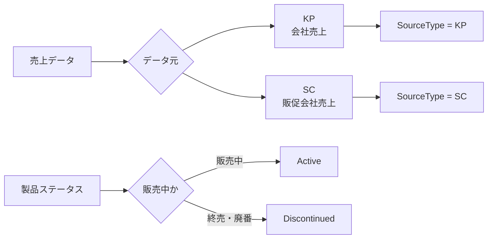

このチャットでは、主に次の2点を検討した。

1. **会社の売上ファイル「KP」と販促会社の売上ファイル「SC」を判別するためのカラム名**
2. **パテやシーリング材などの製品における「終売」の英語表現**

## 1. KP／SCを判別するカラム名

### 前提

扱っている売上データには、少なくとも次の2系統がある。

|区分|内容|
|---|---|
|`KP`|会社側の売上ファイル|
|`SC`|販促会社側の売上ファイル|

これらを結合・分析する際に、各レコードがどちらのデータ由来なのか判別できるカラムを追加したい、という目的で命名を検討した。

### 候補として挙げた名称

|カラム名|意味・ニュアンス|評価|
|---|---|---|
|`SourceType`|データソースの種別|**推奨**|
|`SalesType`|売上の種類|やや意味が広い|
|`FileType`|ファイルの種類|ファイルそのものを分類する印象が強い|
|`SalesOrigin`|売上の発生元・由来|意味は明確だがやや説明的|
|`SourceCategory`|ソースの分類|少し抽象的|
|`DataSource`|データの出所|`KP` / `SC` を直接保持する用途にも使える|
|`売上種別`|日本語で売上の分類を示す|最終出力向けには分かりやすい|
|`データ元`|データの出所|日本語では直感的|
|`元データ種別`|元データの種類|明確だが少し長い|

### 推奨した名称

最終的には **`SourceType`** を第一候補として推奨した。

値はそのまま、

```text
KP
SC
```

とする想定。

たとえばPower Query上では、概念的には以下のようなデータになる。

|SourceType|売上日付|商品|売上金額|
|---|---|---|--:|
|KP|2026-08-01|商品A|100,000|
|SC|2026-08-01|商品A|25,000|

`SourceType` を推奨した理由は、次の通り。

- `KP` / `SC` という「データの由来」を表す意味と合っている
- `SalesType` のように「売上形態」と誤解されにくい
- `FileType` のようにExcelファイル形式そのものを指しているように見えない
- 将来、KP・SC以外のソースが追加されても拡張できる
- Power Query内部で英語の一時カラム名を使う運用とも合わせやすい

ユーザーの既存方針である「処理途中では英語名を使い、最終段階で必要なら日本語化する」という考え方とも相性がよい。

したがって、現状の整理としては、

> **Power Query内部：`SourceType`**  
> **値：`KP` / `SC`**

という構成が最も自然。

日本語で最終出力する必要がある場合は、最後に `売上元`、`データ元`、`売上データ区分` などへ変更する方法もある。

## 2. 「終売」の英語表現

続いて、「終売」を英語でどう表現するかを確認した。

対象となる製品は一般的なIT製品などではなく、

- パテ
- シーリング材
- 建築・工業系材料

といった物理的な製品である。

この前提では、最も自然なのは **`Discontinued`**。

### 主な表現の違い

|英語|日本語の意味|パテ・シーリング材への適性|
|---|---|---|
|`Discontinued`|終売・廃番・販売終了|**最も適切**|
|`Discontinued Product`|終売商品・廃番商品|適切|
|`Out of Production`|生産終了|製造終了を強調する場合|
|`EOL` / `End of Life`|製品ライフサイクル終了|IT・電子機器寄り|
|`EOS` / `End of Support`|サポート終了|建材には通常不適切|

パテやシーリング材について「もう販売しない商品」「廃番商品」という状態を管理するのであれば、

```text
Discontinued
```

が最も簡潔で一般的。

たとえばステータスカラムなら、

|ProductStatus|
|---|
|Active|
|Discontinued|

という構成にできる。

「終売品」という名詞として書く場合は、

```text
Discontinued Product
```

となる。

一方、「販売終了」ではなくメーカー側の**製造そのものが終了していること**を明示したい場合は、

```text
Out of Production
```

も使用できる。

## 3. 今回の命名方針をまとめると



整理すると、今回の用途では次の組み合わせが最も分かりやすい。

|用途|推奨名称|値例|
|---|---|---|
|KP／SC判別カラム|`SourceType`|`KP`, `SC`|
|製品状態カラム|`ProductStatus` または `Status`|`Active`, `Discontinued`|
|終売状態|`Discontinued`|終売・廃番|
|終売商品|`Discontinued Product`|名詞として使用|
|生産終了を明示|`Out of Production`|製造そのものが終了|

特に今回のパテ・シーリング材のような一般的な製品では、IT業界で多用される `EOL` よりも **`Discontinued` のほうが誤解が少ない**。また、KP／SCについても販売形態そのものではなく「どのデータソースから来た売上か」を示すため、**`SourceType` が最も妥当**という結論になる。
