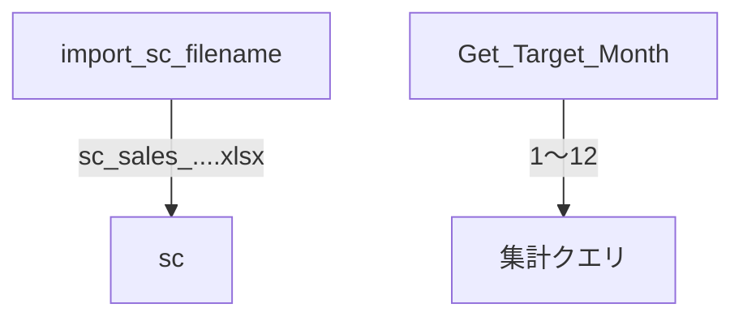
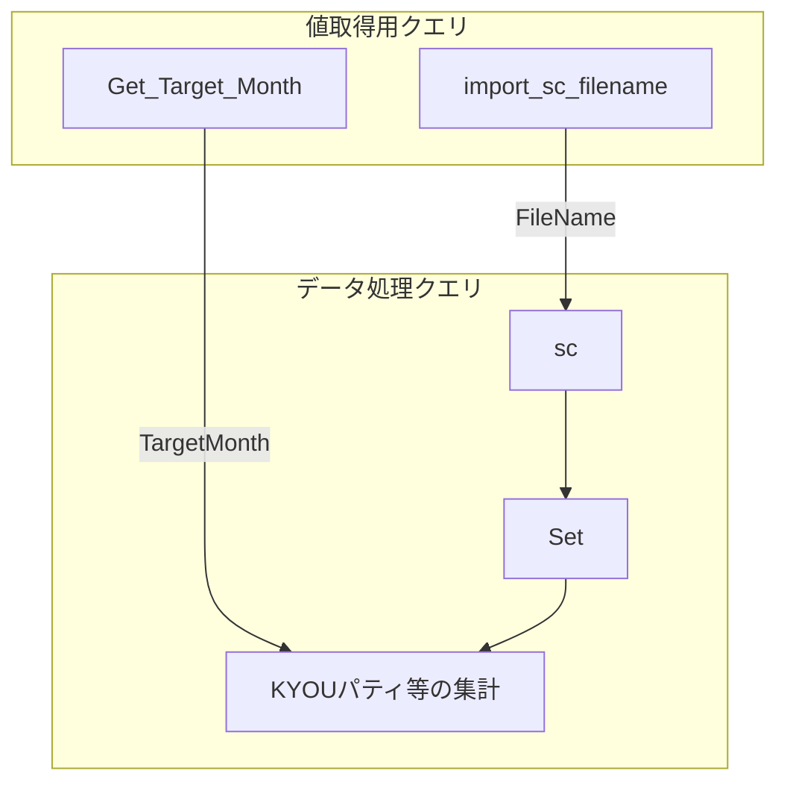

このチャットでは、Power Query の M 言語で「変数」を使う基本から始まり、最終的に **別クエリで取得したファイル名や対象月を、他のクエリから参照して動的な処理に利用する方法** まで検討しました。

全体の流れは、次のように整理できます。


## 1. Power Queryで変数は使えるか

Power Query の M 言語では、`let ... in` の中で名前を付けた各ステップを、実質的に変数として利用できます。

基本構造は次のとおりです。

```m
let
    Variable1 = "ABC",
    Variable2 = 123,
    Result = Variable1
in
    Result
```

例えば、

```m
TargetMonth = 1
```

と定義すれば、その後、

```m
Date.Month([売上日付]) = TargetMonth
```

のように参照できます。

Power Queryでは一般的なプログラミング言語の「変数」と少し性格が異なり、基本的には値を順番に再代入していくのではなく、`let` 内で名前と式を関連付けて処理します。

## 2. 別のソース・別クエリの値を利用できるか

次に確認したのが、

> 別のソースで取得した値を、別のクエリ内で変数として使えるか

という点でした。

これは可能です。

たとえば、あるクエリが最終的に単一の文字列を返すようになっていれば、そのクエリを別クエリから参照できます。

概念的には、



という構造です。

今回の用途では、この仕組みを以下の2か所に利用しました。

|値取得用クエリ|出力|利用先|
|---|---|---|
|`import_sc_filename`|SC売上ファイル名|`sc`|
|`Get_Target_Month`|対象月|集計・抽出クエリ|

## 3. 読み込んだファイル名を取得する

対象ファイルは次の形式でした。

```text
sc_sales_20231101-20240131.xlsx
```

最初は、このファイル名を Power Query 内で取得して利用したいという話でした。

そのため、`Folder.Files()` からファイル一覧を取得し、対象となるSC売上ファイルを抽出する方法を採用しました。

実際に作成した `import_sc_filename` は次の構成です。

```m
let
    // フォルダー内のファイル一覧を取得
    Source = Folder.Files(
        "C:\Users\kyoupatty029\projects\kpm\analysis_inspection\sales_analysis\import\general_enhanced\sc\cumulative"
    ),

    // SC売上ファイルのみ取得
    FilteredFile = Table.SelectRows(
        Source,
        each
            Text.StartsWith([Name], "sc_sales_")
            and Text.EndsWith([Name], ".xlsx")
    ),

    // ファイル名を取得
    FileName = FilteredFile{0}[Name]
in
    FileName
```

このクエリはテーブルを返すのではなく、最終的に

```text
sc_sales_20231101-20240131.xlsx
```

という **単一のテキスト値** を返します。

ここが重要です。

## 4. `sc` クエリの固定ファイル名を動的化

元の `sc` クエリには、次の処理がありました。

```m
#"Renamed Columns" =
    Table.RenameColumns(
        PromotedHeaders,
        {{"sc_sales_20231101-20240131.xlsx", "Name"}}
    ),
```

ここではファイル名が完全にハードコードされています。

そのため、新しい累計ファイルが

```text
sc_sales_20231101-20240229.xlsx
```

などに変わるたびに、Mコードを修正する必要がありました。

これを `import_sc_filename` から取得した値に変更する方針としました。

まず `sc` クエリの先頭で、

```m
FileName = #shared[import_sc_filename],
```

と取得し、

```m
#"Renamed Columns" =
    Table.RenameColumns(
        PromotedHeaders,
        {{FileName, "Name"}}
    ),
```

と変更します。

つまり、

```m
{{"sc_sales_20231101-20240131.xlsx", "Name"}}
```

から、

```m
{{FileName, "Name"}}
```

へ変更したわけです。

これにより、


という動的な構造になりました。

## 5. `sc` クエリでの実際の利用方法

重要部分だけ抜き出すと、次の構造です。

```m
let
    // import_sc_filename の値を取得
    FileName = #shared[import_sc_filename],

    Source = Folder.Files(
        "C:\Users\kyoupatty029\projects\kpm\analysis_inspection\sales_analysis\import\general_enhanced\sc\cumulative"
    ),

    ...

    PromotedHeaders = Table.PromoteHeaders(
        FilteredRows,
        [PromoteAllScalars = true]
    ),

    // 動的なファイル名を利用
    #"Renamed Columns" =
        Table.RenameColumns(
            PromotedHeaders,
            {{FileName, "Name"}}
        ),

    ...

in
    FilteredRowsFinal
```

この方法によって、ファイル名変更への追従性が大幅に向上します。

## 6. なぜファイル名が「列名」になっていたのか

今回、

```m
Table.RenameColumns(
    PromotedHeaders,
    {{"sc_sales_20231101-20240131.xlsx", "Name"}}
)
```

という処理が必要になっている理由は、前段で `Table.PromoteHeaders()` を実行しているためです。

処理前はおそらく次のような構造です。

|Name|Column2|Column3|
|---|---|---|
|sc_sales_20231101-20240131.xlsx|売上日|伝票番号|
|sc_sales_20231101-20240131.xlsx|2024/01/01|123|

これに、

```m
Table.PromoteHeaders(...)
```

を行うと、1行目がヘッダーになります。

すると、

```text
sc_sales_20231101-20240131.xlsx
```

そのものが列名になってしまいます。

そのため、

```m
ファイル名 → Name
```

という列名変更が必要になります。

つまり、ここで利用しているファイル名は単なるメタ情報ではなく、**ヘッダー昇格後に生成された実際のカラム名** です。

## 7. ファイル名から期間を取り出すことも可能

途中で、

```text
sc_sales_20231101-20240131.xlsx
```

から、

```text
20231101
20240131
```

を取り出せることも確認しました。

例えば、

```m
FileName = "sc_sales_20231101-20240131.xlsx",

PeriodText =
    Text.BetweenDelimiters(
        FileName,
        "sc_sales_",
        ".xlsx"
    ),

DateParts = Text.Split(PeriodText, "-"),

StartDateText = DateParts{0},
EndDateText = DateParts{1}
```

とすると、

```text
StartDateText = "20231101"
EndDateText   = "20240131"
```

になります。

これをさらに `date` 型へ変換すれば、期間計算・対象年月判定などにも利用できます。

## 8. `Get_Target_Month` を別クエリから利用

その後、同じ考え方を使って `Get_Target_Month` の値を別クエリから利用しました。

対象クエリの冒頭で、

```m
TargetMonth = #shared[Get_Target_Month],
```

としています。

その後、

```m
#"Filtered Rows" =
    Table.SelectRows(
        FilteredRows,
        each Date.Month([売上日付]) = TargetMonth
    )
```

というフィルター処理を追加しました。

目的は、

> `売上日付` の月が `Get_Target_Month` で取得した対象月と一致するレコードだけを抽出する

ことです。

## 9. `TargetMonth` フィルターで発生したエラー

実際には次の部分でエラーが発生しました。

```m
#"Filtered Rows" =
    Table.SelectRows(
        FilteredRows,
        each Date.Month([売上日付]) = TargetMonth
    )
```

ここで最も疑わしいのが **データ型の不一致** です。

`Date.Month()` の戻り値は数値です。

例えば、

```m
Date.Month(#date(2024, 1, 31))
```

なら、

```text
1
```

が返ります。

一方、`Get_Target_Month` が

```text
"1"
```

あるいは

```text
"01"
```

という **テキスト型** を返している場合、

```m
1 = "1"
```

という比較になってしまいます。

したがって、

```text
Number
```

と

```text
Text
```

の不一致が問題になります。

## 10. `TargetMonth` の型を揃える

そこで、`TargetMonth` を明示的に数値へ変換する方針にしました。

```m
TargetMonth =
    Number.From(
        Text.Trim(
            #shared[Get_Target_Month]
        )
    ),
```

これなら、

```text
"01"
```

でも

```text
"1"
```

でも数値の

```text
1
```

になります。

ただし、`Get_Target_Month` が最初から数値なら、もっと単純に、

```m
TargetMonth = Number.From(#shared[Get_Target_Month]),
```

で十分です。

そのため、最終的には `Get_Target_Month` 自体の出力型を確認し、それに合わせる方が適切です。

## 11. `売上日付` 側の型も確認する

もう一つの可能性として、

```m
Date.Month([売上日付])
```

の `[売上日付]` が `date` 型になっていないケースがあります。

`売上日付` がテキストで、

```text
2024/01/31
```

となっている場合、そのまま `Date.Month()` を適用するとエラーになる可能性があります。

そのため、必要なら先に、

```m
ChangedType =
    Table.TransformColumnTypes(
        FilteredRows,
        {
            {"売上日付", type date}
        }
    )
```

とします。

その上で、

```m
FilteredTargetMonth =
    Table.SelectRows(
        ChangedType,
        each Date.Month([売上日付]) = TargetMonth
    )
```

とします。

## 12. `TargetMonth` フィルターを含めた整理版

今回の処理を整理すると、次の形が分かりやすいです。

```m
let
    // 対象月を取得
    TargetMonth = Number.From(#shared[Get_Target_Month]),

    // Set と製品カテゴリーを結合
    Source = Table.NestedJoin(
        Set,
        {"ProductCodeNameConcat"},
        田中営業担当製品カテゴリー,
        {"コード付き商品名"},
        "田中営業担当製品カテゴリー",
        JoinKind.LeftOuter
    ),

    // カテゴリーを展開
    ExpandedCategory = Table.ExpandTableColumn(
        Source,
        "田中営業担当製品カテゴリー",
        {"カテゴリー"},
        {"カテゴリー"}
    ),

    // KYOUパティのみ抽出
    FilteredCategory = Table.SelectRows(
        ExpandedCategory,
        each [カテゴリー] = "KYOUパティ"
    ),

    // 売上日付を date 型へ統一
    ChangedType = Table.TransformColumnTypes(
        FilteredCategory,
        {
            {"売上日付", type date}
        }
    ),

    // 対象月のみ抽出
    FilteredTargetMonth = Table.SelectRows(
        ChangedType,
        each Date.Month([売上日付]) = TargetMonth
    )
in
    FilteredTargetMonth
```

ステップ名も、

```text
FilteredRows
#"Filtered Rows"
```

のような似た名称を避けて、

```text
FilteredCategory
FilteredTargetMonth
```

と意味を分ける方が管理しやすくなります。

## 13. 今回形成されたPower Queryの設計

今回の検討で、Power Query の役割分担は次のような構造になりました。



つまり、**データそのものを加工するクエリと、処理を制御するための値を取得するクエリを分離する** 方向です。

この設計には次の利点があります。

- ファイル名をハードコードしなくてよい
- 月変更時にMコードを書き換えなくてよい
- 同じ対象月を複数クエリから参照できる
- ファイル名・年月などの管理ロジックを一元化できる
- 後から月次／累計処理を拡張しやすい

## 14. 今回の重要ポイント

|項目|今回の結論|
|---|---|
|Power Queryで変数|使用可能|
|別クエリの値|利用可能|
|ファイル名取得|`Folder.Files()` の `[Name]` から取得|
|ファイル名取得用クエリ|`import_sc_filename`|
|出力例|`sc_sales_20231101-20240131.xlsx`|
|SCクエリでの利用|`Table.RenameColumns()` の旧列名として利用|
|固定値|`"sc_sales_20231101-20240131.xlsx"`|
|動的値|`FileName`|
|対象月取得|`Get_Target_Month`|
|月フィルター|`Date.Month([売上日付]) = TargetMonth`|
|エラー原因候補|`TargetMonth` と `Date.Month()` の型不一致|
|対策|`Number.From()` で月を数値化|
|売上日付|`type date` であることを確認|

## 最終的な考え方

今回の一連の変更で重要なのは、単に「変数を使えるようになった」という点ではありません。

当初は、

```m
"sc_sales_20231101-20240131.xlsx"
```

のような **その時点のデータに依存する値がMコード内部に直接埋め込まれていました**。

これを、

```text
ファイルシステム
    ↓
値取得クエリ
    ↓
FileName / TargetMonth
    ↓
各データ処理クエリ
```

という構造に変更しています。

したがって、今後ファイルが

```text
sc_sales_20231101-20240229.xlsx
sc_sales_20231101-20240331.xlsx
sc_sales_20231101-20240430.xlsx
```

と変化しても、処理本体のMコードを都度修正する必要がなくなる方向に進んでいます。

また、同じ考え方で `TargetMonth`、`TargetYear`、`AnalysisPeriod`、対象ファイル名、対象年度などを独立した値取得クエリとして管理すれば、Power Query 全体をよりパラメータ駆動型の構成にできます。

なお、このチャットでは `#shared[...]` を利用して別クエリを参照する方法を採用しましたが、単純なクエリ参照で済む構成なら、後から **クエリ名を直接参照する形へ整理できる余地** もあります。今後コード全体をリファクタリングする際には、この点も含めて統一するとより読みやすくなります。
