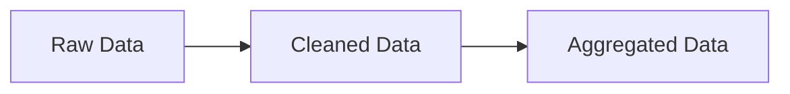
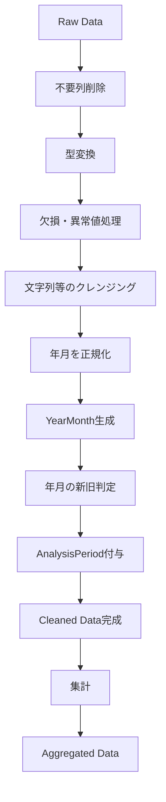

今回のチャットでは、**1つのExcelファイル内に複数年度・複数年月のデータが混在している場合に、年月の新旧関係を表す番号をPower Queryで動的に付与する方法**と、その処理を **Raw → Cleaned → Aggregated** のどの段階に配置するのが適切かを整理した。

## 1. 実現したいこと

想定しているデータは、たとえば以下のような状態。

|年月|売上|付与したいIndex|
|---|--:|--:|
|2024年12月|100|0|
|2024年12月|150|0|
|2023年12月|120|1|
|2023年12月|180|1|

基本ルールは、

- **最も新しい年月 → `0`**
- **その1つ前 → `1`**
- さらに過去年月が増えるのであれば `2`, `3` … と拡張可能

というもの。

重要なのは、`2024年12月` や `2023年12月` をコードに直接書かず、**読み込んだデータから自動的に新旧を判定すること**。

したがって、

```text
2025年03月 → 0
2024年03月 → 1
```

でも、

```text
2026年11月 → 0
2025年11月 → 1
```

でも同じ処理を使える設計にする。

## 2. 単純な「行インデックス」と「年月インデックス」は別物

今回必要なのは、通常の `Table.AddIndexColumn` による**行番号**ではなく、**年月ごとの順位番号**。

たとえばデータが1000行あり、

```text
2024/12
2024/12
2024/12
……
2023/12
2023/12
……
```

となっている場合、単純に

```powerquery
Table.AddIndexColumn(...)
```

を実行すると、

```text
2024/12 → 0
2024/12 → 1
2024/12 → 2
2024/12 → 3
...
```

となってしまう。

これは今回の目的とは異なる。

必要なのは、

```text
2024/12 → 0
2024/12 → 0
2024/12 → 0

2023/12 → 1
2023/12 → 1
2023/12 → 1
```

という**年月単位のIndex**。

したがって、実装上は次の構造が適切になる。


## 3. 推奨するPower Queryの実装方法

たとえば元データに `Date` 列があるとする。

年月単位で比較したいので、まず各日付を月初日に正規化する。

```powerquery
AddedYearMonth =
    Table.AddColumn(
        Source,
        "YearMonth",
        each Date.StartOfMonth([Date]),
        type date
    )
```

たとえば、

```text
2024/12/01
2024/12/15
2024/12/31
```

はすべて、

```text
2024/12/01
```

になる。

その後、年月だけの対応表を作成する。

```powerquery
YearMonthList =
    Table.Distinct(
        Table.SelectColumns(
            AddedYearMonth,
            {"YearMonth"}
        )
    ),

SortedYearMonth =
    Table.Sort(
        YearMonthList,
        {{"YearMonth", Order.Descending}}
    ),

AddedPeriodIndex =
    Table.AddIndexColumn(
        SortedYearMonth,
        "AnalysisPeriod",
        0,
        1,
        Int64.Type
    )
```

この時点で、

|YearMonth|AnalysisPeriod|
|---|--:|
|2024/12/01|0|
|2023/12/01|1|

という対応表ができる。

最後に元データへMergeする。

```powerquery
MergedPeriod =
    Table.NestedJoin(
        AddedYearMonth,
        {"YearMonth"},
        AddedPeriodIndex,
        {"YearMonth"},
        "PeriodMaster",
        JoinKind.LeftOuter
    ),

ExpandedPeriod =
    Table.ExpandTableColumn(
        MergedPeriod,
        "PeriodMaster",
        {"AnalysisPeriod"},
        {"AnalysisPeriod"}
    )
```

これによって、すべての行に年月に対応する番号が付く。

## 4. 完成形のサンプルMコード

全体を簡略化すると次のようになる。

```powerquery
let
    Source =
        Excel.CurrentWorkbook(){[Name="Table1"]}[Content],

    ChangedType =
        Table.TransformColumnTypes(
            Source,
            {
                {"Date", type date}
            }
        ),

    AddedYearMonth =
        Table.AddColumn(
            ChangedType,
            "YearMonth",
            each Date.StartOfMonth([Date]),
            type date
        ),

    YearMonthList =
        Table.Distinct(
            Table.SelectColumns(
                AddedYearMonth,
                {"YearMonth"}
            )
        ),

    SortedYearMonth =
        Table.Sort(
            YearMonthList,
            {
                {"YearMonth", Order.Descending}
            }
        ),

    AddedPeriodIndex =
        Table.AddIndexColumn(
            SortedYearMonth,
            "AnalysisPeriod",
            0,
            1,
            Int64.Type
        ),

    MergedPeriod =
        Table.NestedJoin(
            AddedYearMonth,
            {"YearMonth"},
            AddedPeriodIndex,
            {"YearMonth"},
            "PeriodMaster",
            JoinKind.LeftOuter
        ),

    ExpandedPeriod =
        Table.ExpandTableColumn(
            MergedPeriod,
            "PeriodMaster",
            {"AnalysisPeriod"},
            {"AnalysisPeriod"}
        )
in
    ExpandedPeriod
```

これなら、対象年月が変わってもコード変更は不要。

## 5. Raw → Cleaned → Aggregated のどこで付与するか

今回の処理フローは、



という構成。

結論としては、**Cleaned Dataで付与するのが最も適切**。

|段階|Index付与|評価|理由|
|---|---|---|---|
|Raw|△|基本非推奨|日付型、欠損、異常値などが未整理|
|Cleaned|◎|推奨|年月が正規化された状態で安定して判定できる|
|Aggregated|○|条件次第|集計専用のIndexならここでもよい|

Rawデータでは、

```text
2024/12/1
2024-12-01
2024年12月
空白
エラー
```

など、入力形式が統一されていない可能性がある。

そのため、まずCleaned Dataで、

```text
型変換
↓
欠損・エラー処理
↓
日付正規化
↓
年月生成
```

を行い、その後に新旧判定を実施する方が安全。

## 6. 推奨する処理順序

今回のケースでは、次の順序が最も整理しやすい。



つまり、**Cleaned Dataのかなり後半**に配置するイメージになる。

年月を正しく判定するための前処理が終わってから付与する。

## 7. `AnalysisPeriod`として扱う考え方

この番号は単なる「Index」というより、

```text
0 = Current / Current Year
1 = Previous / Previous Year
2 = Previous Previous
```

という**分析期間を表す属性**として扱う方が意味が明確。

たとえば、

|AnalysisPeriod|意味|
|--:|---|
|0|最新期間|
|1|1つ前の期間|
|2|2つ前の期間|

という構造にしておけば、後続処理で、

```powerquery
Table.SelectRows(
    Source,
    each [AnalysisPeriod] = 0
)
```

とすることで最新期間だけを簡単に取得できる。

また、

```text
AnalysisPeriod = 0 → CY / TY
AnalysisPeriod = 1 → PY / LY
AnalysisPeriod = 2 → PPY
```

のような分類にも発展させられる。

## 8. 年ではなく「年月」で判定することが重要

今回の最初の例は、

```text
2024年12月
2023年12月
```

だったため「年を比較すればよい」ようにも見える。

しかし汎用化するなら、**年だけではなく年月全体を比較する**べき。

たとえば、

```text
2025年1月
2024年12月
```

なら、

```text
2025/01 → 0
2024/12 → 1
```

である。

したがって、

```powerquery
Date.Year([Date])
```

だけで判定するのではなく、

```powerquery
Date.StartOfMonth([Date])
```

などを使って、

```text
YYYY-MM
```

単位で比較する設計が適切。

## 9. 今回の設計上の結論

今回の要件を整理すると、推奨構成は次のようになる。

```text
Raw
 ↓
データクレンジング
 ↓
日付型統一
 ↓
YearMonth生成
 ↓
YearMonth一覧をDistinct
 ↓
新しい年月順にSort
 ↓
0からIndex付与
 ↓
元データへMerge
 ↓
AnalysisPeriodとして保持
 ↓
Cleaned Data完成
 ↓
Aggregated Data
```

特に重要なのは、**「行にインデックスを付ける」のではなく、「年月マスタを一時的に作り、年月に順位を付け、それを元データへ戻す」**という考え方。

これなら対象データが、

```text
2024/12 + 2023/12
```

から、

```text
2025/03 + 2024/03
```

に変わっても、

```text
2026/11 + 2025/11 + 2024/11
```

の3期間に増えても、基本的にコードを変更する必要がない。

**今回の用途では、Cleaned Data段階で `AnalysisPeriod` を生成し、後続の集計クエリではその値を利用する設計が最も一貫性が高い。**
