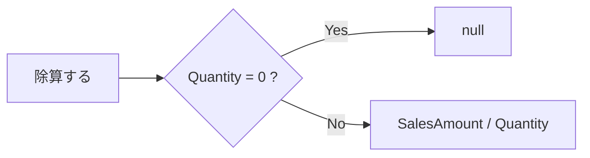
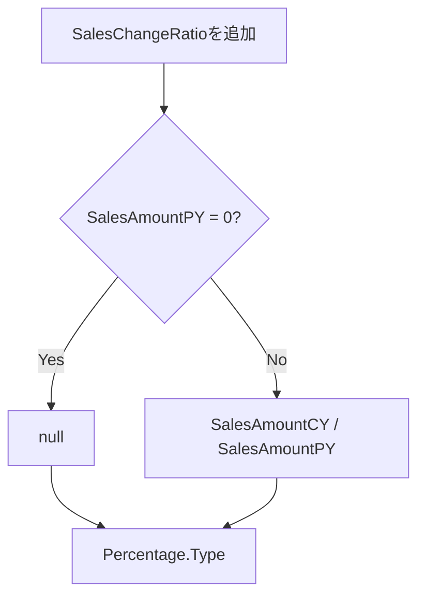

このチャットでは、Power Query で除算を行う際の `0/0` やゼロ除算をどう回避するか、`Number.IsNaN` を使うべきか、`null` と空文字列 `""` のどちらを使うべきか、さらに割合を `Percentage.Type` で扱う方法について整理した。

最終的な方針としては、**除数が `0` の場合だけ事前に判定して `null` を返し、それ以外は通常どおり除算する**のが最も簡潔で扱いやすい、という結論になった。

## 1. 最初の論点：Power Queryで `0/0` をどう回避するか

基本形として、除数が `0` の場合を `if` で判定する方法を確認した。

```powerquery
if [数値B] = 0 then null else [数値A] / [数値B]
```

たとえば、売上金額を数量で割って単価を求める場合は次のようになる。

```powerquery
if [Quantity] = 0 then null else [SalesAmount] / [Quantity]
```

この方法の特徴は、**危険なのは除数が `0` の場合だけなので、その条件だけを明示的に処理する**点にある。

## 2. `Number.IsNaN` を使う案

当初、次のような式が検討された。

```powerquery
if Number.IsNaN([売上金額] / [数量]) then ""
else [売上金額] / [数量]
```

また、英語列名では次のような式も検討した。

```powerquery
if Number.IsNaN([SalesAmount] / [Quantity]) 
then "" 
else if [Quantity] = 0 
     then "" 
     else [SalesAmount] / [Quantity]
```

ただし、この書き方には問題がある。

### 問題点

`Number.IsNaN` を評価するためには、

```powerquery
[SalesAmount] / [Quantity]
```

を**先に実行する必要がある**。

つまり、ゼロ除算を避けたいにもかかわらず、判定前に除算そのものを実行してしまう構造になる。

そのため、ゼロ除算対策としては `Number.IsNaN` よりも、直接

```powerquery
[Quantity] = 0
```

を確認する方が自然である。

### 整理

|方法|評価|
|---|---|
|`Number.IsNaN([A] / [B])`|ゼロ除算対策としては回りくどい|
|`if [B] = 0 then ...`|シンプルで意図が明確|
|`try ... otherwise`|他のエラーもまとめて処理したい場合には候補|

今回の目的では、`Number.IsNaN` は不要と整理した。

## 3. `""` と `null` の違い

当初の式では、計算できない場合に空文字列 `""` を返していた。

```powerquery
if [Quantity] = 0 then "" else [SalesAmount] / [Quantity]
```

しかし、ユーザーの要件は、

> 結果は数値（％含む）がよいので数値だけにしたい

というものだった。

この場合、`""` ではなく `null` が適している。

```powerquery
if [Quantity] = 0 then null else [SalesAmount] / [Quantity]
```

### なぜ `null` の方がよいか

`""` は**テキスト値**である。

一方、

- `50`
- `1.25`
- `0.8`
- `null`

は、数値列の中で扱いやすい。

したがって、数値列の中に「値なし」を表現したい場合は `null` を使う方が適切である。

|戻り値|意味|数値列との相性|
|---|---|---|
|`""`|空文字列|悪い|
|`0`|数値としてゼロ|良いが「値なし」と意味が異なる|
|`null`|値なし|良い|
|`"Error"`|テキスト|悪い|

今回の用途では **`null` が最適**という整理になった。

## 4. `null` を含む除算は問題ないか

次に、

> `null` で除算が発生することは問題ないのか？

という疑問が出た。

Power Queryでは、数値演算に `null` が含まれる場合、基本的には結果も `null` となる。

たとえば概念的には次のようになる。

|SalesAmount|Quantity|結果|
|--:|--:|--:|
|100|2|50|
|null|2|null|
|100|null|null|
|null|null|null|

そのため、たとえば `SalesAmount` が `null` の場合まで、

```powerquery
if [SalesAmount] = null then null
```

と個別に判定する必要は基本的にはない。

つまり、

```powerquery
if [Quantity] = 0 then null
else [SalesAmount] / [Quantity]
```

だけで十分簡潔に書ける。

## 5. `Quantity = 0` だけを条件にする方針

以上を踏まえ、

> Quantityが0の時だけ注意しての条件式にするのが一番すっきり？

という確認に対して、**その方針が最も簡潔**と整理した。

基本形はこれである。

```powerquery
if [Quantity] = 0 then null else [SalesAmount] / [Quantity]
```

考え方は非常に単純で、



となる。

分子側が `0` であること自体は問題ではない。

たとえば、

```text
0 / 10 = 0
```

なので、わざわざ条件分岐する必要はない。

問題なのは**除数が0の場合**である。

## 6. 前年比の式について

次に、売上金額の前年比として次の式が検討された。

```powerquery
if ([売上金額_TY] = 0 and [売上金額_LY] = 0) then ""
else if [売上金額_LY] = 0 then ""
else [売上金額_TY] / [売上金額_LY]
```

英語列名では、

```powerquery
if ([SalesAmountCY] = 0 and [SalesAmountPY] = 0) then ""
else if [SalesAmountPY] = 0 then ""
else [SalesAmountCY] / [SalesAmountPY]
```

という形になる。

しかし、この最初の条件、

```powerquery
[SalesAmountCY] = 0 and [SalesAmountPY] = 0
```

は実質的には不要である。

なぜなら、

```powerquery
[SalesAmountPY] = 0
```

を確認すれば、

```text
CY = 0, PY = 0
CY = 100, PY = 0
CY = -50, PY = 0
```

のすべてを一括で処理できるためである。

したがって、

```powerquery
if [SalesAmountPY] = 0 then null
else [SalesAmountCY] / [SalesAmountPY]
```

で十分となる。

### ケース別の結果

|SalesAmountCY|SalesAmountPY|結果|
|--:|--:|--:|
|100|100|1|
|120|100|1.2|
|80|100|0.8|
|0|100|0|
|100|0|null|
|0|0|null|

このため、「CYとPYがともに0」の特別判定を設ける必要はない。

## 7. `Percentage.Type` の使用

割合列については、計算値そのものを100倍する必要はなく、`Table.AddColumn` の第4引数に

```powerquery
Percentage.Type
```

を指定する方法を確認した。

たとえば、

```powerquery
Table.AddColumn(
    PreviousStep,
    "SalesChangeRatio",
    each [SalesAmountCY] / [SalesAmountPY],
    Percentage.Type
)
```

のように記述できる。

この場合、内部の値は通常の割合値のままである。

たとえば、

```text
0.5
```

という値を、割合として扱うことで、

```text
50%
```

という意味になる。

したがって、

```powerquery
([SalesAmountCY] / [SalesAmountPY]) * 100
```

とする必要はない。

むしろ、`Percentage.Type` を使う場合は **100を掛けない方が正しい**。

## 8. 最終的に整理された `SalesChangeRatio`

ユーザーが提示したコードは次のものだった。

```powerquery
= Table.AddColumn(
    RemovedUnusedColumns,
    "SalesChangeRatio",
    each if ([SalesAmountCY] = 0 and [SalesAmountPY] = 0) then ""
         else if [SalesAmountPY] = 0 then ""
         else [SalesAmountCY] / [SalesAmountPY],
    Percentage.Type
)
```

ここまでの議論を反映すると、次のように整理できる。

```powerquery
= Table.AddColumn(
    RemovedUnusedColumns,
    "SalesChangeRatio",
    each
        if [SalesAmountPY] = 0 then
            null
        else
            [SalesAmountCY] / [SalesAmountPY],
    Percentage.Type
)
```

さらにコンパクトに書くなら、

```powerquery
= Table.AddColumn(
    RemovedUnusedColumns,
    "SalesChangeRatio",
    each if [SalesAmountPY] = 0 then null else [SalesAmountCY] / [SalesAmountPY],
    Percentage.Type
)
```

となる。

### 処理フロー



## 9. 今回整理された実装原則

今回の議論から、Power Queryで割合・単価・前年比などを計算する場合は、次の考え方に統一できる。

- 除算では、基本的に**除数が0かどうかだけを事前確認する**
- 計算不能・該当なしを表す場合は、数値列なら `""` ではなく **`null`**
- 分子が0の場合は普通に除算すればよい
- 分子が `null` の場合も、原則として特別な条件分岐は不要
- `Number.IsNaN` をゼロ除算回避目的で使う必要はない
- 割合は `* 100` するのではなく、必要なら **`Percentage.Type`** を指定する
- 条件式は必要最低限にして、意味の重複する判定を増やさない

したがって、このチャットで確立した基本パターンは次の2つになる。

**通常の除算**

```powerquery
if [Denominator] = 0 then null
else [Numerator] / [Denominator]
```

**割合列として追加**

```powerquery
Table.AddColumn(
    PreviousStep,
    "Ratio",
    each if [Denominator] = 0 then null else [Numerator] / [Denominator],
    Percentage.Type
)
```

今回の `SalesChangeRatio` であれば、最終形は次のコードでよい。

```powerquery
= Table.AddColumn(
    RemovedUnusedColumns,
    "SalesChangeRatio",
    each if [SalesAmountPY] = 0 then null else [SalesAmountCY] / [SalesAmountPY],
    Percentage.Type
)
```

これが、**数値型を維持しながらゼロ除算を回避し、割合として扱う**という今回の要件に対して最も簡潔な形である。
