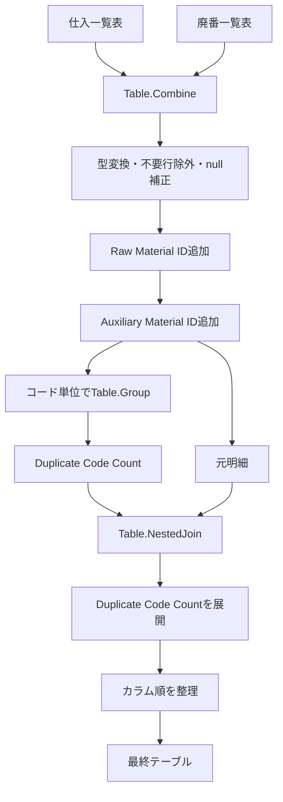

今回のチャットでは、Power Queryコードの**可読性向上を目的としたリファクタリング**から始まり、「コード」列の重複数をどう求めるか、別クエリ化すべきか、約4,000行というデータ量ではどの構成が妥当か、さらにExcelとPower Queryで複数列ソートを扱う際の考え方まで整理しました。

全体として、単にコードを短くするのではなく、**ステップ名・コメント・改行・処理単位を整理し、後から見返して理解しやすいPower Queryコードにする**ことが主眼になっています。

---

## 1. 元のPower Queryコードとリファクタリング方針

元のクエリでは、主に以下の処理を行っていました。

1. `仕入一覧表` と `廃番一覧表` を結合
2. `コード` 列をテキスト型へ変換
3. `品名 = null` の行を除外
4. `発注先` の `null` を空文字へ変換
5. `入目／規格` の `null` を空文字へ変換
6. `Raw Material ID` を作成
7. `Auxiliary Material ID` を作成
8. 「コード」の重複数を追加
9. 最終的に列順を並べ替え

当初のステップ名は日本語中心でしたが、以下のルールに整理しました。

- ステップ名は**PascalCase**
- コメントは**日本語**
- 各ステップすべてにはコメントしない
- ある程度まとまった**処理セグメント単位**でコメントする
- 長い関数呼び出しや列一覧は積極的に改行する
- 処理内容そのものは、不必要に変更しない

特に、以下のような記述スタイルを可読性の基準としました。

```powerquery
ReorderColumnsFinal = Table.ReorderColumns(
    ExpandDuplicateCount,
    {
        "コード", "品名", "発注先", "入目／規格", "発注単位", "単価", 
        "運賃形態", "リードタイム", "品番（発注先）", "品番（社内）", 
        "担当区分①", "担当区分②", "使う製品名", "製造者", "備考", 
        "試験成績書名", "区分", "前単価", "単価改定日", "列1", 
        "file_name", "Cells Color Number", "Status", 
        "Raw Material ID", "Auxiliary Material ID", "Duplicate Code Count"
    }
)
```

### ステップ名の考え方

最終的には、以下のような形が適切という整理になりました。

|処理|ステップ名例|
|---|---|
|ソース結合|`Source`|
|型変換|`ChangeTypeInitial`|
|空白行除外|`RemoveBlankItems`|
|発注先null置換|`ReplaceNullInOrderer`|
|規格null置換|`ReplaceNullInQuantitySpec`|
|Raw Material ID追加|`AddRawMaterialId`|
|Auxiliary Material ID追加|`AddAuxiliaryMaterialId`|
|コード集計|`GroupDuplicateCodeCount` など|
|重複数マージ|`MergeDuplicateCodeCount`|
|展開|`ExpandDuplicateCodeCount`|
|最終列順変更|`ReorderColumnsFinal`|

重要なのは、`Add_Column_RawMaterialId` のような**アンダースコア区切りはPascalCaseではない**という点です。

PascalCaseなら、

```text
AddRawMaterialId
```

のように記述します。

---

## 2. コメントの粒度について

途中で、各ステップごとにコメントを付けようとした結果、かえって視認性が落ちました。

そこで、コメントは以下のような**大きめの処理単位**で付ける方針に変更しました。

```powerquery
// データの結合、型変換、不要行除外、null値の補正
...

// 識別用IDカラムを作成
...

// コード単位の重複数を集計して元データへ付与
...

// 最終出力用にカラム順を調整
...
```

これは、Power Queryの処理を「一行ずつ説明する」のではなく、**何のためのセクションなのかをコメントで示す**方式です。

結果として、

- コードそのものを読めば分かる箇所はコメントしない
- 意図や処理グループを説明する箇所だけコメントする

という運用が適しています。

---

## 3. 「コードの重複数」をどう求めるか

今回もっとも大きく検討したのが、`コード` が元データ内に何件存在するかを各行へ付与する方法です。

例えば元データが次の場合、

|コード|品名|
|---|---|
|A001|商品A|
|A001|商品A-別規格|
|A002|商品B|
|A003|商品C|
|A003|商品C-2|
|A003|商品C-3|

求めたい結果は次のようなものです。

|コード|Duplicate Code Count|
|---|--:|
|A001|2|
|A001|2|
|A002|1|
|A003|3|
|A003|3|
|A003|3|

カラム名については、日本語の「コードの重複数」から、

```text
Duplicate Code Count
```

へ変更する案を採用しました。

---

## 4. 重複数を求める3つの方法

チャットでは、以下の3方式を比較しました。

|方法|概要|
|---|---|
|1|別クエリで重複カウントテーブルを作成し、元クエリへマージ|
|2|同じクエリ内で集計テーブルを作り、そのまま自己マージ|
|3|`Table.AddColumn` 内で各行ごとに元テーブルを検索して数える|

それぞれ性質が異なります。

### 方式1：別クエリで集計してマージ

例えば、別クエリ `DuplicateCode` で、

```powerquery
Table.Group(
    Source,
    {"コード"},
    {
        {"Duplicate Code Count", each Table.RowCount(_), Int64.Type}
    }
)
```

のような集計テーブルを作成します。

その後、元クエリ側で、

```powerquery
Table.NestedJoin(...)
```

して重複数を戻します。

**メリット**

- 集計ロジックが独立して分かりやすい
- 他のクエリでも再利用できる
- 重複コード一覧そのものを確認しやすい
- デバッグしやすい

**デメリット**

- クエリ数が増える
- クエリ間依存が増える
- この用途だけの場合は構成がやや大げさ

---

### 方式2：同一クエリ内で集計テーブルを作ってマージ

同じ `let` 内で、

```powerquery
GroupedData = Table.Group(
    AddAuxiliaryMaterialId,
    {"コード"},
    {
        {"Duplicate Code Count", each Table.RowCount(_), Int64.Type}
    }
)
```

として一度集計します。

その後、

```powerquery
MergeDuplicateCodeCount = Table.NestedJoin(
    AddAuxiliaryMaterialId,
    {"コード"},
    GroupedData,
    {"コード"},
    "DuplicateCount",
    JoinKind.LeftOuter
)
```

で元テーブルへ戻します。

**メリット**

- クエリが1つで完結する
- 外部依存が増えない
- 処理の流れを1か所で追える
- 4,000行程度なら十分現実的

**デメリット**

- 同一クエリ内に「元データ」と「集計テーブル」の2つの系統が生まれる
- 少し長くなる
- 同じ集計結果を他クエリから再利用しづらい

---

### 方式3：各行から直接元テーブルを検索してカウント

一時的に、以下のような方法を検討しました。

```powerquery
AddDuplicateCodeCount = Table.AddColumn(
    AddAuxiliaryMaterialId,
    "Duplicate Code Count",
    each Table.RowCount(
        Table.SelectRows(
            AddAuxiliaryMaterialId,
            each [コード] = ...
        )
    ),
    Int64.Type
)
```

しかし、最初に提示したコードでは**行コンテキストの扱いを誤ったため、各コードの件数ではなく全体件数になってしまいました**。

これは今回の重要な修正点です。

また、この方法は正しく記述できたとしても、各行ごとに元テーブルを再検索する構造になりやすく、

```text
4,000行 × 4,000行相当の探索
```

のような処理になり得ます。

したがって、**「マージを使わないから高速」という評価は適切ではありません**。

むしろPower Queryでは、コード単位で一度 `Table.Group` した後に元テーブルへ戻す方式の方が、一般に構造も性能も安定します。

---

## 5. 「マージは必須なのか？」という論点

厳密には、**重複数を求めるためにマージそのものが必須というわけではありません**。

M言語では工夫すれば別の方法でも実装できます。

ただし、

> 元の明細行をすべて残したまま、グループ単位の集計値を各行へ持たせる

という処理では、

1. コードごとに集計する
2. 集計結果を元の明細行へ戻す

という2段階構造が非常に自然です。

そのためPower Queryでは、


という構成が実務上分かりやすくなります。

つまり、

> **必須ではないが、標準的かつ妥当な実装としてマージが有力**

という整理が正確です。

---

## 6. 別クエリか、同一クエリ内か

データ量について、対象は**約4,000行**であることが確認されました。

この規模であれば、パフォーマンスを理由に別クエリへ分ける必要はほぼありません。

### 約4,000行の場合の評価

|観点|同一クエリ|別クエリ|
|---|---|---|
|処理速度|◎ 十分|◎ 十分|
|コードのまとまり|◎|△|
|クエリ一覧の整理|◎|△ クエリが増える|
|再利用性|△|◎|
|デバッグ|○|◎|
|他処理からの参照|△|◎|
|今回の用途への適合|**◎**|○|

したがって、このケースでは基本的に、

> **同一クエリ内で `Table.Group` → `Table.NestedJoin` → 展開**

で十分です。

別クエリに分けるのは、

- 他のクエリでもDuplicate Code Countを利用する
- 重複コード集計自体を独立データとして使う
- 元クエリが非常に長くなってきた
- 責務を明確に分けたい

といった理由がある場合に検討するのが妥当です。

---

## 7. 安定性の評価についての修正

途中では、

> 直接各行で重複数を計算する方法が一番安定する

という評価も行いましたが、今回の用途についてはこの評価は適切ではありません。

正しくは、**処理の安定性・予測可能性・保守性を総合すると、Group + Merge方式の方が優位**です。

今回のケースなら、おおむね次の評価になります。

|順位|方法|評価|
|---|---|---|
|1|同一クエリ内でGroup → Merge|最も自己完結しており安定|
|2|別クエリでGroup → Merge|十分安定。ただし依存クエリが増える|
|3|各行でTable.SelectRows等を実行|実装ミス・性能低下が起きやすい|

ただし1位と2位の差は技術的な安定性というより、**依存関係・管理方法の差**です。

別クエリを使ったから不安定になる、というほど単純ではありません。

---

## 8. 最終的に妥当な重複カウント部分

今回の条件なら、次の構成が実用的です。

```powerquery
// コード単位で件数を集計し、元データへ重複数を付与
GroupDuplicateCodeCount = Table.Group(
    AddAuxiliaryMaterialId,
    {"コード"},
    {
        {"Duplicate Code Count", each Table.RowCount(_), Int64.Type}
    }
),
MergeDuplicateCodeCount = Table.NestedJoin(
    AddAuxiliaryMaterialId,
    {"コード"},
    GroupDuplicateCodeCount,
    {"コード"},
    "DuplicateCodeCount",
    JoinKind.LeftOuter
),
ExpandDuplicateCodeCount = Table.ExpandTableColumn(
    MergeDuplicateCodeCount,
    "DuplicateCodeCount",
    {"Duplicate Code Count"},
    {"Duplicate Code Count"}
)
```

これなら、

- `コード = A001` が2件なら両方に `2`
- `コード = A002` が1件なら `1`
- `コード = A003` が3件なら3行すべて `3`

となります。

---

## 9. ExcelとPower Queryの複数列ソート

最後に、ExcelとPower Queryでソートの優先順位が逆に見える理由について話しました。

ここは整理しておく必要があります。

### 複数条件を一括指定する場合

Excelの「並べ替え」ダイアログも、Power Queryの `Table.Sort` も、基本的な考え方は同じです。

例えば、

```powerquery
Table.Sort(
    Source,
    {
        {"分類2", Order.Ascending},
        {"分類1", Order.Descending}
    }
)
```

なら、

1. `分類2` が第1優先
2. 同じ `分類2` の中で `分類1` が第2優先

です。

つまり、`Table.Sort` の条件リストでは**上に書いたものほど優先順位が高い**です。

### 「逆」に感じやすい原因

混乱が生じやすいのは、**複数列を一括指定する場合**と、**別々のソート操作を連続して行う場合**を混同したときです。

例えば、

```text
最初にA列をソート
↓
その後B列を単独でソート
```

という操作では、後のB列ソートが全体の並びを再構成するため、結果としてB列が強く見えます。

一方で、

```text
第1キー：A
第2キー：B
```

と一度に指定した場合は、Aが優先です。

したがって、

> ExcelとPower Queryで根本的にソート優先順位が逆

と考えるのは正確ではありません。

正しくは、

> **複数キーを一括指定しているのか、単独ソートを順番に適用しているのかによって見え方が変わる**

という理解が適切です。

---

## 10. 今回の最終的な方針

今回のPower Queryについては、次の方針にまとまりました。

- ステップ名は**PascalCase**
- コメントは**日本語**
- コメントは各行ではなく**大きな処理セグメント単位**
- 長い関数は複数行へ分割する
- 列一覧は複数行へ整形する
- `Raw Material ID` と `Auxiliary Material ID` はそのまま作成
- 「コードの重複数」は英語名の **`Duplicate Code Count`**
- 約4,000行なので、重複カウントは**同一クエリ内で処理してよい**
- 実装は **`Table.Group` → `Table.NestedJoin` → `Table.ExpandTableColumn`** が妥当
- 各行から元テーブルを検索する方式は採用しない
- 別クエリ化は、再利用性やクエリ分割の必要性が生じた場合に検討する
- ExcelとPower Queryの複数列ソートは、基本的に**第1キー → 第2キー → 第3キー**の順で優先される



今回の構成では、**4,000行程度のデータに対して処理性能を過度に最適化するより、読みやすく、処理意図が追いやすく、後から修正しやすい構造を優先する**のが妥当です。
