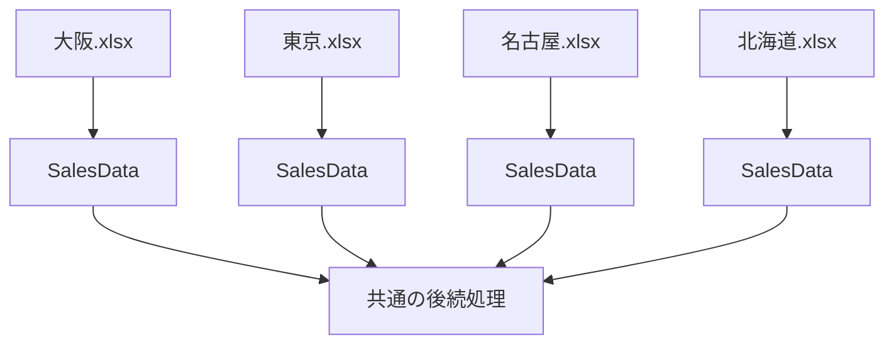

## Power Queryにおけるクエリ・ファイルの命名方針まとめ

今回の議論では、Power Queryで「元データの読み込み → データクレンジング → 地域別などのデータ生成」を行う場合に、**クエリ名を何を基準に付けるべきか**、さらに**CamelCase・snake_case・大文字表記のどれを採用するべきか**を整理した。

結論として、MicrosoftはPower Queryについて厳密な命名規則を定めていない。したがって、特定のケースを「Microsoft公式方式」と考えるより、**意味が明確で、一貫しており、再利用・保守しやすい命名体系をプロジェクト単位で決める**のが適切である。

## 1. クエリ名は「入力」ではなく「役割・出力」を基準にする

最初に検討したのは、Power Queryのクエリ名を、

- 読み込んだファイル名をベースにする
- 最終的に出来上がる表・データをベースにする

のどちらにするか、という問題だった。

基本的には、**出来上がるデータやクエリの役割を基準にする方が扱いやすい**。

たとえば、

```text
sales_data_202607.csv
```

というファイルを読み込み、売上データをクレンジングしたとしても、

```text
sales_data_202607
```

というクエリ名より、

```text
SalesData
CleanedSalesData
```

などの方が、「このクエリが何を提供するものなのか」が明確になる。

特にファイル名に年月が含まれている場合、ファイルが翌月に変わるたびにクエリ名まで変更する設計は好ましくない。


つまり、

> **ファイル名 = 物理的なデータソースの識別**
> 
> **クエリ名 = Power Query内での論理的な役割の識別**

と分けて考えるのが整理しやすい。

## 2. 地域ごとに別Excelファイルを作る場合

今回の具体例では、売上データを読み込み、データクレンジングした後、

- 大阪
- 東京
- 名古屋
- 北海道

でフィルタリングし、それぞれ別Excelファイルとして運用するケースを考えた。

重要なのは、**別々のExcelブックなら同じクエリ名を使用できる**という点である。

たとえば、

```text
大阪.xlsx
└─ SalesData

東京.xlsx
└─ SalesData

名古屋.xlsx
└─ SalesData

北海道.xlsx
└─ SalesData
```

という設計は成立する。

各ブックで`SalesData`が「そのブックで使用する売上データ」という同一の役割を担っているなら、むしろ同一名称にする合理性がある。

### 同一名称にするメリット

特に今回重視したのが**再利用性**である。

各ファイルで、

```text
SalesData
```

というクエリが必ず存在するという契約を作っておけば、別のクエリやVBAなどから参照するときも、

```text
大阪だから SalesData_Osaka
東京だから SalesData_Tokyo
```

と分岐させる必要がなくなる。

構造としては、



となる。

これは、単に名前を揃えて見栄えを良くするという話ではなく、

> **同じ役割を持つクエリに同じインターフェース名を与える**

という設計上の意味を持つ。

したがって、各Excelファイルの構造が同じで、後続処理も共通化したいのであれば、**地域名をクエリ名に埋め込まず、同じクエリ名を使う設計には十分なメリットがある**。

一方、1つのExcelブックの中に大阪・東京・名古屋・北海道をすべて保持するのであれば、当然同名にはできないため、

```text
SalesDataOsaka
SalesDataTokyo
SalesDataNagoya
SalesDataHokkaido
```

など、識別できる名前が必要になる。

## 3. CamelCaseとsnake_caseのどちらを採用するか

次に検討したのが、Power Queryのクエリ名について、

```text
SalesDataCleaned
```

のようなCamel/Pascal系表記と、

```text
sales_data_cleaned
```

のようなsnake_caseのどちらを採用するかという問題だった。

ここは訂正を含めて整理しておく必要がある。

**MicrosoftはPower Queryのクエリ名について「CamelCaseを使うこと」「snake_caseを使うこと」という公式規則を定めていない。**

MicrosoftのPower Query公式ベストプラクティスでは、クエリ・ステップ・グループなどについて、必要に応じて名前を変更したり説明を付けたりして、処理内容を分かりやすくすることを推奨している。つまり重視されているのは表記形式そのものではなく、**意味・可読性・保守性**である。

Microsoft社員によるPower BI Communityでの回答でも、Power BIの名称について特定の標準はなく、利用者がビジネス上の意味を容易に理解できる「meaningful and helpful names」を付けることが重要と説明されている。

したがって、

|表記|例|評価|
|---|---|---|
|PascalCase|`CleanedSalesData`|○ Power Queryでも扱いやすい|
|camelCase|`cleanedSalesData`|○ 技術的には問題なし|
|snake_case|`cleaned_sales_data`|○ 技術的には問題なし|
|UPPER_SNAKE_CASE|`CLEANED_SALES_DATA`|△ 用途を限定した方がよい|
|スペース|`Cleaned Sales Data`|○ Power Queryでは利用可能|

という理解になる。

なお、以前の回答では`SalesDataCleaned`などを「CamelCase」と表現したが、厳密には先頭も大文字なので**PascalCase**である。

今回のユーザーの既存方針ではPower Queryのステップ名にもPascalCaseを使用しているため、クエリについても、

```text
SalesData
CleanedSalesData
ImportedFiles
CustomerSalesSummary
```

のような**PascalCaseに統一する**のは自然な設計になる。

## 4. `LOAD_FILES_DATA`のような全大文字表記について

もう一つの論点が、データクレンジング前の大元CSVファイルを、

```text
LOAD_FILES_DATA.csv
```

のような全大文字＋アンダースコアで命名していることだった。

これについても、

> **MicrosoftがPower Query用データソースについて全大文字を推奨しているわけではない。**

したがって「Microsoft標準だからこの形式にする」という理由は成立しない。

また、一般的なプログラミングでは、

```text
MAX_RETRY_COUNT
DEFAULT_TIMEOUT
API_BASE_URL
```

のような`UPPER_SNAKE_CASE`は**定数**を表現する用途で頻繁に使用される。

そのため、

```text
LOAD_FILES_DATA
```

という名称を見たプログラマーが「固定値や設定値なのか」と解釈する可能性はある。

ただし、業務用フォルダの中で、

```text
LOAD_FILES_DATA
```

を

> 「ここが加工前データの入口である」

という**視覚的なランドマーク**として意図的に使用するなら、間違いではない。

つまり「一般的だから採用する」のではなく、**プロジェクト独自の意味を与えて採用する**ものと考えた方がよい。

## 5. 今回のケースに適した命名体系

今回の用途を考えると、すべてを1種類の表記に統一する必要はない。

むしろ、**対象の種類によって命名規則を分け、そのルールを一貫させる**方が合理的である。

たとえば次のような体系が考えられる。

|対象|命名例|方針|
|---|---|---|
|Rawデータ用フォルダ|`LOAD_FILES_DATA`|特殊用途として大文字|
|CSV|`sales_202608.csv`|snake_case|
|読み込みクエリ|`SalesData`|PascalCase|
|クレンジング済み|`CleanedSalesData`|PascalCase|
|ファイル一覧|`ImportedFiles`|PascalCase|
|集計クエリ|`CustomerSalesSummary`|PascalCase|
|関数|`GetColumnTypeInfo`|PascalCase|
|パラメータ|`TargetFiscalYear`|PascalCase|

特にPower Query内部については、

```text
SalesData
CleanedSalesData
ImportedFiles
CustomerSalesSummary
ProductSalesSummary
```

のように統一すると、かなり整理しやすい。

## 6. 「地域名をクエリ名に入れるか」の判断基準

今回の議論で重要なのは、命名形式そのものよりこちらである。

地域別Excelが、

```text
Osaka.xlsx
Tokyo.xlsx
Nagoya.xlsx
Hokkaido.xlsx
```

と分かれていて、内部構造が同じなら、

```text
各Excel
└─ SalesData
```

とする。

逆に一つのExcelに全部入っているなら、

```text
SalesData
├─ OsakaSales
├─ TokyoSales
├─ NagoyaSales
└─ HokkaidoSales
```

などと区別する。

判断基準を一言で表すと、

> **クエリ名に「そのクエリが置かれている環境から既に分かる情報」を重複して持たせる必要はない。**

`Osaka.xlsx`の中にしか存在しないクエリなら、

```text
OsakaSalesData
```

としなくても、

```text
SalesData
```

で「大阪の売上データ」であることは分かる。

この考え方は、今後ファイルをコピーして別地域へ展開したり、VBAや別クエリから共通名称で参照したりするときにも有利になる。

## 最終的な整理

今回の結論は次のようになる。

1. **MicrosoftにはPower Queryの厳密な命名規則はない。**
2. Microsoftが重視しているのは、意味が分かる名称、可読性、整理、ドキュメント化である。
3. CamelCase/PascalCaseとsnake_caseのどちらが「Microsoft公式」ということはない。
4. Power Query内部をPascalCaseで統一する設計は十分妥当。
5. `LOAD_FILES_DATA`のようなUPPER_SNAKE_CASEも使用可能だが、Microsoft標準ではなく独自規則として扱うべき。
6. クエリ名は物理的なファイル名より、**クエリの役割・提供するデータ**を基準にする方が保守しやすい。
7. 大阪・東京などでExcelファイル自体が分離され、内部構造が同じなら、各ファイルのクエリを`SalesData`など**同一名称に統一する設計には再利用上のメリットがある**。
8. 地域名など、ファイル自体から判別できる情報をクエリ名へ重複して埋め込む必要はない。
9. 逆に、同一Excel内に複数地域のクエリを共存させる場合は、地域を識別できる名称が必要になる。

したがって今回の用途なら、**「ファイル名はデータソースを識別するもの、クエリ名は処理上の役割を識別するもの」と明確に分離し、Power Query内部はPascalCaseを基本とする**設計が最も整合的である。

Microsoft公式のPower Queryベストプラクティスはこちら。  
[Power Query のベスト プラクティス — Microsoft Learn](https://learn.microsoft.com/en-us/power-query/best-practices?utm_source=chatgpt.com)
