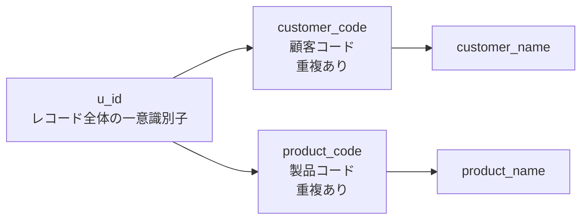
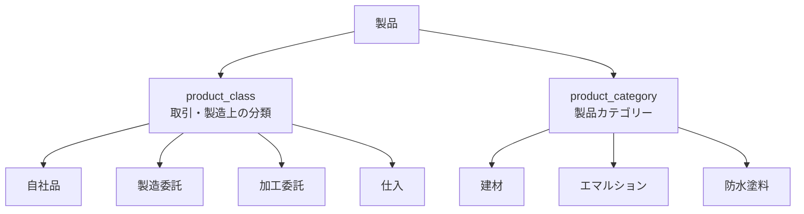
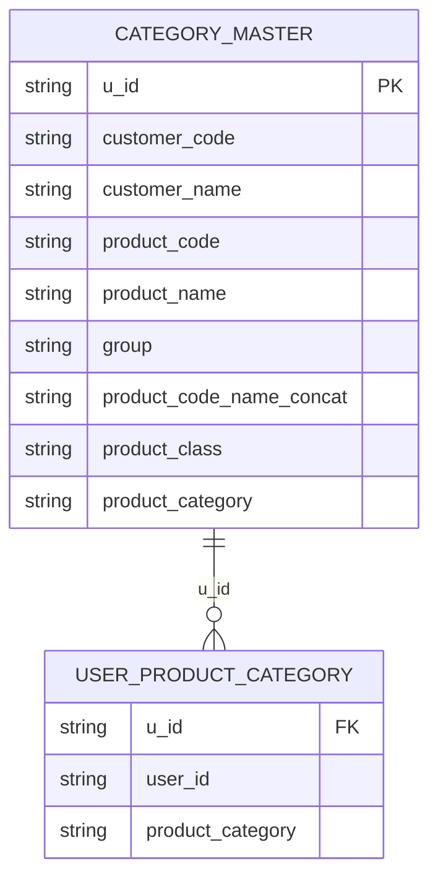
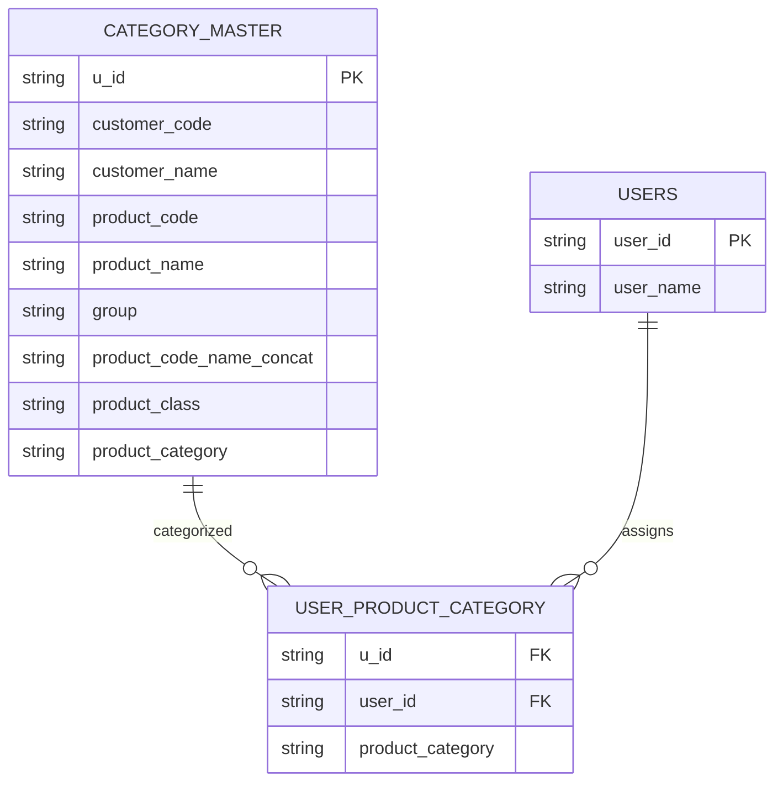
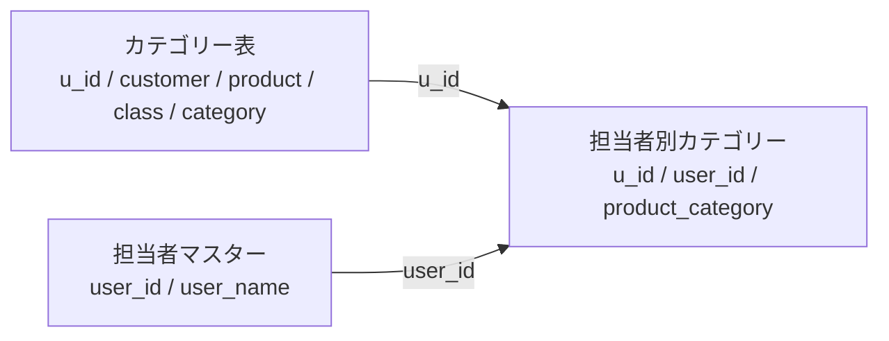

このチャットでは、最初に提示されたカテゴリー表のカラム構成を起点として、`customer_code`・`product_code` の重複事情、`u_id` の役割、`class`・`category` の意味、さらに担当者ごとに異なる製品カテゴリーを持たせる場合の一般的なデータ設計まで検討した。

最終的な重要点は、**既存のフラットなカテゴリー表そのものは業務上の事情を踏まえて維持しつつ、担当者別カテゴリーを追加する場合は担当者ごとのカラムを増殖させるのではなく、別テーブルで行として管理するのが一般的**という整理になる。

## 1. 最初に提示されたカテゴリー表

当初のカラム構成は以下。

```text
u_id
customer_code
customer_name
product_code
product_name
group
product_code_name_concat
class
category
```

この表は、単なる「製品マスター」ではなく、顧客・製品・分類・カテゴリーなどをまとめた業務用のカテゴリー表として扱われている。

各カラムについて会話を通して判明した意味は次のとおり。

|現在のカラム|意味・役割|
|---|---|
|`u_id`|テーブル全体のレコードを一意に識別するユニークコード|
|`customer_code`|既存システム由来の顧客コード|
|`customer_name`|顧客名|
|`product_code`|既存システム由来の製品コード|
|`product_name`|製品名|
|`group`|グループ情報。具体的な意味に応じて名称再検討余地あり|
|`product_code_name_concat`|製品コードと製品名を連結した値|
|`class`|製品の取引・製造形態による分類|
|`category`|製品の種類・用途などによるカテゴリー|

## 2. `customer_code` と `product_code` の特殊事情

重要な前提として、`customer_code` と `product_code` には重複が存在する。

ただし、これは「重複を許容する設計」なのではない。

過去の担当者や旧システムの運用によって、本来一意であるべきコードに重複が発生し、その状態が現在まで残っている。また、事情により現在は修正不可能である。

したがって、

```text
customer_code = 顧客を必ず一意に識別できるID
product_code  = 製品を必ず一意に識別できるID
```

とは扱えない。

このため、以前の回答で提案した

```text
customer_code → customer_id
product_code  → product_id
```

という単純な変更は不適切である。

**`code` と `id` は役割を区別すべき**という結論になった。

`customer_code` と `product_code` は、あくまで既存システム上の業務コードとしてその名称を維持する方が自然である。

## 3. `u_id` の役割

途中で特に重要な訂正が入った。

`u_id` は、

> 顧客のIDでも製品のIDでもなく、そのカテゴリー表の「1行」を一意に識別するコード

である。

したがって、

```text
u_id → customer_id
```

と解釈するのは誤り。

概念上は以下に近い。

```text
u_id
≈ record_id
≈ row_id
≈ category_mapping_id
```

ただし、既に `u_id` という名称で運用しており意味が明確なのであれば、無理に変更する必要はない。

構造としては次のようになる。



つまり、`customer_code` や `product_code` に問題があっても、その組み合わせを含む**各レコードそのものは `u_id` によって確実に区別できる**構造になっている。

## 4. `legacy_customer_code` / `legacy_product_code` に変えるべきか

途中で、

```text
legacy_customer_code
legacy_product_code
```

という案も検討した。

しかし、現在の整理では必須ではない。

`legacy_` は通常、

- 廃止予定
- 旧仕様
- 新しい正式コードへ移行済み
- 後方互換のためだけに残している

といった意味合いを持つ。

今回の場合は、重複問題こそあるものの `customer_code` / `product_code` は依然として現役の業務コードである。

そのため、実態に最も忠実なのは、

```text
customer_code
product_code
```

を維持すること。

「重複が存在し、一意キーとしては利用できない」という仕様は、カラム名ではなくデータ定義書や処理ルール側で明示する方が自然である。

## 5. `class` と `category` の意味

ユーザーから具体的な定義が提示された。

### `class`

その製品がどのような取引・製造形態に属するか。

例：

- 自社品
- 製造委託
- 加工委託
- 仕入

したがって、より明確なカラム名として、

```text
product_class
```

が候補となる。

### `category`

その製品がどの製品カテゴリーに属するか。

例：

- 建材
- エマルション
- 防水塗料

したがって、

```text
product_category
```

とするのが自然。

この2つは別概念である。



## 6. 最初のカラムを現在の理解で見直す

現時点での妥当な整理は以下。

|現在|推奨|判断|
|---|---|---|
|`u_id`|`u_id`|維持でよい。テーブル全体のユニークコード|
|`customer_code`|`customer_code`|維持。`id` へ変更しない|
|`customer_name`|`customer_name`|そのままでよい|
|`product_code`|`product_code`|維持。`id` へ変更しない|
|`product_name`|`product_name`|そのままでよい|
|`group`|要検討|`group` は意味が曖昧。実態に応じて具体化したい|
|`product_code_name_concat`|`product_code_name_concat`|実際にコード＋名前の連結値なら意味は明確|
|`class`|`product_class`|製品属性であることを明示|
|`category`|`product_category`|製品カテゴリーであることを明示|

したがって、現状のフラットなカテゴリー表を改善するなら、

```text
u_id
customer_code
customer_name
product_code
product_name
group
product_code_name_concat
product_class
product_category
```

という形が比較的自然。

特に `customer_code` / `product_code` は、重複しているからといって `id` に名称変更しないことが重要。

## 7. 担当者別に異なる `product_category` を持たせたい問題

次に、同じ製品であっても担当者によって異なるカテゴリーを設定したいという要件が出た。

担当者は例として以下。

|担当者|ID|
|---|--:|
|田中|`10101`|
|鈴木|`10102`|
|佐藤|`20103`|

当初は、フラットな表へ直接、

```text
product_category_10101
product_category_10102
product_category_20103
```

というカラムを追加する案を検討した。

この命名自体については、もしカラム方式を採用するなら、

```text
10101_product_category
```

より、

```text
product_category_10101
```

の方が自然。

理由は、関連カラムを `product_category_*` としてまとめて認識しやすいため。

しかし、その後の検討で、この設計自体は**一般的なデータベース設計ではない**と整理された。

## 8. 一般的な方法は「担当者ごとにカラムを増やさない」

担当者が増えるたびに、

```text
product_category_10101
product_category_10102
product_category_20103
product_category_XXXXX
...
```

とカラムを増やす方法には問題がある。

- 担当者追加のたびにテーブル構造を変更する必要がある
- 担当者退職・異動時にもカラムが残る
- Power Query・SQL・Pythonなどで処理しづらくなる
- 集計時にアンピボットが必要になりやすい
- カテゴリーという「データ」をカラム名へ埋め込んでしまう
- 担当者数に比例して横方向へ肥大化する

データベース設計では、**繰り返し増える要素は「列」ではなく「行」にする**のが基本。

したがって一般的には、担当者別カテゴリー用の別テーブルを設ける。

## 9. 推奨する全体構造

今回の実務に合わせるなら、まず現在のカテゴリー表をベーステーブルとして維持し、担当者固有カテゴリーだけ別テーブルへ切り出す方法が現実的。

### ベースカテゴリー表

例えば `product_category_master` のような表。

|u_id|customer_code|customer_name|product_code|product_name|group|product_code_name_concat|product_class|product_category|
|--:|---|---|---|---|---|---|---|---|
|1|C001|A社|P001|防水材A|…|P001防水材A|自社品|防水塗料|
|2|C002|B社|P001|防水材A|…|P001防水材A|自社品|防水塗料|

ここでの `product_category` は、担当者に依存しない**基本カテゴリー**として扱う。

### 担当者別カテゴリー表

例えば、

```text
product_category_by_user
```

またはより一般的な命名として、

```text
user_product_category
```

など。

構造は以下。

|u_id|user_id|product_category|
|--:|--:|---|
|1|10101|建材|
|1|10102|防水塗料|
|1|20103|エマルション|
|2|10101|建材|
|2|10102|建築用塗料|

ここで重要なのは、今回の元データでは `product_code` 単独に重複問題があるため、安易に

```text
product_code + user_id
```

だけで関連付けないこと。

現在のデータ構造において一意性を保証している `u_id` を使う方が安全。

したがって関係は、



となる。

なお、実際には

```text
(u_id, user_id)
```

の組み合わせを担当者別カテゴリー表の複合キーとして扱う設計が自然。

## 10. `product_category` と担当者別カテゴリーの名称

ベース表と担当者別表の両方に `product_category` が存在しても、**テーブルが分かれていれば問題ない**。

例えば、

### `category_master`

```text
product_category
```

＝標準カテゴリー

### `user_product_category`

```text
product_category
```

＝その担当者にとってのカテゴリー

テーブルコンテキストによって意味が明確になるため、

```text
general_product_category
user_specific_product_category
```

のように過度に長くする必要は必ずしもない。

ただし、Power Queryで最終的に両方を1テーブルへマージする場合は区別が必要になる。

その場合は例えば、

```text
product_category
user_product_category
```

のようにする方が分かりやすい。

## 11. 担当者マスターも分離するのが一般的

担当者IDと担当者名は別マスターにする。

```text
users
```

|user_id|user_name|
|--:|---|
|`10101`|田中|
|`10102`|鈴木|
|`20103`|佐藤|

担当者別カテゴリー表には原則として、

```text
user_id
```

のみ保存する。

担当者名を毎回重複保存しない。

構造は次のようになる。



これなら新しい担当者が増えても、テーブル構造は変えない。

例えば新しく山田 `30101` が追加されても、

```text
u_id = 1
user_id = 30101
product_category = ○○
```

という行を追加するだけで済む。

## 12. 「名前」か「担当者コード」か

担当者を識別する場合、

```text
田中
鈴木
佐藤
```

という名前より、

```text
10101
10102
20103
```

のような担当者IDを使う方が一般的。

理由は、

- 同姓同名の問題を回避できる
- 氏名変更の影響を受けない
- マスターとの結合が安定する
- 担当者名を変更しても関連データを書き換える必要がない

ため。

したがって担当者別カテゴリー表では、

```text
user_id
```

を保持し、名前は `users` テーブルから取得するのが自然。

## 13. 「一般的な方法を最初に提示する」という重要な修正

今回の会話では、当初、

```text
product_category_10101
product_category_10102
product_category_20103
```

のような設計を先に提案した。

しかし、これは「その形式でカラムを追加する」という前提なら妥当な命名ではあっても、**データベース設計として最初に推奨すべき方法ではなかった**。

今後この種の相談では、

1. まず一般的・標準的な設計を提示
2. その後、Excelや既存システムの事情からフラットなカラム方式が必要なら代替案を提示

という順序で考えるべき。

今回の場合の優先順位は明確で、

```text
◎ 一般的
担当者別カテゴリーを別テーブルの「行」として持つ

△ 制約がある場合
product_category_10101 のような担当者別カラムを増やす
```

となる。

## 14. 売上分析表のファイル名について検討した内容

途中でファイル名の命名についても確認した。

比較したのは、

```text
売上分析表_24年11月_単月
```

と

```text
売上分析表_単月_24年11月
```

の2案。

このときは、

```text
売上分析表_24年11月_単月
```

を推奨した。

理由は、

```text
対象 → 期間 → 集計区分
```

という順序になり、

```text
売上分析表_24年11月_単月
売上分析表_24年11月_累計
売上分析表_24年12月_単月
売上分析表_24年12月_累計
```

のように、同じ年月の単月・累計を近くに配置できるため。

ただし、「単月ファイルを年度横断でまとめて並べたい」のであれば、

```text
売上分析表_単月_24年11月
```

にも合理性はある。

つまり、**ファイル名の並び順は検索・グループ化したい軸に合わせる**という考え方になる。

## 最終整理

今回の議論を最終形にまとめると、次の設計が最も妥当。

### 現在のカテゴリー表

```text
u_id
customer_code
customer_name
product_code
product_name
group
product_code_name_concat
product_class
product_category
```

ポイントは以下。

- `u_id`
    - テーブル全体のユニークID
    - customer/productのどちら専用でもない
- `customer_code`
    - 既存業務コード
    - 重複あり
    - `customer_id` へ変更しない
- `product_code`
    - 既存業務コード
    - 重複あり
    - `product_id` へ変更しない
- `product_class`
    - 自社品、製造委託、加工委託、仕入など
- `product_category`
    - 建材、エマルション、防水塗料など

### 担当者別カテゴリー

**カラムを増やさず別テーブルで管理する。**

```text
user_product_category

u_id
user_id
product_category
```

例：

|u_id|user_id|product_category|
|--:|--:|---|
|10001|10101|建材|
|10001|10102|防水塗料|
|10001|20103|エマルション|

担当者は別マスター。

```text
users

user_id
user_name
```

|user_id|user_name|
|--:|---|
|`10101`|田中|
|`10102`|鈴木|
|`20103`|佐藤|

全体としては、



という構造が、今回の既存データの事情と一般的なデータ設計の両方を踏まえた、最も整合性の高い形になる。
