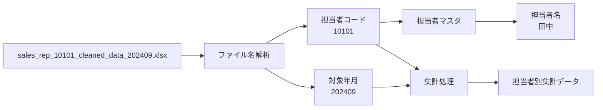
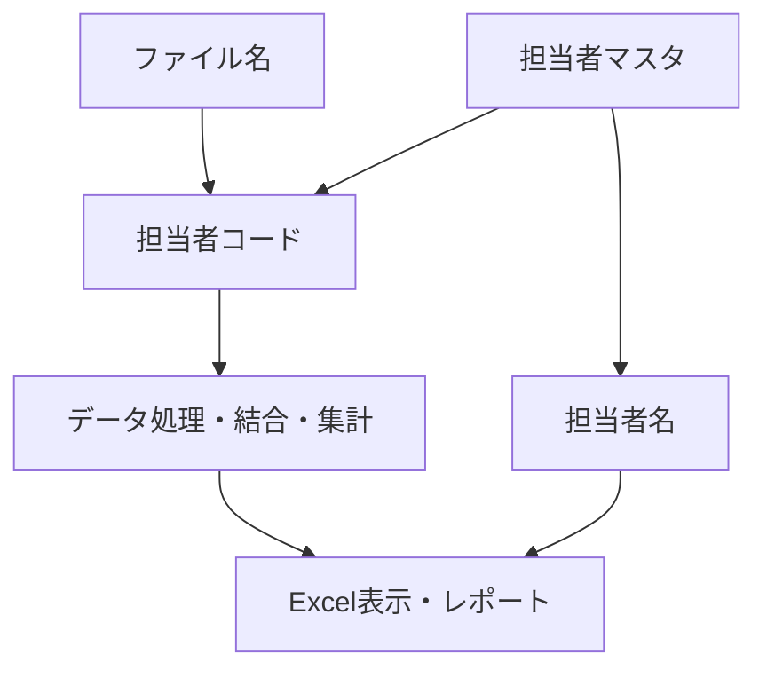
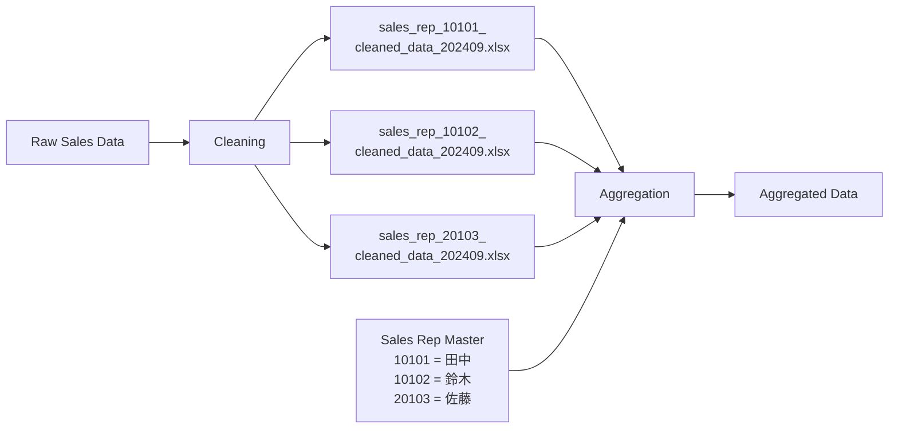

## 概要

今回のチャットでは、売上分析で使用する**クリーンデータのファイル命名規則**について検討した。

想定しているクリーンデータのファイル名は、たとえば次の形式。

```text
sales_rep_tanaka_cleaned_data_202409.xlsx
```

このファイルを基に後続の集計データを作成するにあたり、ファイル名中の担当者識別部分を、

```text
tanaka
```

のような**担当者名**にするか、

```text
10101
```

のような**担当者コード**にするかを検討した。

結論としては、**担当者名より担当者コードを使用する方が適切**という整理になった。

---

## 検討したファイル命名

現在想定している形式は次の通り。

|区分|ファイル名例|
|---|---|
|担当者名を使用|`sales_rep_tanaka_cleaned_data_202409.xlsx`|
|担当者コードを使用|`sales_rep_10101_cleaned_data_202409.xlsx`|

推奨するのは後者。

```text
sales_rep_10101_cleaned_data_202409.xlsx
```

ファイル名の構造として解釈すると、概ね次のようになる。

```text
sales_rep_[担当者コード]_cleaned_data_[対象年月].xlsx
```

例：

```text
sales_rep_10101_cleaned_data_202409.xlsx
```

|要素|意味|
|---|---|
|`sales_rep`|営業担当者単位の売上データ|
|`10101`|担当者コード|
|`cleaned_data`|クレンジング済みデータ|
|`202409`|対象年月|
|`.xlsx`|Excelファイル|

---

## 担当者コードを推奨する理由

### 一意性を確保しやすい

担当者名は、人を識別するための表示名称であり、必ずしも一意とは限らない。

たとえば将来的に、

```text
田中
田中
```

のように同姓の担当者が存在した場合、名前だけでは区別できなくなる可能性がある。

一方、担当者コードが適切に管理されていれば、

```text
10101
10105
```

のように一意に識別できる。

したがって、データ処理上の識別子としては担当者コードの方が安定している。

---

### 担当者名の変更による影響を受けにくい

担当者名は将来的に変更される可能性がある。

たとえば、

- 改姓
- 表記変更
- 漢字・ローマ字表記の変更
- システム上の名称統一

などが発生すると、名前をファイル名に使用している場合は過去ファイルとの名称整合性が崩れる。

```text
sales_rep_tanaka_cleaned_data_202409.xlsx
sales_rep_tanaka_newname_cleaned_data_202410.xlsx
```

のような状態になると、同一人物のデータであるにもかかわらずファイル名上では別担当者のように見える可能性がある。

担当者コードであれば、

```text
sales_rep_10101_cleaned_data_202409.xlsx
sales_rep_10101_cleaned_data_202410.xlsx
```

となり、担当者名が変わっても識別子は維持できる。

---

### Power Queryやスクリプトによる自動処理に向いている

今回のファイルは単純な保管目的ではなく、**クリーンデータを基に後続の集計データを生成する中間データ**として使用する。

そのため、将来的にはPower QueryやPython、VBAなどからファイル名を機械的に解析する可能性がある。

担当者コードを利用すると、

```text
sales_rep_10101_cleaned_data_202409.xlsx
```

から、

```text
10101
```

を抽出して、そのまま担当者IDとして利用できる。

処理イメージは次の通り。



このように、**コードを主キーとして処理し、必要なときだけ担当者名をマスタから取得する**構造にできる。

---

## 担当者名はマスタで管理する

ファイル名から担当者名を完全に排除しても、分析やExcel上では当然担当者名が必要になる。

そのため、

```text
担当者コード → 担当者名
```

の対応を別途マスタで保持する構成が適している。

例：

|SalesRepCode|SalesRepName|
|--:|---|
|10101|田中|
|10102|鈴木|
|20103|佐藤|

ファイル名では、

```text
10101
```

を使用し、表示や集計結果ではマスタを参照して、

```text
田中
```

を取得する。

データ設計としては、次の役割分担になる。



つまり、

- **コード = 識別用**
- **名前 = 表示用**

と役割を分ける。

---

## 名前とコードの比較

今回の用途で比較すると次のようになる。

|観点|担当者名|担当者コード|
|---|---|---|
|人間の可読性|高い|やや低い|
|一意性|低い可能性あり|高い|
|改姓・名称変更への耐性|低い|高い|
|自動処理|やや不向き|向いている|
|マスタとの結合|間接的|直接的|
|長期運用|やや不安定|安定|
|ファイル識別子として|△|◎|

したがって、今回のような**クリーンデータ → 集計データ**という分析パイプラインでは、担当者コードを利用する方が合理的。

---

## 推奨する最終形

今回の検討結果としては、次の命名を基本とするのが適切。

```text
sales_rep_[SalesRepCode]_cleaned_data_[YYYYMM].xlsx
```

具体例：

```text
sales_rep_10101_cleaned_data_202409.xlsx
sales_rep_10102_cleaned_data_202409.xlsx
sales_rep_20103_cleaned_data_202409.xlsx
```

担当者名についてはファイル名に持たせず、担当者マスタで管理する。

全体構造は次のようになる。



## 今回の結論

**`sales_rep_tanaka_cleaned_data_202409.xlsx` より、`sales_rep_10101_cleaned_data_202409.xlsx` のように担当者コードを使用する方が適切。**

特に今回の売上分析では、クリーンデータが後続処理の入力データになるため、ファイル名を人間向けのラベルではなく、**安定した識別子を持つデータ資産として設計する**方が長期的に扱いやすい。

したがって基本方針は、

```text
担当者コード = ファイル・データの識別
担当者名     = マスタ参照による表示
```

とするのが最も整理された構成になる。
