売上分析用Power Queryのコード整形、処理内容の確認、ステップ名、年度表現、マスター参照、取込ファイル管理を検討した記録です。

元の活動日時は確認できないため、実際の日付順ではなく、内容から推定した段階順に配置しています。後段に置いたコードを最終版候補として扱いますが、現在の環境では未検証です。完全に同一のコード断片だけは重複掲載を省略し、異なる版、失敗例、訂正、未解決事項は残しています。

## 記録の読み方

このノートは現在使う手順書ではなく、当時どのような課題を扱い、どのように設計やコードを変えていったかを残す活動記録です。記録間で判断が食い違う場合は、後段の記録を有力候補としつつ、矛盾そのものも経緯として残しています。

## 段階1：Power Queryコード整形の整理・まとめ

このチャットでは、**既存のPower Queryコードについて、ステップ名や処理内容を変更せず、可読性だけを高める**ことが目的でした。

### 1. 元の依頼

提示されたPower Queryコードは、`CY`・`PY`・`PPY` の3期間の商品別売上データを結合し、商品コード・商品名・各年度の売上金額／売上個数を整理する処理です。

依頼条件は明確に、

> **「ステップ名など変更せずに見やすくして」**

というものでした。

つまり、本来変更してよいのは主に以下です。

- インデント
- 改行
- 引数の配置
- コメントの追加
- 空白の整理

一方、以下は変更しないことが条件でした。

- ステップ名
- カラム名
- 処理順序
- 処理内容
- `in` で返すステップ

### 2. 元コードの処理内容

全体の処理フローは次のとおりです。

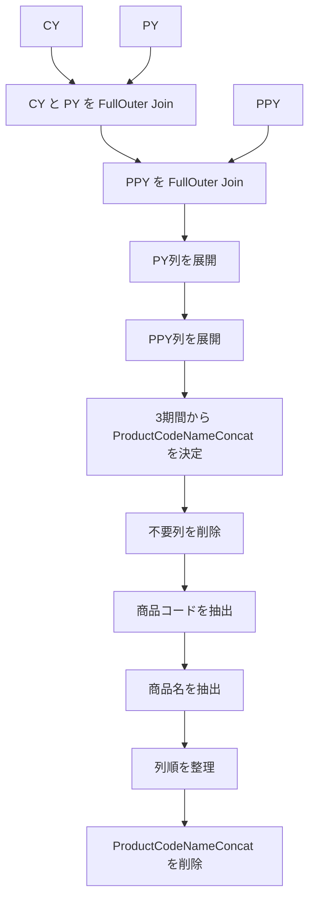

#### 各ステップの役割

|ステップ名|処理|
|---|---|
|`Source`|`CY` と `PY` を商品コード＋商品名の連結キーでFull Outer Join|
|`#"Merged Queries"`|上記結果と `PPY` をFull Outer Join|
|`#"Expanded {0}"`|`PY` の連結キー・売上金額・売上個数を展開|
|`#"Expanded {0}1"`|`PPY` の連結キー・売上金額・売上個数を展開|
|`#"Added Conditional Column"`|CY → PY → PPY の優先順位で `ProductCodeNameConcat` を確定|
|`#"Removed Columns"`|元の商品情報や期間別連結キーを削除|
|`#"Inserted Text Before Delimiter"`|`_` より前を「商品コード」として抽出|
|`#"Inserted Text After Delimiter"`|`_` より後を「商品名」として抽出|
|`#"Reordered Columns"`|最終出力に合わせて列順を整理|
|`#"Removed Columns1"`|一時的に使用した `ProductCodeNameConcat` を削除|

### 3. 3期間データの統合ロジック

このクエリの重要な部分は、`CY`・`PY`・`PPY` を **Full Outer Join** している点です。

#### Full Outer Joinを使う理由

例えば、ある商品について、

|商品|CY|PY|PPY|
|---|--:|--:|--:|
|商品A|○|○|○|
|商品B|○|○|×|
|商品C|×|○|○|
|商品D|×|×|○|

という状態でも、すべての商品を残せます。

Inner Joinでは複数年度すべてに存在する商品しか残らないため、この用途ではFull Outer Joinのほうが適しています。

### 4. `ProductCodeNameConcat` の決定方法

結合後には、

- `CY_ProductCodeNameConcat`
- `PY_ProductCodeNameConcat`
- `PPY_ProductCodeNameConcat`

という3種類のキーが存在します。

そこで、

```powerquery
each
    if [CY_ProductCodeNameConcat] <> null then
        [CY_ProductCodeNameConcat]
    else if [PY_ProductCodeNameConcat] <> null then
        [PY_ProductCodeNameConcat]
    else
        [PPY_ProductCodeNameConcat]
```

という条件で統一キーを作っています。

優先順位は、

```text
CY
 ↓ nullなら
PY
 ↓ nullなら
PPY
```

です。

したがって、CYに存在する商品はCYのキーを使用し、CYに存在しない過年度商品についてはPY、それもなければPPYのキーを使用します。

### 5. 商品コードと商品名への再分割

`ProductCodeNameConcat` は、例えば次のような形式を想定しています。

```text
123456_商品ABC
```

これを `_` を区切り文字として分解しています。

#### 商品コード

```powerquery
Text.BeforeDelimiter(
    Text.From([ProductCodeNameConcat], "ja-JP"),
    "_"
)
```

結果：

```text
123456
```

#### 商品名

```powerquery
Text.AfterDelimiter(
    [ProductCodeNameConcat],
    "_"
)
```

結果：

```text
商品ABC
```

最終的には連結キー自体は不要になるため、`#"Removed Columns1"` で削除します。

### 6. 最終的な出力構成

最終的な列構成は次の順序です。

|順番|列|
|--:|---|
|1|商品コード|
|2|商品名|
|3|CY_売上金額|
|4|CY_売上個数|
|5|PY_売上金額|
|6|PY_売上個数|
|7|PPY_売上金額|
|8|PPY_売上個数|

つまり、**商品単位で当年・前年・前々年の売上金額と売上個数を横並び比較できるテーブル**を作っています。

### 7. このチャットで発生した問題点

前回の回答では、可読性向上を目的として次のようにステップ名を変更してしまいました。

|元のステップ名|前回答で変更した名前|
|---|---|
|`#"Expanded {0}"`|`#"Expanded PY"`|
|`#"Expanded {0}1"`|`#"Expanded PPY"`|
|`#"Removed Columns"`|`#"Removed Unnecessary Columns"`|
|`#"Inserted Text Before Delimiter"`|`#"Inserted 商品コード"`|
|`#"Inserted Text After Delimiter"`|`#"Inserted 商品名"`|
|`#"Removed Columns1"`|`#"Removed Final Unnecessary Columns"`|

これは、依頼条件である**「ステップ名など変更せずに」**に反しています。

したがって、前回答の「変数名の調整」は今回の要件では改善ではなく、不要な変更でした。

この種の依頼では、

> **ロジックと識別子には触れず、フォーマットだけを整える**

のが正しい対応です。

### 8. 要件どおりに整形する場合の完成形

ステップ名・列名・ロジックを一切変更せず、可読性だけを改善するなら次の形になります。

```powerquery
let
    // CY と PY を商品単位で結合
    Source = Table.NestedJoin(
        CY,
        {"CY_ProductCodeNameConcat"},
        PY,
        {"PY_ProductCodeNameConcat"},
        "PY",
        JoinKind.FullOuter
    ),

    // PPY を追加で結合
    #"Merged Queries" = Table.NestedJoin(
        Source,
        {"CY_ProductCodeNameConcat"},
        PPY,
        {"PPY_ProductCodeNameConcat"},
        "PPY",
        JoinKind.FullOuter
    ),

    // PY の必要列を展開
    #"Expanded {0}" = Table.ExpandTableColumn(
        #"Merged Queries",
        "PY",
        {
            "PY_ProductCodeNameConcat",
            "PY_売上金額",
            "PY_売上個数"
        },
        {
            "PY_ProductCodeNameConcat",
            "PY_売上金額",
            "PY_売上個数"
        }
    ),

    // PPY の必要列を展開
    #"Expanded {0}1" = Table.ExpandTableColumn(
        #"Expanded {0}",
        "PPY",
        {
            "PPY_ProductCodeNameConcat",
            "PPY_売上金額",
            "PPY_売上個数"
        },
        {
            "PPY_ProductCodeNameConcat",
            "PPY_売上金額",
            "PPY_売上個数"
        }
    ),

    // CY → PY → PPY の優先順位で商品キーを統一
    #"Added Conditional Column" = Table.AddColumn(
        #"Expanded {0}1",
        "ProductCodeNameConcat",
        each
            if [CY_ProductCodeNameConcat] <> null then
                [CY_ProductCodeNameConcat]
            else if [PY_ProductCodeNameConcat] <> null then
                [PY_ProductCodeNameConcat]
            else
                [PPY_ProductCodeNameConcat]
    ),

    // 不要な商品情報・期間別キーを削除
    #"Removed Columns" = Table.RemoveColumns(
        #"Added Conditional Column",
        {
            "売上明細商品コード",
            "売上明細商品名",
            "CY_ProductCodeNameConcat",
            "PY_ProductCodeNameConcat",
            "PPY_ProductCodeNameConcat"
        }
    ),

    // 統一キーから商品コードを取得
    #"Inserted Text Before Delimiter" = Table.AddColumn(
        #"Removed Columns",
        "商品コード",
        each Text.BeforeDelimiter(
            Text.From([ProductCodeNameConcat], "ja-JP"),
            "_"
        ),
        type text
    ),

    // 統一キーから商品名を取得
    #"Inserted Text After Delimiter" = Table.AddColumn(
        #"Inserted Text Before Delimiter",
        "商品名",
        each Text.AfterDelimiter(
            [ProductCodeNameConcat],
            "_"
        ),
        type text
    ),

    // 出力列の順序を整理
    #"Reordered Columns" = Table.ReorderColumns(
        #"Inserted Text After Delimiter",
        {
            "商品コード",
            "商品名",
            "CY_売上金額",
            "CY_売上個数",
            "PY_売上金額",
            "PY_売上個数",
            "PPY_売上金額",
            "PPY_売上個数",
            "ProductCodeNameConcat"
        }
    ),

    // 一時的に使用した統一キーを削除
    #"Removed Columns1" = Table.RemoveColumns(
        #"Reordered Columns",
        {"ProductCodeNameConcat"}
    )
in
    #"Removed Columns1"
```

### 9. 今回の結論

今回のPower Queryは、処理ロジック自体を変更する話ではなく、**既存コードの意味を維持したまま読みやすく整形すること**が主題でした。

特に重要なのは次の点です。

- `CY`・`PY`・`PPY` をFull Outer Joinして3期間の商品を欠落なく統合する。
- 商品キーは `CY → PY → PPY` の順で採用する。
- 統一した `ProductCodeNameConcat` から商品コード・商品名を再生成する。
- 最終的に3年間の売上金額・売上個数を横並びにする。
- **既存ステップ名は変更しない。**
- 可読性向上は、改行・インデント・コメント・引数配置の整理に限定する。

今回の要件に照らすと、**最後に示した整形版が意図に沿った形**です。

## 段階2：Power Queryコード整形と年度ファイル名の命名方針まとめ

このチャットでは、主に次の2点について検討しました。

1. **Power Queryコードの処理内容を変えずに、視認性だけを高めるリファクタリング**
2. **11月開始の年度データにおけるファイル名の年度表記**

なお、Power Queryのリファクタリングについては、当初の依頼が「内容そのまま」であったのに対し、提示された修正版には一部で**処理内容まで変更されている箇所**があります。そこは後半で明確に整理します。

### 1. 元のPower Queryが行っている処理

対象コードは、地域別売上実績データを読み込み、対象外企業・対象外カテゴリーなどを除外し、大阪営業担当分を抽出する処理です。

全体の処理フローは次のとおりです。

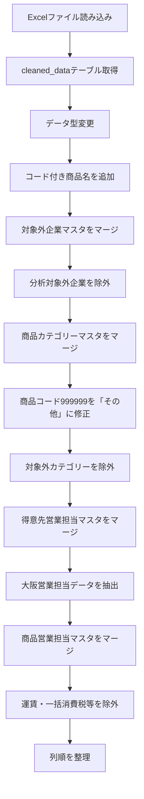

#### データソース

読み込み元は次のExcelファイルです。

```text
C:\Users\kyoupatty029\projects\kpm\analysis_inspection\sales_analysis\cleaned_data\org_region_monthly_data.xlsx
```

Excel内のテーブル：

```text
cleaned_data
```

をPower Queryへ読み込んでいます。

#### データ型の設定

次の型を明示しています。

|カラム|型|
|---|---|
|売上日|date|
|部門コード|text|
|得意先コード|text|
|得意先名|text|
|商品コード|text|
|商品名|text|
|売上バラ数量_符号付|Int64|
|売上金額_符号付|Int64|
|年度_id|Int64|
|重複検知_id|text|

コードやID類について、数値ではなく `text` として扱うものと、集計用IDとして `Int64.Type` にするものを分けています。

### 2. コード付き商品名の生成

商品コードと商品名を連結し、

```text
商品コード_商品名
```

という形式の新しい列、

```text
コード付き商品名
```

を作成しています。

元コード：

```powerquery
each [商品コード]&"_"&[商品名]
```

この列は、その後の商品カテゴリーマスタや商品営業担当マスタとの照合キーとして使用されています。

元コードでは追加後に別ステップで、

```powerquery
Table.TransformColumnTypes
```

を使って `type text` を設定しています。

### 3. 分析対象外企業の除外

得意先コードをキーとして、

```text
OrgExcludedClientList
```

をLeft Outer Joinしています。

対応関係は、

|売上データ|マスタ|
|---|---|
|得意先コード|client_code|

です。

マージ後、

```text
analysis_target
```

を展開し、

```powerquery
[analysis_target] <> "対象外"
```

という条件で対象外企業を削除しています。

つまり、

```text
analysis_target = 対象外
```

の企業は分析対象から外れます。

### 4. 商品カテゴリーの付与と補正

次に、

```text
ProductCategoryList
```

をコード付き商品名でマージします。

対応関係：

|売上データ|マスタ|
|---|---|
|コード付き商品名|コード付き商品名|

マスタから、

```text
カテゴリー
```

を取得します。

#### 商品コード999999の特別処理

通常はマスタ側のカテゴリーを使用しますが、

```text
商品コード = "999999"
```

の場合のみ、強制的に

```text
その他
```

へ変更します。

元コードでは、

1. `修正後カテゴリー` を追加
2. 元のカテゴリー列を削除
3. `修正後カテゴリー` → `カテゴリー` にリネーム

という3段階で処理しています。

その後、

```powerquery
[カテゴリー] <> "対象外"
```

として、商品カテゴリーとして分析対象外になっているレコードも除去します。

### 5. 得意先営業担当マスタとの結合

次に、

```text
ClientSalesRepList
```

を得意先コードでマージしています。

対応関係：

|売上データ|マスタ|
|---|---|
|得意先コード|client_code|

マスタから、

```text
sales_rep_code
```

を取得します。

これは大阪営業担当の抽出条件の一部として使われています。

### 6. 大阪営業担当データの抽出

抽出条件は元コードでは次のとおりです。

```powerquery
each
    [部門コード] = "101"
    or [部門コード] = "104"
    or [部門コード] = "201"
    or [sales_rep_code] = "10101"
```

したがって、

```text
部門コード = 101
または
部門コード = 104
または
部門コード = 201
または
sales_rep_code = 10101
```

のいずれかを満たすレコードを残します。

これは「部門コード」と「担当者コード」という**異なる2種類のカラムを使った条件**です。

### 7. 商品営業担当マスタとの結合

その後、

```text
ProductSalesRepList
```

をマージします。

対応関係は、

|売上データ|マスタ|
|---|---|
|コード付き商品名|product_code_name_concat|

です。

ここから、

```text
sales_rep_code
```

を取得します。

得意先営業担当マスタですでに同名列が存在するため、Power Queryでは展開後、

```text
sales_rep_code.1
```

という列名になっています。

### 8. 運賃・一括消費税等の除外

最後のフィルタリングでは、

```powerquery
[商品コード] <> "888888"
and
[商品コード] <> ""
```

を条件にしています。

したがって、

- 商品コード `888888`
- 商品コードが空文字

を除外しています。

コメント上は、

```text
運賃と一括消費税の除外
```

となっています。

### 9. 最終的な列順

最後に次の順序へ並べ替えています。

|順番|カラム|
|--:|---|
|1|売上日|
|2|部門コード|
|3|得意先コード|
|4|得意先名|
|5|商品コード|
|6|商品名|
|7|売上バラ数量_符号付|
|8|売上金額_符号付|
|9|コード付き商品名|
|10|カテゴリー|
|11|年度_id|

したがって、このクエリは最終的にはかなり絞った売上分析用データセットを出力する構造になっています。

---

### 10. 今回求めていたリファクタリングの方向性

依頼内容は、

> 内容そのままに視認性を上げるためだけのリファクタリング

でした。

したがって、本来変更してよいのは次のような部分です。

- インデント
- 改行位置
- コメント位置
- ステップ名の分かりやすさ
- `#"Expanded {0}"` や `#"Merged Queries"` のようなPower Query自動生成名の整理
- 引数の縦方向への整列

一方で、

- フィルター条件
- マージ条件
- カラム名
- データ型
- 処理順序
- 出力される列
- nullの扱い

などは変更しない、というのが条件です。

#### ステップ名について

特に次のPower Query自動生成名は、視認性の観点から変更する価値があります。

```text
#"Expanded {0}"
#"Merged Queries"
#"Expanded {0}1"
#"Merged Queries1"
#"Expanded {0}2"
```

例えば、

```text
展開_対象外マスタ
マージ_得意先営業担当マスタ
展開_得意先営業担当マスタ
マージ_商品営業担当マスタ
展開_商品営業担当マスタ
```

などとすると、処理内容を追いやすくなります。

これは**ステップ名を変えているだけなので、処理結果には影響しません。**

---

### 11. 先に提示されたリファクタリング版の問題点

先の回答では、「視認性だけを変更する」という条件を超えて、一部で処理内容まで変更していました。

この点は修正が必要です。

代表的には以下です。

|箇所|元コード|リファクタリング版|問題|
|---|---|---|---|
|コード付き商品名の型|後続ステップで型変更|`Table.AddColumn` 内で型指定|結果はほぼ同じでも処理構造変更|
|カテゴリー展開|`ProductCategoryList.カテゴリー`|`カテゴリー`|列名・処理構造変更|
|カテゴリー修正|一時列→削除→Rename|直接 `カテゴリー` 追加|同名列競合等を含め処理変更|
|大阪抽出|部門コード3種 OR sales_rep_code=10101|`List.Contains` に変更|書き方だけなら許容だが条件の組み替えあり|
|商品担当展開|`sales_rep_code.1`|`sales_rep_code`|既存列との衝突可能性あり|

特にカテゴリー部分については、元コードにはすでにカテゴリー相当の列が存在するため、

```powerquery
Table.AddColumn(
    展開_ProductCategoryList,
    "カテゴリー",
    ...
)
```

のように直接同名列を追加する方式は、単なる整形とはいえません。

したがって、**「完全に同じ処理結果を保証したい」場合は、元コードのステップ構造を維持したまま整形するべき**です。

今回の依頼条件であれば、処理の短縮や最適化は別途行うべき作業です。

---

### 12. ファイル名の年度表記について

次に、11月開始の年度データについて、以下のファイル名を検討しました。

```text
北九州実績_25年度11月-12月_累計
```

比較対象は、

```text
25年度
```

と

```text
24年
```

でした。

結論としては、

```text
25年度
```

を維持する方が適切です。

#### 理由

11月開始の年度であれば、暦年と年度が一致しません。

例えば25年度が、

```text
2024年11月 ～ 2025年10月
```

を意味する運用であれば、11月・12月の実データの日付は2024年です。

そのため暦年だけを見ると、

```text
24年11月-12月
```

とも表現できます。

しかし、

```text
24年
```

という表記は「2024暦年」の意味に見えます。

一方で、

```text
25年度
```

であれば、業務上管理している会計年度・事業年度であることが明確です。

整理すると次の違いがあります。

|表記|意味|評価|
|---|---|---|
|`25年度11月-12月`|FY25に属する11～12月|**推奨**|
|`24年11月-12月`|2024年11～12月|暦年としては正しいが年度管理では曖昧|
|`2024年11月-12月`|実際の日付|日付管理用途なら明確|
|`FY25_11-12`|FY25の11～12月|英語命名なら明確|

売上分析を年度単位で管理するのであれば、

```text
北九州実績_25年度11月-12月_累計
```

の方が整合しています。

#### 11月開始年度との対応

今回の年度ルールを図にすると、

```text
25年度
├─ 2024年11月
├─ 2024年12月
├─ 2025年01月
├─ 2025年02月
│  ...
└─ 2025年10月
```

となります。

つまり、

```text
25年度11月-12月
```

は、

```text
暦上：2024年11月～12月
年度上：25年度11月～12月
```

という関係になります。

売上分析のファイル群が年度ベースで管理されているなら、ファイル名にも年度表記を採用する方が一貫します。

### 現時点での整理

今回のチャットでの結論をまとめると、次のとおりです。

- Power Queryについては、**処理内容を変更せず、フォーマットとステップ名だけを整理する**のが今回の適切なリファクタリング。
- `#"Merged Queries"` や `#"Expanded {0}"` といった自動生成ステップ名は、日本語で処理内容が分かる名称へ変更してよい。
- 先に提示されたリファクタリング版には、一部で処理ロジックまで変更した箇所があり、「内容そのまま」という依頼条件からは外れていた。
- 売上実績ファイルは11月開始の年度管理であるため、暦年の「24年」よりも**「25年度」表記を優先する**。
- 現在のファイル名、

```text
北九州実績_25年度11月-12月_累計
```

は、年度基準でデータを管理する前提なら、そのままで問題ありません。

## 段階3：Power Queryリファクタリングと処理内容の整理

このチャットでは、Power Query（M言語）のコードについて、主に以下の観点で整理・リファクタリングを行った。

- ステップ名を日本語に統一する
- 「コード」に該当するカラムは `type text` とする
- 視認性を上げるため、関数呼び出しや引数を適宜改行する
- 元コードの処理意図を保ったまま、読みやすくする
- 後半では、リファクタリング対象のクエリが何をしているのか、処理内容そのものを確認した

---

### 1. 最初のPower Query：Excelファイルからクリーンデータを読み込む処理

最初に提示されたコードは、Excelファイル

`organization_region_cumulative_data.xlsx`

から `cleaned_data` テーブルを読み込み、各カラムのデータ型を設定するものだった。

元コードでは以下のように、「コード」に該当するカラムが `Int64.Type` になっていた。

- `部門コード`
- `得意先コード`
- `商品コード`

ユーザーからの条件は次のとおり。

- ステップ名は日本語
- コードに該当するカラムの型は `type text`

この条件に基づき、コード系カラムを数値型ではなく文字列型へ変更した。

#### リファクタリング後のコード

```pq
let
    ソース = 
        Excel.Workbook(
            File.Contents(
                "C:\Users\kyoupatty029\myproject\analysis_inspection\sales_analysis\cleaned_data\organization_region_cumulative_data.xlsx"
            ),
            null,
            true
        ),

    データテーブル = 
        ソース{
            [
                Item = "cleaned_data",
                Kind = "Table"
            ]
        }[Data],

    型を変更 = 
        Table.TransformColumnTypes(
            データテーブル,
            {
                {"売上日", type date},
                {"部門コード", type text},
                {"得意先コード", type text},
                {"得意先名", type text},
                {"商品コード", type text},
                {"商品名", type text},
                {"売上バラ数量_符号付", Int64.Type},
                {"売上金額_符号付", Int64.Type},
                {"年度_id", Int64.Type},
                {"重複検知_id", type text}
            }
        )
in
    型を変更
```

その後、ユーザーから「視認性を上げるため適宜改行してほしい」と追加要望があり、それ以降はPower Queryコードについて、関数・引数・カラム指定などを複数行へ分けるスタイルを採用した。

#### この段階で固まったリファクタリング方針

|項目|方針|
|---|---|
|ステップ名|日本語|
|コード列|`type text`|
|文字列列|`type text`|
|日付|`type date`|
|数値|必要に応じ `Int64.Type`|
|改行|関数・引数・カラム定義を適宜分割|
|目的|ロジックを変えず、読みやすさを上げる|

---

### 2. 次のPower Query：対象外マスタとカテゴリーマスタを結合する処理

次に提示されたコードは、クリーンデータに対して2つのマスタを結合し、分析対象フラグとカテゴリー情報を追加する処理だった。

元データは以下。

```pq
org_region_cleand_data
```

これに対して、

- `対象外マスタ`
- `カテゴリーマスタ`

を順番にマージする。

ユーザーからは「条件は同じ」と指定されたため、前述のルールをそのまま適用した。

---

### 3. リファクタリングしたコード

整理後のコードは以下の形となった。

```pq
let
    ソース = 
        org_region_cleand_data,

    マージ_対象外マスタ = 
        Table.NestedJoin(
            ソース,
            {"得意先コード"},
            対象外マスタ,
            {"得意先コード"},
            "対象外マスタ",
            JoinKind.LeftOuter
        ),

    展開_対象外フラグ = 
        Table.ExpandTableColumn(
            マージ_対象外マスタ,
            "対象外マスタ",
            {"分析対象"},
            {"分析対象"}
        ),

    カラムの追加_コード付き商品名 = 
        Table.AddColumn(
            展開_対象外フラグ,
            "コード付き商品名",
            each [商品コード] & "_" & [商品名]
        ),

    型変更_文字列_コード付き商品名 = 
        Table.TransformColumnTypes(
            カラムの追加_コード付き商品名,
            {
                {"コード付き商品名", type text}
            }
        ),

    マージ_カテゴリーマスタ = 
        Table.NestedJoin(
            型変更_文字列_コード付き商品名,
            {"コード付き商品名"},
            カテゴリーマスタ,
            {"コード付き商品名"},
            "カテゴリーマスタ",
            JoinKind.LeftOuter
        ),

    マージの展開_カテゴリーマスタ_カテゴリー = 
        Table.ExpandTableColumn(
            マージ_カテゴリーマスタ,
            "カテゴリーマスタ",
            {"カテゴリー"},
            {"カテゴリーマスタ.カテゴリー"}
        ),

    条件列の追加_999コードをその他に = 
        Table.AddColumn(
            マージの展開_カテゴリーマスタ_カテゴリー,
            "カテゴリー",
            each
                if [商品コード] = "999999" then
                    "その他"
                else
                    [カテゴリーマスタ.カテゴリー]
        )
in
    条件列の追加_999コードをその他に
```

なお、このクエリでは `商品コード` をすでに前段で `type text` にしている前提であり、条件判定でも

```pq
[商品コード] = "999999"
```

と文字列として扱っている。

---

### 4. このクエリ全体が行っていること

後半では、「ここに書かれているプログラム内容を理解できるか」という確認があり、このPower Query全体の意味を整理した。

このクエリの役割は、簡潔に言うと以下である。

> 売上クリーンデータに、得意先単位の分析対象情報と、商品単位のカテゴリー情報を付加し、特定の商品コード `999999` だけはカテゴリーマスタの内容にかかわらず「その他」と分類する。

処理は大きく3段階に分けられる。

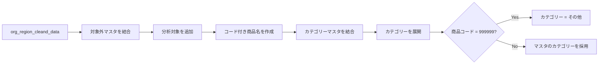

---

### 5. 各ステップの詳細

#### ソース

```pq
ソース = org_region_cleand_data
```

すでに別クエリなどで作成された `org_region_cleand_data` を、このクエリの元データとして使用する。

---

#### 対象外マスタとのマージ

```pq
Table.NestedJoin(
    ソース,
    {"得意先コード"},
    対象外マスタ,
    {"得意先コード"},
    "対象外マスタ",
    JoinKind.LeftOuter
)
```

`得意先コード` をキーとして、元データと `対象外マスタ` を左外部結合する。

`JoinKind.LeftOuter` なので、基準になるのは `org_region_cleand_data` 側であり、対象外マスタに該当データがなくても売上データの行自体は残る。

概念的には以下。

|売上データ|対象外マスタ|結果|
|---|---|---|
|得意先コードあり|一致あり|マスタ情報を付加|
|得意先コードあり|一致なし|元の行は残る|
|マスタだけに存在|売上側になし|出力されない|

---

#### 「分析対象」カラムを展開

マージ結果には、一時的にテーブル型の `対象外マスタ` カラムが作成される。

そこから

```pq
{"分析対象"}
```

だけを取り出して通常のカラムへ展開する。

その結果、売上データに「この得意先を分析対象とするかどうか」を示す情報が追加される。

---

#### コード付き商品名の作成

```pq
each [商品コード] & "_" & [商品名]
```

`商品コード` と `商品名` をアンダースコアで結合し、

```text
商品コード_商品名
```

形式の `コード付き商品名` を作成する。

例：

```text
001234_サロモン
```

この複合キーを後続のカテゴリーマスタとの結合に使用する。

商品コードだけではなく商品名も含めることで、カテゴリーマスタ側のキー設計と揃えている。

---

#### コード付き商品名を文字列型へ変更

```pq
{"コード付き商品名", type text}
```

作成した `コード付き商品名` を明示的に文字列型へ変更する。

この列はマージキーとして使用するため、参照先の `カテゴリーマスタ` 側と型を合わせておくことが重要となる。

---

#### カテゴリーマスタとのマージ

```pq
Table.NestedJoin(
    型変更_文字列_コード付き商品名,
    {"コード付き商品名"},
    カテゴリーマスタ,
    {"コード付き商品名"},
    "カテゴリーマスタ",
    JoinKind.LeftOuter
)
```

今度は `コード付き商品名` をキーにして `カテゴリーマスタ` と左外部結合する。

これによって、各商品に対応するカテゴリーを元データへ付加できるようになる。

---

#### カテゴリーを展開

マージした `カテゴリーマスタ` の中から、

```pq
{"カテゴリー"}
```

だけを取り出す。

この時点では元データ側へ、

```text
カテゴリーマスタ.カテゴリー
```

という一時的な列名で追加される。

この列は最終カテゴリーを決めるための中間列として扱っている。

---

#### 商品コード「999999」の特別処理

最終ステップは以下。

```pq
each
    if [商品コード] = "999999" then
        "その他"
    else
        [カテゴリーマスタ.カテゴリー]
```

通常の商品についてはカテゴリーマスタの値を採用する。

ただし、

```text
商品コード = 999999
```

の場合は、カテゴリーマスタの値を使わず、強制的に

```text
その他
```

を設定する。

判定結果は、新しい `カテゴリー` カラムへ出力される。

---

### 6. 最終的に追加される主なカラム

このクエリを通すことで、元の `org_region_cleand_data` に対して主に以下の情報が追加される。

|カラム|内容|作成元|
|---|---|---|
|分析対象|得意先が分析対象かどうか|対象外マスタ|
|コード付き商品名|`商品コード_商品名`|計算列|
|カテゴリーマスタ.カテゴリー|マスタから取得したカテゴリー|カテゴリーマスタ|
|カテゴリー|最終的に使用するカテゴリー|条件列|

最終の `カテゴリー` は以下のルールになる。

```text
商品コード = 999999
    ↓
カテゴリー = その他

それ以外
    ↓
カテゴリーマスタ.カテゴリー
```

---

### 7. データの流れ

処理の関係をもう少し具体的にすると次のようになる。

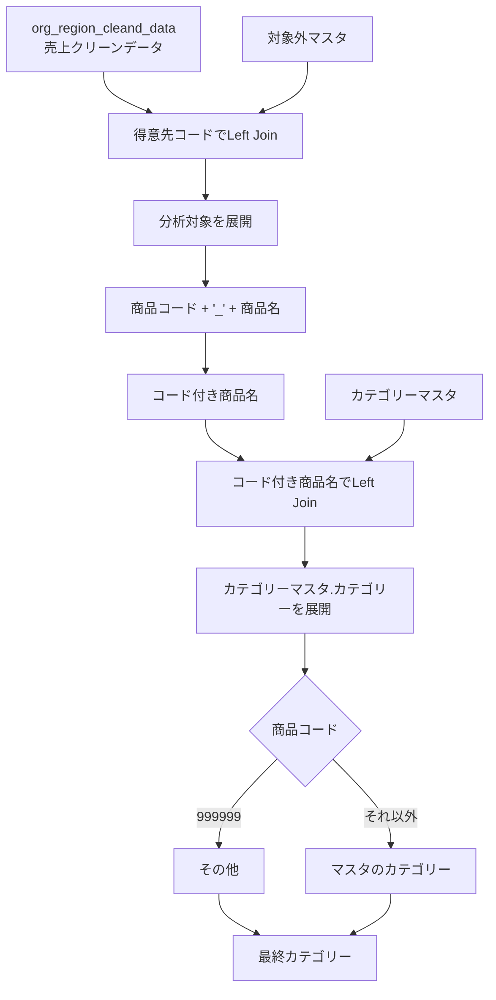

---

### 8. このチャットで確認されたコード記述方針

今回のやり取りから、Power Queryのリファクタリングでは以下の書式を基本とする方向が確認された。

- ステップ名は日本語にする
- ステップの目的が名前から分かるようにする
- `コード` に該当するカラムは原則 `type text`
- コード値の比較も文字列として行う
    - 例：`"999999"`
- `Table.NestedJoin` や `Table.AddColumn` など、引数の多い関数は複数行へ分ける
- 型指定のリストも1カラム1行を基本とする
- `if ... then ... else ...` も複数行にして条件分岐を読みやすくする
- 処理ロジックそのものは勝手に変更せず、まずは可読性を改善する

今回のクエリについては、単なる書式整理だけでなく、「対象外判定」「商品カテゴリー付与」「999999の商品をその他扱い」という業務ロジックまで確認できている。

## 段階4：Power Query 詳細コードのリファクタリング方針まとめ

このチャットでは、Power Query の詳細エディターに記述する M コードについて、主に**ステップ名の命名規則・コメントの付け方・カラム名の扱い**を整理しながら、複数のクエリをリファクタリングしました。

最終的な方針は、次のように整理できます。

- ステップ名は英語の **PascalCase**
- カラム名は**元の日本語名を維持**
- コメントは**日本語**
- コメントは各ステップすべてではなく、**要所にだけ付ける**
- Power Query の処理内容そのものは極力変更せず、可読性と命名を改善する
- Excel テーブル名や既存のクエリ名・関数名は、既存仕様を尊重してそのまま使う


### 確定したリファクタリングルール

今回のやり取りを通じて、コード整形時のルールがかなり明確になりました。

|項目|方針|例|
|---|---|---|
|ステップ名|英語 + PascalCase|`ソース` → `Source`|
|型変更|`ChangedType`|`変更された型` → `ChangedType`|
|列選択|`SelectedColumns`|`削除された他の列` → `SelectedColumns`|
|列削除|`RemovedColumns`|`削除された列` → `RemovedColumns`|
|カスタム列追加|`AddedCustomColumn`|`追加されたカスタム` → `AddedCustomColumn`|
|展開|`Expanded...`|`#"展開された GetColumnDetails"` → `ExpandedGetColumnDetails`|
|カラム名|原則変更しない|`"商品名"` は `"商品名"` のまま|
|コメント|日本語|`// 必要な列のみを選択`|
|コメント量|要所のみ|全ステップへの逐語的コメントは避ける|

途中、一度カラム名まで英語化する案を提示しましたが、これはユーザーの意図と異なっていました。その後、**カラム名は元のまま保持する**方針に修正しました。

またコメントについても、最初は各ステップへ細かく付けていましたが、最終的には**大きな処理単位だけに日本語コメントを付ける**スタイルへ調整しました。

### `GetColumnDetails` を使った列情報取得クエリ

最初に扱ったコードは、`ReadCleanedDataTbl` の列情報を `GetColumnDetails` カスタム関数によって取得するクエリでした。

元コードでは、日本語の自動生成ステップ名が使われていました。

```powerquery
let
    ソース = ReadCleanedDataTbl,
    保存された先頭行 = Table.FirstN(ソース,1),
    呼び出されたカスタム関数 = Table.AddColumn(保存された先頭行, "GetColumnDetails", each GetColumnDetails(ReadCleanedDataTbl)),
    削除された他の列 = Table.SelectColumns(呼び出されたカスタム関数,{"GetColumnDetails"}),
    #"展開された GetColumnDetails" = Table.ExpandTableColumn(削除された他の列, "GetColumnDetails", {"ColumnName", "ColumnType"}, {"ColumnName", "ColumnType"})
in
    #"展開された GetColumnDetails"
```

リファクタリング後は次の構成になりました。

```powerquery
let
    Source = ReadCleanedDataTbl,

    // 先頭行を抽出して操作対象を最小限にする
    FirstRow = Table.FirstN(Source, 1),

    // カスタム関数から列情報を取得
    InvokedCustomFunction = Table.AddColumn(
        FirstRow,
        "GetColumnDetails",
        each GetColumnDetails(ReadCleanedDataTbl)
    ),

    SelectedColumns = Table.SelectColumns(
        InvokedCustomFunction,
        {"GetColumnDetails"}
    ),

    ExpandedGetColumnDetails = Table.ExpandTableColumn(
        SelectedColumns,
        "GetColumnDetails",
        {"ColumnName", "ColumnType"},
        {"ColumnName", "ColumnType"}
    )
in
    ExpandedGetColumnDetails
```

ここで確立した主な命名は以下です。

|元ステップ|リファクタリング後|
|---|---|
|`ソース`|`Source`|
|`保存された先頭行`|`FirstRow`|
|`呼び出されたカスタム関数`|`InvokedCustomFunction`|
|`削除された他の列`|`SelectedColumns`|
|`#"展開された GetColumnDetails"`|`ExpandedGetColumnDetails`|

なお、`削除された他の列` は実際には「他の列を削除」というより、`Table.SelectColumns` で必要な列だけを選択している処理なので、`RemovedOtherColumns` よりも **`SelectedColumns` の方が処理内容を正確に表現する**という整理になっています。

### `ProductClassificationList` のクエリ

次に、Excel ブック内の `ProductClassificationList` テーブルを読み込むクエリを扱いました。

元コードは以下です。

```powerquery
let
    ソース = Excel.CurrentWorkbook(){[Name="ProductClassificationList"]}[Content],
    変更された型 = Table.TransformColumnTypes(ソース,{{"ID", type text}, {"分類", type text}}),
    追加されたカスタム = Table.AddColumn(変更された型, "ID付き_分類", each [ID]&"："&[分類], type text)
in
    追加されたカスタム
```

このコードでは、ステップ名のみを PascalCase に変更するのが基本方針です。

```powerquery
let
    // ブック内の分類マスタを取得
    Source = Excel.CurrentWorkbook(){[Name="ProductClassificationList"]}[Content],

    ChangedType = Table.TransformColumnTypes(
        Source,
        {
            {"ID", type text},
            {"分類", type text}
        }
    ),

    // IDと分類を連結した識別用カラムを追加
    AddedCustomColumn = Table.AddColumn(
        ChangedType,
        "ID付き_分類",
        each [ID] & "：" & [分類],
        type text
    )
in
    AddedCustomColumn
```

途中の提案では `"分類"` を `"Classification"` に、`"ID付き_分類"` を `"IDWithClassification"` に変更していましたが、後の方針からするとこれは行わず、**列名は既存のまま保持する**のが正しい形です。

### `SalesAnalysisProductCategories_Old.xlsx` の商品カテゴリーマスタ

続いて、旧商品カテゴリーマスタファイルを読み込むクエリを扱いました。

元コード：

```powerquery
let
    ソース = Excel.Workbook(File.Contents("C:\Users\kyoupatty029\data_repository\master_data\SalesAnalysisProductCategories_Old.xlsx"), null, true),
    ProductCategoryList_Table = ソース{[Item="ProductCategoryList",Kind="Table"]}[Data],
    変更された型 = Table.TransformColumnTypes(ProductCategoryList_Table,{{"売上明細商品コード", type text}, {"売上明細商品名", type text}, {"コード付き商品名", type text}, {"カテゴリー", type text}, {"チェック日", type any}, {"備考", Int64.Type}, {"重複", Int64.Type}}),
    削除された他の列 = Table.SelectColumns(変更された型,{"コード付き商品名", "カテゴリー"})
in
    削除された他の列
```

リファクタリング後は、テーブル取得ステップから `_Table` を外し、PascalCase に揃える形にしました。

```powerquery
let
    // 商品カテゴリーマスタを読み込む
    Source = Excel.Workbook(
        File.Contents(
            "C:\Users\kyoupatty029\data_repository\master_data\SalesAnalysisProductCategories_Old.xlsx"
        ),
        null,
        true
    ),

    ProductCategoryListTable = Source{
        [Item = "ProductCategoryList", Kind = "Table"]
    }[Data],

    ChangedType = Table.TransformColumnTypes(
        ProductCategoryListTable,
        {
            {"売上明細商品コード", type text},
            {"売上明細商品名", type text},
            {"コード付き商品名", type text},
            {"カテゴリー", type text},
            {"チェック日", type any},
            {"備考", Int64.Type},
            {"重複", Int64.Type}
        }
    ),

    // 分析に必要な列だけを残す
    SelectedColumns = Table.SelectColumns(
        ChangedType,
        {"コード付き商品名", "カテゴリー"}
    )
in
    SelectedColumns
```

このやり取りの途中で、カラム名まで英語化する案を提示しました。

たとえば、

- `"売上明細商品コード"` → `"SalesDetailProductCode"`
- `"カテゴリー"` → `"Category"`

などです。

しかし、ユーザーから「**カラム名は元のままにしておいて**」との指定があり、この方針は撤回されました。

以降は、**ステップ名のみ英語 PascalCase、カラム名は日本語のまま**というルールが確定しています。

### `OrgExcludedCompaniesList` の除外得意先マスタ

次に、`SalesAnalysisMaster.xlsx` 内の `OrgExcludedCompaniesList` を取得するクエリを扱いました。

元コード：

```powerquery
let
    ソース = Excel.Workbook(File.Contents("C:\Users\kyoupatty029\data_repository\master_data\SalesAnalysisMaster.xlsx"), null, true),
    OrgExcludedCompaniesList_Table = ソース{[Item="OrgExcludedCompaniesList",Kind="Table"]}[Data],
    変更された型 = Table.TransformColumnTypes(OrgExcludedCompaniesList_Table,{{"得意先コード", type text}, {"得意先名称", type text}, {"分析対象", type text}, {"データ追加日", type date}})
in
    変更された型
```

リファクタリング後の形は次の通りです。

```powerquery
let
    // 売上分析マスタを読み込む
    Source = Excel.Workbook(
        File.Contents(
            "C:\Users\kyoupatty029\data_repository\master_data\SalesAnalysisMaster.xlsx"
        ),
        null,
        true
    ),

    OrgExcludedCompaniesListTable = Source{
        [Item = "OrgExcludedCompaniesList", Kind = "Table"]
    }[Data],

    ChangedType = Table.TransformColumnTypes(
        OrgExcludedCompaniesListTable,
        {
            {"得意先コード", type text},
            {"得意先名称", type text},
            {"分析対象", type text},
            {"データ追加日", type date}
        }
    )
in
    ChangedType
```

このコードでは、実質的な処理は「ファイル読込 → テーブル抽出 → 型変換」の3段階です。

そのため、コメントも細かく全行へ付けるより、ファイル読込などの意味の大きい箇所だけに置く方針が適しています。

### `MizuokaExcludedProductsList` の除外商品マスタ

最後に扱ったのが、`MizuokaExcludedProductsList` のクエリです。

元コード：

```powerquery
let
    ソース = Excel.Workbook(File.Contents("C:\Users\kyoupatty029\data_repository\master_data\SalesAnalysisMaster.xlsx"), null, true),
    MizuokaExcludedProductsList_Table = ソース{[Item="MizuokaExcludedProductsList",Kind="Table"]}[Data],
    変更された型 = Table.TransformColumnTypes(MizuokaExcludedProductsList_Table,{{"商品コード", type text}, {"商品名", type text}, {"担当者名", type text}, {"データ更新日", type date}}),
    追加されたカスタム = Table.AddColumn(変更された型, "コード付き_商品名", each [商品コード]&"_"&[商品名], type text),
    削除された列 = Table.RemoveColumns(追加されたカスタム,{"商品コード", "商品名"})
in
    削除された列
```

リファクタリング後の形は次のようになります。

```powerquery
let
    // 売上分析マスタを読み込む
    Source = Excel.Workbook(
        File.Contents(
            "C:\Users\kyoupatty029\data_repository\master_data\SalesAnalysisMaster.xlsx"
        ),
        null,
        true
    ),

    MizuokaExcludedProductsListTable = Source{
        [Item = "MizuokaExcludedProductsList", Kind = "Table"]
    }[Data],

    ChangedType = Table.TransformColumnTypes(
        MizuokaExcludedProductsListTable,
        {
            {"商品コード", type text},
            {"商品名", type text},
            {"担当者名", type text},
            {"データ更新日", type date}
        }
    ),

    // 商品コードと商品名から照合用キーを作成
    AddedCustomColumn = Table.AddColumn(
        ChangedType,
        "コード付き_商品名",
        each [商品コード] & "_" & [商品名],
        type text
    ),

    RemovedColumns = Table.RemoveColumns(
        AddedCustomColumn,
        {"商品コード", "商品名"}
    )
in
    RemovedColumns
```

処理フローは以下です。

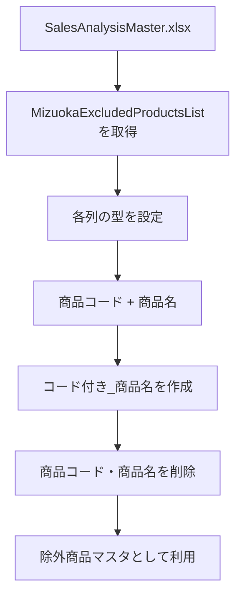

ここでも、`"商品コード"`、`"商品名"`、`"担当者名"`、`"データ更新日"`、`"コード付き_商品名"` といった既存カラム名は変更しません。

### 命名パターンとして整理できたもの

今回扱ったクエリから、今後流用できるステップ命名パターンをまとめると次のようになります。

|Power Query の処理|推奨ステップ名|
|---|---|
|ソース取得|`Source`|
|テーブル取得|`[TableName]Table`|
|先頭行取得|`FirstRow`|
|型変換|`ChangedType`|
|カスタム列追加|`AddedCustomColumn`|
|必要列だけ選択|`SelectedColumns`|
|列削除|`RemovedColumns`|
|カスタム関数呼出|`InvokedCustomFunction`|
|テーブル列展開|`Expanded[ColumnName]`|

重要なのは、**Power Query が自動生成する日本語ステップ名をそのまま英訳するのではなく、実際の処理内容に即した名前を付ける**ことです。

たとえば、

```text
削除された他の列
```

を単純に

```text
RemovedOtherColumns
```

とするのではなく、実際には `Table.SelectColumns` を使っているので、

```text
SelectedColumns
```

とした方がコードの意味が明確になります。

### コメントの最終方針

コメントについては、会話の中で次のように調整されました。

当初は、

```powerquery
// データのソースを取得
Source = ...

// テーブルの先頭行を取得
FirstRow = ...

// カスタム関数を呼び出し...
InvokedCustomFunction = ...
```

のように、ほぼすべてのステップへコメントを付けていました。

しかし、最終的には「**要所にだけコメントをつける**」方針となりました。

したがって、単純な型変換や明白な列削除まで毎回説明するのではなく、次のような箇所を優先します。

- 何のデータを読み込んでいるか
- なぜ先頭行だけに絞っているか
- なぜ結合キーを作成しているか
- カスタム関数を何のために呼んでいるか
- 後続処理上の意味が分かりにくい処理

たとえば以下のようなコメント量が適切です。

```powerquery
let
    // 売上分析マスタを読み込む
    Source = ...,

    MizuokaExcludedProductsListTable = ...,

    ChangedType = ...,

    // 商品コードと商品名から照合用キーを作成
    AddedCustomColumn = ...,

    RemovedColumns = ...
in
    RemovedColumns
```

このスタイルであれば、コメントがコードを圧迫せず、処理の意図だけを補足できます。

### 今回の到達点

このチャットを通じて、Power Query コードを今後リファクタリングするときの標準形は、ほぼ次の形に固まりました。

```powerquery
let
    // 大きな処理単位だけ日本語でコメント
    Source = ...,

    SomeTable = ...,

    ChangedType = ...,

    AddedCustomColumn = ...,

    SelectedColumns = ...
in
    SelectedColumns
```

要するに、**コード内部の処理名は英語 PascalCase、業務データとしてのカラム名は既存の日本語を維持し、コメントは日本語で必要な箇所だけ補う**、という方針です。

このルールであれば、Power Query 標準の M コードらしい読みやすさを保ちながら、業務上の日本語カラムとの対応関係も崩れません。

## 段階5：Power Queryリファクタリング・型情報取得・マスター参照・取込ファイル管理の整理

このチャットでは、売上分析用のPower Queryについて、既存処理をなるべく変えずに可読性を上げるリファクタリング、列型情報を取得する関数の命名と利用方法、各種置換マスターのクエリ整理、売上レコード識別用の列名、さらに`PY_Data`・`CY_Data`で読み込んだファイル名を`ImportedFiles`側で一覧化する設計について検討した。

大きな方向性としては、**Power Queryの処理内容は維持しつつ、ステップ名・変数名・コメント・改行を整理すること**、そして**クエリ間の責務を明確に分けること**が一貫したテーマになっている。

### 1. 売上データ取込クエリの視認性改善

最初に、売上ファイルをフォルダから取得してクレンジングするPower Queryについて、**プログラムのロジックそのものは変更せず、視認性だけを向上させる**整理を行った。

元の処理フローは概ね次のとおり。

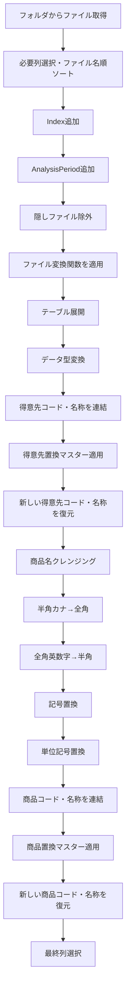

視認性改善では、主に以下を行った。

- 長い関数呼び出しは引数単位で改行
- ネストした`Table.AddColumn`や`List.Accumulate`はインデントを揃える
- 処理ブロックごとに空行を入れる
- コメントは各処理の直前に配置
- 処理内容自体は変更しない

この方針は、その後の各マスタークエリのリファクタリングにも継続して適用した。

### 2. Power Query更新時にExcel側の列幅を維持する方法

Power Queryを更新した際に、Excelシートへ読み込まれたテーブルの列幅が勝手に変わらないようにしたい、という話も扱った。

基本方針は、Power Queryではなく**Excel側のテーブル設定で制御する**こと。

Excelのテーブルプロパティにある、更新時の列幅自動調整に関する設定を無効化する方法を案内した。

また、必要であればVBAで以下のような制御も可能という話をした。

- 更新前に列幅を保存
- Power Query更新
- 更新後に元の列幅へ戻す

ただし、この場合は単純に`RefreshAll`直後へ処理を書くだけでは、非同期更新との兼ね合いがあるため、実際の運用では更新完了待ちを考慮する必要がある。

### 3. `GetColumnTypeInfo`関数の命名

テーブルの各カラムについて、**カラム名とデータ型の一覧を取得する関数**について命名を検討した。

元の関数は次のような処理。

```powerquery
let
    GetColumnDetails = (tableName as table) as table =>
    let
        Schema = Table.Schema(tableName),
        SelectedColumns = Table.SelectColumns(
            Schema,
            {"Name", "TypeName"}
        ),
        RenamedColumns = Table.RenameColumns(
            SelectedColumns,
            {
                {"Name", "ColumnName"},
                {"TypeName", "ColumnType"}
            }
        )
    in
        RenamedColumns
in
    GetColumnDetails
```

候補として以下が挙がった。

|候補|評価|
|---|---|
|`GetColumnType`|単数形で、複数列の一覧を返す関数としてはやや曖昧|
|`GetColumnTypes`|型一覧を取得することは伝わる|
|`GetColumnDetails`|広義で、何の詳細かが少し弱い|
|`GetColumnInfo`|汎用的|
|`GetColumnTypeDetails`|意味は明確だが長め|
|`GetColumnTypeInfo`|型情報を中心に、列名も返す関数としてバランスが良い|
|`GetTableSchema`|`Table.Schema`全体を返すように受け取られるため広すぎる|

特に`Schema`については、ユーザーから「カラム名や型以外の情報も含むのでは」と指摘があり、その認識で整理した。

最終的に、関数名は

```text
GetColumnTypeInfo
```

を採用した。

これは、現在の処理内容である

- `ColumnName`
- `ColumnType`

の一覧取得に対して、過不足の少ない名称と判断した。

### 4. `CleanedDataTbl`へ`GetColumnTypeInfo`を適用する方法

`CleanedDataTbl`はすでに**別クエリとして存在している**前提で、空のクエリからその列型一覧を表示したい、という話になった。

当初は以下のように、

```powerquery
Source = CleanedDataTbl,
FirstRow = Table.FirstN(Source, 1),
InvokedCustomFunction = Table.AddColumn(
    FirstRow,
    "GetColumnTypeInfo",
    each GetColumnTypeInfo(CleanedDataTbl)
)
```

という流れになっていた。

しかし、これは冗長。

`GetColumnTypeInfo`はテーブル自体を引数として受け取り、その構造情報を返す関数なので、先頭行を取得したり、`Table.AddColumn`で関数結果を埋め込んだりする必要はない。

最終的には、以下だけでよいと整理した。

```powerquery
let
    // CleanedDataTbl のカラム情報を取得
    ColumnDetails = GetColumnTypeInfo(CleanedDataTbl)
in
    ColumnDetails
```

さらに簡潔にするなら、

```powerquery
let
    ColumnTypeInfo = GetColumnTypeInfo(CleanedDataTbl)
in
    ColumnTypeInfo
```

でもよい。

つまり、処理構造としては以下だけ。


### 5. ステップ名・変数名の命名ルール

リファクタリングでは、**ステップ名・変数名をPascalCaseへ統一する**方針を採用した。

たとえば自動生成されたPower Queryの、

```powerquery
#"Changed Type"
#"Removed Other Columns"
#"Sorted Rows"
```

のようなステップ名は、以下のように変更する。

```powerquery
ChangedType
SelectedColumns
SortedRows
```

また、テーブル取得時の自動生成名、

```powerquery
customer_code_name_normalization_tbl_Table
```

のような名前も、意味が分かるPascalCaseへ変更する。

例：

```powerquery
CustomerCodeNameTable
```

ただし、より意味を明示するなら、

```powerquery
CustomerCodeNameReplacementTable
```

の方が実際のテーブル名との整合性は高い。

コメントは日本語で統一する方針。

### 6. 置換マスタークエリのリファクタリング

複数のマスター参照クエリについて、同じルールで整理した。

#### `customer_code_name_replacement_tbl`

対象ファイル：

```text
customer_data_replacement_master.xlsx
```

対象テーブル：

```text
customer_code_name_replacement_tbl
```

リファクタリング後の基本形。

```powerquery
let
    // 顧客コード・名称置換マスターを読み込む
    Source = Excel.Workbook(
        File.Contents(
            "C:\Users\kyoupatty029\projects\kpm\analysis_inspection\shared_master\normalization\customer_data_replacement_master.xlsx"
        ),
        null,
        true
    ),

    // 顧客コード・名称置換テーブルを取得
    CustomerCodeNameTable = Source{
        [Item = "customer_code_name_replacement_tbl", Kind = "Table"]
    }[Data],

    // データ型をテキストに変換
    ChangedType = Table.TransformColumnTypes(
        CustomerCodeNameTable,
        {
            {"original_code_name_concat", type text},
            {"updated_code_name_concat", type text}
        }
    ),

    // 必要な列のみ選択
    SelectedColumns = Table.SelectColumns(
        ChangedType,
        {
            "original_code_name_concat",
            "updated_code_name_concat"
        }
    )
in
    SelectedColumns
```

#### `hankaku_katakana_to_zenkaku_tbl`

対象ファイル：

```text
character_replacement_master.xlsx
```

対象テーブル：

```text
hankaku_katakana_to_zenkaku_tbl
```

基本ステップ：

- ソース読込
- 対象テーブル取得
- `id`、`original`、`updated`をtext型へ変換
- `id`昇順
- `original`と`updated`だけを残す

テーブル取得ステップは、

```powerquery
HankakuToZenkakuTable
```

とした。

#### `zenkaku_alphanumeric_to_hankaku_tbl`

対象テーブル：

```text
zenkaku_alphanumeric_to_hankaku_tbl
```

元コードには、

```text
zenkaku_alphanumeic_to_hankaku_tbl_Table
```

というスペルミスがあった。

`alphanumeic`ではなく、

```text
alphanumeric
```

が正しい。

リファクタリングではテーブル取得ステップを、

```powerquery
ZenkakuToHankakuTable
```

とした。

#### `symbol_replacement_tbl`

対象テーブル：

```text
symbol_replacement_tbl
```

テーブル取得ステップを、

```powerquery
SymbolReplacementTable
```

とした。

このクエリには元々ソート処理がなく、そのまま

- 型変換
- 必要列選択

のみ行う。

#### `unit_simbol_replacement_tbl`

ここでは重要なスペル上の論点があった。

元のテーブル名は、

```text
unit_simbol_replacement_tbl
```

となっている。

英語として正しいのは、

```text
symbol
```

なので、Power Query内部のステップ名は、

```powerquery
UnitSymbolReplacementTable
```

とした。

ただし、**実際のExcelテーブル名が`unit_simbol_replacement_tbl`のままなら、Item指定部分は変更できない**。

つまり、

```powerquery
Source{
    [Item = "unit_simbol_replacement_tbl", Kind = "Table"]
}[Data]
```

はそのまま使用する。

#### `product_code_name_replacement_tbl`

対象ファイル：

```text
product_data_replacement_master.xlsx
```

対象テーブル：

```text
product_code_name_replacement_tbl
```

テーブル取得ステップは、

```powerquery
ProductCodeNameReplacementTable
```

とした。

型変換ステップについては途中で、

```powerquery
ConvertedTypes
```

という案も出た。

ただし、他クエリとの統一性を優先するなら、

```powerquery
ChangedType
```

へ統一した方が分かりやすい。

この点は、プロジェクト全体で命名規則を固定するとよい。

### 7. マスタークエリ全体の統一パターン

今回整理した各マスタークエリは、基本的に同じ構造に統一できる。

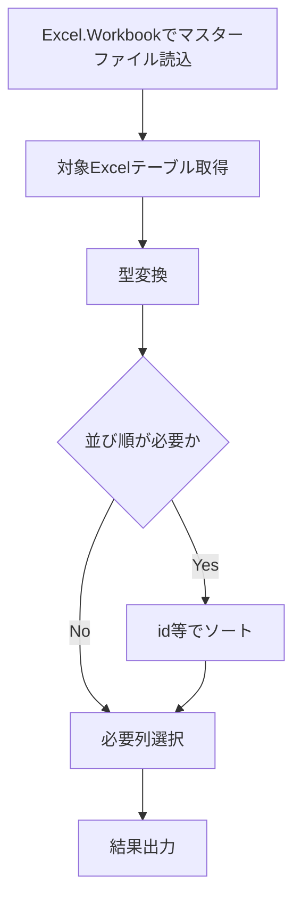

代表的なステップ名は以下。

|役割|ステップ名|
|---|---|
|元ファイル読込|`Source`|
|対象テーブル取得|`...Table`|
|型変換|`ChangedType`|
|ソート|`SortedRows`|
|必要列選択|`SelectedColumns`|

この形に揃えると、クエリ間の比較がかなりしやすくなる。

### 8. 売上を特定するための連番カラム名

売上レコードを一意または疑似一意に識別するための連番カラム名についても検討した。

候補として以下を提示した。

|候補|ニュアンス|
|---|---|
|`SalesID`|売上の識別子|
|`SalesSequence`|売上の連番|
|`SalesNumber`|売上番号|
|`SalesSerialNumber`|シリアル番号|
|`SalesRecordID`|売上レコードのID|
|`SalesEntryID`|売上エントリのID|
|`SalesReferenceID`|売上参照用ID|

このうち、用途によって最適解が異なる。

単純なPower QueryのIndex列として振る連番であれば、

```text
SalesIndex
```

または

```text
SalesSequence
```

の方が、`ID`より実態を正確に表す。

一方、後続処理で「売上レコード識別子」として扱うなら、

```text
SalesRecordID
```

も明確。

`SalesID`は簡潔だが、業務上すでに存在する売上伝票番号などと混同しないかは確認が必要。

### 9. `PY_Data`・`CY_Data`・`ImportedFiles`の設計

後半では、前年データと当年データをそれぞれ別クエリで読み込み、その**実際の読み込み元ファイル名を`ImportedFiles`クエリ側で一覧表示したい**という要件を整理した。

現在のイメージは以下。

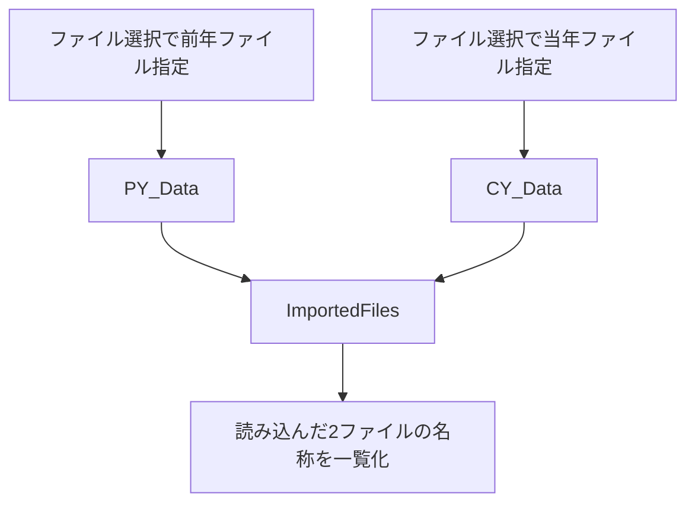

当初の`PY_Data`は、

```powerquery
let
    Source = Excel.Workbook(
        File.Contents(
            "C:\...\sc_sales_202301.xlsx"
        ),
        null,
        true
    )
in
    Source
```

`CY_Data`は、

```powerquery
let
    Source = Excel.Workbook(
        File.Contents(
            "C:\...\sc_sales_202401.xlsx"
        ),
        null,
        true
    )
in
    Source
```

という形だった。

`ImportedFiles`は、

```powerquery
let
    Source1 = PY_Data,
    Source2 = CY_Data
in
    Source1
```

という暫定状態。

#### 要件として明確になったこと

ユーザーの意図は次の通り。

- `PY_Data`で前年ファイルを読み込む
- `CY_Data`で当年ファイルを読み込む
- `ImportedFiles`は両クエリを参照する
- `ImportedFiles`側で、**実際に読み込んだExcelファイル名を出力する**
- `ImportedFiles`側へファイル名やパスを手入力してはいけない
- `PY_Data`と`CY_Data`についても、Mコードへ固定パスを直接書く運用を避けたい
- Excel/Power QueryのGUIでファイルを選択する通常の読み込み操作を利用したい
- 直接Mコードへパスを書けば存在しないファイル等の入力ミスをGUI段階で検知しにくくなるため、運用上それを避けたい

#### ここで重要な技術的問題

この部分について、途中の回答には誤りがあった。

`Excel.Workbook(File.Contents(...))`の結果である`PY_Data`や`CY_Data`は、基本的にはExcelブック内のシートやテーブル情報を含む**テーブル**であって、元ファイルのフルパスやファイル名が自動的に保持されているわけではない。

そのため、

```powerquery
Source1{0}[Name]
```

や、

```powerquery
Source1{0}[Item]
```

から取得できるのは、通常はブック内のシート名・テーブル名等であり、読み込み元Excelファイル名ではない。

また、

```powerquery
Excel.CurrentWorkbook()
```

はファイル選択ダイアログを出す機能ではない。現在のExcelブック内に存在するテーブル・名前付き範囲等を取得する関数であり、ここも途中の説明は不正確だった。

### 10. `ImportedFiles`で元ファイル名を取得するための正しい設計方針

この要件を成立させるには、`PY_Data`と`CY_Data`側で**データ本体だけではなく、元ファイル名に関する情報も保持する設計**が必要になる。

考え方は大きく2つある。

#### 方法A：ファイル取得段階のメタデータを保持する

Power Query GUIから「データの取得 → ファイルから → Excelブックから」でファイルを選択した場合、生成されたクエリは最終的には、

```powerquery
File.Contents("...")
```

を内部に持つ。

このパス文字列そのものを同じクエリ内で変数として保持しておけば、ファイル名を抽出できる。

ただし、これを`ImportedFiles`から取得したい場合、`PY_Data`の返り値を単純なテーブルではなく、ファイル名情報も含んだ構造へ変える必要がある。

例として考えられるのは、

```text
PY_Data
├─ Data
└─ FileName
```

のようなRecordを返す方式。

ただし、既存の`PY_Data`を他のクエリが「テーブル」として直接参照している場合、返り値をRecordへ変えると大きな修正になる。

#### 方法B：ファイル情報専用クエリを分離する

より現実的なのは、GUIで選択したファイルパスを共通ソースとして扱い、

```text
PY_File
CY_File
PY_Data
CY_Data
ImportedFiles
```

のように分ける設計。

たとえば概念的には、

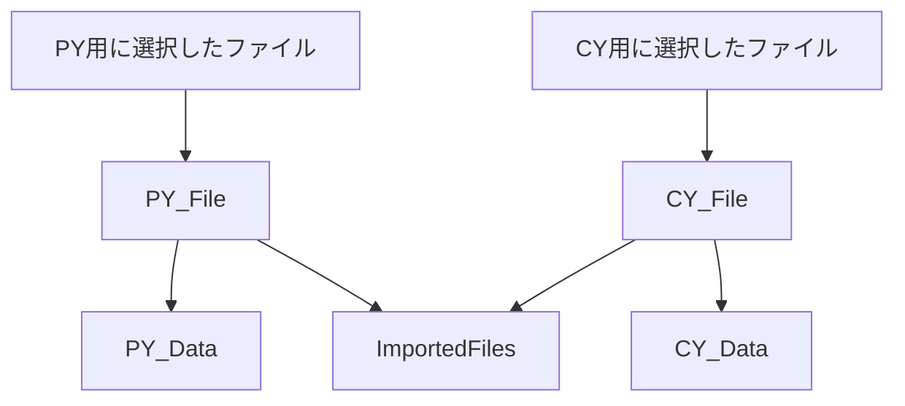

こうすれば、

- `PY_Data`はデータ読込専用
- `CY_Data`はデータ読込専用
- `ImportedFiles`はファイル情報だけを参照

という責務分離ができる。

ただし、Power Query単体には、VBAの`Application.GetOpenFilename`のように**クエリ更新時に毎回ファイル選択ダイアログを出す標準M関数はない**。

Power Queryの「通常のファイル選択」は、クエリ作成時にGUIでパスを設定し、その結果としてMコードにファイルパスが保存される仕組み。

したがって、ユーザーが求める「一般的なExcelファイル選択ダイアログで都度選択する」挙動まで必要なら、Power Queryだけでなく、

- Excelセルへファイルパスを格納してPQが読む
- 名前付きセルをパラメータとして使う
- VBAでファイル選択ダイアログを表示し、セルや名前定義へパスを書き込む
- Power Queryはその値を参照する

といった設計の方が適している。

この点は、今後の実装時に改めて整理が必要。

### 11. 現時点の重要な決定事項と未解決事項

今回のチャットで固まった内容と、まだ設計が必要な部分を整理すると以下。

|項目|状態|内容|
|---|---|---|
|Power Queryの整形方針|決定|ロジックを変えず、改行・インデント・コメントを整理|
|ステップ名|決定|PascalCase|
|コメント|決定|日本語|
|型情報取得関数名|決定|`GetColumnTypeInfo`|
|`CleanedDataTbl`の型一覧取得|決定|`GetColumnTypeInfo(CleanedDataTbl)`を直接実行|
|マスタークエリ命名|概ね決定|`Source`→`...Table`→`ChangedType`→`SortedRows`→`SelectedColumns`|
|`unit_simbol`のスペル|注意事項|実テーブル名は維持、内部変数は`Symbol`表記可|
|売上連番列名|未確定|`SalesIndex` / `SalesSequence` / `SalesRecordID`等が候補|
|`PY_Data` / `CY_Data`|方針あり|前年・当年ファイルを別クエリで読み込む|
|`ImportedFiles`|要件確定|`PY_Data`・`CY_Data`の実ファイル名を自動取得したい|
|`ImportedFiles`でのパス直書き|禁止|ファイル名・パスを二重管理しない|
|ファイル選択方式|要再設計|PQだけで更新時ダイアログ選択は困難。セル/VBA等も候補|

### 12. 今後の推奨構成

これまでの方針を踏まえると、売上分析用Power Queryは次のように役割分担すると整理しやすい。

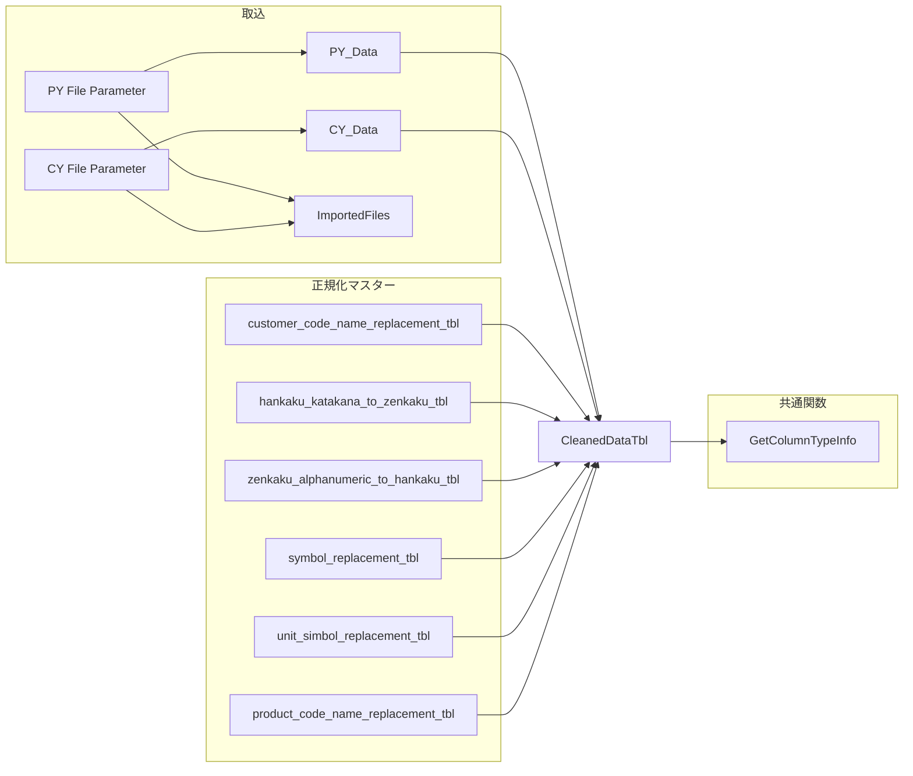

この構成にすると、**データ読込・ファイル情報・正規化マスター・共通関数**が分離され、後から処理を追いやすくなる。

特に`ImportedFiles`については、`PY_Data`・`CY_Data`の「結果テーブル」から無理に元ファイル名を逆算するより、**ファイルを指定する元情報そのものを共有する設計**へ変えるのが本筋になる。

## 段階6：Power Queryリファクタリング・命名規則・年度別売上分析の整理

このチャットでは、既存の売上分析用Power Queryを整理しながら、**コードの命名規則、処理順序、年度表現、仮カラム名と最終カラム名の扱い、CY/PY比較用クエリの構成**を固めていった。

最終的な方向性としては、単にコードを短くするのではなく、今後の分析クエリ全体で再利用できるように、次の考え方へ整理されている。

- Power Queryのステップ名は**英語・PascalCase**
- コメントは日本語でよい
- 中間処理中のカラム名は基本的に英語
- 提出・表示用の日本語カラム名への変換は**最終段階でまとめて行う**
- 年度比較は `CY` / `PY` を標準表記とする
- 元データの共通読み込みクエリとして `ReadCleanedDataTbl` を利用する
- 不要な行・列は、後続処理に必要ないと確定しているものから早めに削減する
- 集計やID生成などの加工処理は、不要データを除外した後に行う

---

### 1. `ReadCleanedDataTbl` のリファクタリング

最初に扱ったのは、クレンジング済みExcelデータをPower Queryへ読み込むクエリだった。

元コードでは日本語のステップ名や、自動生成されたようなステップ名が混在していたため、Power Query内部の処理名を英語へ統一した。

最終的には次のような構成となった。

```m
let
    // ソースの取得
    Source = Excel.Workbook(
        File.Contents(
            "C:\Users\kyoupatty029\projects\kpm\analysis_inspection\sales_analysis\cleaned_data\general_mothly_data.xlsx"
        ),
        null,
        true
    ),

    // テーブルデータの選択と列の型変換
    TransformedTable = Table.TransformColumnTypes(
        Source{[Item="CleanedDataTbl", Kind="Table"]}[Data],
        {
            {"売上発生部門コード", type text},
            {"売上日付", type date},
            {"売上伝票番号", type text},
            {"売上明細伝票行番号", type text},
            {"得意先コード", type text},
            {"得意先名称", type text},
            {"売上明細商品コード", type text},
            {"売上明細商品名", type text},
            {"売上明細金額符号付", Int64.Type},
            {"売上明細バラ総数符号付", Int64.Type},
            {"売上明細単価", Int64.Type},
            {"AnalysisPeriod", type text}
        }
    ),

    // 不要な列を削除
    SelectedColumns = Table.SelectColumns(
        TransformedTable,
        {
            "売上日付",
            "売上伝票番号",
            "売上明細伝票行番号",
            "得意先コード",
            "得意先名称",
            "売上明細商品コード",
            "売上明細商品名",
            "売上明細バラ総数符号付",
            "売上明細単価",
            "売上明細金額符号付",
            "AnalysisPeriod"
        }
    ),

    // 商品コードが空白または "888888" ではない行をフィルタリング
    FilteredTable = Table.SelectRows(
        SelectedColumns,
        each [売上明細商品コード] <> ""
            and [売上明細商品コード] <> "888888"
    ),

    // 伝票行番号を2桁に整形
    TransformedRows = Table.TransformColumns(
        FilteredTable,
        {
            {
                "売上明細伝票行番号",
                each Text.End("0" & _, 2),
                type text
            }
        }
    ),

    // FiscalYear列の追加
    AddedFiscalYear = Table.AddColumn(
        TransformedRows,
        "FiscalYear",
        each
            if Date.Month([売上日付]) = 11
                or Date.Month([売上日付]) = 12
            then Date.Year([売上日付]) + 1
            else Date.Year([売上日付])
    ),

    // FiscalYearをテキスト型へ変換
    FiscalYearAsText = Table.TransformColumnTypes(
        AddedFiscalYear,
        {
            {"FiscalYear", type text}
        }
    ),

    // SalesId列の追加
    AddedSalesId = Table.AddColumn(
        FiscalYearAsText,
        "SalesId",
        each
            Text.From([FiscalYear])
            & "-"
            & Text.From([売上伝票番号])
            & "-"
            & Text.From([売上明細伝票行番号]),
        type text
    ),

    // SalesId生成用の一時列を削除
    FinalTable = Table.RemoveColumns(
        AddedSalesId,
        {
            "売上伝票番号",
            "売上明細伝票行番号",
            "FiscalYear"
        }
    )
in
    FinalTable
```

このクエリを後続処理から参照する名称として、**`ReadCleanedDataTbl`** を使用している。

---

### 2. FiscalYearとSalesId作成時に発生した問題

FiscalYear作成では、当初次のような形にしていた。

```m
Table.AddColumn(
    ...,
    "FiscalYear",
    each ...,
    type text
)
```

しかし、FiscalYearの式自体は、

```m
Date.Year([売上日付]) + 1
```

などの**数値を返している**。

そのため、ユーザー側で「表示はされるがテキストらしく左寄せされていない」「SalesId作成時にエラーになる」という問題が発生した。

最終的に採用した考え方は、処理を横着して一度に済ませず、明確に3段階へ分ける方法だった。


つまり、

1. FiscalYearを作成
2. FiscalYearを明示的に `type text` へ変換
3. その後でSalesIdを作成

という順序である。

これは、このチャットで重要な設計判断の一つとなった。

---

### 3. FiscalYearの考え方

年度は `FiscalYear` と表現することを確認した。

現在のロジックでは、会計年度開始月が11月であるため、

- 11月 → 翌年をFiscalYearとする
- 12月 → 翌年をFiscalYearとする
- 1〜10月 → 暦年をそのままFiscalYearとする

という処理になっている。

例えば、

|売上日付|FiscalYear|
|---|--:|
|2023-10-31|2023|
|2023-11-01|2024|
|2023-12-31|2024|
|2024-01-01|2024|
|2024-10-31|2024|

となる。

---

### 4. 不要な列・行を処理するタイミング

Power Queryで不要なカラムを削除する時期について検討した。

基本方針としては、

> **後続処理に絶対必要ないと確定している列は、できるだけ早めに削除する。**

となった。

理由は、不要なデータを後続処理へ持ち回らないためである。

同様に、

- 不要行のフィルタリング
- ユニークIDの作成

のどちらを先に行うかについても整理した。

基本的には、


とし、**フィルタリングを先に行う**。

理由は単純で、後から除外する行に対してID生成などの計算を行う必要がないためである。

---

### 5. Power Queryの命名規則

チャットを通じて、Power Query内部のステップ名については次の方向へ統一した。

#### ステップ名

**PascalCase** を採用する。

例：

|処理|推奨ステップ名|
|---|---|
|ソース取得|`Source`|
|型変換|`TransformedTable`|
|必要列選択|`SelectedColumns`|
|行フィルタ|`FilteredTable`|
|FiscalYear追加|`AddedFiscalYear`|
|FiscalYear型変換|`FiscalYearAsText`|
|SalesId追加|`AddedSalesId`|
|最終データ|`FinalTable`|

Power Queryが自動生成する、

```m
#"Added Custom"
#"Changed Type"
#"Expanded {0}"
```

のような名前は、処理内容が分かりにくいため、可能な範囲で意味のある英語名へ変更する。

---

### 6. CY・PYの年度表記

年度比較の呼称についても整理した。

以前使用していた、

- TY = This Year
- LY = Last Year

に相当するものとして、現在は、

|表記|意味|
|---|---|
|`CY`|Current Year|
|`PY`|Previous Year|

を使用する。

したがって、

```text
TY → CY
LY → PY
```

へ統一する。

例：

```text
SalesAmountCY
SalesAmountPY
QuantityCY
QuantityPY
UnitPriceCY
UnitPricePY
```

また、元データ側の年度判定カラムとして、

```text
AnalysisPeriod
```

を使用し、

```m
[AnalysisPeriod] = "CY"
```

などで年度を抽出する。

---

### 7. 本年度の得意先別売上小計

`ReadCleanedDataTbl` から本年度データだけを抽出し、得意先別に売上を集計するクエリを作成した。

基本構成は次の通り。

```m
let
    // クレンジングされたデータの読み込み
    Source = ReadCleanedDataTbl,

    // 本年度データを抽出
    FilteredCurrentYear = Table.SelectRows(
        Source,
        each [AnalysisPeriod] = "CY"
    ),

    // 得意先別に売上を集計
    GroupedByCustomerSales = Table.Group(
        FilteredCurrentYear,
        {
            "得意先コード",
            "得意先名称"
        },
        {
            {
                "CustomerSalesAmount",
                each List.Sum([売上明細金額符号付]),
                type nullable number
            }
        }
    ),

    // 売上額順
    SortedFinalData = Table.Sort(
        GroupedByCustomerSales,
        {
            {"CustomerSalesAmount", Order.Descending}
        }
    )
in
    SortedFinalData
```

このクエリは、

> **本年度の得意先ごとの売上小計**

を表す。

クエリ名候補として、

```text
CurrentYearCustomerSalesSummary
```

を検討し、その後短縮版として、

```text
CYCustomerSalesSummary
```

を採用候補とした。

こちらの方が、他のCY/PY系クエリとの整合性も高い。

---

### 8. `type nullable number` の意味

`Table.Group` の集計結果で使用していた、

```m
type nullable number
```

について確認した。

これは、

> **number型だが、nullも許容する**

という意味である。

つまり、

```text
number
または
null
```

を持てる型である。

Power Queryの集計結果では、データ欠損などを考慮して `nullable` を使用するケースがある。

---

### 9. 本年度の「得意先 × 商品」別売上集計

次に、得意先ごとの各商品の売上金額・数量・単価を集計するクエリを整理した。

このクエリの意味は、

> **本年度の得意先別・商品別売上小計**

である。

クエリ名として最初に、

```text
CurrentYearCustomerProductSalesSummary
```

を提示したが、長いため短縮し、

```text
CYCustomerProductSalesSummary
```

とする方向になった。

PY側については対称的に、

```text
PYCustomerProductSalesSummary
```

とする。

これにより、

```text
CYCustomerSalesSummary
CYCustomerProductSalesSummary

PYCustomerSalesSummary
PYCustomerProductSalesSummary
```

のように規則的に並べられる。

---

### 10. CYとPYの商品別売上をFull Outer Joinする処理

ユーザー自身で、次の部分を修正していた。

```m
Source = Table.NestedJoin(
    PYCustomerProductSalesSummary,
    {
        "CustomerCodePY",
        "CustomerNamePY",
        "ProductCodePY",
        "ProductNamePY"
    },
    CYCustomerProductSalesSummary,
    {
        "CustomerCodeCY",
        "CustomerNameCY",
        "ProductCodeCY",
        "ProductNameCY"
    },
    "CYCustomerProductSalesSummary",
    JoinKind.FullOuter
),
```

そしてCY側を展開する。

```m
ExpandedCY = Table.ExpandTableColumn(
    Source,
    "CYCustomerProductSalesSummary",
    {
        "CustomerCodeCY",
        "CustomerNameCY",
        "ProductCodeCY",
        "ProductNameCY",
        "SalesAmountCY",
        "QuantityCY",
        "UnitPriceCY"
    }
)
```

ここでは `FullOuter` を使用しているため、

- CYだけ存在
- PYだけ存在
- CY/PY両方存在

のすべての商品を残せる。

---

### 11. CYとPYのキー情報統合

Full Outer Join後は、CYまたはPYのどちらか一方しか存在しない可能性がある。

そのため、

```text
CustomerCodeCY
CustomerCodePY
```

などを最終的な共通カラムへまとめる。

例：

```m
AddedCustomerCode = Table.AddColumn(
    ExpandedCY,
    "CustomerCode",
    each
        if [CustomerCodeCY] <> null
        then [CustomerCodeCY]
        else [CustomerCodePY],
    type text
)
```

同様に、

```text
CustomerName
ProductCode
ProductName
```

も統合する。

構造としては、

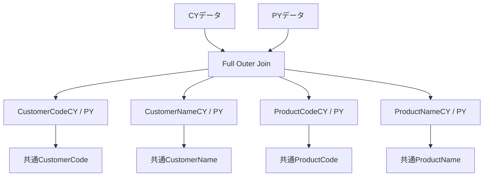

となる。

---

### 12. CY/PYの増減比

CYとPYについて、

- 売上金額
- 数量
- 単価

の増減比を計算する処理も整理した。

例：

```m
AddedSalesChangeRatio = Table.AddColumn(
    RemovedUnusedColumns,
    "SalesChangeRatio",
    each
        if [SalesAmountCY] = 0 and [SalesAmountPY] = 0 then ""
        else if [SalesAmountPY] = 0 then ""
        else [SalesAmountCY] / [SalesAmountPY],
    Percentage.Type
)
```

同様に、

```text
QuantityChangeRatio
UnitPriceChangeRatio
```

を作成する。

ここではPYを分母として、

```text
CY / PY
```

を算出する。

---

### 13. 得意先別小計との結合

商品単位のCY/PY比較結果へ、

```text
CYCustomerSalesSummary
```

をマージし、得意先全体の本年度売上小計を追加する。

これは、最終表を、

1. 得意先の売上規模
2. 得意先内の商品売上規模

の順で並べるために利用する。

イメージとしては、

```text
得意先A  小計 10,000,000
 ├ 商品A 3,000,000
 ├ 商品B 2,500,000
 └ 商品C 1,800,000

得意先B  小計 8,000,000
 ├ 商品D 4,000,000
 └ 商品E 2,000,000
```

という構造を作るためのもの。

最終的には、

```m
Table.Sort(
    ReorderedColumns,
    {
        {"Subtotal", Order.Descending},
        {"SalesAmountCY", Order.Descending}
    }
)
```

のような考え方でソートする。

---

### 14. 仮カラム名と最終カラム名

途中で、

> カラム名は早いうちに最終名称へ変更すべきか

を検討した。

最初は「可能なら早めに最終名称へ変更する」という案もあったが、その後ユーザーから、

> 最後に修正した方が英語と日本語が混ざらなくてよいのではないか

という指摘があり、こちらの方針へ整理された。

#### 現在の方針

**中間処理**

```text
CustomerCode
CustomerName
ProductCode
ProductName
SalesAmountCY
QuantityCY
UnitPriceCY
SalesAmountPY
QuantityPY
UnitPricePY
SalesChangeRatio
QuantityChangeRatio
UnitPriceChangeRatio
```

のように英語で統一する。

**最終出力直前**

```text
得意先コード
得意先名
商品コード
商品名
売上金額（本年度）
数量（本年度）
単価（本年度）
売上金額（昨年度）
数量（昨年度）
単価（昨年度）
増減比（売上金額）
増減比（数量）
増減比（単価）
```

などの提出用日本語へ一括変更する。

この方式なら、

```text
英語 → 日本語 → 英語 → 日本語
```

という途中混在がなくなる。

したがって現在は、

> **Power Query内部では英語を維持し、出力直前にまとめて日本語化する**

という方針が適している。

---

### 15. 仮名称について

どうしても処理途中でしか意味が確定しないカラムについては、仮名称を使用してよい。

ただし、このチャットの方針では、仮名称も可能な限り英語にする。

例えば、

```text
TempCustomerCode
IntermediateProductName
MergedCustomerCode
```

など。

ただし `Temp` を乱用するのではなく、その処理の意味が分かる場合は、

```text
CustomerCodeCY
CustomerCodePY
MergedCustomerCode
```

のような意味ベースの名前の方が望ましい。

---

### 16. 「得意先別実績」の英語名称

「得意先別実績」という名称に対応するPower Queryの名前として、

```text
CustomerPerformanceSummary
```

が候補として挙がった。

意味としては、

- `Customer` = 得意先
- `Performance` = 実績
- `Summary` = 集計・要約

となる。

ただし、今回構築している具体的な売上分析系クエリについては、

```text
CYCustomerSalesSummary
CYCustomerProductSalesSummary
```

のように、**何を集計しているのかをSalesまで明示する名称の方が具体的**である。

そのため、「得意先別実績」が広い意味の成果・実績表なら、

```text
CustomerPerformanceSummary
```

売上実績そのものなら、

```text
CustomerSalesSummary
```

の方が意味は限定的で明確になる。

---

### 現在の命名体系

現時点の整理をまとめると、次のような体系になる。

|用途|名称|
|---|---|
|クレンジング済みデータ読み込み|`ReadCleanedDataTbl`|
|本年度|`CY`|
|昨年度|`PY`|
|本年度 得意先別売上小計|`CYCustomerSalesSummary`|
|昨年度 得意先別売上小計|`PYCustomerSalesSummary`|
|本年度 得意先×商品別売上小計|`CYCustomerProductSalesSummary`|
|昨年度 得意先×商品別売上小計|`PYCustomerProductSalesSummary`|
|得意先別実績|`CustomerPerformanceSummary`|
|会計年度|`FiscalYear`|
|売上明細単位の識別子|`SalesId`|

カラムについても、

|意味|中間処理名|
|---|---|
|得意先コード|`CustomerCode`|
|得意先名|`CustomerName`|
|商品コード|`ProductCode`|
|商品名|`ProductName`|
|CY売上金額|`SalesAmountCY`|
|PY売上金額|`SalesAmountPY`|
|CY数量|`QuantityCY`|
|PY数量|`QuantityPY`|
|CY単価|`UnitPriceCY`|
|PY単価|`UnitPricePY`|
|売上増減比|`SalesChangeRatio`|
|数量増減比|`QuantityChangeRatio`|
|単価増減比|`UnitPriceChangeRatio`|

という体系へ整理できる。

---

### 全体の処理フロー

今回の売上分析処理全体を簡略化すると、次のようになる。

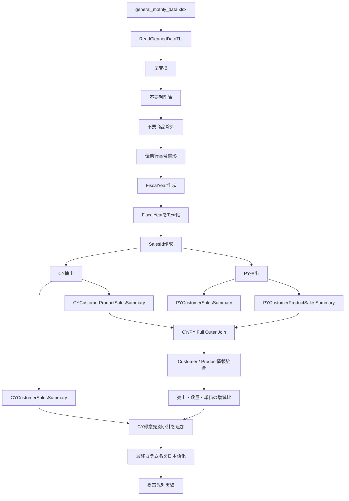

---

### このチャットで固まった主要判断

- Power Queryの**ステップ名はPascalCaseの英語**とする。
- コメントは日本語で問題ない。
- `ReadCleanedDataTbl` を共通のクレンジング済みデータソースとして使用する。
- 不要な列や行は、必要性がなくなった時点でなるべく早く除外する。
- ID生成より不要行フィルタリングを先に行う。
- `FiscalYear` は、作成と型変換を別ステップにする。
- FiscalYearをテキスト化した後に `SalesId` を作成する。
- 年度表記は `TY/LY` ではなく **`CY/PY`** に統一する。
- CY/PY比較では `FullOuter` を使用し、どちらか一方にしか存在しない得意先・商品も残す。
- 中間処理のカラム名は英語で統一する。
- 提出用の日本語カラム名への変更は**処理の最後で一括して行う**。
- 本年度得意先別小計は `CYCustomerSalesSummary`。
- 本年度得意先×商品別小計は `CYCustomerProductSalesSummary`。
- 「得意先別実績」の一般名称候補は `CustomerPerformanceSummary`。

この時点で、単発のPower Queryコード修正というより、**売上分析プロジェクト全体で使用するPower Queryの命名・年度比較・中間データ設計の基本ルール**まで整理された状態になっている。

## 統合元ファイル

- 「Power Queryコード整形の整理・まとめ.md」
- 「Power Queryコード整形と年度ファイル名の命名方針まとめ.md」
- 「Power Queryリファクタリングと処理内容の整理.md」
- 「Power Query 詳細コードのリファクタリング方針まとめ.md」
- 「Power Queryリファクタリング・型情報取得・マスター参照・取込ファイル管理の整理.md」
- 「Power Queryリファクタリング・命名規則・年度別売上分析の整理.md」
