売上分析で使用していた複数のPower Queryについて、処理内容を大きく変えず、ステップ名、インデント、コメント、列順などを整理した記録です。

元の活動日時は確認できないため、実際の日付順ではなく、内容から推定した段階順に配置しています。後段に置いたコードを最終版候補として扱いますが、現在の環境では未検証です。完全に同一のコード断片だけは重複掲載を省略し、異なる版、失敗例、訂正、未解決事項は残しています。

## 記録の読み方

このノートは現在使う手順書ではなく、当時どのような課題を扱い、どのように設計やコードを変えていったかを残す活動記録です。記録間で判断が食い違う場合は、後段の記録を有力候補としつつ、矛盾そのものも経緯として残しています。

## 段階1：Power Queryコードの視認性改善に関するチャットまとめ

### 目的

このチャットでは、既存の **Power Query（M言語）コードの処理内容自体は変更せず、コードをそのまま維持したうえで視認性を改善する**ことを目的として整理を行った。

対象コードは、売上分析用のデータをフォルダから読み込み、不要データの除外、型変換、得意先・商品の名称統一、重複検知用IDの生成、最終列整理までを行うクエリである。

今回の依頼では、ロジックの変更や高速化、ステップ名の変更ではなく、主に以下を実施した。

- 適切な空行の追加
- インデントの統一
- 長い関数呼び出しの複数行化
- 処理単位ごとのコメント追加
- 既存コメントの意味を分かりやすく整理

---

### 対象Power Queryの全体像

対象クエリは、大きく分けると次の処理を行っている。

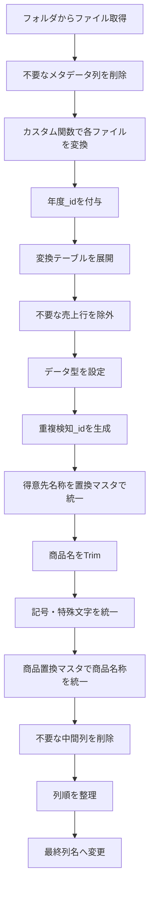

---

### 処理内容の詳細

|処理|主なステップ|内容|
|---|---|---|
|ファイル取得|`ソース`|指定フォルダ内のファイルを `Folder.Files` で取得|
|メタデータ整理|`削除された列`|Extension、更新日時、Folder Pathなどを削除|
|ファイル変換|`カスタム関数の呼び出し1`|`ファイルの変換([Content])` を各ファイルに適用|
|年度識別|`カラムの追加：年度_id`|Indexを追加し、年度を識別|
|必要列抽出|`削除された他の列`|Name、変換結果、年度_idのみ残す|
|テーブル展開|`展開された ファイルの変換`|各売上項目を展開|
|不要行削除|`フィルタ：不要な行の削除`|運賃コードと一括消費税行を除外|
|型設定|`型変更：初期化`|日付、文字列、整数などの型を指定|
|重複検知|`カラムの追加：重複検知_id`|年度・伝票番号・行番号を連結|
|得意先統一|`置換マスタ処理：得意先`|得意先置換マスタを使って名称を統一|
|商品名前処理|`トリム：商品名`|商品名の先頭・末尾スペースを削除|
|記号統一|`置換マスタ処理：記号特殊文字`|記号特殊文字置換マスタを適用|
|商品名称統一|`置換処理マスタ：商品`|商品置換マスタを使って商品名称を統一|
|中間列削除|`カラムの削除：置換処理用2`|置換処理用の一時列を削除|
|列順整理|`カラムのソート：最終`|出力列を所定の順序に変更|
|列名整理|`カラム名の変更：最終`|最終的な日本語列名へ変更|

---

### ファイル読み込みと年度ID

最初に、以下のフォルダを読み込んでいる。

```text
C:\Users\kyoupatty029\myproject\analysis_inspection\sales_analysis\load_files\org_kpk
```

`Folder.Files` の結果にはファイル情報のメタデータが多数含まれるため、次の列を削除する。

- `Extension`
- `Date accessed`
- `Date modified`
- `Date created`
- `Attributes`
- `Folder Path`

その後、各ファイルの `Content` に対してカスタム関数、

```powerquery
ファイルの変換([Content])
```

を適用する。

#### 年度_id

変換後、Index列として `年度_id` を追加している。

元コード上のコメントは以下。

```powerquery
// 0：昨年度
// 1：本年度
```

コード自体は、

```powerquery
Table.AddIndexColumn(
    カスタム関数の呼び出し1,
    "年度_id",
    0,
    1,
    Int64.Type
)
```

となっている。

つまりファイルの並び順を利用し、

- `0` → 昨年度
- `1` → 本年度

として識別する設計である。

---

### 売上データの展開

カスタム関数から返されたテーブルについて、次の10項目を展開する。

|列|
|---|
|売上日付|
|売上発生部門コード|
|売上伝票番号|
|売上明細伝票行番号|
|得意先コード|
|得意先名称|
|売上明細商品コード|
|売上明細商品名|
|売上明細バラ総数符号付|
|売上明細金額符号付|

---

### 不要な売上データの除外

次の2条件に該当する行を対象外にしている。

#### 商品コード `888888`

```text
888888 = 運賃
```

したがって、

```powerquery
[売上明細商品コード] <> "888888"
```

という条件で除外する。

#### 部門コード空欄

元コードでは、

```text
部門コード："" = 一括消費税
```

としている。

そのため、

```powerquery
[売上発生部門コード] <> ""
```

を条件としている。

最終的なフィルタ条件は、

```powerquery
each
    ([売上明細商品コード] <> "888888")
    and
    ([売上発生部門コード] <> "")
```

となる。

---

### データ型の初期設定

フィルタ後に、各カラムのデータ型を明示的に設定している。

|列|型|
|---|---|
|売上日付|`type date`|
|売上発生部門コード|`type text`|
|売上伝票番号|`type text`|
|売上明細伝票行番号|`type text`|
|得意先コード|`type text`|
|得意先名称|`type text`|
|売上明細商品コード|`type text`|
|売上明細商品名|`type text`|
|売上明細バラ総数符号付|`Int64.Type`|
|売上明細金額符号付|`Int64.Type`|
|年度_id|`type text`|

---

### 重複検知用IDの生成

売上明細の重複を識別するため、

```text
年度_id
+
売上伝票番号
+
売上明細伝票行番号
```

を `_` で連結している。

形式は、

```text
年度_id_売上伝票番号_売上明細伝票行番号
```

となる。

Power Queryでは、

```powerquery
[年度_id]
    & "_"
    & [売上伝票番号]
    & "_"
    & [売上明細伝票行番号]
```

としている。

生成後、元の

- 売上伝票番号
- 売上明細伝票行番号

は不要になるため削除する。

---

### 得意先名称の統一処理

得意先については、まず、

```text
得意先コード_得意先名称
```

という文字列を作成する。

例として概念的には、

```text
123456_株式会社ABC
```

のようになる。

この値を `コード付き得意先名` として保持する。

#### 得意先置換マスタ

その後、

```powerquery
List.Accumulate(
    Table.ToRows(得意先置換マスタ),
    [コード付き得意先名],
    (x, y) => Text.Replace(x, y{0}, y{1})
)
```

を使用する。

処理イメージは、

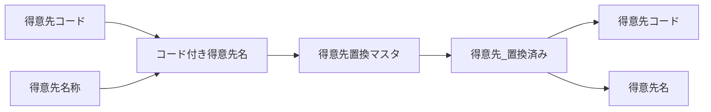

となる。

置換後の値から、

```powerquery
Text.BeforeDelimiter([得意先_置換済み], "_")
```

で得意先コードを取得し、

```powerquery
Text.AfterDelimiter([得意先_置換済み], "_")
```

で得意先名を取得する。

処理終了後、

- `コード付き得意先名`
- `得意先_置換済み`

は中間処理用列として削除する。

---

### 商品名称の統一処理

商品については、得意先よりも一段階多い前処理を行っている。

#### 1. 商品名のTrim

元コードのコメントでは、

> 商品名の置換は、事前に商品名の頭と尻に存在するスペースを全て取り除く。

という方針になっている。

処理は、

```powerquery
Text.Trim
```

を使用する。

なお、元コードには、

> 商品名内に混在する半角・全角スペースは記号特殊文字マスタで対応する予定

という設計メモも残されている。

#### 2. 記号・特殊文字の統一

`記号特殊文字置換マスタ` を利用し、

```powerquery
List.Accumulate(
    Table.ToRows(記号特殊文字置換マスタ),
    [売上明細商品名],
    (x, y) => Text.Replace(x, y{0}, y{1})
)
```

を実行する。

結果を、

```text
商品名_記号修正済み
```

として保持する。

#### 3. コード付き商品名を生成

次に、

```text
売上明細商品コード_商品名
```

を作る。

```powerquery
[売上明細商品コード]
    & "_"
    & [商品名_記号修正済み]
```

結果は、

```text
コード付き商品名
```

となる。

#### 4. 商品置換マスタ

さらに、`商品置換マスタ` を順番に適用する。

```powerquery
List.Accumulate(
    Table.ToRows(商品置換マスタ),
    [コード付き商品名],
    (x, y) => Text.Replace(x, y{0}, y{1})
)
```

結果を、

```text
商品名_置換済み
```

として保持する。

#### 5. 商品コード・商品名へ再分割

得意先と同様に `_` を区切り文字として、

```powerquery
Text.BeforeDelimiter(...)
```

で商品コード、

```powerquery
Text.AfterDelimiter(...)
```

で商品名を取得する。

---

### 中間列の削除

商品名称統一が完了した段階で、次の一時列を削除する。

- `売上明細商品コード`
- `売上明細商品名`
- `商品名_記号修正済み`
- `コード付き商品名`
- `商品名_置換済み`

これにより、最終テーブルには統一済みの商品コード・商品名だけが残る。

---

### 最終的な列順

最終出力前に、列を以下の順番へ並べ替える。

|順番|列|
|--:|---|
|1|売上日付|
|2|売上発生部門コード|
|3|得意先コード|
|4|得意先名|
|5|商品コード|
|6|商品名|
|7|売上明細バラ総数符号付|
|8|売上明細金額符号付|
|9|年度_id|
|10|重複検知_id|

その後、最終的な列名へ変更する。

|変更前|変更後|
|---|---|
|売上日付|売上日|
|売上発生部門コード|部門コード|
|売上明細バラ総数符号付|売上バラ数量_符号付|
|売上明細金額符号付|売上金額_符号付|

---

### 今回行った「視認性改善」

ユーザーからの依頼は、

> コードそのままに視認性をよくして。

というものであり、処理ロジックそのものは変更していない。

主に次の整形を行った。

- 処理のまとまりごとに空行を配置
- 各ステップの前に説明コメントを追加
- `Table.TransformColumnTypes` など長い処理を複数行へ分割
- `Table.ExpandTableColumn` の列リストを見やすく整形
- `List.Accumulate` の処理を複数行化
- `Table.ReorderColumns` や `Table.RenameColumns` の配列を整形
- コメント内容を処理実態に合わせて読みやすくした

一方で、以下については変更していない。

- ステップ名
- カラム名
- ファイルパス
- マスタ名
- フィルタ条件
- 置換処理
- データ型
- 列順
- 最終出力
- クエリのロジック

つまり、今回の変更は**リファクタリングではなく、コードフォーマットとコメントによる可読性向上**に限定されている。

---

### 整形後コード

```powerquery
let
    // ソースファイルの取得
    ソース = Folder.Files("C:\Users\kyoupatty029\myproject\analysis_inspection\sales_analysis\load_files\org_kpk"),
    // 不要な列の削除
    削除された列 = Table.RemoveColumns(
        ソース,
        {"Extension", "Date accessed", "Date modified", "Date created", "Attributes", "Folder Path"}
    ),

    // カスタム関数「ファイルの変換」の呼び出し
    カスタム関数の呼び出し1 = Table.AddColumn(
        削除された列,
        "ファイルの変換",
        each ファイルの変換([Content])
    ),
    // 年度IDの追加（0：昨年度, 1：本年度）
    #"カラムの追加：年度_id" = Table.AddIndexColumn(
        カスタム関数の呼び出し1,
        "年度_id",
        0,
        1,
        Int64.Type
    ),
    // 必要な列だけを残す
    削除された他の列 = Table.SelectColumns(
        #"カラムの追加：年度_id",
        {"Name", "ファイルの変換", "年度_id"}
    ),

    // ファイルの変換列を展開
    #"展開された ファイルの変換" = Table.ExpandTableColumn(
        削除された他の列,
        "ファイルの変換",
        {
            "売上日付",
            "売上発生部門コード",
            "売上伝票番号",
            "売上明細伝票行番号",
            "得意先コード",
            "得意先名称",
            "売上明細商品コード",
            "売上明細商品名",
            "売上明細バラ総数符号付",
            "売上明細金額符号付"
        },
        {
            "売上日付",
            "売上発生部門コード",
            "売上伝票番号",
            "売上明細伝票行番号",
            "得意先コード",
            "得意先名称",
            "売上明細商品コード",
            "売上明細商品名",
            "売上明細バラ総数符号付",
            "売上明細金額符号付"
        }
    ),

    // 不要な行のフィルタリング
    // ① 888888：運賃
    // ② 部門コード空欄：一括消費税
    #"フィルタ：不要な行の削除" = Table.SelectRows(
        #"展開された ファイルの変換",
        each
            ([売上明細商品コード] <> "888888")
            and ([売上発生部門コード] <> "")
    ),

    // データ型の初期化
    #"型変更：初期化" = Table.TransformColumnTypes(
        #"フィルタ：不要な行の削除",
        {
            {"売上発生部門コード", type text},
            {"得意先コード", type text},
            {"得意先名称", type text},
            {"売上明細商品コード", type text},
            {"売上明細商品名", type text},
            {"売上明細バラ総数符号付", Int64.Type},
            {"売上明細金額符号付", Int64.Type},
            {"売上日付", type date},
            {"売上伝票番号", type text},
            {"売上明細伝票行番号", type text},
            {"年度_id", type text}
        }
    ),

    // 重複検知用IDの追加
    #"カラムの追加：重複検知_id" = Table.AddColumn(
        #"型変更：初期化",
        "重複検知_id",
        each
            [年度_id]
            & "_"
            & [売上伝票番号]
            & "_"
            & [売上明細伝票行番号]
    ),

    #"型変更：重複検知_id" = Table.TransformColumnTypes(
        #"カラムの追加：重複検知_id",
        {{"重複検知_id", type text}}
    ),

    // 伝票関連の列を削除
    #"カラムの削除：伝票" = Table.RemoveColumns(
        #"型変更：重複検知_id",
        {"売上伝票番号", "売上明細伝票行番号"}
    ),

    // コード付き得意先名の追加
    #"カラムの追加：コード付き得意先名" = Table.AddColumn(
        #"カラムの削除：伝票",
        "コード付き得意先名",
        each [得意先コード] & "_" & [得意先名称]
    ),

    #"型変更：コード付き得意先名" = Table.TransformColumnTypes(
        #"カラムの追加：コード付き得意先名",
        {{"コード付き得意先名", type text}}
    ),

    // 得意先置換マスタによる置換処理
    #"置換マスタ処理：得意先" = Table.AddColumn(
        #"型変更：コード付き得意先名",
        "得意先_置換済み",
        each
            List.Accumulate(
                Table.ToRows(得意先置換マスタ),
                [コード付き得意先名],
                (x, y) => Text.Replace(x, y{0}, y{1})
            )
    ),

    // 得意先関連の中間列削除と抽出
    #"カラムの削除：得意先" = Table.RemoveColumns(
        #"置換マスタ処理：得意先",
        {"得意先コード", "得意先名称"}
    ),

    #"カラムの追加：抽出：得意先コード" = Table.AddColumn(
        #"カラムの削除：得意先",
        "得意先コード",
        each Text.BeforeDelimiter([得意先_置換済み], "_"),
        type text
    ),

    #"カラムの追加：抽出：得意先名" = Table.AddColumn(
        #"カラムの追加：抽出：得意先コード",
        "得意先名",
        each Text.AfterDelimiter([得意先_置換済み], "_"),
        type text
    ),

    #"カラムの削除：置換処理用1" = Table.RemoveColumns(
        #"カラムの追加：抽出：得意先名",
        {"コード付き得意先名", "得意先_置換済み"}
    ),

    // ① 商品名の置換前に、先頭・末尾のスペースを除去
    // ② 商品名内の半角・全角スペース等は記号特殊文字マスタで対応予定
    #"トリム：商品名" = Table.TransformColumns(
        #"カラムの削除：置換処理用1",
        {{"売上明細商品名", Text.Trim, type text}}
    ),

    // 記号特殊文字置換
    #"置換マスタ処理：記号特殊文字" = Table.AddColumn(
        #"トリム：商品名",
        "商品名_記号修正済み",
        each
            List.Accumulate(
                Table.ToRows(記号特殊文字置換マスタ),
                [売上明細商品名],
                (x, y) => Text.Replace(x, y{0}, y{1})
            )
    ),

    // コード付き商品名の追加
    #"カラムの追加：コード付き商品名" = Table.AddColumn(
        #"置換マスタ処理：記号特殊文字",
        "コード付き商品名",
        each [売上明細商品コード] & "_" & [商品名_記号修正済み]
    ),

    #"型変更：コード付き商品名" = Table.TransformColumnTypes(
        #"カラムの追加：コード付き商品名",
        {{"コード付き商品名", type text}}
    ),

    // 商品置換マスタによる置換処理
    #"置換処理マスタ：商品" = Table.AddColumn(
        #"型変更：コード付き商品名",
        "商品名_置換済み",
        each
            List.Accumulate(
                Table.ToRows(商品置換マスタ),
                [コード付き商品名],
                (x, y) => Text.Replace(x, y{0}, y{1})
            )
    ),

    // 商品コードと商品名の抽出
    #"カラムの追加：抽出：商品コード" = Table.AddColumn(
        #"置換処理マスタ：商品",
        "商品コード",
        each Text.BeforeDelimiter([商品名_置換済み], "_"),
        type text
    ),

    #"カラムの追加：抽出：商品名" = Table.AddColumn(
        #"カラムの追加：抽出：商品コード",
        "商品名",
        each Text.AfterDelimiter([商品名_置換済み], "_"),
        type text
    ),

    #"カラムの削除：置換処理用2" = Table.RemoveColumns(
        #"カラムの追加：抽出：商品名",
        {
            "売上明細商品コード",
            "売上明細商品名",
            "商品名_記号修正済み",
            "コード付き商品名",
            "商品名_置換済み"
        }
    ),

    // 列の並び替え（最終）
    #"カラムのソート：最終" = Table.ReorderColumns(
        #"カラムの削除：置換処理用2",
        {
            "売上日付",
            "売上発生部門コード",
            "得意先コード",
            "得意先名",
            "商品コード",
            "商品名",
            "売上明細バラ総数符号付",
            "売上明細金額符号付",
            "年度_id",
            "重複検知_id"
        }
    ),

    // 列名の変更（最終）
    #"カラム名の変更：最終" = Table.RenameColumns(
        #"カラムのソート：最終",
        {
            {"売上発生部門コード", "部門コード"},
            {"売上明細バラ総数符号付", "売上バラ数量_符号付"},
            {"売上明細金額符号付", "売上金額_符号付"},
            {"売上日付", "売上日"}
        }
    )

in
    #"カラム名の変更：最終"
```

### このチャットで確定したこと

今回のやり取りでは、Power Queryの処理設計そのものを変更するのではなく、**既存コードを維持しながら読みやすく整形する**方針で対応した。

特に、売上分析クエリは現在、

**読込 → 不要データ除外 → 型設定 → 重複検知 → 得意先統一 → 商品名正規化 → 商品統一 → 最終整形**

という一連のデータクレンジング処理として構成されている。

未解決の仕様変更や新規実装事項は、このチャット内では発生していない。

## 段階2：Power Queryコードの視認性改善リファクタリングまとめについて

このチャットでは、売上分析関連の複数のPower Queryコードについて、**処理ロジックそのものは極力変えず、主に視認性・可読性・メンテナンス性を高めるためのリファクタリング**を繰り返し行った。

対象となった処理は、ファイル読み込み、年度識別、売上データ展開、得意先・商品マスタ置換、担当者マスタ結合、月次集計、前年・本年比較、月次順序制御など。全体を通して、Power Queryの自動生成的なステップ名や曖昧な名称を、処理内容が分かる名称へ置き換える方向で整理している。

### 全体方針

今回一貫して行ったリファクタリング方針は次の通り。

- `#"Changed Type"`、`グループ化された行`、`削除された列` のような自動生成名を、処理内容が分かる名前へ変更する。
- 長いPower Query関数は複数行に展開し、引数を縦方向に揃える。
- コメントは処理単位にまとめ、コードの流れを追いやすくする。
- `ソース`だけでは意味が弱い場合は、`データソース`、`売上データテーブル`、`中間データテーブル`などへ具体化する。
- マージ→展開、追加→変換、集計→並べ替え、という処理のまとまりが分かるようステップ名を揃える。
- コードの意味を変える最適化ではなく、基本的には**可読性改善を優先**する。

特に今回のコード群では、以下のような命名が多く採用された。

|元の傾向|リファクタリング後の傾向|
|---|---|
|`変更された型`|`データ型を変換`|
|`削除された列`|`不要列を削除`|
|`並べ替えられた行`|`行を並べ替え`|
|`グループ化された行`|`売上をグループ化`|
|`Expanded {0}`|`担当者コードを展開`|
|`名前が変更された列`|`列名を変更`|
|`ソース`|`データソース` ※文脈次第|
|`intermediate_mizuoka_Table`|`中間データテーブル`|

---

### 売上ファイル取得と年度識別

最初に扱ったコードでは、指定フォルダから売上ファイルを取得し、ファイル名順に並べ、インデックスを使って年度識別子を付与していた。

元の処理は概ね次の流れ。


改善後は、以下のようなステップ名へ整理した。

- `必要列を選択`
- `ファイル名でソート`
- `年度識別子を追加`
- `年度識別子を置換`
- `ナビゲーション用コンテンツ`

年度識別については、

```powerquery
if [year_id] = 0 then "LY"
else if [year_id] = 1 then "TY"
else ""
```

という既存ロジックを維持した。

---

### 売上データの読み込み・展開・クレンジング

最も長いコードでは、担当者 `10101` 用フォルダから複数の売上ファイルを読み込み、ヘルパークエリで展開した後、得意先名・商品名を各種マスタを使って正規化していた。

処理全体は次の構造。

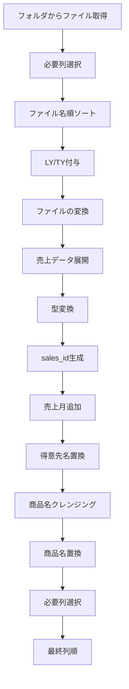

#### 展開対象となっていた売上列

主な列は以下。

- `売上日付`
- `売上発生部門コード`
- `売上伝票番号`
- `売上明細伝票行番号`
- `得意先コード`
- `得意先名称`
- `売上明細商品コード`
- `売上明細商品名`
- `売上明細金額符号付`

#### `sales_id` の生成

伝票行番号を2桁に整形してから、

```text
year_id-売上伝票番号-売上明細伝票行番号
```

の形式で `sales_id` を作成していた。

例：

```text
LY-123456-01
```

この処理については、

- 伝票行番号へ `"00"` を前置
- `Text.End(_, 2)` で末尾2桁取得
- `sales_id` 作成
- 元の伝票番号関連列を削除

という順序を維持した。

#### 得意先名称の置換

得意先については、

```text
得意先コード_得意先名称
```

の連結キーを作成し、`得意先名置換マスタ` を `List.Accumulate` で順次適用していた。

その後、

- `_` より前 → `得意先コード`
- `_` より後 → `得意先名`

として再分解する構成。

既存コードでは旧得意先コードを一時退避する処理も含まれていた。

#### 商品名の置換

商品名については複数段階のクレンジングを行っていた。

1. `UnifiedSpaceSalesName` によるスペース統一
2. `特定文字置換マスタ` による文字置換
3. `商品コード_商品名` の連結
4. `商品名置換マスタ` による置換
5. 商品コードと商品名へ再分解

この処理も基本ロジックは変更せず、ステップ名を明確化する方針で整理した。

---

### Cleaned Dataファイルの読み込み

複数のクエリで、以下のCleaned Dataファイルを参照していた。

```text
C:\Users\kyoupatty029\projects\kpm\analysis_inspection\sales_analysis\cleaned_data\sales_rep_10101_cleaned_data.xlsx
```

参照テーブルは共通して、

```text
sales_intermediate_file
```

だった。

主な型設定は以下。

|列|型|
|---|---|
|売上日付|`type date`|
|売上月|`type text`|
|売上発生部門コード|`type text` または一部コードで `Int64.Type`|
|得意先コード|`type text`|
|得意先名|`type text`|
|商品コード|`type text`|
|商品名|`type text`|
|売上明細金額符号付|`Int64.Type`|
|year_id|`type text`|
|sales_id|`type text`|

リファクタリング後は、

```powerquery
データソース
中間データテーブル
データ型を変換
```

などの名称に統一する方向で整理した。

---

### ファイル名と年度の対応一覧作成

Cleaned Data内の `Name` 列から、重複しないファイル一覧を作り、ファイル名順に `LY` / `TY` を割り当てるクエリも扱った。

処理内容は、

1. `Name` 列のみ選択
2. 重複削除
3. `Name` 昇順
4. インデックス追加
5. `0 → LY`
6. その他 → `TY`
7. インデックス削除
8. `year_id`, `Name` の順に並べ替え

という構成。

ここでは元コードの

```powerquery
if [index] = 0 then "LY" else "TY"
```

をそのまま維持した。

---

### 担当者マスタとの結合

売上データと得意先別担当者一覧を結合する処理も複数回扱った。

基本構造は、

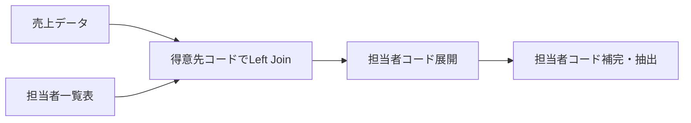

#### 未登録得意先の担当者補完

あるクエリでは、担当者コードが `null` の場合、

```text
10101
```

を設定していた。

元コメントには「担当者名が null の場合に水岡を設定」と記載されていたが、実際に操作しているのは**担当者コード**だったため、リファクタリングではコメントを

> 担当者コードが null の場合にデフォルト値 `"10101"` を設定

のように実処理に合わせて修正した。

#### 得意先単位の集計

その後、

```text
得意先コード
得意先名
担当者コード
```

でグループ化し、

```powerquery
List.Sum([売上明細金額符号付])
```

によって得意先売上を集計。

最後に、

1. `担当者コード` 降順
2. `売上明細金額` 降順

で並べ替えていた。

---

### `ClientSalesRepList` マスタ

共有マスタとして以下のファイルを使用していた。

```text
C:\Users\kyoupatty029\projects\kpm\analysis_inspection\shared_master\SalesAnalysisMaster.xlsx
```

使用テーブル：

```text
ClientSalesRepList
```

主なカラムは以下。

|列|内容|
|---|---|
|`client_code`|得意先コード|
|`client_name`|得意先名称|
|`division_code`|部門コード|
|`sales_rep_code`|担当者コード|
|`updated_date`|更新日|

2種類のクエリを扱った。

#### 必要列だけ取得する版

最終的に、

```text
client_code
client_name
sales_rep_code
```

だけを残すクエリ。

#### マスタ全体を型設定して取得する版

こちらは5列すべてを保持。

自動生成名だった、

```powerquery
#"Changed Type"
```

は、

```powerquery
データ型を変換
```

へ変更した。

---

### 担当者10101の売上抽出

Cleaned Dataへ `ClientSalesRepList` を結合し、担当者コード `"10101"` のデータだけ抽出するクエリも整理した。

処理は次の通り。

1. Cleaned Dataを読み込み
2. 型変換
3. 売上日付昇順
4. 不要商品コードを除外
5. 得意先コードで `ClientSalesRepList` とLeft Join
6. `sales_rep_code` を `担当者コード` として展開
7. `担当者コード = "10101"` だけ残す
8. 列順を調整

除外条件は、

```powerquery
[商品コード] <> ""
and [商品コード] <> "888888"
```

だった。

コメント上では、

- 運賃
- 一括消費税

の除外として扱っていた。

---

### 売上集計クエリ

短い集計クエリについても、命名を整理した。

#### 大塚刷毛売上の集計

ソース：

```powerquery
売上データ_大塚刷毛
```

グループキー：

```text
year_id
売上発生部門コード
売上月
得意先コード
```

集計：

```powerquery
{{"売上", each List.Sum([売上明細金額符号付]), type nullable number}}
```

リファクタリング後は、

```powerquery
データソース
売上をグループ化
```

のようにした。

---

### 部門別・年度別データ抽出

`売上データ` から、

```text
売上発生部門コード = "101"
year_id = "LY"
```

の行だけを抽出し、不要な識別列を削除して、

```text
売上明細金額符号付 → 昨年度
```

へ変更するクエリも整理した。

処理フローは単純で、


となる。

---

### 昨年度・本年度比較表

部門101および部門201について、ほぼ同一構造の前年比較クエリを扱った。

入力クエリはそれぞれ、

```text
部門101_昨年
部門101_本年
```

または、

```text
部門201_昨年
部門201_本年
```

だった。

処理構造は共通。

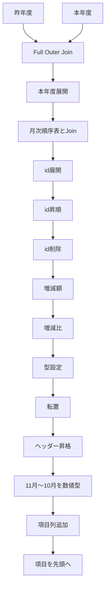

#### 増減額

```powerquery
[本年度] - [昨年度]
```

#### 増減比

```powerquery
if [昨年度] = 0
then null
else [本年度] / [昨年度]
```

その後、

```powerquery
{"増減額", Int64.Type}
{"増減比", Percentage.Type}
```

を設定。

#### 月の並び

会計年度に合わせ、

```text
11月
12月
1月
2月
3月
4月
5月
6月
7月
8月
9月
10月
```

の順序を維持していた。

#### 転置後の項目列

転置後に、

```powerquery
項目リスト = {"昨年度", "本年度", "増減額", "増減比"}
```

を作り、

```powerquery
Table.PositionOf(...)
```

を使って各行へ対応する項目名を設定していた。

部門101と201のコード差は、入力クエリ名だけで、ロジックは同一だった。

---

### 売上月別集計

Cleaned Dataから対象部門のデータだけ抽出し、売上月単位で集計するクエリも整理した。

対象部門：

```text
101
201
```

除外条件：

```powerquery
[商品コード] <> ""
```

元コメントでは「一括消費税の除外」とされていた。

グループキー：

```text
売上月
売上発生部門コード
year_id
```

集計対象：

```powerquery
売上明細金額符号付
```

処理結果は、

```text
月 × 部門 × 年度
```

単位の売上集計となる。

---

### 月次順序表

Excelブック内のテーブル、

```text
月次順序表
```

を読み込むだけのシンプルなクエリもリファクタリングした。

構成は、

```powerquery
Excel.CurrentWorkbook(){[Name="月次順序表"]}[Content]
```

から取得し、

```text
id       → Int64.Type
売上月   → type text
```

に設定。

このクエリは、11月始まりの月順制御に使用されている。

リファクタリング後の名称例：

```powerquery
月次順序データ
データ型を変換
```

---

### `year_id` とファイル名一覧の抽出

最後に扱ったクエリでは、Cleaned Dataから、

```text
year_id
Name
```

の組み合わせだけを抽出していた。

元コードは一旦、

```powerquery
Table.Group(
    中間テーブル,
    {"year_id", "Name"},
    {{"カウント", each Table.RowCount(_), Int64.Type}}
)
```

でグループ化し、その直後に `カウント` 列を削除する構成。

つまり実質的には、

> `year_id` と `Name` のユニークな組み合わせ一覧

を作成している。

リファクタリングでは、

```powerquery
グループ化データ
必要な列のみ保持
```

という名称にした。

ただし、処理目的だけを見ると、将来的には `Table.Distinct` を使う方が意図は明確になる余地がある。ただし今回の作業では、原則として**元の処理ロジックを変更せず、視認性改善だけを実施**した。

---

### 今回のコード群の関係

今回登場したクエリを全体で見ると、概ね次のような構造になっている。

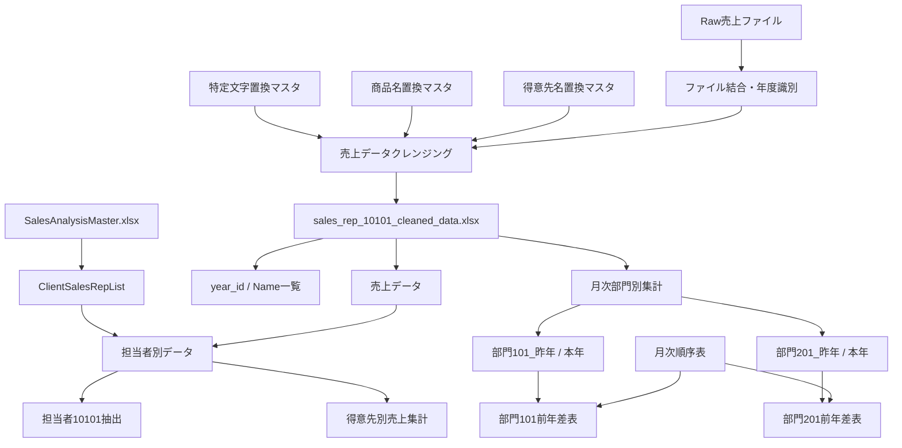

---

### このチャットで固まったリファクタリングスタイル

今回のやり取りを通じて、Power Queryコードについては次のスタイルが一貫して適している。

```powerquery
let
    // 大きな処理単位のコメント
    データソース = ...,
    対象テーブル = ...,

    // データ型の設定
    データ型を変換 = Table.TransformColumnTypes(
        対象テーブル,
        {
            ...
        }
    ),

    // データの抽出
    対象データを抽出 = Table.SelectRows(
        データ型を変換,
        each ...
    ),

    // 集計
    売上をグループ化 = Table.Group(
        対象データを抽出,
        {...},
        {...}
    )
in
    売上をグループ化
```

特に、自動生成される日本語ステップ名や英語ステップ名をそのまま使わず、

> **何をしたかが読めば分かるステップ名**

へ変更することが、このチャット全体の中心的な改善方針だった。

### 今後整理すると効果が大きい点

今回の範囲では主に視認性改善に留めたが、コード群全体を見ると、次の部分は今後さらに整理する余地がある。

- 部門101と201の前年差表はほぼ完全に同一ロジックなので、関数化できる可能性が高い。
- Cleaned Dataファイルのパスが複数クエリへ直接記述されており、パラメータ化の余地がある。
- `10101`、`101`、`201` などのコード値が複数箇所へ直接記載されており、将来的には管理方法を検討できる。
- `Table.Group` → カウント削除でユニーク行を取得している処理は、目的上は `Table.Distinct` の方が簡潔。
- `year_id` の `LY` / `TY` 判定がファイル名順に依存するため、ファイル命名規則との依存関係を明文化すると安全。
- 一部コメントと実際の処理内容にズレがあったため、今後も「コメントではなくコードを正」として確認する必要がある。
- ステップ名の日本語表記について、今回のような自然文形式に統一するか、既存の `動詞_対象` 形式へ寄せるかは、プロジェクト全体で統一するとさらに読みやすくなる。

今回のやり取りでは、**機能変更よりも「読みやすく、意図が追いやすく、後から修正しやすいPower Query」へ整えること**を中心に進めた。

## 段階3：Power Queryコードの視認性改善リファクタリングまとめ

このチャットでは、売上分析で使用している複数のPower Queryコードについて、**処理内容やロジックを大きく変更せず、視認性・可読性を高めること**を目的としてリファクタリングを行った。

対象となったのは、主に以下の4つのクエリである。

|対象|主な役割|
|---|---|
|`kp`|KP売上ファイルの取込・整形|
|`sc`|SC売上ファイルの取込・KP形式への統一|
|KP＋SC統合／クレンジング|KP・SCを結合し、得意先・商品情報を統一|
|ImportedFiles系|KP・SCのインポート対象ファイル名一覧を作成|

リファクタリングでは、ステップ名を英語のPascalCase系へ整理し、複数行の関数呼び出しを適切にインデントし、処理単位でコメントと空行を配置する方針を採った。

---

### 全体の処理構造

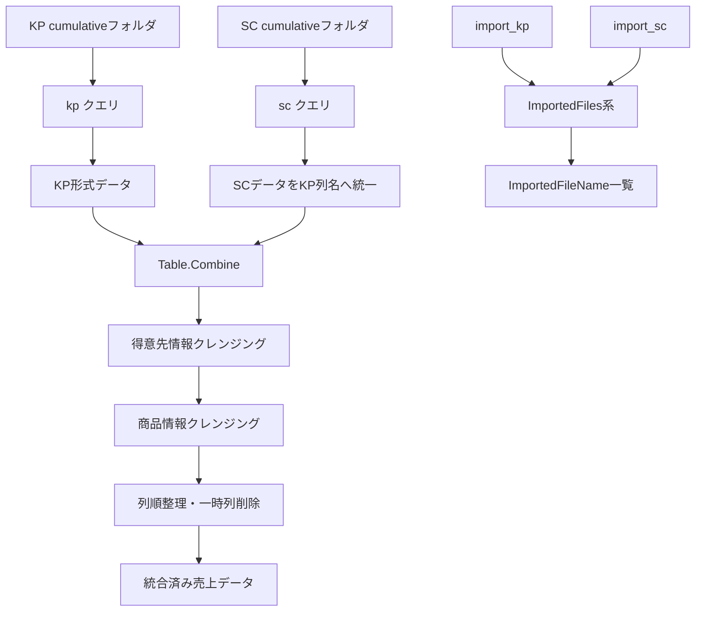

---

### 1. KP売上データ取込クエリ

KP側では、以下のフォルダをデータソースとして使用している。

```text
C:\Users\kyoupatty029\projects\kpm\analysis_inspection\sales_analysis\import\org\kp\cumulative
```

処理フローは次の通り。

1. `Folder.Files` でファイル一覧取得
2. 隠しファイルを除外
3. `ファイルの変換` 関数で各ファイルを変換
4. 変換済みテーブルのみ残す
5. サンプルファイルを基準に列を展開
6. 各列の型を設定
7. `SourceType = "KP"` を追加
8. 不要な得意先・商品を除外

リファクタリング後のコードは以下。

```powerquery
let
    // フォルダからファイルを取得
    Source = Folder.Files("C:\Users\kyoupatty029\projects\kpm\analysis_inspection\sales_analysis\import\org\kp\cumulative"),

    // 隠しファイルを除外
    FilteredHiddenFiles = Table.SelectRows(
        Source,
        each [Attributes]?[Hidden]? <> true
    ),

    // カスタム関数でファイル内容を変換
    TransformedFiles = Table.AddColumn(
        FilteredHiddenFiles,
        "TransformedFile",
        each ファイルの変換([Content])
    ),

    // 必要な列のみを残す
    SelectedColumns = Table.SelectColumns(
        TransformedFiles,
        {"TransformedFile"}
    ),

    // サンプルファイルから展開する列を動的に取得
    ExpandedTable = Table.ExpandTableColumn(
        SelectedColumns,
        "TransformedFile",
        Table.ColumnNames(ファイルの変換(#"サンプル ファイル"))
    ),

    // 列のデータ型を適切に設定
    ChangedColumnTypes = Table.TransformColumnTypes(
        ExpandedTable,
        {
            {"売上日付", type date},
            {"売上発生部門コード", Int64.Type},
            {"発生部門M部門名", type text},
            {"売上伝票番号", Int64.Type},
            {"売上明細伝票行番号", Int64.Type},
            {"売上伝票区分", Int64.Type},
            {"得意先コード", type text},
            {"得意先名称", type text},
            {"得意先名称２", type text},
            {"得意先住所１", type text},
            {"得意先住所２", type text},
            {"得意先住所３", type any},
            {"納入先コード", Int64.Type},
            {"納入先名称", type text},
            {"納入先名称２", type text},
            {"納入先住所１", type text},
            {"納入先住所２", type text},
            {"納入先住所３", type any},
            {"売上明細商品コード", type text},
            {"売上明細商品名", type text},
            {"売上明細荷姿区分", Int64.Type},
            {"売上明細入数", Int64.Type},
            {"売上明細入数単位", type text},
            {"売上明細荷姿数符号付", Int64.Type},
            {"売上明細荷姿単位", type any},
            {"売上明細バラ総数符号付", Int64.Type},
            {"売上明細単価", type number},
            {"売上明細金額符号付", Int64.Type},
            {"売上明細外税消費税符号付", Int64.Type},
            {"税率", Int64.Type}
        }
    ),

    // データソース種別を追加
    AddedCustomColumn = Table.AddColumn(
        ChangedColumnTypes,
        "SourceType",
        each "KP",
        type text
    ),

    // 不要な行をフィルタリング
    FilteredRows = Table.SelectRows(
        AddedCustomColumn,
        each ([得意先コード] <> "402070")
            and ([売上明細商品コード] <> "" and [売上明細商品コード] <> "888888")
    )
in
    FilteredRows
```

#### KP側の除外条件

|対象|除外値|
|---|---|
|得意先コード|`"402070"`|
|商品コード|空文字 `""`|
|商品コード|`"888888"`|

また、元コードの自動生成的なステップ名であった

```powerquery
#"Added Custom"
```

を

```powerquery
AddedCustomColumn
```

へ変更し、他ステップと命名方法を統一した。

---

### 2. SC売上データ取込クエリ

SC側では以下をデータソースとしている。

```text
C:\Users\kyoupatty029\projects\kpm\analysis_inspection\sales_analysis\import\org\sc\cumulative
```

SCは元データの構造がKPと異なるため、読み込んだ後に**KPのカラム名へ統一する処理**が入っている。

処理フローは以下。


リファクタリング後は以下。

```powerquery
let
    // フォルダからファイルを取得
    Source = Folder.Files("C:\Users\kyoupatty029\projects\kpm\analysis_inspection\sales_analysis\import\org\sc\cumulative"),

    // 隠しファイルを除外
    FilteredHiddenFiles = Table.SelectRows(
        Source,
        each [Attributes]?[Hidden]? <> true
    ),

    // カスタム関数でファイル内容を変換
    TransformedFiles = Table.AddColumn(
        FilteredHiddenFiles,
        "TransformedFile",
        each #"ファイルの変換 (2)"([Content])
    ),

    // 必要な列のみを残す
    SelectedColumns = Table.SelectColumns(
        TransformedFiles,
        {"TransformedFile"}
    ),

    // サンプルファイルから展開する列を動的に取得
    ExpandedTable = Table.ExpandTableColumn(
        SelectedColumns,
        "TransformedFile",
        Table.ColumnNames(#"ファイルの変換 (2)"(#"サンプル ファイル (2)"))
    ),

    // 不要な列を削除
    RemovedColumns = Table.RemoveColumns(
        ExpandedTable,
        {"日付別売上明細表"}
    ),

    // 必要な行のみを残す
    FilteredRows = Table.SelectRows(
        RemovedColumns,
        each [Column2] <> null
    ),

    // ヘッダーを昇格
    PromotedHeaders = Table.PromoteHeaders(
        FilteredRows,
        [PromoteAllScalars = true]
    ),

    // 列のデータ型を適切に設定
    ChangedColumnTypes = Table.TransformColumnTypes(
        PromotedHeaders,
        {
            {"売上日", type date},
            {"伝票番号", Int64.Type},
            {"取引区分", type text},
            {"締切", type text},
            {"得意先コード", Int64.Type},
            {"得意先名", type text},
            {"税転嫁", type text},
            {"納入先コード", type text},
            {"納入先名", type text},
            {"担当者コード", type text},
            {"担当者名", type text},
            {"内訳", type text},
            {"出荷", type text},
            {"商品コード", Int64.Type},
            {"商品名/摘要", type text},
            {"単位", type text},
            {"入数", Int64.Type},
            {"ケース", Int64.Type},
            {"倉庫コード", Int64.Type},
            {"倉庫名", type text},
            {"数量", Int64.Type},
            {"原単価", Int64.Type},
            {"単価", Int64.Type},
            {"粗利益", Int64.Type},
            {"金額", Int64.Type},
            {"主プロジェクトコード", type text},
            {"副プロジェクトコード", type text},
            {"プロジェクト名", type text},
            {"課税区分", type text},
            {"備考", type text},
            {"見積番号", type text},
            {"受注番号", type text}
        }
    ),

    // データソース種別を追加
    AddedCustomColumn = Table.AddColumn(
        ChangedColumnTypes,
        "SourceType",
        each "SC",
        type text
    ),

    // KPのカラム名に統一
    RenamedColumnsFinal = Table.RenameColumns(
        AddedCustomColumn,
        {
            {"売上日", "売上日付"},
            {"伝票番号", "売上伝票番号"},
            {"商品コード", "売上明細商品コード"},
            {"商品名/摘要", "売上明細商品名"},
            {"単位", "売上明細入数単位"},
            {"入数", "売上明細入数"},
            {"数量", "売上明細バラ総数符号付"},
            {"単価", "売上明細単価"},
            {"金額", "売上明細金額符号付"},
            {"得意先名", "得意先名称"},
            {"納入先名", "納入先名称"}
        }
    ),

    // 不要な行をフィルタリング
    FilteredRowsFinal = Table.SelectRows(
        RenamedColumnsFinal,
        each [売上明細商品コード] <> null
            and [売上明細商品コード] <> 888888
    )
in
    FilteredRowsFinal
```

#### SC → KP列名変換

|SC|KP統一後|
|---|---|
|売上日|売上日付|
|伝票番号|売上伝票番号|
|商品コード|売上明細商品コード|
|商品名/摘要|売上明細商品名|
|単位|売上明細入数単位|
|入数|売上明細入数|
|数量|売上明細バラ総数符号付|
|単価|売上明細単価|
|金額|売上明細金額符号付|
|得意先名|得意先名称|
|納入先名|納入先名称|

さらに

```powerquery
SourceType = "SC"
```

を付与することで、KPとSCを統合した後でも元のデータソースを判別できる構造としている。

---

### 3. KP＋SC統合後の得意先・商品クレンジング

次に、整形済みの

```powerquery
kp
sc
```

を

```powerquery
Table.Combine({kp, sc})
```

で統合する。

このクエリでは単純な結合だけではなく、**得意先情報と商品情報の表記統一・置換**を行う。

### 得意先情報の処理

基本構造は次の通り。

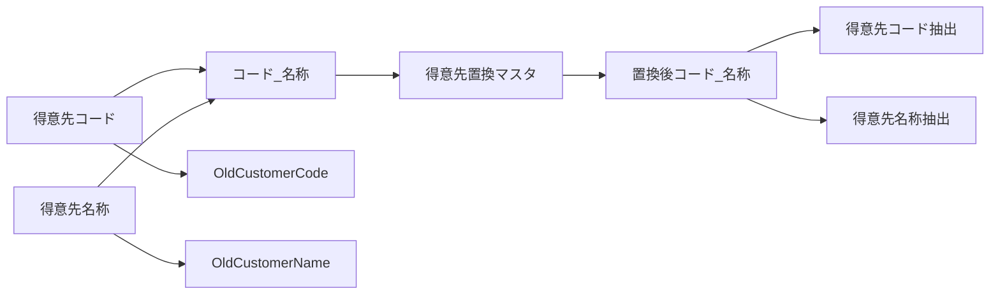

まず、

```powerquery
CustomerCodeNameConcat
```

として

```text
得意先コード_得意先名称
```

を作成する。

その値に対して、

```powerquery
得意先置換マスタ
```

を

```powerquery
List.Accumulate
```

で順番に適用する。

```powerquery
each List.Accumulate(
    Table.ToRows(得意先置換マスタ),
    [CustomerCodeNameConcat],
    (x, y) => Text.Replace(x, y{0}, y{1})
)
```

置換結果は

```powerquery
ReplacementCustomData
```

へ格納する。

その前に元の列を

```text
得意先コード → OldCustomerCode
得意先名称   → OldCustomerName
```

へ退避する。

その後、

```powerquery
Text.BeforeDelimiter([ReplacementCustomData], "_")
```

から新しい得意先コード、

```powerquery
Text.AfterDelimiter([ReplacementCustomData], "_")
```

から新しい得意先名称を再生成する。

---

### 商品情報の処理

商品についても同様に、コードと名称を連結してからマスタ置換している。ただし、商品名はその前に追加の文字列クレンジングを行う。

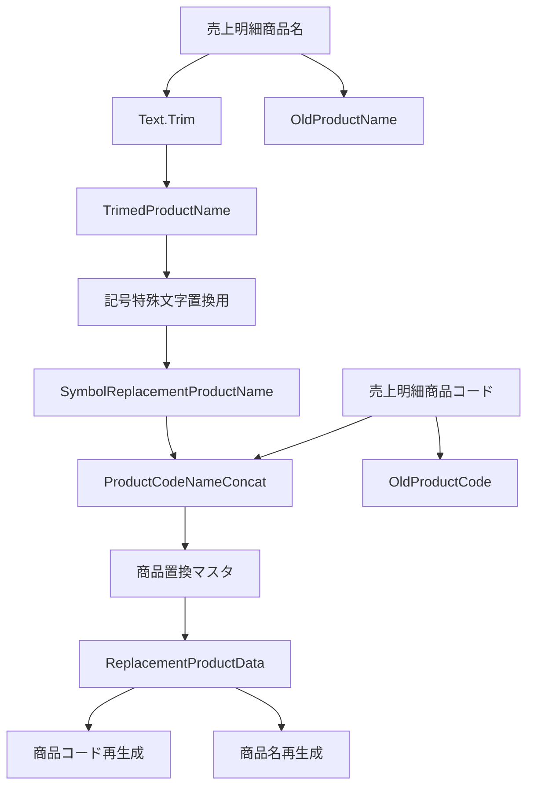

商品名はまず

```powerquery
Text.Trim([売上明細商品名])
```

によって前後の空白を除去する。

結果は

```powerquery
TrimedProductName
```

へ格納。

その後、

```powerquery
記号特殊文字置換用
```

を用いて、

```powerquery
List.Accumulate
```

による特殊記号・文字の置換を実行する。

結果を

```powerquery
SymbolReplacementProductName
```

とする。

さらに、

```text
商品コード_商品名
```

形式の

```powerquery
ProductCodeNameConcat
```

を作り、

```powerquery
商品置換マスタ
```

による置換を実行。

結果を

```powerquery
ReplacementProductData
```

へ格納する。

元の商品情報は

```text
売上明細商品コード → OldProductCode
売上明細商品名     → OldProductName
```

として退避。

その後、

```powerquery
Text.BeforeDelimiter
Text.AfterDelimiter
```

を使い、置換後の商品コード・商品名を復元する。

---

### リファクタリング後の統合クエリ

```powerquery
let
    // 複数のテーブルを結合
    Source = Table.Combine({kp, sc}),

    // 必要な列のデータ型を変更
    ChangedColumnTypes = Table.TransformColumnTypes(
        Source,
        {
            {"得意先コード", type text},
            {"売上明細商品コード", type text}
        }
    ),

    // 顧客コードと名前を結合
    AddedConcatenatedCustomer = Table.AddColumn(
        ChangedColumnTypes,
        "CustomerCodeNameConcat",
        each [得意先コード] & "_" & [得意先名称],
        type text
    ),

    // 得意先マスタによる置換処理
    ReplacedCustomerData = Table.AddColumn(
        AddedConcatenatedCustomer,
        "ReplacementCustomData",
        each List.Accumulate(
            Table.ToRows(得意先置換マスタ),
            [CustomerCodeNameConcat],
            (x, y) => Text.Replace(x, y{0}, y{1})
        )
    ),

    // 元の得意先情報を保持
    RenamedCustomerColumns = Table.RenameColumns(
        ReplacedCustomerData,
        {
            {"得意先コード", "OldCustomerCode"},
            {"得意先名称", "OldCustomerName"}
        }
    ),

    // 置換後の得意先コードを抽出
    ExtractedCustomerCode = Table.AddColumn(
        RenamedCustomerColumns,
        "得意先コード",
        each Text.BeforeDelimiter([ReplacementCustomData], "_"),
        type text
    ),

    // 置換後の得意先名称を抽出
    ExtractedCustomerName = Table.AddColumn(
        ExtractedCustomerCode,
        "得意先名称",
        each Text.AfterDelimiter([ReplacementCustomData], "_"),
        type text
    ),

    // 商品名をトリミング
    TrimmedProductName = Table.AddColumn(
        ExtractedCustomerName,
        "TrimedProductName",
        each Text.Trim([売上明細商品名]),
        type text
    ),

    // 特殊記号を置換
    ReplacedProductSymbols = Table.AddColumn(
        TrimmedProductName,
        "SymbolReplacementProductName",
        each List.Accumulate(
            Table.ToRows(記号特殊文字置換用),
            [TrimedProductName],
            (x, y) => Text.Replace(x, y{0}, y{1})
        ),
        type text
    ),

    // 商品コードと商品名を結合
    ConcatenatedProduct = Table.AddColumn(
        ReplacedProductSymbols,
        "ProductCodeNameConcat",
        each [売上明細商品コード] & "_" & [SymbolReplacementProductName],
        type text
    ),

    // 商品置換マスタによる置換処理
    ReplacedProductData = Table.AddColumn(
        ConcatenatedProduct,
        "ReplacementProductData",
        each List.Accumulate(
            Table.ToRows(商品置換マスタ),
            [ProductCodeNameConcat],
            (x, y) => Text.Replace(x, y{0}, y{1})
        ),
        type text
    ),

    // 元の商品情報を保持
    RenamedProductColumns = Table.RenameColumns(
        ReplacedProductData,
        {
            {"売上明細商品コード", "OldProductCode"},
            {"売上明細商品名", "OldProductName"}
        }
    ),

    // 置換後の商品コードを抽出
    ExtractedProductCode = Table.AddColumn(
        RenamedProductColumns,
        "売上明細商品コード",
        each Text.BeforeDelimiter([ReplacementProductData], "_"),
        type text
    ),

    // 置換後の商品名を抽出
    ExtractedProductName = Table.AddColumn(
        ExtractedProductCode,
        "売上明細商品名",
        each Text.AfterDelimiter([ReplacementProductData], "_"),
        type text
    ),

    // 列の並び順を調整
    ReorderedColumns = Table.ReorderColumns(
        ExtractedProductName,
        {
            "SourceType", "売上日付", "売上発生部門コード", "発生部門M部門名",
            "売上伝票番号", "売上明細伝票行番号", "売上伝票区分", "得意先コード",
            "得意先名称", "得意先名称２", "得意先住所１", "得意先住所２",
            "得意先住所３", "納入先コード", "納入先名称", "納入先名称２",
            "納入先住所１", "納入先住所２", "納入先住所３", "売上明細商品コード",
            "売上明細商品名", "売上明細荷姿区分", "売上明細入数", "売上明細入数単位",
            "売上明細荷姿数符号付", "売上明細荷姿単位", "売上明細バラ総数符号付",
            "売上明細単価", "売上明細金額符号付", "売上明細外税消費税符号付",
            "税率", "取引区分", "締切", "税転嫁", "担当者コード", "担当者名",
            "内訳", "出荷", "ケース", "倉庫コード", "倉庫名", "原単価",
            "粗利益", "主プロジェクトコード", "副プロジェクトコード",
            "プロジェクト名", "課税区分", "備考", "見積番号", "受注番号",
            "OldCustomerCode", "OldCustomerName", "OldProductCode", "OldProductName",
            "CustomerCodeNameConcat", "ReplacementCustomData", "TrimedProductName",
            "SymbolReplacementProductName", "ProductCodeNameConcat", "ReplacementProductData"
        }
    ),

    // 処理用の一時列を削除
    RemovedColumns = Table.RemoveColumns(
        ReorderedColumns,
        {
            "CustomerCodeNameConcat",
            "ReplacementCustomData",
            "TrimedProductName",
            "SymbolReplacementProductName",
            "ProductCodeNameConcat",
            "ReplacementProductData"
        }
    )
in
    RemovedColumns
```

最終的には、置換処理に使用した一時列だけを削除し、

```text
OldCustomerCode
OldCustomerName
OldProductCode
OldProductName
```

は残している。

したがって、**置換前と置換後を追跡可能な設計**になっている。

---

### 4. インポートファイル名一覧クエリ

最後に、

```powerquery
import_kp
import_sc
```

を結合し、読み込み対象となっているファイル名を一覧化するクエリを整理した。

元コードでは、Power QueryのGUIが自動生成した以下のようなステップ名が使用されていた。

```text
#"Filtered Hidden Files1"
#"Invoke Custom Function1"
#"Removed Other Columns1"
#"Renamed Columns"
```

これを他のクエリと同じ命名方式へ統一した。

```powerquery
let
    // 複数のテーブルを結合
    Source = Table.Combine({import_kp, import_sc}),

    // 隠しファイルを除外
    FilteredHiddenFiles = Table.SelectRows(
        Source,
        each [Attributes]?[Hidden]? <> true
    ),

    // カスタム関数でファイル内容を変換
    InvokedCustomFunction = Table.AddColumn(
        FilteredHiddenFiles,
        "ファイルの変換 (3)",
        each #"ファイルの変換 (3)"([Content])
    ),

    // 必要な列のみを選択
    SelectedColumns = Table.SelectColumns(
        InvokedCustomFunction,
        {"Name"}
    ),

    // ファイル名列を変更
    RenamedColumns = Table.RenameColumns(
        SelectedColumns,
        {
            {"Name", "ImportedFileName"}
        }
    )
in
    RenamedColumns
```

最終出力は基本的に

|ImportedFileName|
|---|
|ファイル名1|
|ファイル名2|
|…|

という単一列のテーブルとなる。

なお、現在のロジックでは

```powerquery
#"ファイルの変換 (3)"
```

を実行して列を追加した後、その列を使用せず `Name` のみを残している。この処理は今回の「視認性改善」では変更せず、そのまま維持している。

---

### リファクタリングで統一した考え方

今回の一連の修正では、特に以下を共通ルールとした。

|項目|方針|
|---|---|
|ステップ名|PascalCase系の英語名|
|GUI自動生成名|可能な範囲で意味のある名前へ変更|
|コメント|処理内容を説明する短い日本語|
|空行|論理的な処理単位ごとに配置|
|長い関数|引数を複数行へ展開|
|型定義|1列1行にして一覧性を確保|
|RenameColumns|対応関係が分かるよう縦並び|
|RemoveColumns|削除対象を縦並び|
|ロジック|原則変更しない|
|一時列|最終段階でまとめて削除|
|元データ|`Old...` 列として必要に応じて保持|

特に、Power Query GUIが作成する

```powerquery
#"Added Custom"
#"Filtered Hidden Files1"
#"Invoke Custom Function1"
```

のような名前を、

```powerquery
AddedCustomColumn
FilteredHiddenFiles
InvokedCustomFunction
```

へ変更することで、コード全体の統一感を高めている。

---

### 現在のデータ処理設計

一連のクエリを整理すると、現在の売上分析データは以下の構造になっている。

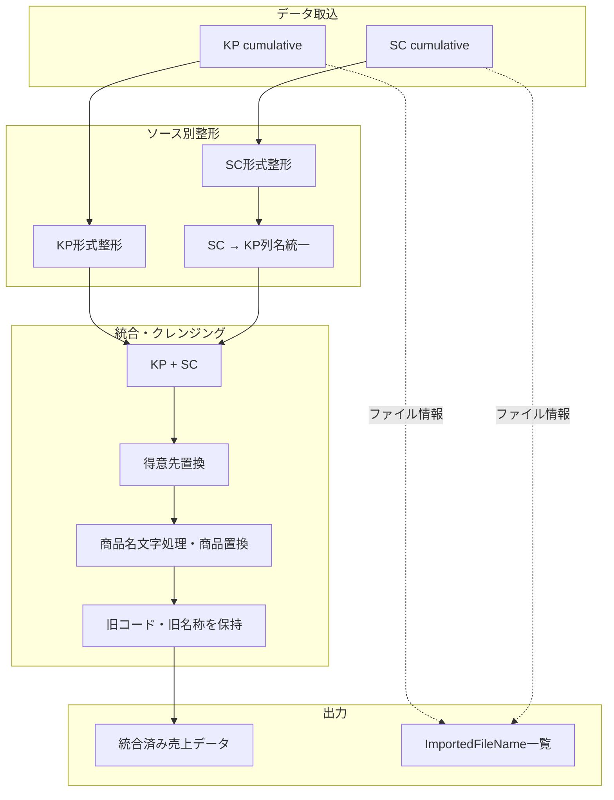

重要なのは、KPとSCを直接同じデータとして扱うのではなく、

**「各ソースを先に正規化 → 共通フォーマット化 → 統合 → 共通クレンジング」**

という構造になっている点である。

これは売上分析用データのメンテナンスという観点でも比較的理解しやすい構成になっている。

---

### 今回までに確立したコードスタイル

このチャットを通して、Power Queryコードについては次のスタイルが事実上の基準となった。

```text
Source
↓
入力データの整理
↓
必要列の選択・展開
↓
型設定
↓
補助列追加
↓
クレンジング・置換
↓
列名統一
↓
フィルタリング
↓
列順整理
↓
一時列削除
↓
最終出力
```

ステップ名は処理内容を表す英語名を使用し、コメントは日本語で説明する方式で統一されている。

また、今回の目的はあくまで**視認性改善のためのリファクタリング**であり、処理そのものを積極的に短縮・高速化・設計変更するリファクタリングまでは行っていない。

今後さらに整理する場合は、次の段階として「コードの見た目」だけでなく、`List.Accumulate` 用のマスタテーブルを変数化する、一時列名の命名規則を統一する、不要な処理を除去するといった**構造的リファクタリング**を別途検討できる状態になっている。

## 段階4：Power Queryコードの視認性向上リファクタリングまとめ

このチャットでは、売上分析で使用している複数のPower Queryコードについて、**処理内容そのものは極力変えず、視認性・可読性・保守性を高めること**を目的としてリファクタリングを行った。

対象となったのは大きく次の3種類である。

- KP側の累計売上ファイル読込クエリ
- SC側の累計売上ファイル読込クエリ
- KP＋SCを統合し、得意先・商品情報をクレンジング／置換するクエリ

特に3つ目については、こちらから提案したリファクタリング案をベースに、ユーザー側でさらに命名を修正し、`CustomerCodeNameConcat`／`ProductCodeNameConcat` という名称を採用した。

---

### 1. 全体として採用したリファクタリング方針

元コードはPower QueryのGUI操作によって自動生成されたステップ名が多く、

```powerquery
#"Renamed Columns"
#"Filtered Hidden Files1"
#"Invoke Custom Function1"
#"Added Custom1"
#"Inserted Text Before Delimiter1"
```

のように、**「何をしたか」は分かっても「何のための処理か」がコードだけでは読み取りにくい状態**だった。

そこで、基本方針として以下を採用した。

|項目|元コード|リファクタリング後|
|---|---|---|
|ステップ名|GUI自動生成名|PascalCaseの意味のある英語名|
|コメント|ほぼなし|処理ブロック単位で追加|
|インデント|1行に長く記述|引数ごとに改行|
|型定義|横長|列ごとに縦方向へ配置|
|フィルタ条件|1行|条件単位で改行|
|一時列|GUI由来の名称|処理内容が分かる名称|
|処理構造|ステップを追わないと分からない|顧客処理・商品処理など意味単位で整理|

最終的には、単純にコードを短くするよりも、

> **後から見たときに「今どの処理をしているか」を追いやすいコード**

を優先する方向となった。

---

### 2. KP累計売上データ読込クエリ

最初の対象は、KP側の累計売上ファイルをフォルダから読み込むクエリだった。

元のソースフォルダは以下。

> 同一のコード断片は前段階に記録済みのため、重複掲載を省略。

処理の流れは次のとおり。

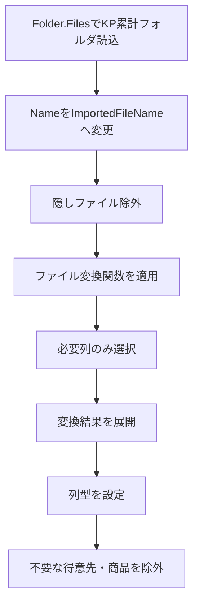

リファクタリングでは、例えば以下のようにステップ名を変更した。

|GUI生成名|リファクタリング名|意味|
|---|---|---|
|`#"Renamed Columns"`|`RenamedColumns`|列名変更|
|`#"Filtered Hidden Files1"`|`FilteredHiddenFiles`|隠しファイル除外|
|`#"Invoke Custom Function1"`|`TransformedFiles`|ファイル変換|
|`#"Removed Other Columns1"`|`SelectedColumns`|必要列選択|
|`#"Expanded Table Column1"`|`ExpandedTable`|テーブル展開|
|`#"Changed Type"`|`ChangedColumnTypes`|データ型設定|
|`#"Filtered Rows"`|`FilteredRows`|行フィルタリング|

#### KP側の最終フィルタ条件

以下のデータを除外している。

```powerquery
each ([得意先コード] <> "402070")
    and ([売上明細商品コード] <> ""
        and [売上明細商品コード] <> "888888")
```

つまり、

- 得意先コード `402070`
- 商品コードが空文字
- 商品コード `888888`

を対象外としている。

---

### 3. SC累計売上データ読込クエリ

次にSC側の累計売上データ読込クエリを同様の方針で整理した。

ソースフォルダは以下。

> 同一のコード断片は前段階に記録済みのため、重複掲載を省略。

SC側はKP側よりも元Excelの構造に前処理が必要であり、次のような流れになっている。

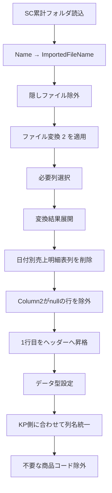

SC側で特に重要なのが、**KPと共通化できる列名へ変換している点**である。

主な列名変換は以下。

|SC元列|共通列名|
|---|---|
|売上日|売上日付|
|伝票番号|売上伝票番号|
|商品コード|売上明細商品コード|
|商品名/摘要|売上明細商品名|
|単位|売上明細入数単位|
|入数|売上明細入数|
|数量|売上明細バラ総数符号付|
|単価|売上明細単価|
|金額|売上明細金額符号付|
|得意先名|得意先名称|
|納入先名|納入先名称|

この処理によって、後段の

```powerquery
Table.Combine({kp, sc})
```

で、KPとSCを同一データ構造として扱えるようにしている。

#### SC側の商品除外条件

```powerquery
each (
    [売上明細商品コード] <> null
    and [売上明細商品コード] <> 888888
)
```

商品コードが、

- `null`
- `888888`

の場合は除外する。

---

### 4. KP＋SC統合後のデータクレンジング

チャットの中心となったのが、この統合・クレンジングクエリである。

最初に、

```powerquery
Source = Table.Combine({kp, sc})
```

によってKPとSCを統合する。

その後、

1. 得意先情報の正規化
2. 商品名の文字クレンジング
3. 商品情報の正規化
4. 元データ保持
5. 一時列削除

という処理を行っている。

全体構造は次のようになる。

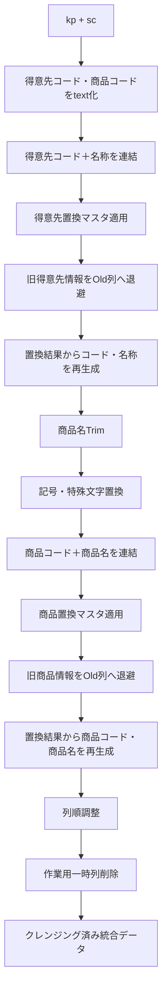

---

### 5. 得意先データの置換処理

まず得意先コードを文字列へ変換する。

```powerquery
ChangedColumnTypes = Table.TransformColumnTypes(
    Source,
    {
        {"得意先コード", type text},
        {"売上明細商品コード", type text}
    }
)
```

これは、後続の文字列連結・置換処理を安定して行うための処理。

続いて、

```text
得意先コード_得意先名称
```

という形式の文字列を作る。

ユーザー側の最終修正では、一時列名として以下を採用した。

```powerquery
CustomerCodeNameConcat
```

実際の処理は、

```powerquery
AddedConcatenatedCustomer = Table.AddColumn(
    ChangedColumnTypes,
    "CustomerCodeNameConcat",
    each [得意先コード] & "_" & [得意先名称],
    type text
)
```

となっている。

---

### 6. 得意先置換マスタの適用

得意先情報の置換には、

```powerquery
List.Accumulate
```

を使用している。

> 同一のコード断片は前段階に記録済みのため、重複掲載を省略。

処理の意味は、

1. `得意先置換マスタ` を行リストへ変換
2. `CustomerCodeNameConcat` を初期値とする
3. マスタの各行について
4. `y{0}` を `y{1}` へ順次置換する

というもの。

したがって、

```text
旧得意先コード_旧得意先名
```

を

```text
新得意先コード_新得意先名
```

へまとめて変換できる。

この結果は一時列、

```text
ReplacementCustomData
```

へ格納している。

なお、名称としては `Custom` より `Customer` の方が意味的には自然だが、このチャット時点では `ReplacementCustomData` の名称は維持している。

---

### 7. 元の得意先情報を保存する

置換前の情報を失わないよう、

```powerquery
{"得意先コード", "OldCustomerCode"},
{"得意先名称", "OldCustomerName"}
```

へ変更する。

その後、置換済みの

```text
ReplacementCustomData
```

を `_` で分割し、

```powerquery
Text.BeforeDelimiter(...)
```

で得意先コード、

```powerquery
Text.AfterDelimiter(...)
```

で得意先名称を再生成している。

これにより、同じテーブル内に、

|種類|列|
|---|---|
|クレンジング後|得意先コード|
|クレンジング後|得意先名称|
|元データ|OldCustomerCode|
|元データ|OldCustomerName|

を保持できる。

この設計は、置換結果の検証やトレーサビリティの確保にも有効。

---

### 8. 商品名の文字クレンジング

得意先処理後、商品情報のクレンジングを行う。

最初に、

```powerquery
Text.Trim([売上明細商品名])
```

で商品名の前後空白を除去する。

一時列は、

```text
TrimedProductName
```

となっている。

ただし英語としては、

```text
TrimmedProductName
```

が正しい綴りである。

現在コードでは列名が `TrimedProductName`、ステップ名が `TrimmedProductName` となっているため、将来的に名称を整理する場合は統一候補となる。

---

### 9. 記号・特殊文字置換

続いて、

```text
記号特殊文字置換用
```

マスタを利用して商品名の文字を正規化する。

処理方式は得意先置換と同じ `List.Accumulate`。

```powerquery
each List.Accumulate(
    Table.ToRows(記号特殊文字置換用),
    [TrimedProductName],
    (x, y) => Text.Replace(x, y{0}, y{1})
)
```

結果は、

```text
SymbolReplacementProductName
```

へ格納される。

つまり商品名は、


という段階を踏む。

---

### 10. 商品コード＋商品名の連結

記号置換後の商品名と商品コードを、

```text
商品コード_商品名
```

形式に連結する。

最初の提案では、

```text
ConcatenatedProduct
```

だったが、ユーザー側で、

```text
ProductCodeNameConcat
```

へ修正した。

最終形は、

```powerquery
ConcatenatedProduct = Table.AddColumn(
    ReplacedProductSymbols,
    "ProductCodeNameConcat",
    each [売上明細商品コード] & "_" & [SymbolReplacementProductName],
    type text
)
```

となっている。

これは得意先側の、

```text
CustomerCodeNameConcat
```

と命名規則が対称になっている。

|対象|採用名|
|---|---|
|得意先コード＋名称|`CustomerCodeNameConcat`|
|商品コード＋名称|`ProductCodeNameConcat`|

この命名は今後のコードでも統一しやすい。

---

### 11. 商品置換マスタの適用

商品についても、

```text
商品置換マスタ
```

を `List.Accumulate` で順次適用する。

```powerquery
each List.Accumulate(
    Table.ToRows(商品置換マスタ),
    [ProductCodeNameConcat],
    (x, y) => Text.Replace(x, y{0}, y{1})
)
```

結果は、

```text
ReplacementProductData
```

へ格納する。

この方式により、商品コードと商品名をセットとして置換できる。

---

### 12. 元商品情報を保持して新しい商品情報を再生成

得意先処理と同様に、元の列を、

```text
OldProductCode
OldProductName
```

へ退避する。

```powerquery
RenamedProductColumns = Table.RenameColumns(
    ReplacedProductData,
    {
        {"売上明細商品コード", "OldProductCode"},
        {"売上明細商品名", "OldProductName"}
    }
)
```

そのうえで、

```powerquery
Text.BeforeDelimiter(
    [ReplacementProductData],
    "_"
)
```

から新しい商品コード、

```powerquery
Text.AfterDelimiter(
    [ReplacementProductData],
    "_"
)
```

から新しい商品名を取得する。

結果として、

|元データ|クレンジング後|
|---|---|
|OldProductCode|売上明細商品コード|
|OldProductName|売上明細商品名|

という対応になる。

---

### 13. 最終列順

処理後は `Table.ReorderColumns` により、業務上使用する主要列を先頭へ配置し、旧データや一時列を後方へ移動している。

概ね次の構成。

```text
ファイル情報
↓
売上・伝票情報
↓
得意先情報
↓
納入先情報
↓
商品情報
↓
数量・単価・金額
↓
SC固有情報
↓
OldCustomer*
↓
OldProduct*
↓
処理用一時列
```

実際には次の一時列も並び順へ含めた後、

```text
CustomerCodeNameConcat
ReplacementCustomData
TrimedProductName
SymbolReplacementProductName
ProductCodeNameConcat
ReplacementProductData
```

最後に削除している。

---

### 14. 一時列の削除

最終ステップでは、クレンジング処理だけに必要だった一時列を削除する。

```powerquery
RemovedColumns = Table.RemoveColumns(
    ReorderedColumns,
    {
        "CustomerCodeNameConcat",
        "ReplacementCustomData",
        "TrimedProductName",
        "SymbolReplacementProductName",
        "ProductCodeNameConcat",
        "ReplacementProductData"
    }
)
```

一方、

> 同一のコード断片は前段階に記録済みのため、重複掲載を省略。

は削除していない。

つまりこれらは一時列ではなく、

> **置換前データを追跡するために意図的に残している列**

という位置づけになる。

---

### 15. ユーザー側で行った重要な修正

こちらの最初のリファクタリング案に対して、ユーザー側で次の名称へ変更した。

|当初案|ユーザー修正後|
|---|---|
|`ConcatenatedCustomer`|`CustomerCodeNameConcat`|
|`ConcatenatedProduct`|`ProductCodeNameConcat`|

この変更により、

```text
Customer + Code + Name + Concat
Product + Code + Name + Concat
```

という構造が明確になり、得意先・商品の一時キーであることを名称から判断しやすくなった。

特に今後Power Query全体で命名規則を揃える場合、

```text
CustomerCodeNameConcat
ProductCodeNameConcat
```

は対になる名称として扱える。

---

### 16. 最終的なコード設計思想

今回のコードは単なる「列置換」ではなく、次の考え方で構成されている。

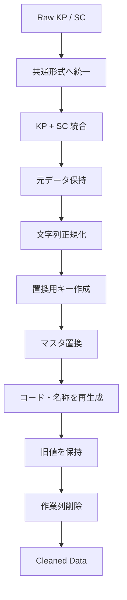

特に重要なのは、**旧値を直接上書きして消してしまうのではなく、`Old*` 列として退避してからクレンジング後の列を作り直していること**。

これにより、

- 元データ確認
- マスタ置換の検証
- 異常値調査
- 修正前後比較
- 後からの置換ルール見直し

がしやすくなる。

---

### 17. 今回確立された命名・整形ルール

今回のリファクタリングから、今後のPower Queryでも流用できる規則が整理できる。

|用途|命名例|
|---|---|
|ソース|`Source`|
|型変更|`ChangedColumnTypes`|
|列追加|処理内容を含める|
|得意先連結値|`CustomerCodeNameConcat`|
|商品連結値|`ProductCodeNameConcat`|
|置換結果|`ReplacedCustomerData` / `ReplacedProductData`|
|元得意先|`OldCustomerCode`, `OldCustomerName`|
|元商品|`OldProductCode`, `OldProductName`|
|コード抽出|`ExtractedCustomerCode` 等|
|列並べ替え|`ReorderedColumns`|
|不要列削除|`RemovedColumns`|

ステップ名は原則として**PascalCase**で統一し、

```powerquery
#"Added Custom1"
```

のようなGUI由来名称は可能な限り残さない方向となった。

---

### 現時点の整理

今回のチャットで行ったことを一言で整理すると、

> **KP・SCの生データを共通形式で読み込み、統合後に得意先・商品情報をマスタベースで正規化するPower Queryについて、処理構造を維持したまま、ステップ名・インデント・コメント・一時列名を整理して読みやすいコードへ変更した。**

特に最終的には、ユーザー側で `CustomerCodeNameConcat` と `ProductCodeNameConcat` を採用したことで、得意先処理と商品処理の対称性も明確になった。

なお、今後さらに整理するなら、`TrimedProductName` → `TrimmedProductName`、`ReplacementCustomData` → `ReplacementCustomerData` など、**列名・ステップ名の英語表現を完全に統一する余地**は残っている。ただし、今回の主目的である視認性向上という点では、すでに大幅に改善された状態になっている。

## 統合元ファイル

- 「Power Queryコードの視認性改善に関するチャットまとめ.md」
- 「Power Queryコードの視認性改善リファクタリングまとめについて.md」
- 「Power Queryコードの視認性改善リファクタリングまとめ.md」
- 「Power Queryコードの視認性向上リファクタリングまとめ.md」
