売上分析用のクリーンデータ、Power Query、Python、置換マスター、集計クエリの役割と構成を検討した記録です。

元の活動日時は確認できないため、実際の日付順ではなく、内容から推定した段階順に配置しています。後段に置いたコードを最終版候補として扱いますが、現在の環境では未検証です。完全に同一のコード断片だけは重複掲載を省略し、異なる版、失敗例、訂正、未解決事項は残しています。

## 記録の読み方

このノートは現在使う手順書ではなく、当時どのような課題を扱い、どのように設計やコードを変えていったかを残す活動記録です。記録間で判断が食い違う場合は、後段の記録を有力候補としつつ、矛盾そのものも経緯として残しています。

## 段階1：売上分析用 Power Query・クリーンデータ管理・クエリ構成の整理

今回のチャットでは、主に以下の3点を整理・調整した。

1. **クリーンデータの保存フォルダ構成**
2. **Power Queryコードの視認性向上リファクタリング**
3. **Power Queryのグループ構成・処理順・命名方針**

全体として、処理ロジックそのものを大きく変えるのではなく、**既存の売上分析フローを維持したまま、保存構造・命名・コードの可読性を改善する**方向で進めた。

---

### 1. クリーンデータの保存構造

売上分析では、集計データを作成する前段階としてクリーンデータを生成している。

作業対象のルートは以下。

```text
C:\Users\kyoupatty029\projects\kpm\analysis_inspection\sales_analysis\cleaned_data\general_enhanced\
```

クリーンデータのファイル名は、例えば以下の形式。

```text
general_enhanced_cleaned_data_202411.xlsx
general_enhanced_cleaned_data_2023.xlsx
```

年月・年度は**ファイル名で管理する**ため、年月ごとにサブフォルダを増やす方式ではなく、1つのフォルダへ集約する方針。

#### 既存の `set` フォルダ

集計処理では複数年度・複数期間のクリーンデータを同時に使用するため、すでに以下のフォルダを利用している。

```text
general_enhanced\
└── set\
```

`set` は、CY / PY / PPY など、**集計処理で現在使用するファイル群をまとめる作業用フォルダ**という位置づけ。

一方、それとは別に、作成済みのクリーンデータをすべて一元管理する保管用フォルダが必要になった。

---

### 2. `logs` / `archive` などのフォルダ名の検討

最初の候補として `logs` が挙がったが、用途を整理すると適切ではないと判断した。

|候補|一般的な意味|今回との適合度|評価|
|---|---|--:|---|
|`logs`|実行履歴、エラー、監査ログ|低い|不採用推奨|
|`cleaned_data`|クリーンデータ|内容は合う|親階層と重複|
|`cleaned_files`|クリーン済みファイル|内容は合う|冗長|
|`processed_data`|処理済みデータ|やや広義|親階層と意味重複|
|`data_archive`|データ保管庫|高い|少し冗長|
|`archive`|保存済み・過去データの保管庫|高い|最も簡潔|
|`staging`|中間処理・一時置き場|低い|用途が違う|

特に現在の階層自体が、

```text
cleaned_data\general_enhanced\
```

となっているため、

```text
cleaned_data\general_enhanced\cleaned_data\
```

や

```text
cleaned_data\general_enhanced\processed_data\
```

は意味が重複して冗長になる。

したがって、今回の用途では **`archive` が最も自然**という結論になった。

#### 推奨構成

```text
sales_analysis\
└── cleaned_data\
    └── general_enhanced\
        ├── archive\
        │   ├── general_enhanced_cleaned_data_2023.xlsx
        │   ├── general_enhanced_cleaned_data_2024.xlsx
        │   ├── general_enhanced_cleaned_data_202411.xlsx
        │   └── ...
        │
        └── set\
            ├── 集計対象PPY
            ├── 集計対象PY
            └── 集計対象CY
```

役割は明確に分かれる。

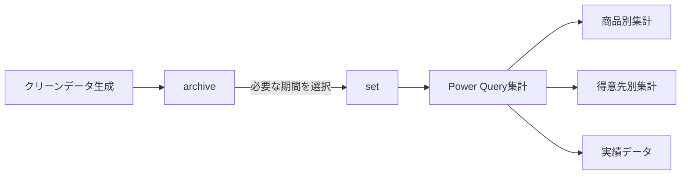

- `archive`：生成済みクリーンデータの保管
- `set`：今回の集計で使用するファイルの集合

という分離になる。

---

### 3. Power Query のコード整形方針

複数のPower Queryコードについて、**「プログラムそのものは変更せず、視認性のみ改善する」**という条件でリファクタリングを行った。

基本方針は以下。

- 処理ロジックは変更しない
- `Table.*` 関数の引数を複数行に分ける
- ステップごとの役割をコメントで示す
- 自動生成された分かりにくいステップ名を、人間が理解しやすい名称へ整理
- `#"Expanded {0}"` などの自動生成名を、意味のある名前へ変更
- `let` ～ `in` の流れを縦方向に追いやすくする

例として、

```powerquery
#"Expanded {0}"
```

ではなく、

```powerquery
ExpandedPY
ExpandedPPY
ExpandedCategory
ExpandedTargetClient
```

などへ整理した。

同様に、

```powerquery
#"Filtered Rows"
#"Filtered Rows1"
```

についても、処理内容をコメントで明示した。

---

### 4. `Set` クエリ

`Set` は以下のフォルダを読み込む中核クエリ。

```text
C:\Users\kyoupatty029\projects\kpm\analysis_inspection\sales_analysis\cleaned_data\general_enhanced\set
```

主な処理は以下。

1. `Folder.Files` で `set` 内のファイル取得
2. `Content` / `Name` を保持
3. Index追加
4. Indexから `AnalysisPeriod` を設定
5. ファイル変換関数を呼び出す
6. 各ファイルを展開
7. データ型を設定
8. `ProductCodeNameConcat` を生成

期間割当は以下。

```text
Index = 0 → PPY
Index = 1 → PY
その他   → CY
```

つまり、`Set` が後続集計の基礎データになっている。

---

### 5. `IMPORTED_FILES` / 年度情報取得

`set` フォルダ内のファイル名一覧を取得し、ファイル名から年度を抽出するクエリも整形した。

処理は以下。

```text
Folder.Files
    ↓
Nameのみ取得
    ↓
Name → FileName
    ↓
FileNameからFiscalYear抽出
    ↓
FiscalYear降順ソート
```

`FiscalYear` は、

```powerquery
Text.BetweenDelimiters([FileName], "_", ".", 3, 0)
```

によって抽出している。

---

### 6. `Target_Month`

`Set` の `売上日付` から月一覧を生成するクエリ。

処理は以下。

```text
Set
 ↓
売上日付のみ取得
 ↓
Date.MonthName
 ↓
Monthへリネーム
 ↓
重複削除
 ↓
日付順ソート
 ↓
id追加
 ↓
売上日付削除
```

結果として、

```text
id | Month
```

という月マスタ的なテーブルを生成する。

---

### 商品別集計

### 7. `商品別_CY` / PY / PPY

`Set_KYOU_Patty` から期間ごとの商品集計を生成する。

CYの例では、

```text
Set_KYOU_Patty
 ↓
AnalysisPeriod = CY
 ↓
商品コード・商品名・ProductCodeNameConcatでGroup
 ↓
売上金額合計
売上数量合計
 ↓
ProductCodeNameConcat_CY
```

となる。

代表的な集計列は以下。

```text
売上金額_CY
売上数量_CY
```

同様に、

```text
商品別_PY
商品別_PPY
```

を作成している。

---

### 8. `商品別集計表`

CY / PY / PPY の商品集計を統合する。

構造は概ね以下。

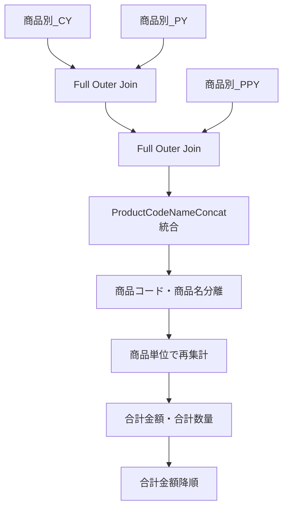

#### キーの統合

CY / PY / PPY のうち最初に値があるものを採用する。

```powerquery
if [ProductCodeNameConcat_CY] <> null then [ProductCodeNameConcat_CY]
else if [ProductCodeNameConcat_PY] <> null then [ProductCodeNameConcat_PY]
else [ProductCodeNameConcat_PPY]
```

その後、

```text
商品コード_商品名
```

という連結キーから、

```text
商品コード
商品名
```

を再生成する。

#### 最終列

```text
商品コード
商品名
合計金額
合計数量
売上金額_CY
売上数量_CY
売上金額_PY
売上数量_PY
売上金額_PPY
売上数量_PPY
```

合計金額の降順で並べる。

---

### 9. 商品実績用クエリ

`商品別集計表` から必要列のみ取得する実績用クエリも作成している。

保持する列。

```text
商品名
売上金額_CY
売上金額_PY
売上金額_PPY
```

並べ替え優先順位。

```text
1. 売上金額_CY
2. 売上金額_PY
3. 売上金額_PPY
```

すべて降順。

---

### 得意先別集計

### 10. `得意先別_小計`

CYの売上金額を得意先単位で集計する。

```text
Set_KYOU_Patty
 ↓
AnalysisPeriod = CY
 ↓
得意先コード・得意先名称でGroup
 ↓
小計
 ↓
小計降順
 ↓
CustomerCodeNameConcat追加
```

連結キーは、

```text
得意先コード_得意先名称
```

で作成。

---

### 11. `得意先別_CY` / PY / PPY

得意先と商品の組み合わせ単位で売上を集計する。

CYの場合は、

```text
得意先コード
得意先名称
ProductCodeNameConcat
```

でグループ化。

計算する値。

```text
売上金額_CY
売上数量_CY
```

さらに、

```text
CustomerCodeNameConcat_CY
ProductCodeNameConcat_CY
```

を作成する。

最終的には必要な4列だけに絞る。

```text
CustomerCodeNameConcat_CY
ProductCodeNameConcat_CY
売上金額_CY
売上数量_CY
```

PY / PPY も同じ構造。

---

### 12. `得意先別集計表`

CY / PY / PPY の得意先×商品集計を統合するクエリ。

基本構造。

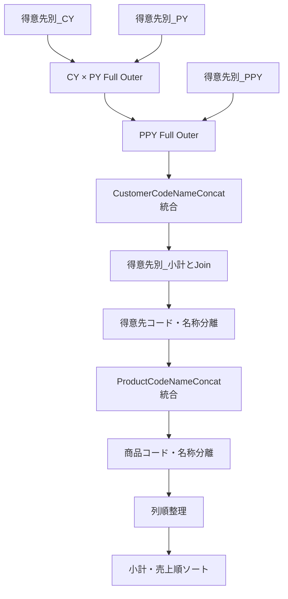

#### 得意先キーの統合

```text
CY
↓ nullなら
PY
↓ nullなら
PPY
```

#### 商品キーも同じロジック

```text
ProductCodeNameConcat_CY
ProductCodeNameConcat_PY
ProductCodeNameConcat_PPY
```

から1つに統合する。

#### 最終列

```text
得意先コード
得意先名
商品コード
商品名
小計
売上金額_CY
売上数量_CY
売上金額_PY
売上数量_PY
売上金額_PPY
売上数量_PPY
```

#### ソート順

```text
1. 小計
2. 売上金額_CY
3. 売上金額_PY
4. 売上金額_PPY
```

すべて降順。

---

### 13. 得意先TOP30

`得意先別集計表` をさらに得意先名単位で再集計し、TOP30を生成。

```text
得意先別集計表
 ↓
得意先名でGroup
 ↓
CY / PY / PPY 売上金額合計
 ↓
売上金額で降順
 ↓
上位30件
```

保持する値。

```text
得意先名
売上金額_CY
売上金額_PY
売上金額_PPY
```

---

### KYOUパティ関連

### 14. `Set_KYOU_Patty`

当初は、`Set` と `田中営業担当製品カテゴリー` を結合し、

```text
カテゴリー = KYOUパティ
```

だけを抽出するクエリとして整理した。

その後、担当者別得意先リストも利用する形へ拡張した。

#### 現在の処理イメージ

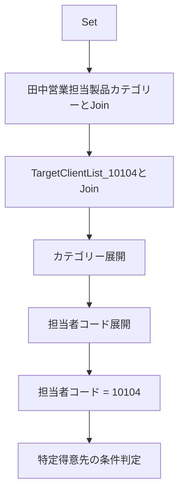

#### 商品カテゴリとの結合

キー。

```text
Set[ProductCodeNameConcat]
          ↓
田中営業担当製品カテゴリー[コード付き商品名]
```

Left Outer Join。

#### 得意先リストとの結合

キー。

```text
CustomerCodeNameConcat
        ↓
TargetClientList_10104[コード付き_得意先名称]
```

こちらもLeft Outer Join。

#### 担当者条件

展開後の、

```text
担当者コード.1
```

が、

```text
10104
```

のものを抽出。

#### 特定得意先の例外条件

特定得意先、

```text
301083_株式会社　AAAA
```

については、

```text
カテゴリー = KYOUパティ
```

の場合のみ残す条件になっている。

論理的には、

```text
通常得意先
OR
特定得意先 AND KYOUパティ
```

という構造。

---

### Power Queryのグループ構成

画面上では、おおむね以下のグループ構造だった。

```text
Master
setからファイルを変換する
商品別
    商品別_CY
    商品別_PY
    商品別_PPY
    商品別集計表

得意先別
    得意先別_小計
    得意先別_CY
    得意先別_PY
    得意先別_PPY
    得意先別集計表

実績
    KYOUパティ実績データ
    KYOUパティ得意先別TOP30

その他のクエリ
    Set
    Set_KYOU_Patty
    Target_Month
    IMPORTED_FILES
```

---

### 15. Power Queryの実行順

重要な点として、**Power Queryは画面の上から順に実行されるわけではない**。

グループ順も処理順には影響しない。

例えば、

```text
商品別集計表
```

が、

```text
商品別_BOX商品別_PY
商品別_PPY
```

を参照している場合、Power Queryは依存関係を解決して必要な処理を実行する。

概念的には、

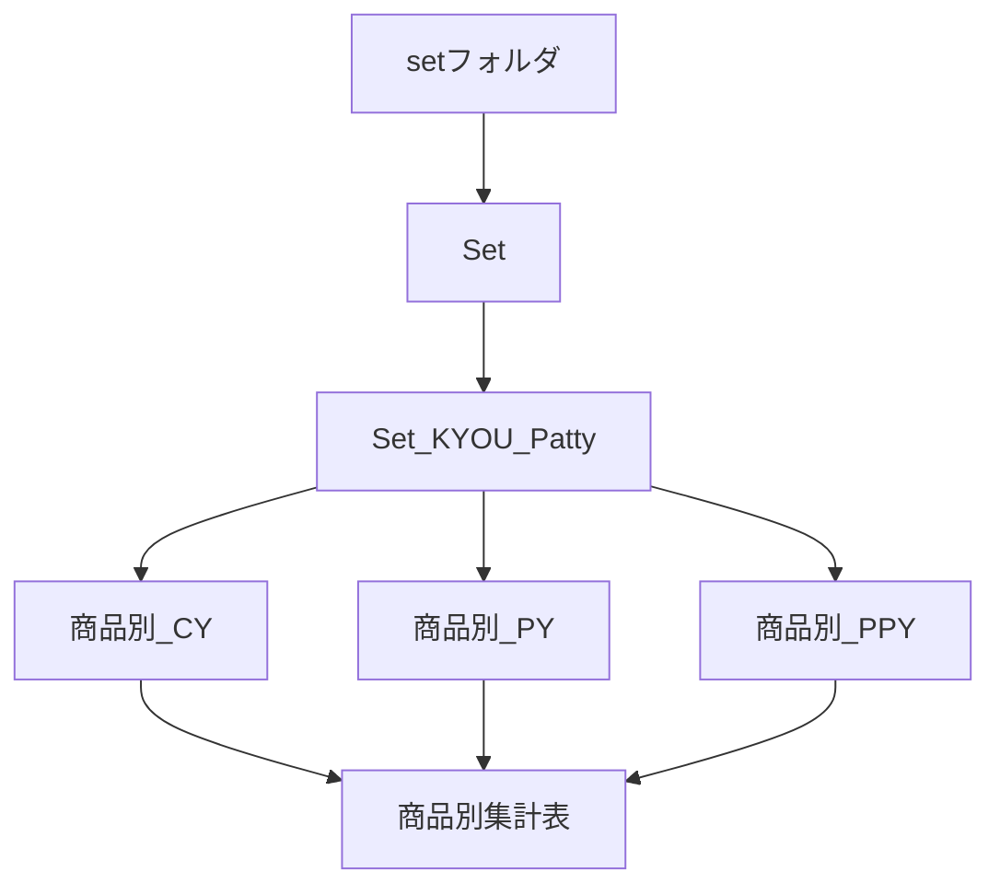

したがって、

```text
Power Query画面で上にある
```

ことと、

```text
先に処理される
```

ことは別物。

#### グループの役割

Power Queryのグループは基本的に、

> 人間がクエリを整理するためのUI上の分類

であり、実行制御には使われない。

---

### グループ名・クエリ名についての検討

現在の命名でも運用可能だが、より分かりやすくするなら、**データ処理の段階ごとに整理する方法**もある。

例えば、

```text
Master
Import
Base
Product
Customer
Output
```

のような分類。

ただし、現在は日本語名と英語名が混在しているため、無理に全面変更する必要はない。

現状の構造なら、

|現在|役割|
|---|---|
|Master|マスタ|
|setからファイルを変換する|Excel自動生成クエリ|
|商品別|商品分析|
|得意先別|顧客分析|
|実績|最終出力|
|その他のクエリ|基礎・補助クエリ|

となっている。

特に `その他のクエリ` には、

```text
Set
Set_KYOU_Patty
Target_Month
IMPORTED_FILES
```

という重要な基礎クエリが入っているため、将来的には、

```text
Base
基礎データ
共通
```

などへ変更する余地がある。

`その他` という名前よりも、その役割を明示できる。

---

### 現在の売上分析フロー全体

今回の内容を一本の処理フローとしてまとめると以下。

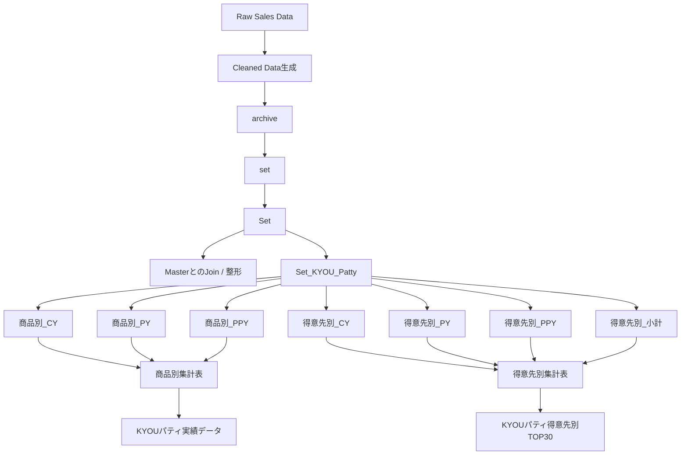

---

### 今回の主要な判断

今回のチャットで固まった方針をまとめると、次のようになる。

- クリーンデータは年月別フォルダへ分割せず、**1フォルダへ一元管理する**
- 年月・年度はファイル名で識別する
- 集計用のファイル集合は既存の **`set`** に置く
- 保存済みクリーンデータの保管先としては **`archive` が最も適切**
- `logs` は実行履歴・システムログの意味が強いため不適
- Power Queryのグループ順は処理順には影響しない
- 実行順は**クエリ間の依存関係によって決まる**
- Power Queryコードはロジックを変えず、
    - インデント
    - 改行
    - コメント
    - ステップ名  
        を整理して可読性を高める
- `#"Expanded {0}"` などの自動生成ステップ名は、意味のある英語名に整理する
- 商品別、得意先別、実績という分類は現状でも理解しやすい
- `その他のクエリ` は、将来的には `Base` / `基礎データ` / `共通` などへ変える余地がある

現時点のフォルダ構造としては、次の形が最も整理されている。

```text
sales_analysis\
└── cleaned_data\
    └── general_enhanced\
        ├── archive\
        └── set\
```

そしてPower Query側では、

```text
Set
    ↓
Set_KYOU_Patty
    ↓
CY / PY / PPY
    ↓
商品別・得意先別集計
    ↓
実績出力
```

という依存構造が、この分析処理の中核になっている。

## 段階2：売上分析用 Power Query／マスタ構成の整理

### 1. このチャットで確認した内容

このチャットでは、売上分析で使用している Power Query の構成について、実際のMコード・クエリ一覧・Excelマスタのテーブル構成・最終的なクリーンデータのカラムまで順番に確認した。

中心となるファイルは次のとおり。

|区分|ファイル|
|---|---|
|クリーンデータ出力|`general_cumulative_cleaned_data.xlsx`|
|得意先置換マスタ|`customer_data_replacement_master.xlsx`|
|文字置換マスタ|`character_replacement_master.xlsx`|
|商品置換マスタ|`product_data_replacement_master.xlsx`|
|売上分析マスタ|`SalesAnalysisMaster.xlsx`|

Power Query 全体としては、大きく次の役割に分かれている。

1. 売上元ファイルをフォルダから取得する
2. ファイルに `PY` / `CY` の分析期間を付与する
3. 得意先コード・名称を正規化する
4. 商品名のスペース・文字種・記号・単位表記を正規化する
5. 商品コード・名称を置換マスタで補正する
6. 分析に必要な列のみを残して `CleanedDataTbl` を生成する
7. 別途 `ImportedFilesTbl` で対象ファイルと `AnalysisPeriod` を管理する
8. `SalesAnalysisMaster.xlsx` に、カテゴリー・担当者・分析除外などの分析用マスタを保持する

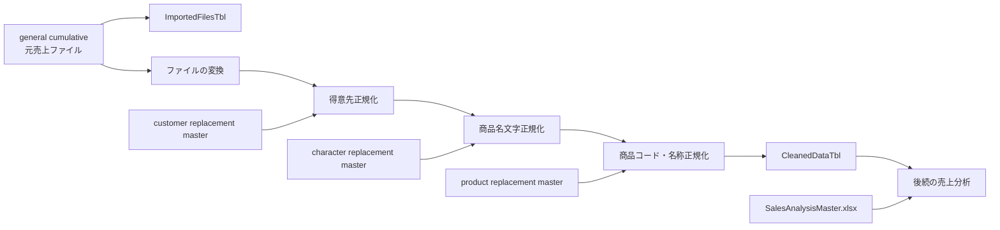

---

### 2. メインクエリ `CleanedDataTbl`

対象ファイルとして示されたのは、

`general_cumulative_cleaned_data.xlsx`

であり、その中心となるクエリでは次のフォルダを読み込んでいる。

```text
C:\Users\kyoupatty029\projects\kpm\analysis_inspection\sales_analysis\import\general\cumulative
```

### 処理フロー

#### ファイル取得と AnalysisPeriod の設定

最初に `Folder.Files` で対象ディレクトリ以下のファイルを取得する。

```m
Source = Folder.Files("...\general\cumulative")
```

その後、

- `Content`
- `Name`
- `Attributes`

だけを残し、ファイル名を昇順に並べる。

さらに0始まりの `Index` を追加し、

```m
if [Index] = 0 then "PY" else "CY"
```

によって `AnalysisPeriod` を設定する。

したがって、現在のロジックは、

|Index|AnalysisPeriod|
|--:|---|
|0|PY|
|1以降|CY|

となっている。

これは「ファイル名の昇順で最初に来るファイルをPY、それ以外をCYとする」という設計であり、ファイル名の命名規則と並び順が重要になる。

なお、`Folder.Files` は指定フォルダだけでなく**サブフォルダ内のファイルも再帰的に取得する**関数である。直下だけに限定したい場合は `Folder.Contents` などとは挙動が異なる点に注意が必要。

#### 隠しファイルの除外

`Attributes[Hidden]` を確認し、

```m
each [Attributes]?[Hidden]? <> true
```

として隠しファイルを除外している。

その後、Power Query がフォルダ結合時に生成した関数、

```m
ファイルの変換([Content])
```

を各ファイルに適用している。

展開する列構成は、

```m
Table.ColumnNames(ファイルの変換(#"サンプル ファイル"))
```

から取得しているため、「サンプル ファイル」の構造を基準としている。

---

### 3. 得意先データの正規化

まず次の4列を `text` 型へ変換している。

- `得意先コード`
- `得意先名称`
- `売上明細商品コード`
- `売上明細商品名`

その後、得意先について、

```m
[得意先コード] & "_" & [得意先名称]
```

でコードと名称を結合し、

`CodeNameConcat`

を作成する。

### 得意先置換マスタ

参照しているマスタは、

`customer_data_replacement_master.xlsx`

内の

`customer_code_name_replacement_tbl`

である。

読み込み後に残す列は次の2つ。

|カラム|用途|
|---|---|
|`original_code_name_concat`|置換前の「コード_名称」|
|`updated_code_name_concat`|置換後の「コード_名称」|

メイン処理では、

```m
List.Accumulate(
    Table.ToRows(customer_code_name_replacement_tbl),
    [CodeNameConcat],
    (state, current) =>
        Replacer.ReplaceValue(state, current{0}, current{1})
)
```

を使い、置換マスタの内容を順番に適用している。

置換結果は `ReplacementCustomData` に格納する。

その後、元の列を、

- `得意先コード` → `OldCustomerCode`
- `得意先名称` → `OldCustomerName`

へ変更し、置換済み文字列を `_` で分割して、

- 新しい `得意先コード`
- 新しい `得意先名称`

を再生成している。

ただし、後述する最終列選択では `OldCustomerCode` / `OldCustomerName` は残していない。

---

### 4. 商品名の文字正規化

得意先正規化の次に、商品名称そのものを複数段階でクレンジングしている。

処理順序は次のとおり。


### `CleanSpaces` 関数

独自関数として次のコードを使用している。

```m
(CleanColumn as text) as text =>
let
    TrimmedText = Text.Trim(CleanColumn),
    ReplacedFullWidthSpaces = Text.Replace(TrimmedText, "　", " "),
    SplitTextBySpace = Text.Split(ReplacedFullWidthSpaces, " "),
    RemoveEmptyEntries = List.Select(SplitTextBySpace, each _ <> ""),
    ResultText = Text.Combine(RemoveEmptyEntries, " ")
in
    ResultText
```

役割は、商品名に含まれるスペース表現の統一である。

処理は、

1. 前後のトリム
2. 全角スペースを半角スペースへ変換
3. 半角スペースで文字列を分割
4. 空要素を削除
5. 半角スペース1個で再結合

という流れ。

例えば、

```text
"  商品　　名称   ABC  "
```

のようなデータを、おおむね

```text
"商品 名称 ABC"
```

のような形へ統一する。

---

### 5. `character_replacement_master.xlsx`

文字表記の正規化ルールは、

```text
C:\Users\kyoupatty029\projects\kpm\analysis_inspection\shared_master\normalization\character_replacement_master.xlsx
```

に集約されている。

現在確認したテーブルは4種類。

|Power Query|Excelテーブル|用途|
|---|---|---|
|`hankaku_katakana_to_zenkaku_tbl`|同名|半角カタカナ → 全角カタカナ|
|`zenkaku_alphanumeric_to_hankaku_tbl`|同名|全角英数字 → 半角英数字|
|`symbol_replacement_tbl`|同名|記号表記の統一|
|`unit_symbol_replacement_tbl`|同名|単位・単位記号の統一|

各マスタの基本構造は、

|id|original|updated|
|---|---|---|

となっている。

最終的には `original` と `updated` の2列だけをMコード側で使用する。

### 半角カタカナ → 全角

```m
Table.Sort(..., {{"id", Order.Ascending}})
```

で `id` 順にソートした後、

```text
original
updated
```

だけを残している。

メインクエリ側では、

```m
List.Accumulate(
    Table.ToRows(hankaku_katakana_to_zenkaku_tbl),
    [CleanSpaces],
    (state, current) =>
        Text.Replace(state, current{0}, current{1})
)
```

で商品名称へ順次適用する。

### 全角英数字 → 半角英数字

こちらも同じ構造で、

`zenkaku_alphanumeric_to_hankaku_tbl`

を読み込み、`id` 順にソートする。

前工程の

`HankakuKatakanaToZenkaku`

を入力として置換する。

### 記号置換

`symbol_replacement_tbl`

については、提示されたMコードでは `id` によるソートを行わず、

- `original`
- `updated`

のみを取得している。

メイン側では、

`ZenkakuAlphanumericToHankaku`

の結果を入力として `Text.Replace` を順次実行する。

ここは他の文字置換マスタとは「ソートの有無」が異なる。

### 単位記号置換

`unit_symbol_replacement_tbl`

は `id` 昇順にソートした後、

- `original`
- `updated`

のみを残す。

記号置換後の商品名に適用し、最終結果を、

`CharacterReplacedProductName`

に格納している。

---

### 6. 商品コード・商品名称の最終正規化

文字レベルの正規化終了後、

```m
[売上明細商品コード] & "_" & [CharacterReplacedProductName]
```

で、

`ProductCodeNameConcat`

を作成する。

### 商品置換マスタ

参照ファイルは、

`product_data_replacement_master.xlsx`

である。

Excelテーブルは、

`product_code_name_replacement_tbl`

。

構造は得意先置換マスタと同じ。

|カラム|用途|
|---|---|
|`original_code_name_concat`|元の商品コード＋商品名|
|`updated_code_name_concat`|正規化後の商品コード＋商品名|

メインクエリでは `List.Accumulate` と `Replacer.ReplaceValue` によって置換を行う。

その結果を、

`ProductCodeNameReplacement`

へ格納する。

元のカラムは、

- `売上明細商品コード` → `OldSalesProductCode`
- `売上明細商品名` → `OldSalesProductName`

へ変更する。

置換済み文字列を `_` で分割して、

- 新しい `売上明細商品コード`
- 新しい `売上明細商品名`

を作り直す。

このため最終データには、

```text
正規化済み商品コード
正規化済み商品名
旧商品コード
旧商品名
```

を同時に保持している。

これは商品置換前後を追跡できる構成になっている。

---

### 7. `CleanedDataTbl` の最終カラム

`FinalColumns` では、最終的に以下の列を保持している。

|分類|カラム|
|---|---|
|日付・部門|`売上日付`|
||`売上発生部門コード`|
||`発生部門M部門名`|
|伝票|`売上伝票番号`|
||`売上明細伝票行番号`|
||`売上伝票区分`|
|得意先付随情報|`得意先名称２`|
||`得意先住所１`|
||`得意先住所２`|
||`得意先住所３`|
|納入先|`納入先コード`|
||`納入先名称`|
||`納入先名称２`|
||`納入先住所１`|
||`納入先住所２`|
||`納入先住所３`|
|数量・荷姿|`売上明細荷姿区分`|
||`売上明細入数`|
||`売上明細入数単位`|
||`売上明細荷姿数符号付`|
||`売上明細荷姿単位`|
||`売上明細バラ総数符号付`|
|金額・税|`売上明細単価`|
||`売上明細金額符号付`|
||`売上明細外税消費税符号付`|
||`税率`|
|分析期間|`AnalysisPeriod`|
|正規化得意先|`得意先コード`|
||`得意先名称`|
|正規化商品|`売上明細商品コード`|
||`売上明細商品名`|
|商品履歴|`OldSalesProductCode`|
||`OldSalesProductName`|

つまり `CleanedDataTbl` は、単なる元売上データではなく、

**売上明細 ＋ AnalysisPeriod ＋ 正規化済み得意先 ＋ 正規化済み商品 ＋ 商品の旧値**

を持つ分析用クリーンデータになっている。

---

### 8. `ImportedFilesTbl`

別クエリとして、同じ cumulative ディレクトリからファイル名一覧を取得している。

処理は非常に単純で、


最終テーブルは2列。

|AnalysisPeriod|FileName|
|---|---|
|PY / CY|元ファイル名|

したがって役割は、

**どのファイルがどの分析期間として読み込まれているかを確認する管理テーブル**

と整理できる。

`CleanedDataTbl` と `ImportedFilesTbl` の `AnalysisPeriod` は、それぞれ独立して生成しているものの、同じファイル名ソート＋Indexルールを使用している。

---

### 9. Power Query エディター内のクエリ構成

提示されたクエリペインでは、13クエリが次のように整理されていた。

```text
CleanedDataTbl からファイルを変換する...
├─ ヘルパー クエリ
│  ├─ サンプル ファイル
│  ├─ パラメーター1 (サンプル ファイル)
│  ├─ ファイルの変換
│  └─ サンプル ファイルの変換
│
├─ ReplacementMaster
│  ├─ customer_code_name_replacement_tbl
│  ├─ hankaku_katakana_to_zenkaku_tbl
│  ├─ zenkaku_alphanumeric_to_hankaku_tbl
│  ├─ symbol_replacement_tbl
│  ├─ unit_symbol_replacement_tbl
│  └─ product_code_name_replacement_tbl
│
├─ ReplacementFunction
│  └─ CleanSpaces
│
└─ その他のクエリ
   ├─ ImportedFilesTbl
   └─ CleanedDataTbl
```

役割分離としては、

- Power Query 自動生成ヘルパー
- 外部置換マスタ
- 独自関数
- 実際の出力／管理クエリ

という4階層になっている。

---

### 10. `SalesAnalysisMaster.xlsx`

クレンジングとは別に、売上分析用の補助マスタとして `SalesAnalysisMaster.xlsx` が存在する。

提示された内容では、大きく4種類の表がある。

なお、画像・テキスト上では2列目と3列目の英語名称がどちらも `ProductSalesRepList` となっている。この点は実ファイル上でも同名なのか、転記上の重複なのかは未確認のため、ここでは用途を基準に「得意先別担当者表」「商品別担当者表」と区別する。

### ProductCategoriesList ― カテゴライズ表

確認されたカラムは、

|カラム|
|---|
|`id`|
|`得意先コード`|
|`得意先名`|
|`商品コード`|
|`商品名`|
|`大まかにグループ別けしたものです`|
|`コード付き_商品名`|
|`基本分類`|
|`基本カテゴリー`|
|`category_10104`|
|`category_10101`|
|`更新日`|

商品だけではなく得意先コード・得意先名も含んでいるため、単純な商品マスタというより、売上分析に使用する**分類・カテゴライズ用テーブル**と見るのが適切。

特に、

- 基本分類
- 基本カテゴリー
- 担当者等に対応すると考えられる `category_10104`
- `category_10101`

など、分析軸を付加するための情報が含まれている。

### 得意先別担当者表

カラムは、

|カラム|
|---|
|`client_code`|
|`client_name`|
|`client_code_name_concat`|
|`division_code`|
|`sales_rep_code`|
|`updated_date`|

得意先単位で、

**どの部門・営業担当者に紐づくか**

を管理する構造になっている。

`client_code_name_concat` があるため、コードだけでなくコード＋名称の組み合わせをキーとして扱う設計も考慮されている。

### 商品別担当者表

カラムは、

|カラム|
|---|
|`product_code`|
|`product_name`|
|`division_code`|
|`sales_rep_code`|
|`updated_date`|
|`重複`|

商品単位で担当部門・営業担当者を管理する。

`重複` 列が存在しているが、このチャットでは値の定義や用途までは確認していない。

### OrgExcludedClientList ― 組織別分析対象外企業

カラムは、

|カラム|
|---|
|`client_code`|
|`client_name`|
|`client_code_name_concat`|
|`analysis_target`|
|`updated_date`|

分析対象／対象外の判定を得意先単位で管理するためのマスタ。

`analysis_target` の具体的な値の仕様は、このチャットでは提示されていないため、「0/1」「TRUE/FALSE」などの形式までは確定していない。

---

### 11. 全体のデータ設計

ここまでの内容を統合すると、現在の構成は次のように整理できる。

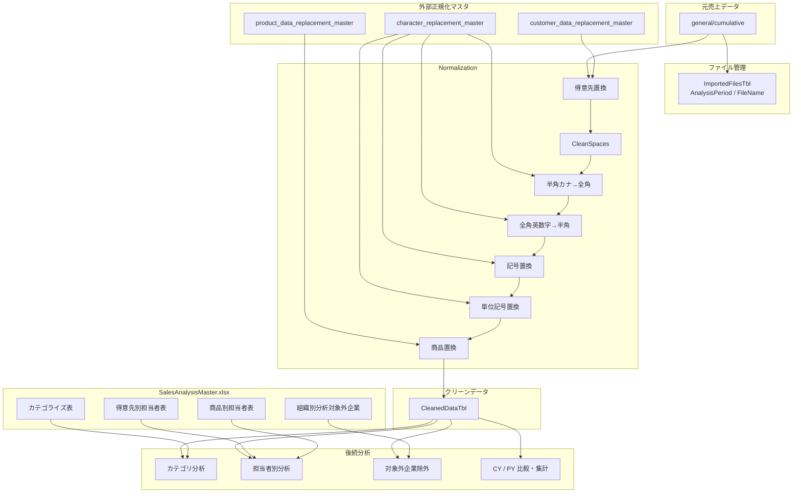

設計思想としては、

**Normalization と Analysis Master を分離している**

ことが重要である。

たとえば、

- 「同じ商品なのに商品名が違う」
- 「旧商品コードと新商品コードが混在する」
- 「半角／全角表記が混在する」

といった**データ品質問題**は `CleanedDataTbl` を作る段階で解決する。

一方、

- どのカテゴリーか
- 誰の担当か
- 分析対象に含めるか

という**分析上の意味付け**は `SalesAnalysisMaster.xlsx` で管理する構成になっている。

この分離は、現在のシステムを理解するうえでかなり重要。

---

### 12. このチャットで明らかになった設計上のポイント

現在の仕組みを短く表現すると、

> **売上元データを正規化して一意性・表記を整え、その後に分析用マスタを付与して売上分析へ利用する構成**

となる。

特に次の点が明確になった。

- `CleanedDataTbl` が売上分析の基礎となる正規化済み明細データ。
- `ImportedFilesTbl` は読み込み対象ファイルと `PY/CY` の関係を確認する管理用テーブル。
- 得意先は「コード＋名称」をセットにして置換する。
- 商品はまず文字レベルで正規化し、その後「商品コード＋商品名」のセットで最終置換する。
- 文字置換ルールをMコードに直接大量記述せず、Excelマスタとして外部管理している。
- 商品については `OldSalesProductCode` / `OldSalesProductName` を最終データに残しており、変更前後を追跡できる。
- Power Query 内では `ReplacementMaster` と `ReplacementFunction` をグループ分けしている。
- `SalesAnalysisMaster.xlsx` は正規化用マスタではなく、カテゴリ・担当者・分析対象判定などを管理する**分析用マスタ群**。
- 将来的な後工程では、`CleanedDataTbl` に `SalesAnalysisMaster.xlsx` の情報をキーで紐付けて分析データを構築する流れが想定される。

また、今後確認したほうがよい未確定事項も残っている。

- `PY/CY` を「ファイル名昇順＋Index」だけで判定し続ける設計でよいか。
- `symbol_replacement_tbl` だけ `id` ソートを行っていない理由。
- `SalesAnalysisMaster.xlsx` 内で、得意先別担当者表と商品別担当者表の英語テーブル名が本当に双方 `ProductSalesRepList` なのか。
- `商品別担当者表` の `重複` 列の定義。
- `OrgExcludedClientList.analysis_target` の値と判定仕様。
- `ProductCategoriesList` の `category_10104` / `category_10101` が具体的に何を表すか。
- `SalesAnalysisMaster.xlsx` の各マスタと `CleanedDataTbl` を、最終的にどのキー・優先順位で結合するか。

以上が、このチャットで確認したMコード、Power Query構成、正規化マスタ、クリーンデータ、分析用マスタの全体像である。

## 段階3：売上分析用 Power Query／Python データクレンジング設計の整理

### 1. このチャットで検討してきた全体像

今回の中心テーマは、**売上分析に入る前段として行うデータクレンジング処理の設計・命名・Power Queryコードの整理**です。

売上分析では、まず元データに対して以下の前処理を実施します。

- マスターファイルを参照した置換処理
- コード類のゼロパディング
- 商品名などの文字列正規化
- 分析に必要な補助列の追加
    - `AnalysisPeriod`
    - `FileName`
    - 年度関連列
- ファイル情報の管理
- 最終的な分析用データへの整形

このデータクレンジング処理については、

> **Power QueryとPython（pandas）で同一の処理を再現できるようにする**

という方針が確定しています。

ただし、Pythonへ全面移行するわけではありません。

現在の役割分担は次のように整理されました。

|領域|主なツール|位置づけ|
|---|---|---|
|データクレンジング|Power Query / Python|同じ処理を両方で実装|
|Python側の目的|pandas|学習＋クレンジング高速化|
|売上集計|Power Query|現在のメイン|
|ダッシュボード|Excel|Power Query結果を利用|
|ピボットテーブル|Excel|集計・分析用途|
|高度・厳密な分析|Python|将来的に利用する可能性あり|

したがって構造としては、

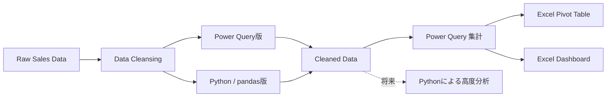

という位置づけです。

---

### 2. 命名規則について検討した内容

#### snake_case と PascalCase

最初に、

- `analysis_period`
- `file_name`
- `cleaned_data`
- `imported`

などを snake_case にするか、

- `AnalysisPeriod`
- `FileName`
- `CleanedData`
- `ImportedFiles`

など PascalCase にするかを検討しました。

Pythonでは一般にsnake_caseとの親和性が高い一方、今回のプロジェクトでは**最終的な集計処理の中心がPower Query**であるため、Power Query側の命名に寄せる考え方を採用する方向になりました。

ただし、途中で確認した重要な点として、

> **Excelそのものに「PascalCaseが標準」という正式な命名規則があるわけではない**

という整理もしています。

つまり、

- ExcelだからPascalCaseにしなければならないわけではない
- Power QueryだからPascalCaseが公式標準というわけでもない
- プロジェクト内での一貫性を優先すべき

という考え方です。

今回のプロジェクトでは、Power Queryのステップ名などもPascalCaseで整理しているため、

```text
SourceFiles
SortedRows
WithIndex
WithAnalysisPeriod
FinalTable
ChangedType
```

のような形式との統一性があります。

---

### 3. シート名・テーブル名・複数形

シート名やテーブル名についても検討しました。

候補としては、

```text
cleaned_data
imported
```

から、

```text
CleanedData
ImportedFiles
```

のような形式へ整理する考え方です。

特に`import`フォルダ内のCSVファイル一覧を扱うテーブルについては、

```text
ImportedFilesTbl
```

が適切と判断しました。

理由は、このテーブルが「ある1ファイル」を表すものではなく、

> **importフォルダから読み込んだ複数のファイル情報の集合**

だからです。

そのため、

```text
ImportedFileTbl
```

より

```text
ImportedFilesTbl
```

の方が意味的に自然です。

一方、

```text
CleanedDataTbl
```

のような名称は、`Data`自体が集合的な意味を持つため複数形にする必要はありません。

---

### 4. ImportedFilesTbl の設計

`ImportedFilesTbl`のコードとして、以下の構成を確認しました。

```powerquery
let
    // ディレクトリからファイルを取得
    SourceFiles = Folder.Files(
        "C:\Users\kyoupatty029\projects\kpm\analysis_inspection\sales_analysis\import\general\monthly"
    ),
    // 必要な列のみを選択し、行を並べ替え
    FilteredColumns = Table.SelectColumns(SourceFiles, {"Name"}),
    SortedRows = Table.Sort(FilteredColumns, {{"Name", Order.Ascending}}),
    // インデックス列を追加し、条件列を作成
    WithIndex = Table.AddIndexColumn(
        SortedRows,
        "Index",
        0,
        1,
        Int64.Type
    ),

    WithAnalysisPeriod = Table.AddColumn(
        WithIndex,
        "AnalysisPeriod",
        each if [Index] = 0 then "PY" else "CY",
        type text
    ),
    // カラム名を変更
    RenamedColumns = Table.RenameColumns(
        WithAnalysisPeriod,
        {{"Name", "FileName"}}
    ),
    // 必要な列のみを選択
    FinalTable = Table.SelectColumns(
        RenamedColumns,
        {"AnalysisPeriod", "FileName"}
    )
in
    FinalTable
```

役割は明確です。


ここで、

```text
Index = 0 → PY
それ以外 → CY
```

という分類を行っています。

---

### 5. AnalysisPeriod付きファイル読み込み処理のリファクタリング

複数回、Power Queryで自動生成されたステップ名を整理しました。

たとえば、

```text
#"Removed Other Columns1"
#"Sorted Rows"
#"Added Index"
#"Added Conditional Column"
```

などを、

```text
SortedFiles
WithAnalysisPeriod
FilteredHiddenFiles
InvokedFunction
ExpandedFiles
ChangedType
```

のように変更しました。

方針としては、

> **Power Query GUIが自動生成した「操作名」ではなく、「結果として何になったか」をステップ名で表現する**

方向です。

たとえば、

```text
#"Added Conditional Column"
```

より、

```text
WithAnalysisPeriod
```

の方が後から読んだときに意味を理解しやすくなります。

---

### 6. Attributes列を残す理由

途中で、

```powerquery
Table.SelectColumns(
    Source,
    {"Content", "Name", "Attributes"}
)
```

の`Attributes`がなぜ必要なのか確認しました。

理由は後続の、

```powerquery
Table.SelectRows(
    ...,
    each [Attributes]?[Hidden]? <> true
)
```

で使用しているからです。

つまり、

```text
Attributes
    ↓
Hidden属性を確認
    ↓
隠しファイルを除外
```

という依存関係があります。

したがって、

```powerquery
{"Content", "Name"}
```

だけにしてしまうと、

```powerquery
[Attributes]?[Hidden]?
```

を参照できなくなります。

隠しファイルを除外しないのであれば`Attributes`は不要ですが、除外処理を残すのであれば必要です。

---

### 7. FiscalYearIdについて

会計年度を算出する処理も検討しました。

当初、

```powerquery
Date.Month([売上日付]) = (11 or 12)
```

と書いてエラーになりました。

Power Queryではこの書き方はできないため、

```powerquery
Date.Month([売上日付]) = 11
or
Date.Month([売上日付]) = 12
```

と条件を個別に記述する必要があります。

正しい形は、

```powerquery
= Table.AddColumn(
    #"Kept First Rows",
    "カスタム",
    each
        if Date.Month([売上日付]) = 11
            or Date.Month([売上日付]) = 12
        then Date.Year([売上日付]) + 1
        else Date.Year([売上日付])
)
```

です。

結果をテキスト型にする方法としては、

```powerquery
Text.From(Date.Year([売上日付]) + 1)
```

のように条件式内部で変換する方法と、

後段で、

```powerquery
Table.TransformColumnTypes(...)
```

する方法を検討しました。

また年度カラム名については、

```text
FiscalId
```

より、

```text
FiscalYearId
```

を推奨しました。

`FiscalId`では何のIDなのか曖昧ですが、

```text
FiscalYearId
```

なら「会計年度を表す識別子」であることが明確だからです。

---

### 8. Power QueryのIntelliSenseについて

Excel 2019を使用しており、

> Power Queryでメソッド・関数を入力しても補完されない

という問題も確認しました。

Excel 2019ではPower Queryそのものは利用できますが、Microsoft 365版と比較するとM言語編集時の補完機能や編集支援が限定的です。

そのため、

> Excel 2019でPower Queryの関数補完が十分に出ないこと自体は不自然ではない

という整理になりました。

---

### 9. Power Query全体構成の評価

Power Queryエディタのスクリーンショットも確認しました。

構造としては大きく、

- データ本体
    - `CleanedDataTbl`
    - `ImportedFilesTbl`
- Master
    - 顧客コード・名称置換
    - 商品コード・名称置換
    - 半角→全角
    - 全角英数字→半角
    - 記号置換
    - 単位記号置換
- Function
    - `CleanSpaces`
- Excelのフォルダー結合によって生成される補助クエリ
    - `ファイルの変換`
    - `サンプル ファイル`
    - など

という構造になっていました。

この構成は、

> **データ本体・マスター・関数を分離している**

という点で、Power Queryとして良い整理になっています。

特に、

```text
Master
Function
Main Query
```

を分けているのは、将来的な保守や再利用を考えても合理的です。

---

### 10. 顧客コード・顧客名の置換処理

得意先については、

```text
得意先コード
得意先名称
```

を連結してからマスターに基づいて置換する方式です。

基本的な流れは、


です。

具体的には、

```powerquery
ConcatenatedCustomer =
    Table.AddColumn(
        ChangedType,
        "CodeNameConcat",
        each [得意先コード] & "_" & [得意先名称],
        type text
    )
```

として、

```text
000123_株式会社○○
```

のような値を作ります。

その後、

```powerquery
List.Accumulate(
    Table.ToRows(customer_code_name_replacement_tbl),
    [CodeNameConcat],
    (state, current) =>
        Replacer.ReplaceValue(
            state,
            current{0},
            current{1}
        )
)
```

でマスターの、

|original|updated|
|---|---|
|置換前|置換後|

を順番に適用します。

---

### 11. OldCustomerCode方式

新しい、

```text
得意先コード
得意先名称
```

を追加しようとした際、既存列が同じ名前で残っているため、

> 「その列はすでに存在します」

というエラーが発生しました。

この問題への対応として、

```text
得意先コード → OldCustomerCode
得意先名称 → OldCustomerName
```

と事前に変更する方式を採用しました。

その後、

```powerquery
Text.BeforeDelimiter(...)
```

と、

```powerquery
Text.AfterDelimiter(...)
```

によって新しい、

```text
得意先コード
得意先名称
```

を生成します。

この方法には、単に旧列を削除する方式に比べて、

- 処理途中の値を確認できる
- 新旧比較ができる
- デバッグしやすい
- 変換の意味が明確

という利点があります。

そのため、

> **処理途中ではOld〜へリネームし、最終段階で不要になったら削除する**

という設計が適しています。

---

### 12. 商品コード・商品名のクレンジング

商品側では処理がさらに多くなっています。

大きく分けると、

1. 商品コードのゼロパディング
2. 商品名のスペースクレンジング
3. 半角カタカナ → 全角
4. 全角英数字 → 半角
5. 記号置換
6. 単位記号置換
7. 商品コード＋商品名を連結
8. 商品コード・商品名マスターによる置換
9. 最終商品コード・商品名を再生成

という流れです。

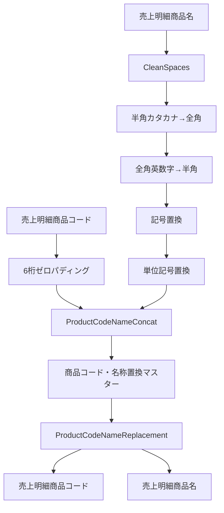

---

### 13. 4種類の文字置換マスター

商品名については、

```text
hankaku_katakana_to_zenkaku_tbl
zenkaku_alphanumeric_to_hankaku_tbl
symbol_replacement_tbl
unit_simbol_replacement_tbl
```

の4テーブルを利用しています。

すべて共通して、

```text
original
updated
```

という2列を持っています。

つまり構造は、

|original|updated|
|---|---|
|置換前文字列|置換後文字列|

です。

各テーブルについて、

```powerquery
Table.ToRows(tbl)
```

によって、

```text
{
    {original1, updated1},
    {original2, updated2},
    ...
}
```

というリストに変換し、

```powerquery
Text.Replace(
    state,
    current{0},
    current{1}
)
```

で部分一致置換しています。

したがって、

```text
original = "ABC"
updated  = "XYZ"
```

なら、

```text
商品ABC123
```

は、

```text
商品XYZ123
```

になります。

完全一致ではなく、

> **文字列中にoriginalが含まれていれば、その部分をupdatedへ置換する**

処理です。

---

### 14. List.Accumulateの二重構造

今回特に詳しく検討したのが、

```powerquery
CharacterReplacedProductName =
    List.Accumulate(
        {
            hankaku_katakana_to_zenkaku_tbl,
            zenkaku_alphanumeric_to_hankaku_tbl,
            symbol_replacement_tbl,
            unit_simbol_replacement_tbl
        },
        CleanedProductName,
        (state, tbl) =>
            Table.TransformColumns(
                state,
                {
                    {
                        "CleanSpaces",
                        each List.Accumulate(
                            Table.ToRows(tbl),
                            _,
                            (s, current) =>
                                Text.Replace(
                                    s,
                                    current{0},
                                    current{1}
                                )
                        )
                    }
                }
            )
    )
```

です。

このコードでは`List.Accumulate`が二重に使われています。

#### 外側のList.Accumulate

外側は、

```text
4つの置換マスター
```

を順番に処理します。

```text
CleanedProductName
↓
半角カタカナ置換
↓
全角英数字置換
↓
記号置換
↓
単位記号置換
↓
最終結果
```

です。

#### 内側のList.Accumulate

内側は、それぞれのマスター内にある、

```text
original → updated
```

を1行ずつ適用します。

したがって処理構造は、

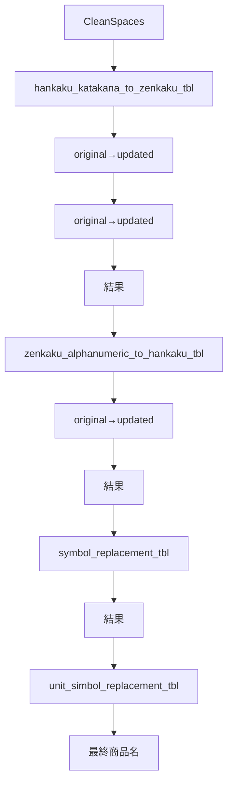

です。

---

### 15. 「original列はすでにあります」エラー

当初、各置換テーブルについて、

```powerquery
Table.AddColumn(
    state,
    Table.ColumnNames(tbl){0},
    ...
)
```

という方式を試しました。

しかし各マスターの先頭カラム名がすべて、

```text
original
```

で共通していたため、

```text
original
original
original
...
```

という同名列を追加しようとしてエラーになりました。

そこで、

```powerquery
Table.TransformColumns
```

を使って既存の`CleanSpaces`列を直接変換する方式へ変更しました。

この方式なら、置換マスターのカラム名が、

```text
original
updated
```

で共通でも問題ありません。

---

### 16. CleanSpacesという列名の問題

`Table.TransformColumns`に変更したことで、4種類の文字置換が完了しても、カラム名自体は、

```text
CleanSpaces
```

のまま残ります。

これは処理内容を正しく表現していません。

`CleanSpaces`という名前から読み取れるのは、

> スペース処理が終わった

ということだけだからです。

実際には、

- スペースクレンジング
- 半角カタカナ
- 全角英数字
- 記号
- 単位記号

まで処理されています。

そこで、最終結果を、

```text
CharacterReplacedProductName
```

へ変更する案を検討しました。

処理としては、

```powerquery
CharacterReplacedProductName =
    List.Accumulate(...),

RenamedProductName =
    Table.RenameColumns(
        CharacterReplacedProductName,
        {
            {
                "CleanSpaces",
                "CharacterReplacedProductName"
            }
        }
    )
```

という形です。

---

### 17. 「ステップ名」と「カラム名」は別物

ここで重要なのは、

```powerquery
CharacterReplacedProductName =
    List.Accumulate(...)
```

と書いても、

> **`CharacterReplacedProductName`はステップ名であり、カラム名ではない**

という点です。

そのため、処理結果のテーブル内には依然として、

```text
CleanSpaces
```

列が存在します。

したがって別途、

```powerquery
Table.RenameColumns
```

を実施しない限り、カラム名は変わりません。

この点はPower Queryで混同しやすい部分です。

---

### 18. 一括処理型とステップ分割型

商品名の文字置換について、2つの設計を比較しました。

#### 一括処理型

```powerquery
List.Accumulate(
    {
        tbl1,
        tbl2,
        tbl3,
        tbl4
    },
    CleanedProductName,
    ...
)
```

という構造です。

メリットは、

- コードが短い
- 同じロジックを繰り返さない
- マスターを増減しやすい
- 「複数マスターを順番に適用する」という抽象化ができている

ことです。

一方、

- 処理途中をPower Query画面から確認しづらい
- `List.Accumulate`に慣れていない人には読みにくい

というデメリットがあります。

#### ステップ分割型

こちらは、

```text
CleanedProductName
↓
ReplacedHankakuKatakana
↓
ReplacedZenkakuAlphanumeric
↓
ReplacedSymbols
↓
ReplacedUnitSymbols
```

という形です。

メリットは、

- Power Queryの各ステップで中間結果を確認できる
- デバッグがしやすい
- 初見でも処理内容が分かりやすい

ことです。

一方、

- 同じ`List.Accumulate`コードを何度も書く
- 長くなる
- マスター追加時にコード変更箇所が増える

というデメリットがあります。

---

### 19. エンジニアとしてどちらを目指すか

途中では「ステップ分割型の方が一般的に保守しやすい」という話もしましたが、その後さらに検討すると、単純に、

> 分割型＝良い  
> 一括型＝悪い

ではありません。

今回の処理の本質は、

> **同じ構造を持つ複数の置換マスターを、決められた順番で同じ方法により適用する**

ことです。

そのためソフトウェア設計としては、本来かなり抽象化しやすい処理です。

理想形に近づけるなら、

```text
ReplaceWithTable
```

のような汎用関数を作り、

```text
ReplacementTables
```

の一覧を渡して処理する設計が候補になります。

たとえば概念的には、

```powerquery
ReplaceWithTable =
    (inputText as text, replaceTable as table) as text =>
        List.Accumulate(
            Table.ToRows(replaceTable),
            inputText,
            (state, current) =>
                Text.Replace(
                    state,
                    current{0},
                    current{1}
                )
        )
```

のような関数です。

さらに、

```powerquery
ReplacementTables = {
    hankaku_katakana_to_zenkaku_tbl,
    zenkaku_alphanumeric_to_hankaku_tbl,
    symbol_replacement_tbl,
    unit_simbol_replacement_tbl
}
```

とすれば、

> 置換マスターを順番に適用する

という仕様そのものをコードで表現できます。

エンジニアリング上は、


という方向が自然です。

ただし、Power Queryの場合はGUIで中間ステップを確認できること自体がデバッグ手段になるため、

> **抽象化しすぎず、Power Query上で追跡可能な粒度を残す**

ことも重要です。

したがって今回なら、

- `CleanSpaces`
- 文字置換一式
- 商品コード＋商品名連結
- 商品マスター置換

くらいの大きな単位でステップを分け、その内部の反復処理を関数化するのがバランスのよい方向です。

---

### 20. 古い列の扱いについて

顧客・商品の両方で、新しい列を同名で生成する前に既存列との競合が発生しました。

採用した考え方は、

|元列|一時列|
|---|---|
|得意先コード|`OldCustomerCode`|
|得意先名称|`OldCustomerName`|
|売上明細商品コード|`OldSalesProductCode`|
|売上明細商品名|`OldSalesProductName`|

です。

最終的に、

```text
Old...
```

列は出力対象から除外します。

この方法により、

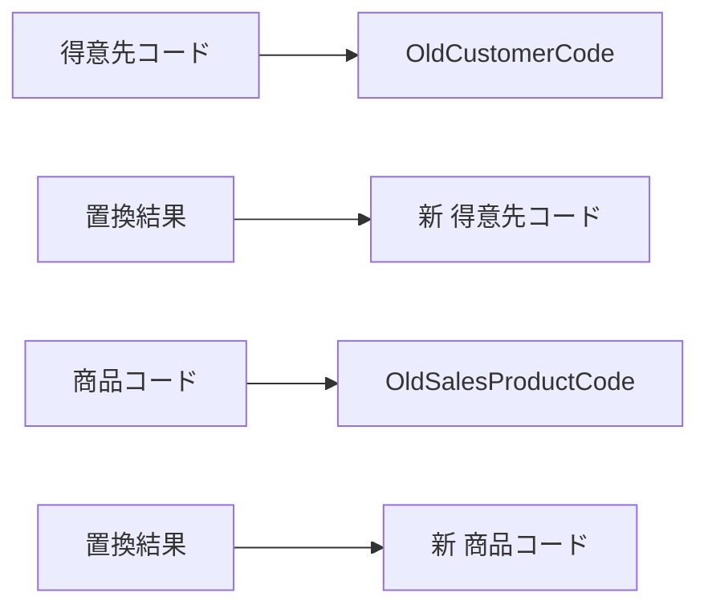

と、新旧を明確に区別できます。

---

### 21. ゼロパディングについて

得意先コードと商品コードについては、以前、

```powerquery
each "0" & _
```

や、

```powerquery
each "00" & _
```

を行った後、

```powerquery
Text.End(_, 6)
```

で6桁にしていました。

リファクタリングでは、

```powerquery
Text.PadStart(_, 6, "0")
```

を使う案を提示しました。

こちらの方が、

> **6桁になるまで左側を0で埋める**

という意図をそのままコードで表現できるため、可読性は高くなります。

---

### 22. 最終出力列

クレンジング完了後は、途中処理に使った、

```text
OldCustomerCode
OldCustomerName
CodeNameConcat
ReplacementCustomData
CleanSpaces
CharacterReplacedProductName
OldSalesProductCode
OldSalesProductName
ProductCodeNameConcat
ProductCodeNameReplacement
```

などを出力せず、分析に必要な正式列だけを、

```powerquery
Table.SelectColumns(...)
```

で残す設計です。

これにより、

> **途中処理用カラムは処理内部だけに存在し、CleanedDataには正式データだけを出力する**

という境界を作っています。

これはクレンジング処理として適切な構成です。

---

### 23. このチャットで固まってきた設計方針

全体を通じて、現在の方針は次のように整理できます。

- Power Queryを売上集計の中心とする。
- Python/pandasでも同一のデータクレンジング処理を再現する。
- Pythonはまず高速化と学習が主目的。
- Excelのダッシュボード・ピボットは引き続き利用する。
- Power Query側はPascalCase中心の命名を採用する。
- `ImportedFilesTbl`は複数ファイルを扱うため名称として適切。
- 分析補助列として`AnalysisPeriod`、`FileName`などを使用する。
- 年度IDは`FiscalYearId`の方が意味が明確。
- マスターは`original`／`updated`構造で統一する。
- 文字列置換は部分一致で`original → updated`を適用する。
- 置換順序自体がデータクレンジング仕様の一部。
- 古い顧客・商品列は`Old...`へ一時的にリネームする。
- 最終出力では途中処理列を除外する。
- 同じロジックの反復は、将来的にはカスタム関数への抽象化を検討する。
- ただしPower Queryではデバッグ性も重要なため、過度な一括化は避ける。

---

### 24. 現時点で残っている検討事項

いくつか未確定・未完了の部分もあります。

1つ目は、**商品名など日本語文字列内のスペースを全角・半角のどちらに統一するか**です。この質問は途中で出ましたが、その直後にPower Queryコードのリファクタリングへ移ったため、このチャット内では結論まで詰めていません。

2つ目は、文字列置換処理について、

```text
一括List.Accumulate
```

をそのまま使うか、

```text
ReplaceWithTable
ApplyReplacements
```

のような**カスタム関数へ正式に切り出すか**です。

方向性としては関数化に価値がありますが、実際のコード構成までは確定していません。

3つ目は、Power QueryとPythonで、

```text
同じ入力
↓
同じマスター
↓
同じ置換順序
↓
同じCleanedData
```

を保証するための**共通仕様書**です。今後Python版を本格化するなら、Power Queryコードそのものを仕様とするより、

|順番|対象|処理|マスター|
|--:|---|---|---|
|1|商品名|スペース正規化|`CleanSpaces`|
|2|商品名|半角カナ→全角|`hankaku_katakana_to_zenkaku_tbl`|
|3|商品名|全角英数字→半角|`zenkaku_alphanumeric_to_hankaku_tbl`|
|4|商品名|記号置換|`symbol_replacement_tbl`|
|5|商品名|単位記号置換|`unit_simbol_replacement_tbl`|
|6|商品コード＋商品名|正式名称置換|`own_product_code_name_replacement_tbl`|

のように**処理仕様をツール非依存で定義する**方が、Power Query/Python双方を維持しやすくなります。

---

### 25. 現在の到達点

今回の一連の検討によって、単なるPower Queryコードの整理から一歩進み、

> **Power QueryとPythonの両方から利用できる「売上データクレンジング仕様」を設計している**

状態まで来ています。

特に重要なのは、クレンジングを単発の操作ではなく、

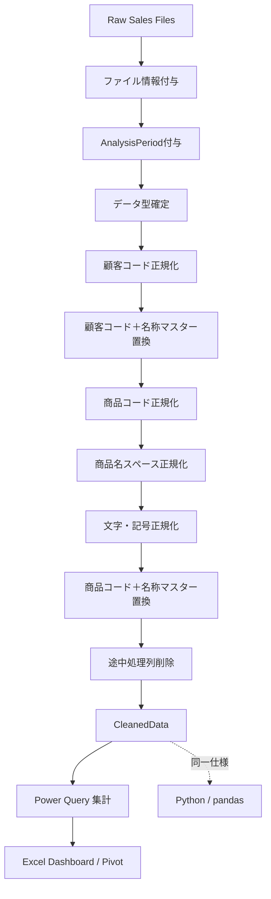

というパイプラインとして整理できるようになった点です。

#### セッション引き継ぎ

**行ったこと:** Power Queryによる売上データクレンジングの命名、ファイル管理、年度付与、顧客・商品マスター置換、文字正規化、コードのリファクタリング方針を整理しました。特に複数の`original`/`updated`マスターを`List.Accumulate`で連続適用する構造と、旧カラムを`Old...`へ退避する方式を確認しました。

**次の具体的なアクション:** 日本語商品名のスペース統一ルールを決めること、文字置換処理をカスタム関数化するか判断すること、Power Query/Python共通のクレンジング仕様を処理順序として明文化することです。

**主要な判断:** Power Queryを売上集計の主軸としつつ、Pythonでも同一クレンジングを再現する。途中列は意味の分かる名称を使い、最終出力時に除去する。単純なコード短縮より、処理意図・デバッグ性・再利用性のバランスを優先する方針です。

必要であれば、このまとめを次に **「売上データクレンジング設計仕様書」形式へ再構成して、Power Query版とPython版の共通仕様として使える形**にできます。

## 統合元ファイル

- 「売上分析用 Power Query・クリーンデータ管理・クエリ構成の整理.md」
- 「売上分析用 Power Query／マスタ構成の整理.md」
- 「売上分析用 Power Query／Python データクレンジング設計の整理.md」
