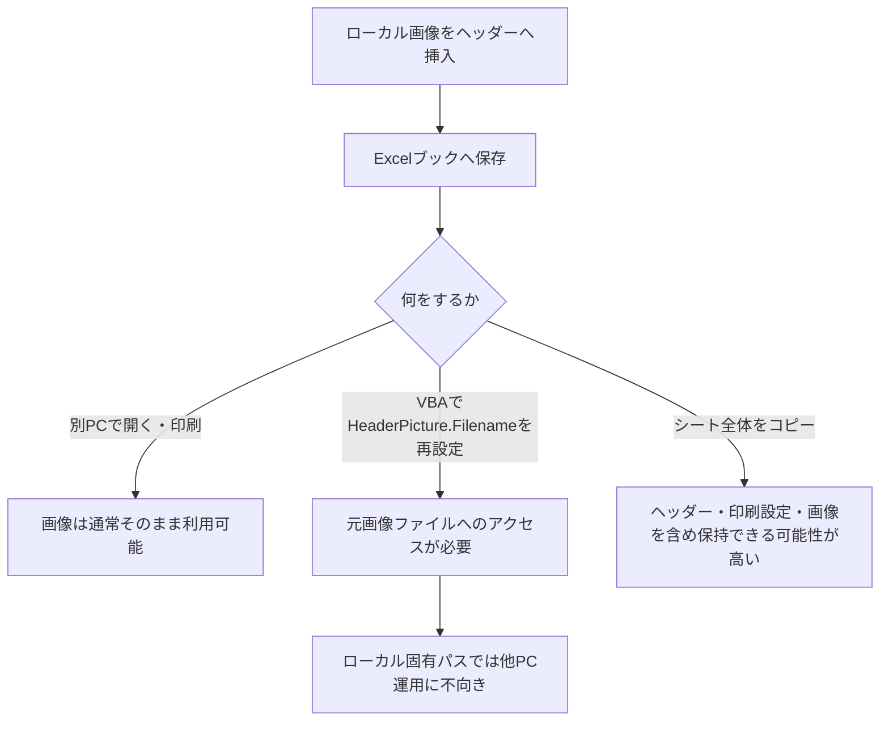

## 1. 今回確認したかったこと

このチャットでは、Excelの**ヘッダー・フッター、印刷設定、そこに挿入された画像をVBAでどこまでコピーできるか**について確認した。

特に焦点になったのは、次の3点。

- ヘッダー・フッターや印刷設定はVBAでコピーできるか
- ヘッダー・フッターにローカル画像を挿入した場合、その画像は別PCでも表示されるか
- その画像込みのヘッダー・フッターをVBAで別シート・別ブックへコピーする場合、どう扱われるか

---

## 2. ヘッダー・フッター・印刷設定はVBAでコピー可能

Excelでは、ワークシートの`PageSetup`オブジェクトを使うことで、ヘッダー・フッターや各種印刷設定を取得・設定できる。

代表的には以下のような設定が対象になる。

|分類|主なプロパティ|
|---|---|
|印刷範囲|`PrintArea`|
|印刷方向|`Orientation`|
|用紙サイズ|`PaperSize`|
|拡大縮小|`Zoom`|
|横方向ページ数|`FitToPagesWide`|
|縦方向ページ数|`FitToPagesTall`|
|左右余白|`LeftMargin`, `RightMargin`|
|上下余白|`TopMargin`, `BottomMargin`|
|ヘッダー余白|`HeaderMargin`|
|フッター余白|`FooterMargin`|
|水平中央|`CenterHorizontally`|
|垂直中央|`CenterVertically`|
|左・中央・右ヘッダー|`LeftHeader`, `CenterHeader`, `RightHeader`|
|左・中央・右フッター|`LeftFooter`, `CenterFooter`, `RightFooter`|

したがって、コピー元シートの`PageSetup`を参照して、コピー先シートの`PageSetup`へ代入すれば、通常の印刷設定や文字列のヘッダー・フッターはコピーできる。

---

## 3. 「ファイルから」挿入した画像の扱い

ユーザーの実際の操作は以下。

Excelのヘッダー編集画面で「画像の挿入」を選択すると、

- ファイルから
- Bing イメージ検索
- OneDrive - 個人用

の3つが表示される。

そのうち、**「ファイルから」→ローカルPC上のロゴ画像を選択**している。

### この場合の基本的な扱い

この方法でヘッダー・フッターに挿入した画像は、Excelブックに保存された状態で保持される。

そのため、

1. 自分のPC上のローカル画像を使ってヘッダーへ挿入
2. Excelファイルを保存
3. Excelファイルだけを共有フォルダへ配置
4. 別担当者が別PCで開く
5. その担当者が印刷する

という運用でも、通常は**元画像ファイルを別PCへコピーする必要はなく、ヘッダー・フッター画像も表示・印刷される**。

つまり、以下のような単純な外部リンク依存ではない。

```text
Excelブック
   ↓
C:\Users\自分\Pictures\logo.png を毎回参照
```

このため、元のPC上だけにロゴ画像が存在していても、保存済みExcelファイルを他PCで開く用途では基本的に問題にならない。

---

## 4. ここで混同しやすい「表示」と「再設定」の違い

今回もっとも重要なのはここ。

### 保存済みExcelを別PCで開く場合

画像はExcelブック内に保持されているため、通常はそのまま表示できる。


このケースでは、別PCから元の`logo.png`へアクセスする必要は基本的にない。

### VBAで別シートへ「画像を再設定」する場合

一方、

```vba
targetSheet.PageSetup.LeftHeaderPicture.Filename = _
    sourceSheet.PageSetup.LeftHeaderPicture.Filename
```

のように`Filename`プロパティを使って**画像を再設定する処理**を行う場合は事情が異なる。

これは「Excelに既に保存されている画像をコピーする」というより、

> この画像ファイルを使って、もう一度ヘッダー画像を設定してください

という操作に近い。

したがって、この方法では元画像のファイルパスが必要になる可能性がある。

ここが、

- 保存済みブック上で画像を見る
- VBAで画像を新しく設定し直す

の大きな違い。

---

## 5. ヘッダー・フッター画像をVBAで扱うプロパティ

Excel VBAでは、ヘッダー・フッター画像に以下のオブジェクトが用意されている。

```vba
LeftHeaderPicture
CenterHeaderPicture
RightHeaderPicture

LeftFooterPicture
CenterFooterPicture
RightFooterPicture
```

画像ファイルを設定する場合は、例えば以下。

```vba
With ws.PageSetup
    .CenterHeaderPicture.Filename = "C:\Images\logo.png"
    .CenterHeader = "&G"
End With
```

`&G`は、

> この位置に設定された画像を表示する

というヘッダー・フッター用の特殊コード。

そのため、画像ファイルを設定しただけでなく、

```vba
.CenterHeader = "&G"
```

の設定も必要になる。

---

## 6. 当初提示したVBAコピー案

画像を含むヘッダー・フッターをコピーする方法として、会話中では次の考え方を提示した。

まず通常のヘッダー・フッターをコピー。

```vba
With targetSheet.PageSetup
    .LeftHeader = sourceSheet.PageSetup.LeftHeader
    .CenterHeader = sourceSheet.PageSetup.CenterHeader
    .RightHeader = sourceSheet.PageSetup.RightHeader

    .LeftFooter = sourceSheet.PageSetup.LeftFooter
    .CenterFooter = sourceSheet.PageSetup.CenterFooter
    .RightFooter = sourceSheet.PageSetup.RightFooter
End With
```

さらに画像について、

```vba
With targetSheet.PageSetup
    .LeftHeaderPicture.Filename = _
        sourceSheet.PageSetup.LeftHeaderPicture.Filename

    .CenterHeaderPicture.Filename = _
        sourceSheet.PageSetup.CenterHeaderPicture.Filename

    .RightHeaderPicture.Filename = _
        sourceSheet.PageSetup.RightHeaderPicture.Filename
End With
```

などとして、画像ファイルをコピー先にも設定する案。

画像表示用に、

```vba
.LeftHeader = "&G"
.CenterHeader = "&G"
.RightHeader = "&G"
```

などを設定する。

---

## 7. ただし、この方法には重要な制約がある

この点については、会話途中の説明にやや混同があった。

### 問題になるのは`Filename`を使う場合

例えばコピー元で、

```text
C:\Users\自分\Pictures\logo.png
```

を使っていた場合、そのExcelファイル自体は他PCでも画像を表示できる。

しかしVBAから、

```vba
.CenterHeaderPicture.Filename = "C:\Users\自分\Pictures\logo.png"
```

として**新しく画像を設定しようとすると、そのPCからそのファイルへアクセスできなければならない**。

つまり、

|状況|元画像ファイルが必要か|
|---|--:|
|保存済みExcelを別PCで開く|基本不要|
|保存済みExcelを別PCで印刷|基本不要|
|VBAで元画像ファイルを指定して再挿入|必要|
|VBAで`Filename`を使って別シートへ再設定|必要になる可能性が高い|

となる。

---

## 8. 「画像そのものをVBAでコピーできるか」が本質的な論点

今回の話を整理すると、最終的な問題は、

> コピー元シートのヘッダーに既に埋め込まれている画像を、元画像ファイルを参照せずに、VBAからコピー先シートへ移植できるか

という点になる。

通常のテキストであれば、

```vba
target.PageSetup.CenterHeader = source.PageSetup.CenterHeader
```

だけで済む。

しかしヘッダー・フッターの画像は、通常のShapeのように、

```vba
.Copy
.Paste
```

で直接操作する構造ではない。

`HeaderFooter.Picture`自体をバイナリ画像として読み出して別の`HeaderFooter.Picture`へ代入する、といった単純なVBA APIも存在しない。

そのため、**PageSetupの各プロパティを1項目ずつコピーする方法と、画像データそのもののコピーは別問題として考える必要がある**。

---

## 9. 今回の内容から考えられる実装方式

今後実装を考える場合、大きく3つの方式が考えられる。

|方法|画像|特徴|
|---|---|---|
|`PageSetup`を個別コピー|△|文字・印刷設定は容易。画像だけ扱いが難しい|
|`Picture.Filename`で再設定|○|実装は簡単。ただし画像ファイルへのアクセスが必要|
|シートそのものをコピー|◎|ヘッダー・フッターを含むシート設定全体を保持しやすい|

特に、もし既存の処理上、

```vba
ws.Copy
```

のように**シート全体を別ブックへコピーできる状況**なら、ヘッダー・フッター、印刷設定、画像を個別に再構築するよりも、そのほうが自然な可能性がある。

これは、ユーザーがこれまで在庫処理マクロ等で行っている「シートそのものをコピーする」方式とも親和性が高い。

---

## 10. 今回の結論

今回確認できた内容を簡潔にまとめると、以下。

- Excelのヘッダー・フッターおよび印刷設定は、VBAの`PageSetup`でコピー可能。
- 「ファイルから」でローカル画像をヘッダー・フッターに挿入して保存したExcelは、通常、そのExcelファイルだけを別PCへ渡しても画像を表示・印刷できる。
- そのため、別担当者のPCに元画像ファイルが存在する必要は通常ない。
- ただし、VBAの`HeaderPicture.Filename`や`FooterPicture.Filename`を使ってコピー先へ**画像を再設定する処理**では、元画像ファイルのパスへアクセスできる必要が生じる。
- 「保存済み画像を表示すること」と「VBAから画像ファイルを使って再挿入すること」は別。
- ヘッダー・フッター内に保存済みの画像そのものを、`PageSetup`の単純なプロパティ代入だけで別シートへコピーするのは容易ではない。
- 実務上は、可能であれば**シート全体をコピーする方法**も有力候補になる。



なお、会話途中では「ヘッダー画像はリンクなので別PCでは表示されない」という説明と、「Excel内に埋め込まれる」という説明が混在した。今回のユーザーの具体的な操作、すなわち**Excelのヘッダー編集から［画像の挿入］→［ファイルから］で画像を選択して保存する通常操作**については、後者の理解を基準に整理するのが適切。
