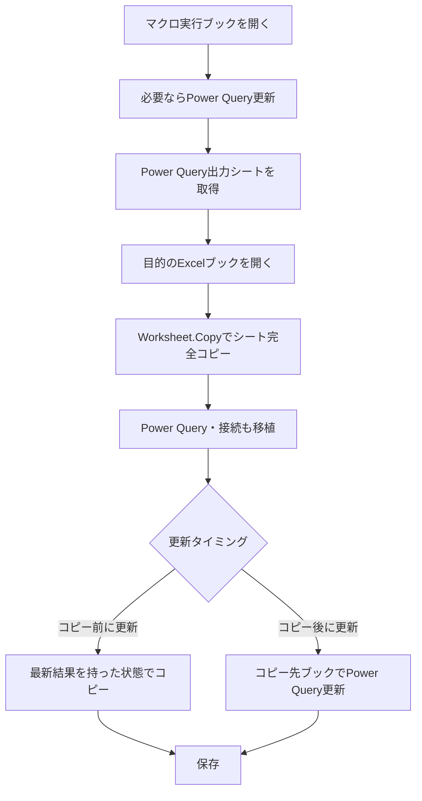

## 目的

今回のチャットでは、**VBAとPower Queryを組み合わせて、外部Excelファイルからデータを取得し、その結果やPower Query自体を別のExcelブックへ移植・更新する作業をどこまで自動化できるか**を整理した。

最終的に検討していた構成は、単純にPower Queryの結果データだけをコピーするのではなく、**Power Queryを含んだシートそのものをVBAで別ブックへ完全コピーすることで、クエリや接続も含めて移植する**方式である。

---

## 検討した処理全体

当初想定していた処理は、大きく次の2点だった。

1. Power Queryへデータを読み込む
2. Power Queryで読み込んだ結果を、特定のExcelブック・シートへ出力する

その後の検討で、単に結果データをコピーする方式よりも、次のような構成が候補となった。


つまり、**マクロ実行用ブックそのものをPower Queryのテンプレート兼処理基盤として使用する**構成である。

---

## Power QueryとVBAで可能なこと

今回のやり取りで確認した範囲では、VBAからPower Queryに対して次のような操作が可能である。

|処理|VBAでの対応|備考|
|---|---|---|
|既存Power Queryの更新|可能|`WorkbookConnection.Refresh` など|
|ブック内の接続を一括更新|可能|`RefreshAll` 等も利用可能|
|Power Query出力結果のコピー|可能|セル・テーブル・シート単位|
|Power Query出力シートの別ブックへのコピー|可能|`Worksheet.Copy`|
|コピー先でPower Queryを更新|条件が整えば可能|クエリ・接続も移植されている場合|
|VBAによるPower QueryのMコード生成・変更|技術的には可能|運用上は複雑|
|外部Excelファイルの選択|VBAで可能|`FileDialog` 等|
|Power Queryのデータソース切替|実装方法次第|パラメータ・Mコード変更等|

Power Queryの更新については、例えば次のような方法がある。

```vba
ThisWorkbook.Connections("Query - クエリ名").Refresh
```

また、ブック全体を対象とするのであれば、

```vba
ThisWorkbook.RefreshAll
```

のような方法も使用できる。

ただし、今回最終的に検討している方式では、**個々のクエリ名をVBA内に直接記述しない設計も可能**である。

---

## 外部Excelファイルからのデータ取得について

途中では、

> Power Queryで外部Excelファイルを読み込む設定自体は、最初に手動で作る必要があるのではないか

という話になった。

典型的には、Power Queryで事前に次のようなクエリを作成する。

```text
データ
 ↓
データの取得
 ↓
ファイルから
 ↓
Excelブックから
 ↓
対象ファイル
```

その後、VBAから更新する方式である。

ただし、これは**「毎回外部ファイルを手動で指定しなければならない」という意味ではない**。

最初にPower Queryを構築した後は、

- 固定パス
- Excelセルを利用したパラメータ
- 名前定義
- Power Queryパラメータ
- VBAによるMコード書き換え

などを使用することで、外部ファイルの切替も自動化できる余地がある。

今回の会話では、そこまで複雑にするよりも、**実行用マクロブックにあらかじめ必要なPower Queryを持たせておく方式**が有力となった。

---

## 一度検討した「値だけコピーする方式」

初期段階では、Power Queryを実行用ブックで更新した後、その結果だけを別ブックへコピーする方法も考えた。

イメージとしては、


例えば、

```vba
wsSource.UsedRange.Copy
wsTarget.Range("A1").PasteSpecial Paste:=xlPasteValues
```

のような方式である。

この方法であれば、コピー先ブックにはPower Queryを持たせず、**更新済みの結果だけを固定データとして渡す**ことになる。

### メリット

- コピー先ブックがシンプル
- 外部接続が残らない
- コピー先ユーザーがPower Queryを意識しなくてよい

### デメリット

- コピー先ではPower Queryを再更新できない
- 毎回マクロ実行ブック側で更新して再配布する必要がある

今回の検討では、これよりも**クエリそのものを移植できる方式の方が目的に合う可能性が高い**という流れになった。

---

## 重要な論点：シート全体をコピーするとPower Queryも移植されるか

この点について、チャット途中で認識の訂正があった。

当初の説明では、

> Power Queryによって出力されたテーブルのデータはコピーされるが、Power Queryのクエリや接続はコピーされない

としていた。

しかしユーザー側から、

> Excelの通常操作で、Power Queryの出力されたシート全体を別ブックへコピーすると、Power Queryの接続も含めてコピーされる

という実際の動作が示された。

そのため、この点については当初の説明を訂正し、**Power Queryを出力しているワークシート自体を別ブックへコピーした場合、そのPower Queryや関連接続もコピー先ブックへ移植されるケースがある**という認識に修正した。

今回の運用では、このExcelの挙動を利用する。

---

## 最終的に考えている方式

ユーザーが最後に示した考え方は、

> VBAで個々のクエリ名などを指定して移植処理を行う必要はなく、Power Queryの出力されているシートを完全コピーすれば、それだけでクエリも移植できるのではないか

というものだった。

この方式であれば、VBA側はかなり単純化できる。

概念的には次の処理だけで済む。

```vba
wsSource.Copy After:=targetWorkbook.Sheets(targetWorkbook.Sheets.Count)
```

つまり、



この設計なら、VBAに

- クエリ名
- 接続名
- 出力テーブル名

などを大量にハードコードしなくても済む可能性がある。

---

## 更新タイミングの2パターン

今回の話の中では、Power Queryの更新タイミングとして2案が考えられた。

|方法|処理|特徴|
|---|---|---|
|コピー前に更新|マクロブックでPower Query更新 → シートコピー|コピー時点ですでに最新データ|
|コピー後に更新|シートコピー → コピー先でPower Query更新|コピー先自身でデータ取得|

### コピー前更新

```text
マクロ実行ブック
  ↓
Power Query更新
  ↓
最新データ
  ↓
シート完全コピー
  ↓
目的ブック
```

この方式は、**コピー先では更新させず、確定した最新状態を渡したい場合**に向いている。

### コピー後更新

```text
マクロ実行ブック
  ↓
Power Query付きシートコピー
  ↓
目的ブック
  ↓
Power Query更新
```

この方式は、コピー先ブック側でもPower Queryを生かしたい場合に向いている。

状況によっては、

```text
コピー前に更新
＋
コピー先でも必要に応じて更新可能
```

という構成も取れる。

---

## 実装する場合の基本構成

今回の考え方を実際のVBAへ落とし込むなら、全体の処理は次のようになる。

1. マクロ実行ブックをPower Queryのテンプレートとして準備する
2. 必要なPower Queryをあらかじめ設定しておく
3. VBAを実行する
4. 必要ならPower Queryを更新する
5. コピー先Excelブックを選択または指定する
6. Power Query出力シートを`Worksheet.Copy`で完全コピーする
7. 必要に応じてコピー先でPower Queryを更新する
8. コピー先ブックを保存する

これにより、

**「Power QueryをVBAで一から生成する」**

のではなく、

**「完成済みのPower Query環境を持つシートをテンプレートとして配布する」**

という設計になる。

---

## 今回の重要な結論

今回の検討で最も重要だったのは、Power Queryを単なるデータ変換処理として扱うのではなく、**Power Queryを含んだシート自体をVBAで移植する**という発想である。

最終的な方向性は次の通り。

- Power Queryは実行用マクロブックへ事前に構築しておく。
- VBAからPower Queryの更新は可能。
- Power Queryの結果だけを値としてコピーする方式も可能。
- ただし今回の用途では、**Power Query出力シート全体のコピーが有力**。
- Excelのシートコピーでは、Power Query出力テーブルだけでなく、関連するクエリ・接続もコピー先ブックへ移植される動作を利用できる。
- そのため、VBA側でクエリ名や接続名を個別指定せず、`Worksheet.Copy`中心の処理にできる可能性が高い。
- 更新タイミングは「コピー前」「コピー後」のどちらでも設計可能。

要するに、今回の構想は、

> **Power Queryを持ったマクロブックをテンプレート兼エンジンとして用意し、VBAでPower Query付きシートを目的のExcelブックへ丸ごと移植する**

という方式に整理できる。

### 現時点の未決事項

実際にVBA化する段階では、まだ次の点を決める必要がある。

- コピー対象シートは1枚か複数か
- コピー先ブックは固定か、ファイル選択式か
- 同名シートが既に存在する場合の扱い
- Power Queryをコピー前に更新するか、コピー後に更新するか
- コピー先に既存の同名クエリ・接続がある場合の扱い
- Power Query更新完了をVBA側で待機する必要があるか
- コピー後に元のPower Queryや不要な接続を削除する必要があるか

実装する場合は、この設計を前提に**「Power Query付きシート移植マクロ」の実装計画書を作成してからコード化する**のが次の段階になる。
