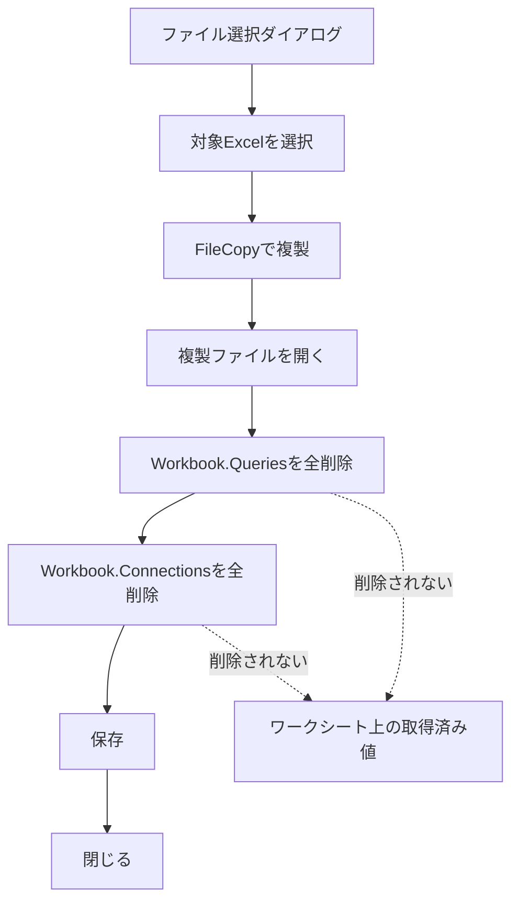

Excelファイルを複製し、シート上の出力データを保ちながらPower Queryや接続を削除し、複数の提出用ファイルを一括生成するVBAの検討記録です。

元の活動日時は確認できないため、実際の日付順ではなく、内容から推定した段階順に配置しています。後段に置いたコードを最終版候補として扱いますが、現在の環境では未検証です。完全に同一のコード断片だけは重複掲載を省略し、異なる版、失敗例、訂正、未解決事項は残しています。

## 記録の読み方

このノートは現在使う手順書ではなく、当時どのような課題を扱い、どのように設計やコードを変えていったかを残す活動記録です。記録間で判断が食い違う場合は、後段の記録を有力候補としつつ、矛盾そのものも経緯として残しています。

## 段階1：Excelファイル複製後にPower Queryを削除し、シート上の出力データを保持するVBA検討まとめ

このチャットでは、**ファイルダイアログでExcelファイルを選択して複製し、その複製ファイルからPower Query関連情報を削除しつつ、ワークシート上に既に出力されているデータは残す**という処理について検討した。

最終的には、`Workbook.Queries` を使ってPower Queryそのものを削除し、その後 `Workbook.Connections` を削除することで、希望する状態を実現できた。

---

### 1. 最初の要件：Excelファイルを選択して複製する

最初の要件は単純で、ファイルダイアログからExcelファイルを1つ選択し、そのファイルを複製するというものだった。

基本処理は次の流れ。


複製ファイル名は、元ファイル名に「コピー」を追加する形とした。

例：

|元ファイル|複製後|
|---|---|
|`Sales.xlsx`|`Salesコピー.xlsx`|
|`Inventory.xlsm`|`Inventoryコピー.xlsm`|

基本的には `FileCopy` を使用する。

---

### 2. 次の要件：複製したExcelからPower Queryを削除したい

次に追加された要件は、複製したExcelファイル内に存在するPower Queryをすべて削除することだった。

ここで最初に検討したのが、

```vba
Workbook.Connections
```

を削除する方法。

例えば、

```vba
Dim conn As WorkbookConnection

For Each conn In wb.Connections
    conn.Delete
Next conn
```

という処理だった。

しかし、この方法では**Power Queryそのものは削除されなかった**。

Power Queryエディターを開くと、クエリ一覧がそのまま残っていた。

---

### 3. 「接続」と「Power Queryそのもの」は別物

ここで重要になったのが、Excel内部では次のものが別々に管理されているという点。

|対象|VBA上の主なオブジェクト|意味|
|---|---|---|
|Power Queryそのもの|`Workbook.Queries`|Power Queryエディターに表示されるクエリ定義|
|外部接続|`Workbook.Connections`|外部データやPower Queryとの接続情報|
|シート上のクエリ出力|`QueryTable` / `ListObject`|ワークシート上にロードされた表|

つまり、

```text
Power Query = WorkbookConnection
```

ではない。

両者は関連しているものの、別オブジェクトとして存在している。

概念的には次のようになる。


そのため、`Connections.Delete` だけ実行しても、Power Queryエディター内のクエリ定義が残る場合がある。

---

### 4. QueryTable.Delete の検討

途中で、

```vba
QueryTable.Delete
```

を使用して内部クエリを削除できないか、という検討を行った。

例えば、

```vba
For Each ws In wb.Worksheets
    For Each qryTbl In ws.QueryTables
        qryTbl.Delete
    Next qryTbl
Next ws
```

という方法。

しかし、これは今回の目的とは異なる。

`QueryTable` は基本的に**シート上にロードされている外部データテーブル**を表すオブジェクトであり、Power Queryエディター内のクエリ定義そのものではない。

さらに、`QueryTable.Delete` や `ListObject.Delete` は、場合によってはシート上のテーブルそのものを削除するため、

> シート上の出力済みデータは残したい

という要件と相性が悪い。

したがって、この方法は最終的には採用しなかった。

---

### 5. ListObjectを削除する方法も不適切だった

次に、Power Queryからロードされたテーブルを、

```vba
ListObject
```

として判定する方法も検討した。

例えば、

```vba
If qry.SourceType = xlSrcQuery Then
    qry.Delete
End If
```

という処理。

これもPower Query定義を消すのではなく、**ワークシート上のExcelテーブルそのものを削除する処理**になる。

したがって今回の希望、

> Power Queryは消す  
> ただし、シート上に出力されているデータは残す

とは異なる。

---

### 6. 最終的に成功した方法

最終的に希望どおり動作したのは、

1. `Workbook.Queries` を削除
2. `Workbook.Connections` を削除

という方法だった。

Power Queryそのものを削除する処理は次の部分。

```vba
Dim pq As Object

For Each pq In wb.Queries
    wb.Queries(pq.Name).Delete
Next pq
```

これにより、Power Queryエディターの左側に表示されているクエリそのものが削除される。

その後、接続情報も削除する。

> 同一のコード断片は前段階に記録済みのため、重複掲載を省略。

結果として、

- Power Queryエディター → クエリなし
- Workbook Connections → 不要な接続なし
- ワークシート上 → 取得済みデータは残る

という状態になった。

---

### 7. 完成時の処理フロー

最終的なマクロの流れは次のとおり。



最終コードの中心部分は次の形になった。

```vba
Sub DeleteAllQueriesAndKeepData()

    Dim fd As FileDialog
    Dim selectedFilePath As String
    Dim destinationFilePath As String
    Dim wb As Workbook
    Dim conn As WorkbookConnection
    Dim pq As Object

    Set fd = Application.FileDialog(msoFileDialogFilePicker)

    fd.Title = "エクセルファイルを選択してください"
    fd.Filters.Clear
    fd.Filters.Add "Excelファイル", "*.xls; *.xlsx"

    If fd.Show = -1 Then

        selectedFilePath = fd.SelectedItems(1)

        destinationFilePath = _
            Left(selectedFilePath, InStrRev(selectedFilePath, ".")) & _
            "コピー" & _
            Mid(selectedFilePath, InStrRev(selectedFilePath, "."))

        FileCopy selectedFilePath, destinationFilePath

        Set wb = Workbooks.Open(destinationFilePath)

        ' Power Queryそのものを削除
        On Error Resume Next

        For Each pq In wb.Queries
            wb.Queries(pq.Name).Delete
        Next pq

        On Error GoTo 0

        ' 接続を削除
        On Error Resume Next

        For Each conn In wb.Connections
            conn.Delete
        Next conn

        On Error GoTo 0

        wb.Close SaveChanges:=True

        MsgBox _
            "クエリと接続を削除し、シートのデータを保持してファイルを複製しました：" & _
            vbCrLf & destinationFilePath

    Else

        MsgBox "ファイルが選択されませんでした。"

    End If

    Set fd = Nothing

End Sub
```

---

### 8. 「クエリ→接続」の削除順序について検証したこと

一時的に、

> クエリそのものを先に削除してから接続を削除するから、シートのデータが残るのではないか

という仮説を立てた。

その仮説に基づき、

```text
Workbook.Queries.Delete
↓
Workbook.Connections.Delete
```

という順番が重要なのではないか、と説明した。

しかし、その後ユーザー側で処理順序を逆にして実験したところ、

```text
Workbook.Connections.Delete
↓
Workbook.Queries.Delete
```

でも問題なくシート上のデータが残ることが確認された。

したがって、

> シート上のデータが残る理由は「削除順序」にある

という仮説は否定された。

---

### 実験結果から分かったこと

今回のケースでは、


となった。

つまり、少なくとも対象ブックでは、削除順序はシート上の取得済みデータ保持に影響しなかった。

より正確には、

> Power Queryや接続を削除しても、既にワークシートへロードされている値はExcelシート上のデータとして残る

という挙動だった。

したがって、重要なのは削除順序より、

```vba
QueryTable.Delete
```

や

```vba
ListObject.Delete
```

のような**シート上のオブジェクト自体を消す処理を行わないこと**である。

---

### 9. 各削除方法と結果の整理

今回試した／検討した方法を整理すると次のとおり。

|操作|Power Query定義|接続|シート上のデータ|今回の採用|
|---|--:|--:|--:|--:|
|`Connections.Delete`|残る|消える|残る|単独では不十分|
|`Workbook.Queries.Delete`|消える|残る可能性あり|残る|採用|
|`QueryTable.Delete`|目的と異なる|状況依存|消える可能性あり|不採用|
|`ListObject.Delete`|目的と異なる|状況依存|テーブルごと消える|不採用|
|`Queries.Delete` + `Connections.Delete`|消える|消える|残る|**採用**|

最終的な考え方は、

> **定義と接続は消す。シート上の表には触らない。**

というものになる。

---

### 10. Power Queryのグループ／フォルダが残る問題

最後に残った課題が、Power Queryエディター内でクエリ整理用に作成している**グループ（フォルダ）**だった。

Power Queryでは例えば、

```text
売上
├─ Raw
├─ Cleaned
└─ Aggregated
```

のようにクエリをグループ化できる。

`Workbook.Queries.Delete` ですべてのクエリを削除しても、この空になったグループが残る場合がある。

状態としては、

```text
売上
Raw
Cleaned
Aggregated
```

という空フォルダだけが残る。

---

### VBAからグループを削除できるか

この時点での結論は、

> 通常のExcel VBAの公開オブジェクトモデルには、Power Queryの「クエリグループ」を直接列挙・削除するAPIが用意されていない

というものだった。

`Workbook.Queries` ではクエリは取得できるが、

```vba
Workbook.QueryGroups
```

のような標準VBAオブジェクトは存在しない。

したがって、

```vba
wb.Queries(...)
```

でクエリ自体は削除できても、クエリグループを同じようには操作できない。

現状では、空になったクエリグループについては**Power Queryエディター上で手動削除する必要がある**、という整理になった。

---

### 11. 最終的に確定した考え方

今回の検討から、Power Query関連では次の3階層を分けて考える必要がある。


今回の目的に対する処理方針は以下で確定した。

- 元ファイルには触らない。
- ファイルダイアログで対象Excelを選ぶ。
- `FileCopy` で複製を作る。
- 複製ファイルだけを編集する。
- `Workbook.Queries` を削除する。
- `Workbook.Connections` を削除する。
- `QueryTable.Delete` は使用しない。
- `ListObject.Delete` も使用しない。
- シートに既に出力済みの値は残す。
- `Queries` と `Connections` の削除順序は、今回の検証では本質的ではなかった。
- Power Queryの空グループ／フォルダは残る場合がある。
- Power Queryグループを直接削除する標準VBA APIは確認できず、手動削除が必要という整理になった。

---

### 結論

今回実現したかった状態は次のものだった。

|項目|最終状態|
|---|---|
|元Excelファイル|変更なし|
|複製Excelファイル|作成|
|Power Queryクエリ|削除|
|外部データ接続|削除|
|シート上の取得済みデータ|**保持**|
|QueryTable/ListObject|削除しない|
|Power Queryグループ|空のものが残る場合あり|

つまり最終的には、**「Power Query機能を除去して、現在シートに表示されている結果だけを静的なExcelデータとして残した複製ブックを作る」VBA**として成立した。

## 段階2：Excel VBAで複数ファイルを選択し、提出用ファイルを一括生成する処理の整理

### Excel VBAで複数ファイルを選択し、提出用ファイルを一括生成する処理の整理

今回のチャットでは、既存の `SalesReportSubmitter` マクロを「1ファイル処理」から「複数ファイル一括処理」へ拡張することを目的に検討しました。最終的な要件は、ファイル選択ダイアログで複数のExcelファイルを選択し、各ファイルについて「複製 → Power Query削除 → 接続削除 → 保存」という同じ処理を順番に実行することです。

#### 1. 元のマクロの処理内容

最初に提示された `SalesReportSubmitter` は、1つのExcelファイルを選択し、そのファイルから提出用ファイルを生成するマクロでした。

処理の流れは次のとおりです。


元コードでは、ファイル選択後に以下のように1件目だけを取得していました。

```vba
selectedFilePath = fd.SelectedItems(1)
```

このため、標準状態では1つのファイルしか処理できません。

---

### 2. VBAのファイル選択ダイアログでは複数選択が可能

`Application.FileDialog(msoFileDialogFilePicker)` では、次の設定を追加することで複数ファイルを選択できます。

```vba
fd.AllowMultiSelect = True
```

複数選択されたファイルは、

```vba
fd.SelectedItems
```

に格納されます。

そのため、1件だけ取得するのではなく、

```vba
For Each selectedFile In fd.SelectedItems
```

というループで処理すれば、選択したすべてのファイルに同じ処理を適用できます。

基本構造は次の形です。

```vba
If fd.Show = -1 Then

    For Each selectedFile In fd.SelectedItems

        ' 1ファイル分の処理

    Next selectedFile

End If
```

---

### 3. 複数ファイル対応で変更した部分

元の処理ロジックそのものは変えず、ファイル単位の処理をループ内へ移動する方針としました。

主な変更点は次のとおりです。

|項目|元コード|複数ファイル対応|
|---|---|---|
|ファイル選択|1ファイル|複数ファイル|
|`AllowMultiSelect`|未設定|`True`|
|ファイル取得|`SelectedItems(1)`|`For Each`|
|ファイル複製|1回|ファイルごと|
|Query削除|1ブック|各ブック|
|Connection削除|1ブック|各ブック|
|完了通知|1ファイルごと|全処理終了後|
|処理状況|特になし|`Debug.Print`で確認可能|

処理全体としては次の構造になります。


---

### 4. 途中で発生した問題

複数ファイル対応版を実際に使用したところ、**1つのファイルしか生成されない**という問題が発生しました。

そこで、提出用ファイル名を生成している部分を重点的に見直しました。

提出用ファイル名は、

```text
元ファイル名 + "_提出用" + 拡張子
```

とする必要があります。

例えば、

```text
売上実績_大阪.xlsx
```

なら、

```text
売上実績_大阪_提出用.xlsx
```

とします。

また、

```text
sales.report.xlsx
```

のようにファイル名中に `.` が含まれていても、

```text
sales.report_提出用.xlsx
```

となるよう、**最後の `.` を拡張子の境界として扱う**必要があります。

---

### 5. ファイル名取得処理でさらに問題が発生

修正版を試したところ、提出用ファイル名が

```text
._提出用.xlsx
```

となる問題が発生しました。

これは、ファイルパスから「拡張子を除いたファイル名」を取り出す文字列処理が正しくなかったことが原因です。

Windowsのフルパスを次の3つに分解する必要があります。

```text
C:\Sales\2026\大阪売上.xlsx
│              │      │
│              │      └ 拡張子
│              └ ファイル名
└ フォルダ
```

それぞれ、

```text
フォルダ:
C:\Sales\2026\

ファイル名:
大阪売上

拡張子:
.xlsx
```

として扱います。

VBAでは `InStrRev` を使うことで、最後に現れる `\` と `.` を検索できます。

---

### 6. ファイル名生成の基本ロジック

安定して処理するなら、考え方としては次の3段階に分離するのが分かりやすいです。

```vba
Dim folderPath As String
Dim baseFileName As String
Dim fileExtension As String
```

#### フォルダ部分

```vba
folderPath = Left( _
    selectedFilePath, _
    InStrRev(selectedFilePath, "\") _
)
```

例えば、

```text
C:\Sales\大阪売上.xlsx
```

なら、

```text
C:\Sales\
```

を取得します。

#### 拡張子

```vba
fileExtension = Mid( _
    selectedFilePath, _
    InStrRev(selectedFilePath, ".") _
)
```

結果：

```text
.xlsx
```

#### ファイル名

```vba
baseFileName = Mid( _
    selectedFilePath, _
    InStrRev(selectedFilePath, "\") + 1, _
    InStrRev(selectedFilePath, ".") _
        - InStrRev(selectedFilePath, "\") - 1 _
)
```

結果：

```text
大阪売上
```

そして最終的に、

```vba
destinationFilePath = _
    folderPath & _
    baseFileName & _
    "_提出用" & _
    fileExtension
```

とします。

---

### 7. 最終的に目指しているコード構成

今回の議論を整理すると、マクロは次のような形にするのが自然です。

```vba
Option Explicit

Sub SalesReportSubmitter()

    Dim fd As FileDialog
    Dim selectedFile As Variant

    Dim selectedFilePath As String
    Dim destinationFilePath As String

    Dim folderPath As String
    Dim baseFileName As String
    Dim fileExtension As String

    Dim wb As Workbook
    Dim conn As WorkbookConnection
    Dim pq As Object

    ' ファイル選択ダイアログ
    Set fd = Application.FileDialog(msoFileDialogFilePicker)

    With fd
        .Title = "エクセルファイルを選択してください"
        .Filters.Clear
        .Filters.Add "Excelファイル", "*.xls; *.xlsx"
        .AllowMultiSelect = True
    End With

    If fd.Show <> -1 Then
        MsgBox "ファイルが選択されませんでした。"
        Set fd = Nothing
        Exit Sub
    End If

    Application.ScreenUpdating = False
    Application.DisplayAlerts = False

    ' 選択されたファイルを順番に処理
    For Each selectedFile In fd.SelectedItems

        selectedFilePath = CStr(selectedFile)

        ' パスを分解
        folderPath = Left( _
            selectedFilePath, _
            InStrRev(selectedFilePath, "\") _
        )

        fileExtension = Mid( _
            selectedFilePath, _
            InStrRev(selectedFilePath, ".") _
        )

        baseFileName = Mid( _
            selectedFilePath, _
            InStrRev(selectedFilePath, "\") + 1, _
            InStrRev(selectedFilePath, ".") _
                - InStrRev(selectedFilePath, "\") - 1 _
        )

        ' 提出用ファイル名
        destinationFilePath = _
            folderPath & _
            baseFileName & _
            "_提出用" & _
            fileExtension

        ' 複製
        FileCopy selectedFilePath, destinationFilePath

        ' 複製先を開く
        Set wb = Workbooks.Open(destinationFilePath)

        ' Power Queryを削除
        On Error Resume Next

        For Each pq In wb.Queries
            wb.Queries(pq.Name).Delete
        Next pq

        ' 接続を削除
        For Each conn In wb.Connections
            conn.Delete
        Next conn

        On Error GoTo 0

        ' 保存して閉じる
        wb.Close SaveChanges:=True

        Set wb = Nothing

        Debug.Print "処理完了: " & destinationFilePath

    Next selectedFile

    Application.DisplayAlerts = True
    Application.ScreenUpdating = True

    Set fd = Nothing

    MsgBox _
        "選択したすべてのファイルの処理が完了しました。", _
        vbInformation, _
        "完了"

End Sub
```

---

### 8. このマクロで想定される変換結果

例えば3ファイルを選択した場合、

|元ファイル|作成されるファイル|
|---|---|
|`大阪売上.xlsx`|`大阪売上_提出用.xlsx`|
|`東京売上.xlsx`|`東京売上_提出用.xlsx`|
|`福岡売上.xlsx`|`福岡売上_提出用.xlsx`|

各提出用ファイルについて、

```text
元ファイル
  ↓ FileCopy
提出用ファイル
  ↓
Power Query削除
  ↓
WorkbookConnection削除
  ↓
シート上の既存データを残す
  ↓
保存
```

という処理を行います。

---

### 9. 今回の重要ポイント

今回の修正では、単に

```vba
fd.AllowMultiSelect = True
```

とするだけでは不十分です。

重要なのは次の3点です。

- `fd.SelectedItems(1)` を使わず、`For Each` で全選択ファイルを処理する。
- `destinationFilePath` を**ループのたびに元ファイルから生成し直す**。
- フォルダ・ファイル名・拡張子を明確に分離してから提出用ファイル名を組み立てる。

特に今回発生した

```text
._提出用.xlsx
```

という現象は、複数ファイル処理そのものではなく、**ファイル名抽出ロジックの問題**と考えるのが適切です。

---

### 10. 今後改善するとしたら

現在のマクロでも基本的な一括処理は可能ですが、業務用マクロとして安定させるなら次の改善余地があります。

- 同名の `_提出用.xlsx` がすでに存在した場合の処理
- 1ファイルでエラーが起きても、残りのファイルを続行する仕組み
- 成功／失敗したファイルの一覧表示
- `ScreenUpdating` や `DisplayAlerts` をエラー発生時にも必ず元へ戻すエラーハンドリング
- `.xlsm` も処理対象にするかどうか
- `.xls` を最終的に `.xls` のまま提出用とするのか、`.xlsx` に統一するのか

特に**既存の提出用ファイルが存在する場合**は、現在の `FileCopy` ではエラーになるため、実運用では仕様を決めておいた方が安全です。

現時点での処理方針を一言でまとめると、**「選択した各Excelファイルを個別に複製し、その複製側からPower Queryと接続だけを取り除いた提出用ファイルを、一括で生成するマクロ」**です。

## 統合元ファイル

- 「Excelファイル複製後にPower Queryを削除し、シート上の出力データを保持するVBA検討まとめ.md」
- 「Excel VBAで複数ファイルを選択し、提出用ファイルを一括生成する処理の整理.md」
