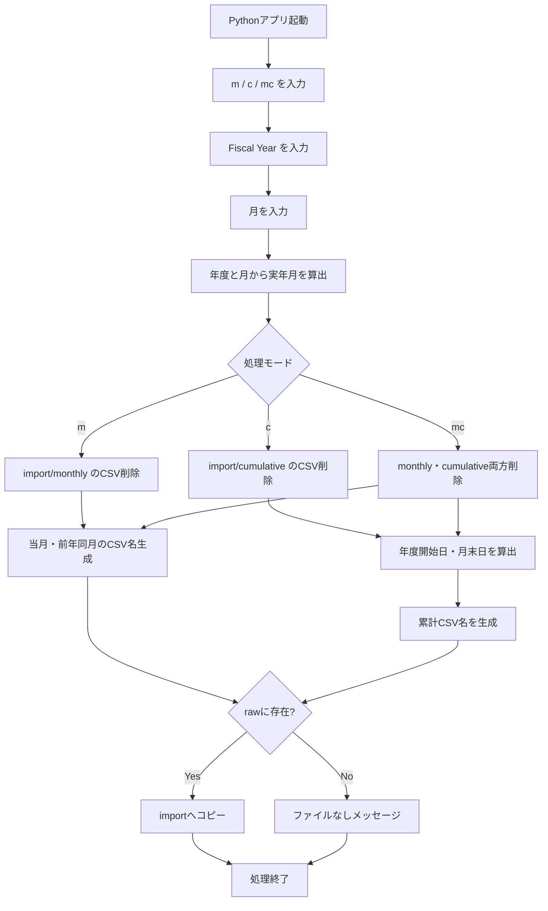

以下に、今回のチャット全体を「仕入分析用Python CLIアプリの要件整理・設計経緯」として再構成します。


## 1. 目的

仕入分析業務を効率化するため、コマンドラインから対象年度・月を指定し、分析に必要なCSVファイルを自動的に `raw` フォルダから `import` フォルダへコピーするPythonアプリを作成する。

主な目的は以下。

- 分析前に `import` フォルダ内の古いCSVを削除する
- 指定した月次データを自動取得する
- 指定した年度の累計データを自動取得する
- 比較分析用として前年データも取得する
- ファイルが存在しない場合は、その旨を表示する
- 11月始まりの「年度」に対応する

---

## 2. `purchase` / `purchases` の命名方針

最初に、`purchase` を単数形にするか `purchases` と複数形にするかを検討した。

### フォルダ名

分析という概念・機能を表すため、以下の単数形を採用する方向となった。

```text
purchase_analysis
```

`purchase_analysis` は「仕入分析」という処理・分析領域そのものを表しているため、単数形で問題ない。

### CSVファイル名

一方、CSVには複数の仕入取引・仕入レコードが含まれるため、データセット名は複数形の `purchases` が適切と判断した。

現在の命名規則：

```text
purchases_202410.csv
purchases_20231101-20241031.csv
```

したがって、基本方針は以下。

|対象|命名|
|---|---|
|分析フォルダ|`purchase_analysis`|
|月次CSV|`purchases_YYYYMM.csv`|
|累計CSV|`purchases_YYYYMMDD-YYYYMMDD.csv`|

---

## 3. ルートフォルダとディレクトリ構成

仕入分析のルートフォルダとして、以下を使用する。

```text
C:\Users\kyoupatty029\projects\kpm\analysis_inspection\cost_management\purchase_analysis
```

想定構成：

```text
purchase_analysis/
├─ raw/
│  ├─ monthly/
│  │  ├─ purchases_202410.csv
│  │  ├─ purchases_202409.csv
│  │  ├─ purchases_202408.csv
│  │  └─ ...
│  └─ cumulative/
│     ├─ purchases_20231101-20241031.csv
│     ├─ purchases_20231101-20240930.csv
│     ├─ purchases_20231101-20240831.csv
│     └─ ...
└─ import/
   ├─ monthly/
   └─ cumulative/
```

途中の記述では `comulative` というスペルも出ていたが、正しい英単語は以下。

```text
cumulative
```

そのため、実際のフォルダ名も `cumulative` に統一するのが望ましい。

---

## 4. CLIで指定する処理

起動後、最初に処理モードを入力する。

```text
Enter command (m, c, mc):
```

コマンドの意味：

|コマンド|意味|処理対象|
|---|---|---|
|`m`|monthly|月次データ|
|`c`|cumulative|累計データ|
|`mc`|monthly + cumulative|月次・累計両方|

続いて年度と月を入力する。

```text
Enter fiscal year (e.g., 2024):
Enter month (e.g., 12):
```

重要なのは、ここで入力する `year` は暦年ではなく**年度（Fiscal Year）**であること。

---

## 5. 年度の定義

年度は**11月始まり**。

例えば2024年度は次の期間となる。

```text
2023年11月1日 ～ 2024年10月31日
```

年度と実際の年月の対応：

|2024年度の入力月|実際の年月|
|--:|---|
|11|2023年11月|
|12|2023年12月|
|1|2024年1月|
|2|2024年2月|
|…|…|
|10|2024年10月|

したがって、年度から暦年を求める基本ルールは以下。

```text
11月・12月 → fiscal_year - 1
1月～10月 → fiscal_year
```

例えば：

```text
FY2024 + 12月 → 2023年12月
FY2024 + 2月  → 2024年2月
FY2024 + 10月 → 2024年10月
```

この年度変換は、今回のプログラムで最も重要なロジックの一つとなった。

---

## 6. 月次データの仕様

月次データは以下の形式。

```text
purchases_YYYYMM.csv
```

例：

```text
purchases_202410.csv
purchases_202409.csv
purchases_202408.csv
purchases_202407.csv
```

### 比較対象

指定した年度・月のデータだけではなく、**前年同月のデータも取得する**。

例えば：

```text
Fiscal Year: 2024
Month: 10
```

の場合、

```text
purchases_202410.csv
purchases_202310.csv
```

を対象とする。

FY2024・12月の場合は実際には2023年12月なので、

```text
purchases_202312.csv
purchases_202212.csv
```

となる。

---

## 7. 累計データの仕様

累計CSVは以下の形式。

```text
purchases_開始日-終了日.csv
```

例：

```text
purchases_20231101-20241031.csv
purchases_20231101-20240930.csv
purchases_20231101-20240831.csv
purchases_20231101-20240731.csv
```

### 開始日

累計期間は必ず、その年度の開始日である前年11月1日から始まる。

計算式：

```text
年度開始日 = (Fiscal Year - 1)年11月1日
```

例：

|年度|開始日|
|--:|--:|
|2024年度|20231101|
|2023年度|20221101|
|2022年度|20211101|

これは固定の `20231101` ではなく、入力年度によって動的に変える必要がある。

---

## 8. 累計データの終了日

終了日は、入力した年度・月を実際の暦年月へ変換したうえで、その月の月末日とする。

月末日は `calendar.monthrange()` を使用して計算する方針となった。

例：

```text
2024年2月 → 29日
2023年2月 → 28日
2024年4月 → 30日
2024年10月 → 31日
```

したがって、ファイル名の末尾を `31` に固定してはいけない。

---

## 9. 重要な年度計算例：2024年度12月

チャット途中で最も重要な修正点となった例。

入力：

```text
Enter command (m, c, mc): c
Enter fiscal year (e.g., 2024): 2024
Enter month (e.g., 12): 12
```

2024年度は2023年11月開始である。

したがって、「2024年度12月」とは**2024年12月ではなく2023年12月**を意味する。

正しい累計期間：

```text
2023年11月1日 ～ 2023年12月31日
```

したがって、対象ファイルは：

```text
purchases_20231101-20231231.csv
```

前年との比較も行う場合：

```text
purchases_20221101-20221231.csv
```

となる。

さらにその前年まで必要とする場合：

```text
purchases_20211101-20211231.csv
```

となる。

---

## 10. 年度・月から実年月への変換で発生した誤り

途中で提示されたコードには、年度→暦年変換が逆になっているものがあった。

誤っていた考え方：

```python
if fiscal_month >= 11:
    actual_year = fiscal_year
else:
    actual_year = fiscal_year - 1
```

これでは、

```text
FY2024 + 12月 → 2024年12月
```

となってしまう。

しかし正しくは：

```text
FY2024 + 12月 → 2023年12月
```

である。

11月開始・翌年10月終了の年度なら、正しい考え方は以下。

```python
if fiscal_month >= 11:
    actual_year = fiscal_year - 1
else:
    actual_year = fiscal_year
```

つまり：

```text
11～12月 → 年度-1
1～10月 → 年度
```

ここは最終実装時に必ず確認する必要がある。

---

## 11. 前年度データの考え方

比較分析のため、入力された年度だけでなく、その1年前の年度についても同じ「年度内月」までのデータを取得する。

例：

```text
FY2024 / 12月
```

現在年度：

```text
2023/11/01 ～ 2023/12/31
```

前年度：

```text
2022/11/01 ～ 2022/12/31
```

対応するファイル：

```text
purchases_20231101-20231231.csv
purchases_20221101-20221231.csv
```

チャット途中ではさらにその1年前、

```text
purchases_20211101-20211231.csv
```

まで取得するコードも提示された。

ただし、元々の要件は「入力された年月の1年前のデータも一緒に取得する」であるため、最終仕様として**2年度分なのか3年度分なのかは整理しておく必要がある**。

現在までの会話上では、累計処理については次の3期間が提示されている。

```text
対象年度
前年度
さらにその前年度
```

一方、月次については基本的に、

```text
対象月
前年同月
```

の2ファイルが要件となっている。

---

## 12. `import` フォルダのクリア処理

処理を始める前に、対象となる `import` サブフォルダ内のCSVをすべて削除する。

例：

```python
def clear_folder(folder_path):
    for file_name in os.listdir(folder_path):
        if file_name.endswith(".csv"):
            os.remove(os.path.join(folder_path, file_name))
```

処理モードによる削除対象：

|コマンド|削除対象|
|---|---|
|`m`|`import/monthly`|
|`c`|`import/cumulative`|
|`mc`|両方|

CSV以外のファイルは削除対象外とする設計。

---

## 13. rawからimportへのコピー

`raw` 側に対象ファイルが存在する場合、

```python
shutil.copy2()
```

を使って `import` フォルダへコピーする。

当初の説明では「移動」という表現を使っていたが、実装は `shutil.copy2()` のため、実際には**コピー**である。

つまり、

```text
raw → 元ファイルを維持
import → 分析対象ファイルをコピー
```

となる。

分析用rawデータを保存しておくという運用上も、コピーのほうが安全。

---

## 14. 対象ファイルが存在しない場合

対象CSVが `raw` フォルダに存在しない場合、エラー終了ではなくメッセージを表示する。

例：

```text
File purchases_20211101-20211231.csv not found in raw/cumulative folder.
```

処理としては、

```python
if os.path.exists(src_path):
    shutil.copy2(...)
else:
    print(...)
```

という構造。

---

## 15. 想定する全体フロー



---

## 16. これまで提示された主要関数

プログラムは概ね以下の役割ごとに分割する方向となっている。

|関数|役割|
|---|---|
|`clear_folder()`|importフォルダ内のCSV削除|
|`copy_file()`|raw→importへのCSVコピー|
|`get_last_day_of_month()`|指定年月の月末日取得|
|`calculate_fiscal_start_date()`|年度開始日（前年11/1）の生成|
|`calculate_actual_year_and_month()`|年度＋月→実年月の変換|
|`calculate_cumulative_file_name()`|累計CSVファイル名生成|
|`process_files()`|コマンドに応じた全体制御|

---

## 17. 最終的に確認すべき重要ポイント

今回、実際にプログラムを実行したところ年度計算が正しくない問題が発生した。

特に注意すべき点は以下。

- `Fiscal Year` は暦年ではない
- 11月・12月は `fiscal_year - 1`
- 1～10月は `fiscal_year`
- FY2024の開始日は `20231101`
- FY2022の開始日は `20211101`
- 累計終了日は入力した年度内月の実年月の月末
- 前年度ファイルも、開始日と終了日の両方を1年前にずらす
- 月末日を `31` に固定しない
- うるう年を考慮する
- `raw/cumulative` と `import/cumulative` のスペルを統一する
- 月次処理でも前年同月を忘れない

年度変換の期待値は少なくとも以下をテストする必要がある。

|入力|実年月|累計期間|
|---|---|---|
|FY2024 / 11|2023-11|20231101-20231130|
|FY2024 / 12|2023-12|20231101-20231231|
|FY2024 / 1|2024-01|20231101-20240131|
|FY2024 / 2|2024-02|20231101-20240229|
|FY2024 / 10|2024-10|20231101-20241031|
|FY2023 / 12|2022-12|20221101-20221231|
|FY2022 / 10|2022-10|20211101-20221031|

---

## 18. 現時点での仕様まとめ

最終的な基本仕様は次のように整理できる。

```text
入力
  ├─ command: m / c / mc
  ├─ fiscal_year
  └─ month

Fiscal Year
  └─ 11月開始、翌年10月終了

Monthly
  ├─ purchases_対象年月.csv
  └─ purchases_前年同月.csv

Cumulative
  ├─ purchases_対象年度開始日-対象月末.csv
  └─ purchases_前年度開始日-前年同月末.csv
      ※会話途中ではさらに1年度前も取得する仕様あり

実行前
  └─ 対象importフォルダ内のCSVを削除

rawに対象ファイルあり
  └─ importへコピー

rawに対象ファイルなし
  └─ 該当ファイルなしのメッセージを表示
```

### 代表例

入力：

```text
command = c
fiscal_year = 2024
month = 12
```

正しい対象：

```text
FY2024:
purchases_20231101-20231231.csv

FY2023:
purchases_20221101-20221231.csv
```

3年度分を扱う仕様なら追加：

```text
FY2022:
purchases_20211101-20211231.csv
```

今回の一連のやり取りで、最も重要な決定は「入力する年は暦年ではなく11月始まりのFiscal Yearである」という点であり、Python側ではこれを中心に日付計算を組み立てる必要がある。

特に最後に明確になったのは、**以前提示したコードには年度→実年月変換の向きが誤っている版が含まれていた**ことです。次にコードを確定する場合は、このまとめを仕様書として、まず期待値テストを固定してから実装するのが安全です。
