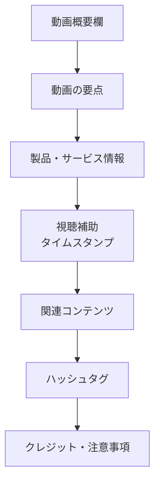

プログラム関連の命名検討と同じ元メモに混在していた、YouTubeのハッシュタグと概要欄デザインに関する記録です。プログラム系フォルダ内に適切な統合先がないため、内容を失わないよう分類保留として分離しました。

## 検討内容

### 3. YouTubeハッシュタグの数と表示仕様

その後、話題をYouTubeへ移し、ハッシュタグについて確認しました。

使用していた例は次の5つです。

```text
#最強パテ #型枠補修 #金属補修 #補修剤 #エポキシパテ
```

ここでは、

- ハッシュタグは5個程度入れればよいのか
- そのうち3個までが目立つ位置に表示されるのか
- 実際には「後ろ3つ」が表示されたように見えたが、それが仕様なのか

という点を検討しました。

一般的には、説明欄などに設定したハッシュタグの一部が動画ページ上部に表示される仕組みがあります。

当初の整理では、基本的には**先頭側のハッシュタグが優先される想定**としました。

つまり、

```text
#最強パテ #型枠補修 #金属補修 #補修剤 #エポキシパテ
```

であれば、意図としては、

```text
#最強パテ
#型枠補修
#金属補修
```

を優先表示させたい並びになります。

ただし、実際に後ろ側の3つが表示されたのであれば、YouTube側の表示ロジックやUI、タイトル側のハッシュタグ、仕様変更などの影響があり得る、という整理でした。

ここで重要なのは、**必ずしも「5つ入力したら任意の先頭3つが確実にそのまま表示される」と断言できる仕様として扱わない方がよい**という点です。

実運用では、最も重要なタグを前に置いておくのが安全です。

今回の候補で優先度をつけるなら、例えば、

```text
#最強パテ #型枠補修 #エポキシパテ #金属補修 #補修剤
```

のように、ブランド名・用途・製品カテゴリを前方に配置する考え方ができます。

### 4. YouTube概要欄のデザイン案

最後に、YouTube動画の概要欄そのものをどのように設計するかを検討しました。

提案した構成は、単なる説明文ではなく、視聴者が必要な情報へすぐ移動できるよう、概要欄をいくつかの情報ブロックに分ける方式です。

基本構成は以下です。

|順番|セクション|役割|
|--:|---|---|
|1|キャッチフレーズ|最初の数行で動画内容を伝える|
|2|動画内容|何が分かる動画なのか説明|
|3|使用製品・リンク|商品情報や購入先へ誘導|
|4|タイムスタンプ|長い動画の目次|
|5|ハッシュタグ|検索・分類用途|
|6|関連動画・SNS|他コンテンツへの導線|
|7|クレジット・注意事項|素材表記や免責事項|

概要欄全体の情報導線は次のような構造です。



### 5. 提案した概要欄の具体例

最強パテのような製品紹介・施工動画を想定し、次のようなデザインを提案しました。

#### 冒頭

最初の1〜2行では、長い説明をせず、動画を見るメリットを簡潔に示します。

例：

> プロの技術をあなたの手に。  
> 最強パテを使った型枠補修の方法を分かりやすく解説します。

YouTube概要欄は最初の数行しか最初から見えない場合があるため、ここには会社説明ではなく**動画の核心**を置く方が適しています。

#### 動画内容

動画で分かることを短く整理します。

```text
この動画では、
・型枠補修の基本
・使用する補修材
・施工手順
・作業時のポイント

について紹介します。
```

文章だけよりも、この程度の短い箇条書きの方が視認性を高められます。

#### 製品情報

製品紹介動画であれば、概要欄の重要な導線になります。

```text
【使用製品】
最強パテ
型枠・金属補修に使用できるエポキシ系補修材

製品詳細：
https://...
```

重要なのは、製品名だけで終わらず、

- 何の商品か
- 何に使えるのか
- 詳細を見る場所

をセットにすることです。

#### タイムスタンプ

動画が長い場合には目次を入れます。

```text
【目次】
00:00 オープニング
01:30 型枠補修について
05:45 使用する材料
10:15 補修作業
15:00 まとめ
```

特に施工動画・解説動画とは相性がよい構成です。

#### 関連情報

他の動画やWebサイトへの導線をまとめます。

```text
【関連情報】
公式サイト
https://...

関連動画
https://...
```

SNSを運用している場合は同じ場所にまとめてもよいですが、リンクが多すぎると概要欄が散漫になるため、必要なものだけに絞る考え方です。

#### ハッシュタグ

最後にハッシュタグをまとめます。

```text
#最強パテ #型枠補修 #エポキシパテ #金属補修 #補修剤
```

本文の途中に散らすより、末尾にまとめる方が概要欄として整って見えます。

## 統合元ファイル

- 「チャット全体まとめ：命名規則・YouTubeハッシュタグ・概要欄デザイン.md」
