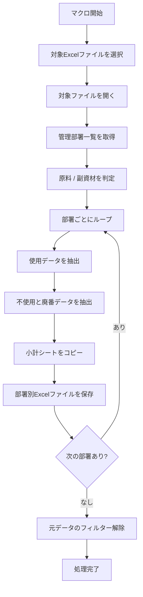
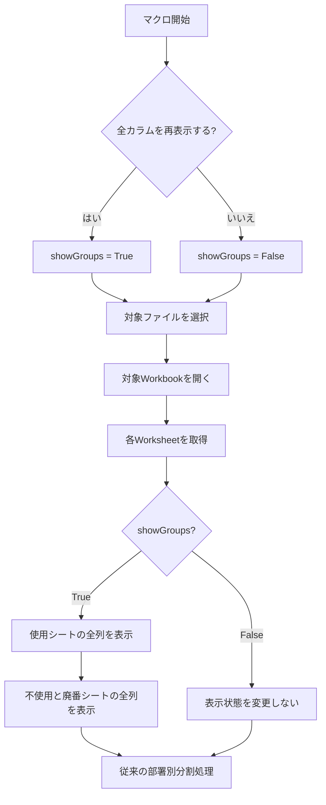

# CreateFilteredDepartmentFiles：部署別棚卸表の分割処理と「全カラム再表示」機能の追加まとめ

## 1. マクロの目的

対象となったVBAは `CreateFilteredDepartmentFiles`。

このマクロの役割は、**原料または副資材の棚卸データを「管理部署」単位に分割し、部署ごとのExcelファイルとして出力すること**。

大きな処理フローは次のとおり。



今回、この既存処理に対して、**コピー元で非表示になっている列をコピー前に再表示するか選択できる機能**を追加することになった。

---

## 2. 元の `CreateFilteredDepartmentFiles` の構成

### 入力ファイル

初期フォルダとして次を指定している。

```text
C:\Users\kyoupatty029\projects\kpm\dev\internal_systems\inventory_prep_macro\test_files
```

`Application.GetOpenFilename` によって、ユーザーが `.xlsx` ファイルを選択する。

キャンセルした場合は処理終了。

### 使用するシート

選択したExcelファイルから次の4シートを取得する。

|シート|用途|
|---|---|
|`管理部署`|分割対象となる部署一覧の取得|
|`使用`|使用中の棚卸データ|
|`不使用と廃番`|不使用・廃番データ|
|`小計`|部署別ファイルへコピーする小計シート|

対応するWorksheet変数は以下。

```vba
wsMngDept
wsSourceUsage
wsSourceUnused
wsSourceSubtotal
```

---

## 3. 管理部署一覧の取得

`管理部署` シートのC列から部署名を取得する。

```vba
Set rng = wsMngDept.Range("C2:C" & wsMngDept.Cells(wsMngDept.Rows.Count, "C").End(xlUp).Row)
```

その後、`Collection` を使って重複を除外する。

```vba
Set departmentList = New Collection

For Each cell In rng
    On Error Resume Next
    departmentList.Add cell.Value, CStr(cell.Value)
    On Error GoTo 0
Next cell
```

同じ部署名をキーとして再度Collectionへ追加するとエラーになる性質を利用し、`On Error Resume Next` で重複を無視している。

結果として、

```text
管理部署シート
    ↓
C列から部署名取得
    ↓
重複除去
    ↓
departmentList
```

という構造になる。

---

## 4. 「使用」「不使用と廃番」のデータ範囲取得

それぞれ `A1` を起点として `CurrentRegion` でデータ範囲を取得する。

```vba
Set sourceDataUsage = wsSourceUsage.Range("A1").CurrentRegion
Set sourceDataUnused = wsSourceUnused.Range("A1").CurrentRegion
```

さらに、各シートの1行目から `"管理部署"` というヘッダーを検索し、AutoFilterで使用する列番号を取得する。

```vba
colNumUsage = wsSourceUsage.Rows(1).Find( _
    What:="管理部署", _
    LookIn:=xlValues, _
    LookAt:=xlWhole _
).Column

colNumUnused = wsSourceUnused.Rows(1).Find( _
    What:="管理部署", _
    LookIn:=xlValues, _
    LookAt:=xlWhole _
).Column
```

この列番号を後の部署別フィルタリングに使用する。

---

## 5. 原料・副資材の判定

選択されたブックの**ファイル名**によって種類を判定する。

```vba
If InStr(selectedWorkbook.Name, "原料") > 0 Then
    fileType = "原料"
ElseIf InStr(selectedWorkbook.Name, "副資材") > 0 Then
    fileType = "副資材"
Else
    MsgBox "選択されたファイル名に「原料」または「副資材」が含まれていません。", vbCritical
    Exit Sub
End If
```

つまりファイル名には、

- `原料`
- `副資材`

のどちらかが含まれている必要がある。

この `fileType` は後で、

- テーブル名
- 出力ファイル名

の生成に利用する。

---

## 6. 部署ごとのExcelファイル作成

`departmentList` に登録された部署について順番に処理する。

```vba
For Each departmentName In departmentList
```

部署ごとに新規Workbookを作成し、

```text
小計
使用
不使用と廃番
```

の3シートを用意する。

```vba
Set newWorkbook = Workbooks.Add

With newWorkbook
    .Sheets(1).Name = "小計"
    .Sheets.Add(After:=.Sheets("小計")).Name = "使用"
    .Sheets.Add(After:=.Sheets("使用")).Name = "不使用と廃番"
End With
```

---

## 7. 「使用」データの部署別抽出

コピー元の「使用」シートを、現在処理している部署名でフィルタリングする。

```vba
sourceDataUsage.AutoFilter _
    Field:=colNumUsage, _
    Criteria1:=departmentName
```

表示されているセルだけを新規Workbookへコピーする。

```vba
sourceDataUsage.SpecialCells(xlCellTypeVisible).Copy _
    Destination:=newWorkbook.Sheets("使用").Range("A1")
```

その後、コピーされたデータをExcelテーブル化する。

```vba
With newWorkbook.Sheets("使用")
    .ListObjects.Add( _
        xlSrcRange, _
        .Range("A1").CurrentRegion, _
        , _
        xlYes _
    ).Name = "棚卸表_" & fileType & "_使用"
End With
```

したがってテーブル名は、例えば、

```text
棚卸表_原料_使用
棚卸表_副資材_使用
```

となる。

---

## 8. 「不使用と廃番」データの部署別抽出

基本構造は「使用」と同じ。

```vba
sourceDataUnused.AutoFilter _
    Field:=colNumUnused, _
    Criteria1:=departmentName
```

可視セルだけをコピー。

```vba
sourceDataUnused.SpecialCells(xlCellTypeVisible).Copy _
    Destination:=newWorkbook.Sheets("不使用と廃番").Range("A1")
```

コピー後にテーブル化する。

テーブル名は、

```text
棚卸表_原料_不使用と廃番
```

または

```text
棚卸表_副資材_不使用と廃番
```

となる。

---

## 9. 「小計」シートのコピー

「小計」については部署別フィルタリングを行わず、元シート全体をコピーする。

```vba
wsSourceSubtotal.Cells.Copy _
    Destination:=newWorkbook.Sheets("小計").Cells
```

最終的な部署別ファイルは次の構成になる。

|シート|内容|
|---|---|
|小計|コピー元の小計シート|
|使用|該当部署のみ|
|不使用と廃番|該当部署のみ|

---

## 10. ファイル保存

保存先は、

```vba
ThisWorkbook.Path
```

つまり、**このVBAマクロが格納されているWorkbookと同じフォルダ**。

ファイル名は、

```vba
fileType & "_" & departmentName & ".xlsx"
```

となる。

例えば、

```text
原料_製造部.xlsx
原料_研究部.xlsx
副資材_製造部.xlsx
副資材_品質管理部.xlsx
```

のような形式になる。

保存後、その部署のWorkbookを閉じて次の部署へ進む。

---

# 11. 今回追加した要件

今回、新たに次の仕様を追加することになった。

> 「使用」と「不使用と廃番」シートをコピーするとき、コピー元でグループ化されている列を再表示してからコピーするか選択したい。

具体的な要件は2点。

1. **コピー元ファイルを選択・読み込む前に、全カラムを再表示するか確認する**
2. **「はい」を選択した場合、ファイル読み込み後に「使用」「不使用と廃番」の全カラムを表示状態にする**

処理順としては次のようになった。



---

## 12. 確認ダイアログの追加

新しく次の変数を追加した。

```vba
Dim userResponse As Integer
Dim showGroups As Boolean
```

ファイル選択ダイアログより前に次を実行する。

```vba
userResponse = MsgBox( _
    "コピー元のグループ化を再表示しますか？", _
    vbYesNo + vbQuestion, _
    "グループ化の解除" _
)

showGroups = (userResponse = vbYes)
```

ユーザーの選択結果は次のように保持される。

|選択|`showGroups`|
|---|--:|
|はい|`True`|
|いいえ|`False`|

これにより、ファイルをまだ開いていない段階で動作方針を決定できる。

---

## 13. ファイル読み込み後の全カラム再表示

対象Workbookを開き、

```vba
Set wsSourceUsage = selectedWorkbook.Sheets("使用")
Set wsSourceUnused = selectedWorkbook.Sheets("不使用と廃番")
```

まで完了した後、次の処理を追加した。

```vba
If showGroups Then
    wsSourceUsage.Cells.EntireColumn.Hidden = False
    wsSourceUnused.Cells.EntireColumn.Hidden = False
End If
```

したがって、「はい」を選択すると、

```text
使用
├─ 表示列
├─ 非表示列 → 表示
└─ 非表示列 → 表示

不使用と廃番
├─ 表示列
├─ 非表示列 → 表示
└─ 非表示列 → 表示
```

となってから、その後のコピー処理へ進む。

「いいえ」なら、この処理自体をスキップする。

---

## 14. 今回の変更で維持されているもの

今回の修正は、既存の部署別分割ロジック自体には手を加えていない。

|処理|変更|
|---|---|
|対象ファイル選択|基本変更なし|
|管理部署一覧取得|変更なし|
|原料／副資材判定|変更なし|
|部署別AutoFilter|変更なし|
|使用データコピー|変更なし|
|不使用と廃番データコピー|変更なし|
|小計コピー|変更なし|
|Excelテーブル化|変更なし|
|ファイル名生成|変更なし|
|保存先|変更なし|
|**コピー前の列表示状態**|**今回追加**|

つまり、今回の変更は既存処理の前段に、

```text
「全列を表示するか？」
        ↓
     はい / いいえ
        ↓
必要なら全列を表示
        ↓
従来処理
```

というオプションを追加したもの。

---

## 15. 技術的に注意すべき点

今回の実装について、一点だけ整理しておく必要がある。

ユーザーの要望では「**グループ化されているのを再表示**」となっているが、実際に追加したコードは、

```vba
wsSourceUsage.Cells.EntireColumn.Hidden = False
wsSourceUnused.Cells.EntireColumn.Hidden = False
```

である。

これは厳密には**アウトライン（グループ）の展開だけを行っているのではなく、非表示列をすべて表示する処理**。

したがって、

- グループ化によって折りたたまれている列
- ユーザーが手動で非表示にした列

を区別せず、両方とも表示する。

今回の要求にある「**全カラムを再表示した状態にする**」という最終状態には合致するが、「グループだけを展開し、手動非表示列はそのまま」という意味であれば別実装が必要になる。

また、現在のコードではコピー元Workbookそのものの列表示状態を変更する。そのWorkbookを明示的に保存してはいないため通常は元ファイルへ保存されないが、**コピー処理だけの一時的な表示制御に限定したいのであれば、処理終了時に元の表示状態へ戻す設計も検討余地がある**。

---

## 16. 現時点の仕様

最終的な `CreateFilteredDepartmentFiles` の役割は次のように整理できる。

> 原料／副資材の統合済み棚卸表を読み込み、「管理部署」シートに登録された部署単位で「使用」「不使用と廃番」をフィルタリングし、「小計」と合わせて部署別Excelファイルを生成する。処理開始時には、「使用」「不使用と廃番」の非表示列をすべて表示してから分割処理を行うかをユーザーが選択できる。

今回決定した追加仕様は、**対象ファイル選択前に確認 → 「はい」なら対象Workbookを開いた直後に「使用」「不使用と廃番」の全列を表示 → 従来の部署別分割処理を実行**、という流れである。