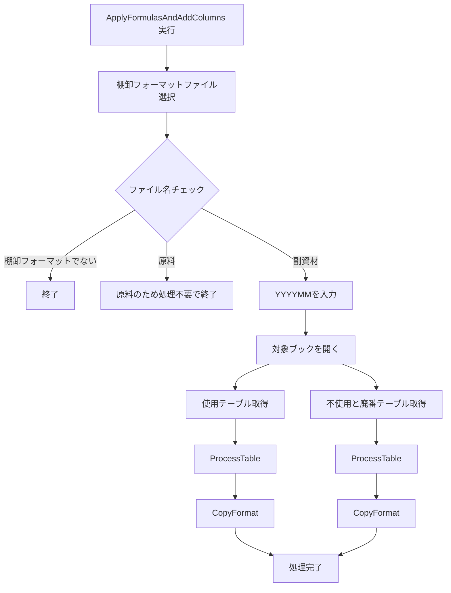
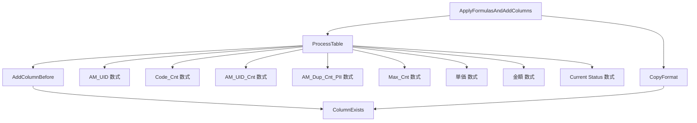

# VBA「ApplyFormulasAndAddColumns」修正・確認の整理

このチャットでは、在庫管理用VBA `ApplyFormulasAndAddColumns` をもとに、既存処理を維持しながら「新しく追加した年月列へ、右隣列の書式をコピーする処理」を追加・修正しました。途中でコード全体の保持に失敗し、`ProcessTable` など既存処理を省略してしまった点も重要な経緯です。

## 1. 元になったVBAの目的と構成

最初に提示されたコードは、在庫管理用Excelファイルのうち「副資材」の棚卸フォーマットを対象に、入力した年月 `yyyyMM` に対応する列を追加し、各種計算式を設定するマクロです。

中心となる処理は以下です。



対象テーブルは2つあります。

|区分|シート名|テーブル名|
|---|---|---|
|使用|`使用`|`棚卸表_副資材_使用`|
|不使用・廃番|`不使用と廃番`|`棚卸表_副資材_不使用と廃番`|

## 2. 元コードに含まれていた主要処理

### `ApplyFormulasAndAddColumns`

メインプロシージャです。

処理内容は以下でした。

- ファイル選択ダイアログを開く
- 初期フォルダとして以下を指定
    ```text
    C:\Users\kyoupatty029\projects\kpm\dev\internal_systems\inventory_prep_macro\
    ```
- 選択ファイル名に `棚卸フォーマット` が含まれるか確認
- `原料` ファイルの場合は処理不要として終了
- `副資材` でない場合も終了
- `YYYYMM` をInputBoxで入力
- 選択ブックを開く
- `使用` と `不使用と廃番` の両テーブルに対して処理
- 最後に完了メッセージを表示

元々は各テーブルに対して以下だけを実行していました。

```vba
Call ProcessTable(tblUsage, yyyyMM)
```

および

```vba
Call ProcessTable(tblUnused, yyyyMM)
```

今回、この直後に新しい書式コピー処理を追加することになりました。

---

### `ProcessTable`

各棚卸テーブルに対する実処理を担当する共通サブルーチンです。

まず、入力された `yyyyMM` から4か月前を計算します。

```vba
fourMonthsAgo = Format( _
    DateAdd("m", -4, _
    DateValue(Left(yyyyMM, 4) & "/" & Right(yyyyMM, 2) & "/01")), _
    "YYYYMM")
```

例：

```text
yyyyMM = 202609
→ fourMonthsAgo = 202605
```

その後、次の3列を追加します。

```text
数量_yyyyMM
単価_yyyyMM
金額_yyyyMM
```

それぞれ4か月前の対応列の直前へ挿入します。

たとえば、

```text
数量_202605
```

が存在する場合、

```text
数量_202609
数量_202605
```

という並びになります。

列追加は `AddColumnBefore` に委譲されています。

---

### `ProcessTable` 内で設定する計算式

元コードでは以下の列に数式を設定していました。

|列|内容|
|---|---|
|`AM_UID`|コードと発注先を `_` で連結|
|`Code_Cnt`|同一コード数|
|`AM_UID_Cnt`|同一AM_UID数|
|`AM_Dup_Cnt_PII`|PII側のAM_UID重複数|
|`Max_Cnt`|重複関連カウントの最大値|
|`単価_yyyyMM`|`PurchaseItemInformation` から単価取得|
|`金額_yyyyMM`|数量 × 単価|
|`Current Status`|PIIからStatus取得|

数式の内容は以下でした。

#### AM_UID

```vba
=TEXTJOIN("_", FALSE, [@コード],[@発注先])
```

#### Code_Cnt

```vba
=COUNTIF([コード],[@コード])
```

#### AM_UID_Cnt

```vba
=COUNTIF([AM_UID],[@[AM_UID]])
```

#### AM_Dup_Cnt_PII

```vba
=COUNTIF(PII!PurchaseItemInformation[AM_UID], [@[AM_UID]])
```

#### Max_Cnt

```vba
=MAX(棚卸表_副資材_使用[@[Code_Cnt]:[AM_Dup_Cnt_PII]])
```

#### 単価

```vba
=INDEX(
    INDIRECT("PII!PurchaseItemInformation"),
    MATCH(
        [@[AM_UID]],
        INDIRECT("PII!PurchaseItemInformation[AM_UID]"),
        0
    ),
    MATCH(
        "単価",
        INDIRECT("PII!PurchaseItemInformation[#見出し]"),
        0
    )
)
```

#### 金額

```vba
=[@[数量_yyyyMM]] * [@[単価_yyyyMM]]
```

#### Current Status

```vba
=INDEX(
    INDIRECT("PII!PurchaseItemInformation"),
    MATCH(
        [@[AM_UID]],
        INDIRECT("PII!PurchaseItemInformation[AM_UID]"),
        0
    ),
    MATCH(
        "Status",
        INDIRECT("PII!PurchaseItemInformation[#見出し]"),
        0
    )
)
```

---

### `AddColumnBefore`

指定した4か月前の列が存在する場合、その直前に新しい年月列を追加する処理です。

概念的には以下です。


同じ処理を、

```text
数量_
単価_
金額_
```

について実施します。

---

### `ColumnExists`

テーブル内に指定した名前の列が存在するか確認する共通関数です。

```vba
Function ColumnExists(tbl As ListObject, colName As String) As Boolean
```

すべての `ListColumns` を走査し、一致する列があれば `True` を返します。

## 3. 今回追加したかった処理

ユーザーから追加要件として指定されたのは、新しく作成した以下3列の**書式変更**でした。

```text
数量_yyyyMM
単価_yyyyMM
金額_yyyyMM
```

重要なのは、値や数式ではなく**フォーマットのみ**をコピーすることです。

さらに、コピー元について途中で明確化されました。

当初こちらは「左隣の列」と誤認しましたが、正しくは、

> 対象列の1つ右にある列のフォーマットをコピーする

という仕様です。

つまり、列追加後の構成が以下の場合、

```text
数量_202609 | 数量_202605
```

`数量_202609` の書式は `数量_202605` から取得します。

これは `AddColumnBefore` が4か月前の列の左側へ新列を挿入する仕様と整合しています。

## 4. `CopyFormat` の追加

この処理を共通化するため、

```vba
Sub CopyFormat(tbl As ListObject, yyyyMM As String)
```

を追加しました。

メイン処理では以下のように呼び出します。

```vba
Call ProcessTable(tblUsage, yyyyMM)
Call CopyFormat(tblUsage, yyyyMM)
```

および、

```vba
Call ProcessTable(tblUnused, yyyyMM)
Call CopyFormat(tblUnused, yyyyMM)
```

処理順は重要です。


`CopyFormat` を先に実行すると対象列自体がまだ存在しない可能性があるため、必ず `ProcessTable` の後です。

## 5. `CopyFormat` で発生したエラー

最初の実装では、

```vba
Dim colName As String
```

としていました。

一方、対象列の種類は、

```vba
targetCols = Array("数量_", "単価_", "金額_")
```

という `Variant` 配列です。

そして、

```vba
For Each colName In targetCols
```

と書いたことで、VBAから以下の趣旨のコンパイルエラーが出ました。

> For Each に指定する変数は Variant 型または Object 型でなければならない

これを修正するため、

```vba
Dim colName As Variant
```

に変更しました。

修正後は問題なく動作したことが確認されています。

## 6. 確定した `CopyFormat` の考え方

最終的なロジックは以下です。

```vba
targetCols = Array("数量_", "単価_", "金額_")
```

各要素について、

```text
数量_ + yyyyMM
単価_ + yyyyMM
金額_ + yyyyMM
```

を対象にします。

対象列が存在する場合、

```vba
Set col = tbl.ListColumns(colName & yyyyMM)
```

で取得します。

さらに右側に列が存在することを確認します。

```vba
If col.Index < tbl.ListColumns.Count Then
```

そのうえで、

```vba
Set srcCell = col.Range.Offset(0, 1).Resize(1, 1)
Set destCell = col.Range.Resize(1, 1)
```

とし、右隣をコピー元、対象列をコピー先にします。

書式のみコピーするため、

```vba
srcCell.Copy
destCell.PasteSpecial Paste:=xlPasteFormats
```

を使用します。

最後にコピー状態を解除します。

```vba
Application.CutCopyMode = False
```

## 7. このチャットで発生したコード管理上の問題

途中でユーザーから「コードを全部書いて」と依頼された際、こちらがコード全体を正しく維持できませんでした。

特に問題だったのは、もともと存在していた以下の処理を欠落させたことです。

```text
ProcessTable
AddColumnBefore
ProcessTable内の各種数式処理
```

途中の提示コードでは、

```vba
Call ProcessTable(tblUsage, yyyyMM)
```

と呼び出しているにもかかわらず、

```vba
Sub ProcessTable(...)
```

本体が含まれていない状態になりました。

そのためユーザーから、

> ProcessTableとかその他のことを行ってます。

と指摘されています。

これは今回の重要な教訓です。

今回必要だったのは既存コードを作り替えることではなく、

> **最初に提示された完全なコードを維持したまま、`CopyFormat` の追加と呼び出しだけを加えること**

でした。

## 8. 現時点で確定している仕様

今回のやり取りから確定した内容を整理すると以下です。

|項目|確定内容|
|---|---|
|対象ファイル|副資材の棚卸フォーマット|
|対象テーブル|使用／不使用と廃番の2テーブル|
|入力|`yyyyMM`|
|新規列|`数量_yyyyMM`、`単価_yyyyMM`、`金額_yyyyMM`|
|新規列の位置|対応する4か月前の列の左|
|数式設定|従来どおり `ProcessTable` で実行|
|書式コピー|`ProcessTable` の直後|
|コピー先|新規作成した3列|
|コピー元|各対象列の**1列右**|
|コピー内容|値・数式ではなく書式のみ|
|共通処理名|`CopyFormat`|
|`For Each`変数|`Variant`|
|対象|`tblUsage` と `tblUnused` の両方|
|動作確認|修正版 `CopyFormat` は正常動作確認済み|

## 9. 本来あるべき完成形の構造

コード全体としては、以下の5つを同一モジュール内に保持する必要があります。

```text
ApplyFormulasAndAddColumns
├─ ProcessTable
│  ├─ AddColumnBefore
│  └─ 各種数式設定
├─ CopyFormat
├─ AddColumnBefore
└─ ColumnExists
```

Mermaidで表すと以下です。



## 10. このチャットで最終的に達成できたこと

今回、実際に確認できた成果は次のとおりです。

- 既存の `ProcessTable` 後に書式コピー処理を追加する方針を決定
- `使用` と `不使用と廃番` の両テーブルへ適用
- 対象を
    - `数量_yyyyMM`
    - `単価_yyyyMM`
    - `金額_yyyyMM`  
        に限定
- コピー元を「対象列の右隣」と確定
- 書式だけを `xlPasteFormats` でコピー
- `For Each` の型エラーを `Variant` 化で修正
- 修正版が実際に問題なく動くことを確認

一方で、**コード全体の再掲時には元コードを省略してしまったため、完全版コードの再構成はまだ未完了**です。次に完全版を作る場合は、最初に提示されたVBAを基準として、`CopyFormat` だけを追加した形で再構成するのが正しい状態です。