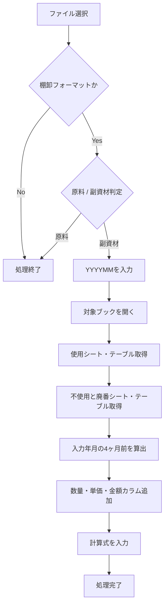
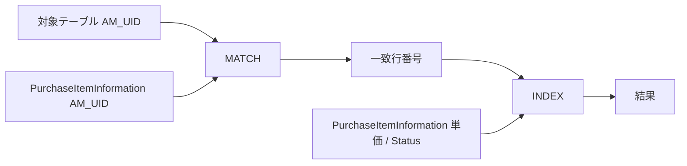
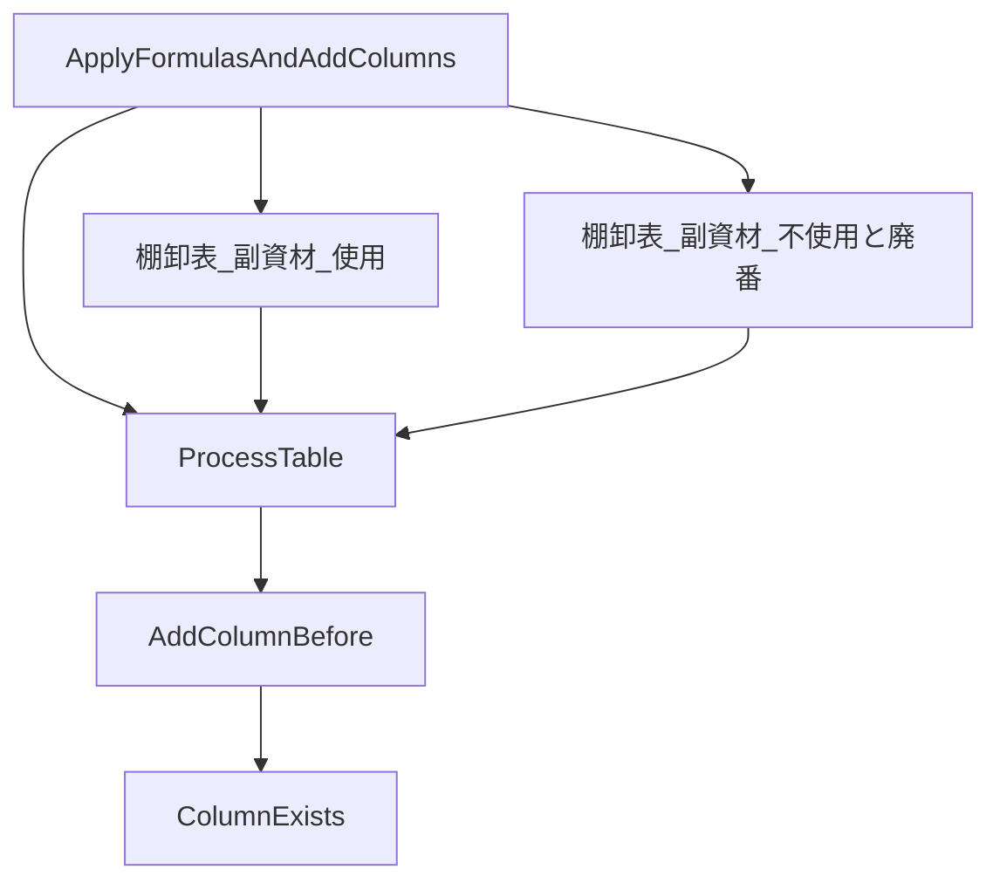

# VBA「ApplyFormulasAndAddColumns」開発・修正経緯まとめ

このチャットでは、棚卸フォーマットのExcelブックに対して、対象年月の「数量・単価・金額」カラムを追加し、既存カラムへ計算式を入力するVBAマクロ `ApplyFormulasAndAddColumns` を段階的に作成・修正しました。

最終的な対象は主に「副資材」ファイルで、同一ブック内の2つのテーブルに対して同様の処理を実行する構成です。

|シート|テーブル|
|---|---|
|使用|`棚卸表_副資材_使用`|
|不使用と廃番|`棚卸表_副資材_不使用と廃番`|

## 1. マクロ全体の目的

マクロの処理フローは最終的に次の形に整理されました。



ファイル選択ダイアログは、デバッグしやすいように次のフォルダから開始する仕様になりました。

```text
C:\Users\kyoupatty029\projects\kpm\dev\internal_systems\inventory_prep_macro\
```

サブプロシージャ名は途中で `InventoryManagement` から以下へ変更しました。

```vba
Sub ApplyFormulasAndAddColumns()
```

## 2. YYYYMMと4ヶ月前の年月

年月入力形式について、当初コメントや変数名に `YYMMMM` という誤表記がありましたが、正しくは `YYYYMM` です。

入力例：

|入力値|意味|4ヶ月前|
|--:|---|--:|
|`202502`|2025年2月|`202410`|
|`202410`|2024年10月|`202406`|
|`202406`|2024年6月|`202402`|
|`202506`|2025年6月|`202502`|

4ヶ月前の年月は `DateAdd` で求める構成になりました。

```vba
fourMonthsAgo = Format( _
    DateAdd( _
        "m", _
        -4, _
        DateValue(Left(yyyyMM, 4) & "/" & Right(yyyyMM, 2) & "/01") _
    ), _
    "YYYYMM" _
)
```

たとえば `yyyyMM = "202502"` の場合、

```text
fourMonthsAgo = "202410"
```

になります。

## 3. カラム追加ルール

年月が付くのは次の3カラムだけです。

|種類|新規カラム例|基準となる既存カラム|
|---|---|---|
|数量|`数量_202502`|`数量_202410`|
|単価|`単価_202502`|`単価_202410`|
|金額|`金額_202502`|`金額_202410`|

処理ルールは明確に次のように決まりました。

```text
数量_202410
    ↓ 左側に追加
数量_202502 | 数量_202410
```

同じように、

```text
単価_202502 | 単価_202410
金額_202502 | 金額_202410
```

となります。

この処理を共通化するため、`AddColumnBefore` サブルーチンを用意しました。

```vba
AddColumnBefore tbl, "数量_", yyyyMM, fourMonthsAgo
AddColumnBefore tbl, "単価_", yyyyMM, fourMonthsAgo
AddColumnBefore tbl, "金額_", yyyyMM, fourMonthsAgo
```

### AddColumnBefore の役割

`AddColumnBefore tbl, "数量_", yyyyMM, fourMonthsAgo`

を例にすると、次の処理を行います。

1. `数量_202410` が存在するか確認する。
2. `数量_202502` がすでに存在していないか確認する。
3. `数量_202410` の位置を取得する。
4. その位置へ新しいテーブルカラムを挿入する。
5. 新規カラム名を `数量_202502` に変更する。

## 4. 既存カラムチェック

開発中に何度か抜けてしまったため、最終的に重要な共通関数として維持することになったのが `ColumnExists` です。

```vba
Function ColumnExists(tbl As ListObject, colName As String) As Boolean
    Dim col As ListColumn

    ColumnExists = False

    For Each col In tbl.ListColumns
        If col.Name = colName Then
            ColumnExists = True
            Exit Function
        End If
    Next col
End Function
```

用途は2つあります。

まず、基準となる4ヶ月前のカラムが存在するか確認します。

```vba
If Not ColumnExists(tbl, baseName & fourMonthsAgo) Then Exit Sub
```

次に、新規カラムがすでに存在していないか確認します。

```vba
If Not ColumnExists(tbl, baseName & yyyyMM) Then
```

このチェックによって、マクロを複数回実行しても、

```text
数量_202502
数量_202502
```

のような重複追加を防げます。

## 5. カラム書式・色コピーについて

途中では、新しく追加したカラムへ右隣のカラムの書式をコピーする処理を何度か試しました。

試した対象は、

- `NumberFormat`
- `Interior.Color`
- `Font.Color`
- `Font.Bold`
- `Font.Size`
- `HorizontalAlignment`
- `VerticalAlignment`

などです。

しかし、実際には新規カラムが黒くなる問題が発生しました。

特に、

```vba
newCol.Range.Interior.Color = rightCol.Range.Interior.Color
```

などの処理を追加すると、「使用」シート・「不使用と廃番」シートともに追加カラムが真っ黒になるケースが発生しました。

そのため、最終的には方針を変更し、

> VBAから書式・色・デザインを操作する処理はすべて削除する

ことになりました。

現在の `AddColumnBefore` は、列追加と名前変更だけを担当する設計です。

```vba
Sub AddColumnBefore( _
    tbl As ListObject, _
    baseName As String, _
    yyyyMM As String, _
    fourMonthsAgo As String _
)

    Dim col As ListColumn
    Dim newCol As ListColumn
    Dim colIndex As Integer

    If Not ColumnExists(tbl, baseName & fourMonthsAgo) Then Exit Sub

    For Each col In tbl.ListColumns
        If col.Name = baseName & fourMonthsAgo Then

            If Not ColumnExists(tbl, baseName & yyyyMM) Then
                colIndex = col.Index
                Set newCol = tbl.ListColumns.Add(Position:=colIndex)
                newCol.Name = baseName & yyyyMM
            End If

            Exit For
        End If
    Next col
End Sub
```

この変更後、少なくとも「新規カラムが黒くなる」問題は解消しました。

## 6. 「使用」と「不使用と廃番」の変数を分離

当初は次のように1組の変数を使い回していました。

```vba
Dim ws As Worksheet
Dim tbl As ListObject
```

しかし「使用」は処理されるのに「不使用と廃番」は正しく処理されない問題がありました。

そこで、シートとテーブルを明示的に分離しました。

```vba
Dim wsUsage As Worksheet
Dim tblUsage As ListObject

Dim wsUnused As Worksheet
Dim tblUnused As ListObject
```

参照も別々です。

```vba
Set wsUsage = ActiveWorkbook.Sheets("使用")
Set tblUsage = wsUsage.ListObjects("棚卸表_副資材_使用")
```

```vba
Set wsUnused = ActiveWorkbook.Sheets("不使用と廃番")
Set tblUnused = wsUnused.ListObjects("棚卸表_副資材_不使用と廃番")
```

途中では「不使用と廃盤」という誤記もありましたが、正しい名称は一貫して、

```text
不使用と廃番
```

です。

## 7. 既存カラムへ入力したい計算式

年月付きカラム以外にも、既存テーブルには次の計算式を入れたいという要件が追加されました。

|カラム|計算式|
|---|---|
|`AM_UID`|`=TEXTJOIN("_", FALSE, [@コード],[@発注先])`|
|`Code_Cnt`|`=COUNTIF([コード],[@コード])`|
|`AM_UID_Cnt`|`=COUNTIF([AM_UID],[@[AM_UID]])`|
|`AM_Dup_Cnt_PII`|`=COUNTIF(PurchaseItemInformation[AM_UID], [@[AM_UID]])`|
|`Max_Cnt`|`=MAX(棚卸表_副資材_使用[@[Code_Cnt]:[AM_Dup_Cnt_PII]])`|
|`Current Status`|PIIテーブルからStatusを取得|

重要なのは、これらは、

```text
AM_UID_202502
Code_Cnt_202502
```

のように年月を付けるカラムではありません。

年月が付くのはあくまで、

```text
数量_YYYYMM
単価_YYYYMM
金額_YYYYMM
```

だけです。

## 8. PIIテーブル参照

単価とCurrent Statusは、同一ブック内の以下を参照します。

```text
シート: PII
テーブル: PurchaseItemInformation
```

検索キーは、

```text
AM_UID
```

です。

取得対象は、

```text
単価
Status
```

です。

当初希望していたExcel数式は次の形でした。

### 単価

```excel
=INDEX(
    PurchaseItemInformation,
    MATCH(
        [@[AM_UID]],
        PurchaseItemInformation[AM_UID],
    ),
    MATCH(
        "単価",
        PurchaseItemInformation[#見出し],
    )
)
```

### Current Status

```excel
=INDEX(
    PurchaseItemInformation,
    MATCH(
        [@[AM_UID]],
        PurchaseItemInformation[AM_UID],
    ),
    MATCH(
        "Status",
        PurchaseItemInformation[#見出し],
    )
)
```

VBAでは完全一致にするため、第3引数に `0` を明示する形も試しました。

## 9. INDIRECT形式で発生した問題

途中で、PIIシートにあるテーブルを確実に参照しようとして、次の `INDIRECT` 形式へ変更しました。

### 単価

```excel
=INDEX(
    INDIRECT("PII!PurchaseItemInformation"),
    MATCH(
        [@[AM_UID]],
        INDIRECT("PII!PurchaseItemInformation[AM_UID]"),
        0
    ),
    MATCH(
        "単価",
        INDIRECT("PII!PurchaseItemInformation[#見出し]"),
        0
    )
)
```

### Current Status

```excel
=INDEX(
    INDIRECT("PII!PurchaseItemInformation"),
    MATCH(
        [@[AM_UID]],
        INDIRECT("PII!PurchaseItemInformation[AM_UID]"),
        0
    ),
    MATCH(
        "Status",
        INDIRECT("PII!PurchaseItemInformation[#見出し]"),
        0
    )
)
```

VBAとしての入力自体は成功しました。

しかしExcel上では、

```text
#N/A
```

が返る状態になりました。

つまり現在の問題は、

> VBAが計算式を書き込めていない

のではなく、

> 書き込まれた計算式の検索・参照結果が `#N/A` になっている

という段階です。

ここは重要な切り分けです。

## 10. 最後に検討した数式

最後に、`INDIRECT` とテーブル全体に対する列番号検索をやめて、目的列を直接 `INDEX` する案を提示しました。

### 単価

```excel
=INDEX(
    PII!PurchaseItemInformation[単価],
    MATCH(
        [@[AM_UID]],
        PII!PurchaseItemInformation[AM_UID],
        0
    )
)
```

### Current Status

```excel
=INDEX(
    PII!PurchaseItemInformation[Status],
    MATCH(
        [@[AM_UID]],
        PII!PurchaseItemInformation[AM_UID],
        0
    )
)
```

考え方としては、



です。

この方式なら、

```text
テーブル全体
↓
ヘッダーをMATCH
↓
列番号を取得
```

という処理そのものが不要になります。

ただし、**この修正案についてはチャット終了時点で動作確認までは完了していません。**

## 11. 現在の主要VBA構造

最終段階の構成は概ね次の3層です。



役割を整理すると以下です。

|プロシージャ / 関数|役割|
|---|---|
|`ApplyFormulasAndAddColumns`|ファイル選択、種類判定、年月入力、シート・テーブル取得|
|`ProcessTable`|4ヶ月前算出、カラム追加、計算式入力|
|`AddColumnBefore`|指定された4ヶ月前カラムの左へ新カラム追加|
|`ColumnExists`|指定カラムが存在するか確認|

この分割自体は今後も維持して問題ありません。

## 12. 現時点で確定している仕様と未解決事項

### 確定している仕様

- マクロ名は `ApplyFormulasAndAddColumns`
- 対象は現在「副資材」
- ファイル名に「棚卸フォーマット」が必要
- `YYYYMM` 形式で年月入力
- 入力年月から4ヶ月前を算出
- `数量_YYYYMM`、`単価_YYYYMM`、`金額_YYYYMM` を追加
- 各カラムは4ヶ月前の同種カラムの左へ追加
- `使用` / `棚卸表_副資材_使用`
- `不使用と廃番` / `棚卸表_副資材_不使用と廃番`
- 使用・不使用は別変数で管理
- `ColumnExists` は必須
- VBAによる書式・色コピーは行わない
- PIIシート内の `PurchaseItemInformation` テーブルを参照する
- 計算式は `DataBodyRange.Formula` によりテーブル最下行まで適用する

### 未解決・要確認

最大の未解決事項は、

```text
単価_YYYYMM
Current Status
```

の2カラムです。

`INDIRECT` 形式では計算式の挿入自体は成功するものの、結果が `#N/A` になります。

次に確認すべき順番は、

```text
1. 対象テーブルの AM_UID の実値
2. PurchaseItemInformation[AM_UID] に同値が存在するか
3. 前後スペースや型の違いがないか
4. PII!PurchaseItemInformation[単価] の直接構造化参照がExcel 2019で通るか
5. Current StatusについてもStatus列直接参照で取得できるか
```

です。

特に `#N/A` は `MATCH` が一致データを発見できていない可能性が高いため、次回はVBA側をさらに書き換える前に、**Excel上で1行だけ直接数式を入力して `MATCH([@[AM_UID]], PurchaseItemInformation[AM_UID],0)` が何を返すか確認する**のが最も効率的です。

## 現時点の到達点

開発初期には、テーブル参照、シート参照、カラム位置、年月算出、変数使い回し、書式コピーなど複数の問題が重なっていました。現在はかなり切り分けが進み、

```text
ファイル選択
→ 副資材判定
→ YYYYMM入力
→ 使用 / 不使用と廃番の2テーブル取得
→ 4ヶ月前算出
→ 数量・単価・金額カラム追加
→ カラム重複チェック
```

までは仕様がほぼ固まっています。

残っている中心課題は、**`PurchaseItemInformation` を使う `単価_YYYYMM` と `Current Status` の参照式を確定すること**です。ここを解決した後に、`AM_UID`、`Code_Cnt`、`AM_UID_Cnt`、`AM_Dup_Cnt_PII`、`Max_Cnt` を含めた計算式群を `ProcessTable` に統合すれば、「使用」「不使用と廃番」の双方に同じ処理を適用する完成形にできます。