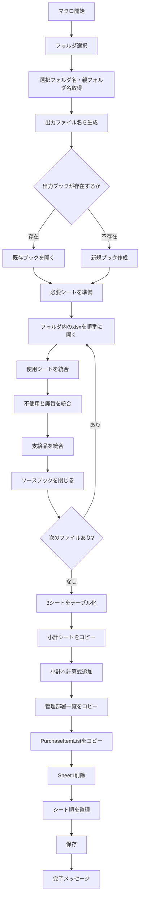

# VBA「CombineDepartmentFiles」棚卸ファイル統合処理 ― チャット全体まとめ

## 1. このVBAの目的

今回確認した `CombineDepartmentFiles` は、**部署ごとなどに分かれている複数の棚卸Excelファイルを1つのブックへ統合するマクロ**です。

主に以下の3シートを対象としています。

|対象シート|処理|
|---|---|
|`使用`|各ファイルのデータを縦方向に結合|
|`不使用と廃番`|各ファイルのデータを縦方向に結合|
|`支給品`|各ファイルのデータを縦方向に結合|

その後、統合ブックに以下も追加します。

- `小計`
- `管理部署`
- `PurchaseItemList`

最終的には、概ね次の構成の棚卸フォーマットを生成します。

```text
棚卸フォーマット_選択フォルダ名_親フォルダ名.xlsx
```

シート順は次のように整えられます。

```text
小計
↓
使用
↓
不使用と廃番
↓
支給品
↓
管理部署
↓
PurchaseItemList
```

---

## 2. `CombineDepartmentFiles` の処理フロー

全体の処理は以下の構造になっています。



---

## 3. フォルダ選択と出力ファイル名

最初にフォルダ選択ダイアログを表示します。

```vba
Set fileDialog = Application.fileDialog(msoFileDialogFolderPicker)
```

フォルダが選択されると、次の2つを取得します。

```vba
selectedFolderName = GetFolderName(folderPath)
parentFolderName = GetParentFolderName(folderPath)
```

例えばフォルダ構成が、

```text
原料
└─ 本社・6丁目
```

で `本社・6丁目` を選択した場合、

```text
selectedFolderName = 本社・6丁目
parentFolderName   = 原料
```

となります。

出力ファイルは、

```vba
destFileName = ThisWorkbook.Path & _
    "\棚卸フォーマット_" & _
    selectedFolderName & "_" & _
    parentFolderName & ".xlsx"
```

なので、例として、

```text
棚卸フォーマット_本社・6丁目_原料.xlsx
```

のようなファイルが作成されます。

---

## 4. 出力ブックの準備

同じ名前の出力ファイルが存在する場合は開きます。

```vba
Set destWorkbook = Workbooks.Open(destFileName)
```

存在しない場合は新規作成します。

```vba
Set destWorkbook = Workbooks.Add
destWorkbook.SaveAs destFileName, FileFormat:=xlOpenXMLWorkbook
```

続いて、

```text
使用
不使用と廃番
支給品
```

の各シートが存在するか確認し、なければ追加します。

---

## 5. 各ファイルを統合する仕組み

フォルダ内の `.xlsx` を `Dir` で順番に取得します。

```vba
fileName = Dir(folderPath & "\*.xlsx")

Do While fileName <> ""
```

それぞれのファイルを、

```vba
Set sourceWorkbook = Workbooks.Open(folderPath & "\" & fileName)
```

で開きます。

各ファイルから、

```text
使用
不使用と廃番
支給品
```

を探して統合します。

---

## 6. 最初のファイルと2つ目以降のファイルの違い

重要なのが、

```vba
firstCopyUsage
firstCopyUnused
firstCopySupplies
```

という3つのBoolean変数です。

初期値は、

```vba
firstCopyUsage = True
firstCopyUnused = True
firstCopySupplies = True
```

となっています。

### 最初のファイル

最初のファイルについては、**ヘッダーを含めてUsedRange全体をコピー**します。

例：

```vba
wsSource.UsedRange.Copy

wsUsage.Range("A1").PasteSpecial Paste:=xlPasteValues
wsUsage.Range("A1").PasteSpecial Paste:=xlPasteFormats
```

処理後、

```vba
firstCopyUsage = False
```

に変更します。

### 2つ目以降

2ファイル目以降はヘッダーが不要なので、1行目を除外してコピーします。

```vba
wsSource.UsedRange.Offset(1, 0) _
    .Resize(wsSource.UsedRange.Rows.Count - 1).Copy
```

つまり、

```text
元データ

1行目：ヘッダー        ← コピーしない
2行目：データ          ┐
3行目：データ          ├ コピー
4行目：データ          ┘
```

という意図です。

---

# 7. 今回発生したエラー

今回問題になったのは次のコードです。

```vba
wsSource.UsedRange.Offset(1, 0) _
    .Resize(wsSource.UsedRange.Rows.Count - 1).Copy
```

ここで実行時エラーが発生しました。

このコードを分解すると、

```vba
wsSource.UsedRange
```

で使用範囲を取得し、

```vba
.Offset(1, 0)
```

で1行下へずらし、

```vba
.Resize(wsSource.UsedRange.Rows.Count - 1)
```

でヘッダー1行分を除いた行数にサイズ変更しています。

---

## 8. 最も重要な原因候補：UsedRangeが1行しかない

特に重要な問題が、

```vba
wsSource.UsedRange.Rows.Count = 1
```

の場合です。

このとき、

```vba
wsSource.UsedRange.Rows.Count - 1
```

は、

```text
1 - 1 = 0
```

になります。

つまりVBAには実質、

```vba
.Resize(0)
```

を実行させることになります。

しかしExcelの `Range.Resize` に**0行の範囲は指定できません**。

そのためエラーになります。

### 典型例

コピー元のシートが、

```text
コード | 品名 | 数量 | 単価
```

のようにヘッダーしかない場合、

```text
UsedRange.Rows.Count = 1
```

になります。

このシートについて2ファイル目以降の処理に入ると、

```vba
Resize(0)
```

となり、エラーになります。

---

## 9. 基本的な対処方法

コピー対象が2行以上存在する場合だけコピーするようにします。

基本形は次の考え方です。

```vba
Dim dataRange As Range

Set dataRange = wsSource.UsedRange

If dataRange.Rows.Count > 1 Then

    dataRange.Offset(1, 0) _
        .Resize(dataRange.Rows.Count - 1).Copy

End If
```

これによって、

```text
UsedRange = 1行
```

ならコピー処理をスキップします。

---

## 10. 既存コードへ適用する場合の構造

例えば `使用` シートでは現在、

```vba
If firstCopyUsage Then

    wsSource.UsedRange.Copy
    wsUsage.Range("A1").PasteSpecial Paste:=xlPasteValues
    wsUsage.Range("A1").PasteSpecial Paste:=xlPasteFormats
    firstCopyUsage = False

Else

    lastRowUsage = wsUsage.Cells(wsUsage.Rows.Count, "A").End(xlUp).Row + 1

    wsSource.UsedRange.Offset(1, 0) _
        .Resize(wsSource.UsedRange.Rows.Count - 1).Copy

    wsUsage.Range("A" & lastRowUsage).PasteSpecial Paste:=xlPasteValues
    wsUsage.Range("A" & lastRowUsage).PasteSpecial Paste:=xlPasteFormats

End If
```

となっています。

考え方としては、

```text
最初のコピー
    ↓
ヘッダー込みでコピー

2回目以降
    ↓
UsedRangeが2行以上？
    ├─ Yes → ヘッダーを除いてコピー
    └─ No  → コピーしない
```

という構造に変更する必要があります。

---

# 11. 他に検討した原因

チャットでは、ほかにも以下の可能性を検討しました。

|原因候補|内容|優先度|
|---|---|--:|
|UsedRangeが1行|`Resize(0)` になる|**高**|
|データが実質空|使用履歴だけが残っている場合など|中|
|結合セル|`Offset` / `Resize` と範囲構造が衝突する場合|低〜中|
|`wsSource Is Nothing`|対象シートが存在しない|低|

ただし現在のコードでは、

```vba
If Not wsSource Is Nothing Then
```

が存在するため、少なくとも今回の問題については、

```text
wsSource = Nothing
```

よりも、

```text
UsedRange.Rows.Count = 1
```

をまず疑うのが妥当です。

また、以前提示した、

```vba
If Not dataRange.MergeCells Then
```

という結合セル判定を必須条件にする必要は通常ありません。今回のエラーに対しては、まず**ゼロ行の `Resize` を防ぐことが本質的な対策**です。

---

# 12. 同じ問題は3か所存在する

今回エラーになった構造は `使用` だけではありません。

同一コードが、

```text
使用
不使用と廃番
支給品
```

のすべてに存在します。

### 使用

```vba
wsSource.UsedRange.Offset(1, 0) _
    .Resize(wsSource.UsedRange.Rows.Count - 1).Copy
```

### 不使用と廃番

同じ処理です。

### 支給品

こちらも同じ処理です。

したがって、修正する場合は**3か所すべて同じ基準で修正する必要があります**。

---

# 13. 統合後のテーブル化

3シートの結合終了後、

```vba
CreateTable wsUsage, "棚卸表_" & parentFolderName & "_使用"

CreateTable wsUnused, _
    "棚卸表_" & parentFolderName & "_不使用と廃番"

CreateTable wsSupplies, _
    "棚卸表_" & parentFolderName & "_支給品"
```

を実行します。

`CreateTable` は、

```vba
Set tblRange = ws.Range("A1").CurrentRegion
```

で範囲を取得し、

```vba
Set tbl = ws.ListObjects.Add( _
    xlSrcRange, tblRange, , xlYes)
```

でExcelテーブルへ変換します。

テーブルスタイルは、

```vba
tbl.TableStyle = "TableStyleLight8"
```

です。

---

# 14. 「小計」シート

マクロブック、

```vba
ThisWorkbook
```

に存在する `小計` シートをコピーします。

```vba
Set sourceSubtotalSheet = ThisWorkbook.Sheets("小計")
```

コピー先には新しいシートを作り、

```vba
sourceSubtotalSheet.Cells.Copy
wsSubtotal.Cells.PasteSpecial Paste:=xlPasteAll
```

によって完全コピーします。

その後、

```vba
AddFormulasToSubtotal wsSubtotal, parentFolderName
```

を実行します。

---

## 15. 小計の計算式

現在は年月が固定されています。

対象年月は、

```text
202406
202402
202310
202306
202302
202210
```

です。

例えば、

```vba
.Range("D4").Formula = _
    "=COUNTIF(棚卸表_" & parentFolderName & _
    "_使用[数量_202406], "">0"")"
```

となっています。

数量については、

```text
使用
不使用と廃番
合計
```

を計算します。

金額についても、

```text
使用
不使用と廃番
合計
```

を計算します。

---

# 16. 管理部署一覧

`CopyManagementDepartmentList` では、選択したフォルダ名によって参照テーブルを切り替えます。

|selectedFolderName|テーブル|
|---|---|
|`本社・6丁目`|`管理部署一覧表_本社・6丁目`|
|`石切`|`管理部署一覧表_石切`|

それ以外の場合は、

```vba
MsgBox "選択したフォルダ名に対応する管理部署一覧表がありません。"
```

として処理を終了します。

コピー後は、

```text
管理部署
```

シートとして追加されます。

---

# 17. PurchaseItemList

マクロブックに存在する、

```text
PurchaseItemList
```

シートについてはシート単位でコピーしています。

```vba
ThisWorkbook.Sheets("PurchaseItemList").Copy _
    After:=destWorkbook.Sheets(destWorkbook.Sheets.Count)
```

これは `管理部署` のような「テーブル範囲のみコピー」ではなく、**シート全体コピー**です。

---

# 18. 最終的なシート整理

不要な、

```text
Sheet1
```

を削除します。

その後、

```vba
.Sheets("小計").Move Before:=.Sheets(1)
.Sheets("使用").Move After:=.Sheets("小計")
.Sheets("不使用と廃番").Move After:=.Sheets("使用")
.Sheets("支給品").Move After:=.Sheets("不使用と廃番")
.Sheets("管理部署").Move After:=.Sheets("支給品")
.Sheets("PurchaseItemList").Move After:=.Sheets("管理部署")
```

として順番を固定します。

---

# 19. 現時点での整理

今回のチャットで確認できた状態をまとめると、次のとおりです。

|項目|状態|
|---|---|
|VBAの目的|複数部署ファイルの棚卸データ統合|
|統合対象|使用 / 不使用と廃番 / 支給品|
|ヘッダー処理|最初のファイルのみコピー|
|2ファイル目以降|`Offset + Resize` でヘッダー除外|
|現在の不具合|`Offset().Resize().Copy` でエラー|
|主原因候補|`UsedRange.Rows.Count = 1`|
|発生条件|ヘッダーしか存在しないシートなど|
|必要な修正|`Rows.Count > 1` の場合のみコピー|
|修正対象|使用 / 不使用と廃番 / 支給品の3か所|
|その他|小計、管理部署、PurchaseItemListも追加|
|最終成果物|`棚卸フォーマット_○○_○○.xlsx`|

## 結論

今回の問題の核心は、2ファイル目以降について、

```vba
wsSource.UsedRange.Rows.Count - 1
```

を無条件に `Resize` の行数として使っている点です。

コピー元シートにヘッダーしかなければ、

```text
Rows.Count = 1
↓
Rows.Count - 1 = 0
↓
Resize(0)
↓
エラー
```

となります。

したがって今後の修正方針としては、**「データ行が存在する場合だけヘッダーを除いた範囲をコピーする」ように3シート共通で防御処理を追加する**のが第一候補です。

なお、この段階では原因分析まで進んでおり、`CombineDepartmentFiles` 全体のコード修正版への反映はまだ確定していません。次に修正する場合は、3シートに同じ判定を個別記述するより、重複している統合処理自体を共通化できるかも併せて検討する余地があります。